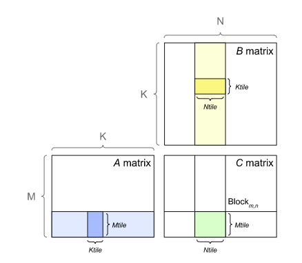

# GEMM (General Matrix Multiplication)

GEMM is a study of how to arrange data blocks to facilitate matrix multiplication computation $C=A B$ given GPU hardware specifications.

For example given $A \in \mathbb{R}^{M \times K}, B \in \mathbb{R}^{K \times N}$ and $C \in \mathbb{R}^{M \times N}$,
in a naive approach by CPU, $C=A B$ can be implemented by taking each cell in $A$ and each cell in $B$ then place the result in $C$.
There are $2MNK$ read operations and $MN$ write operations.

By GPU implementing $MN$ threads, where each thread reads one row from $A$ and one column from $B$, that has $2K$ read operations and $1$ write operation.
In total, there are $2MNK$ read operations and $MN$ write operations as well.
Each read and write operations are on global memory, hence time-consuming.

An improvement to this is by segmenting matrices to tiles.
As indicated below, each tile has a size of $m \times k$, $k \times n$ and $m \times n$, so that matrix $A$ has $t_m \times t_k$ tiles, $B$ has $t_k \times t_n$ tiles and $C$ has $t_m \times t_n$ tiles, where tile sizes are $t_m=M/m$, $t_n=N/n$ and $t_k=K/k$.

Each thread can load one tile from $A$, one tile from $B$ and write the result to $C$.
All tiles in the same row/column are loaded to shared memory (there are $t_k$ tiles from $A$ in a row, and $t_k$ tiles from $B$ in a column), and these threads are assigned to the same thread block.
Shared memory can significantly boost up computation speed by reducing global memory access.

There are only $t_m \times t_n \times t_k \times (m \times n)$ read operations on global memory to load data to shared memory.

      

 