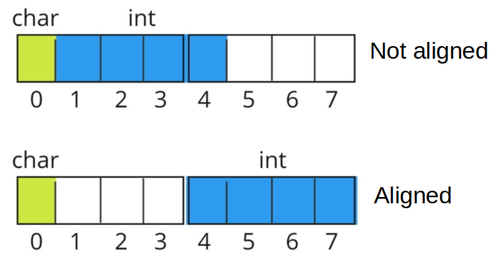

# Something About Memory

## Scope of Local Variables (A Compiler Perspective)

## Stack vs Heap

| | Stack | Heap | Explained |
|-|-|-|-|
| Cost of Usage | Low | High | for heap, need additional system call such as `malloc` for memory allocation |
| Deallocation of variable | Not necessary | Clear deallocation is important | Must use system call `free` to deallocate memory |
| Access time | Quick | Slow as compared to stack | Need additional memory reference to locate variables |
| Order for allocation of memory | Allocated as a contiguous block | Allocated in a random order | Stack memory is managed by stack pointer register to move up/down |

### Overflow Considerations

Overflow is invalid access to not allocated memory. If vars are declared on stack, it might trigger stack overflow; on heap, then heap overflow.

Examples:

* Invalid `memset`: allocated only 32 bytes, operated 64 bytes, HEAP overflow
```cpp
void* heap = (void*) malloc(32);
memset(heap, 'A', 64);
```

* requesting for too much stack memory, STACK overflow

```cpp
int a[99999999];
```

* recursively invoking a functions for too many times, it is a STACK overflow
```cpp
void foo() {
    foo();
}
```


## Memory Alignment

Given the `struct A`, for a 32-bit CPU, each time 4 contiguous memory bytes are loaded.
```cpp
struct A {
    char c;
    int i;
};
```

If in not-aligned layout (same as above `struct A`), to load `char c` and `int i`, require 3 loading operations: 1 for `char c` and 2 for `int i` (for it exists across two load instructions).

```cpp
struct A {
    int i;
    char c;
};
```
If in aligned layout such as first declaring `int i` then `char c`, require 2 loading operations: 1 for `char c` and 1 for `int i`.

<div style="display: flex; justify-content: center;">
      
</div>
</br>

Another alternative is `alignas` (since c++11) that automatically aligns declared variables
```cpp
struct alignas(16) A {
  char c;
  int i;
};
```

## POD vs Trivial

## Memory Pool

Memory pool basically is a list that links many memory blocks. When this pool has too few blocks, it asks OS for more memory and appends new memory blocks to the list.

A typical implementation is `std::allocator`.

## Memory Compare and Exchange

Compare-and-exchange atomically compares the object representation (until C++20)/value representation (since C++20) of `*this` with that of `expected`, and if those are bitwise-equal, replaces the former with `desired` (performs read-modify-write operation). Otherwise, loads the actual value stored in `*this` into `expected` (performs load operation).

Strong and weak versions refer to performance and safety, that `strong` guarantees successful compare-and-exchange, but slow in execution, while `weak` has the opposite performance.

`order` is about the memory synchronization ordering for both operations.

```cpp
// since c++11
bool compare_exchange_strong( T& expected, T desired,
                              std::memory_order order =
                                  std::memory_order_seq_cst ) noexcept;
// since c++11
bool compare_exchange_weak( T& expected, T desired,
                            std::memory_order order =
                                std::memory_order_seq_cst ) noexcept;
```

### Example

Compare-and-exchange operations are often used as basic building blocks of lockfree data structures.

Suppose there is a list of nodes linked by `next`. There might be multiple threads setting nodes as new heads to the list.
`head.compare_exchange_weak` is used here to guarantee atomicity of setting the current node as a new head at the time when compare-and-exchange happens.

```cpp
#include <atomic>
template<typename T>
struct node
{
    T data;
    node* next;
    node(const T& data) : data(data), next(nullptr) {}
};

template<typename T>
class stack
{
    std::atomic<node<T>*> head;
 public:
    void push(const T& data)
    {
      node<T>* new_node = new node<T>(data);
 
      // put the current value of head into new_node->next
      new_node->next = head.load(std::memory_order_relaxed);
 
      // now make new_node the new head, but if the head
      // is no longer what's stored in new_node->next
      // (some other thread must have inserted a node just now)
      // then put that new head into new_node->next and try again
      while(!head.compare_exchange_weak(new_node->next, new_node,
                                        std::memory_order_release,
                                        std::memory_order_relaxed))
          ; // the body of the loop is empty
 
// Note: the above use is not thread-safe in at least 
// GCC prior to 4.8.3 (bug 60272), clang prior to 2014-05-05 (bug 18899)
// MSVC prior to 2014-03-17 (bug 819819). The following is a workaround:
//      node<T>* old_head = head.load(std::memory_order_relaxed);
//      do {
//          new_node->next = old_head;
//       } while(!head.compare_exchange_weak(old_head, new_node,
//                                           std::memory_order_release,
//                                           std::memory_order_relaxed));
    }
};
int main()
{
    stack<int> s;
    s.push(1);
    s.push(2);
    s.push(3);
}
```