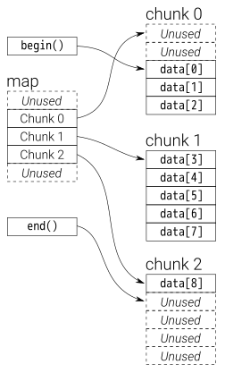

# STL 

## `std::map`

`std::map` uses red-black tree, that renders high computation cost when having too many insertion and deletion operation (to balance the tree). Read/write operations on the map is $O\big(log(n)\big)$.

## `std::string`

* string types

`std::string` is allocates memory in **a single block** (as needed, and sometimes preemptively), and best practice suggests pre-computing the string size the filling it.

`std::stringstream`, `std::istringstream` and `std::ostringstream` **1)** better express the intent to appending strings by `<<` and `>>` respectively. **2)** A stringstream writes into a stringbuffer, which usually means **a linked list of buffers**. Memory is not continuous, and it requires no reallocations as the buffer grows.


They are interchangeable via the following
```cpp
const std::string tmp = stringstream.str();
const char* cstr = tmp.c_str();
```

* `std::endl` must be appended to `std::cout`

The reason for this is that typically endl flushes the contents of the stream.

You must implement at least one `std::endl` before exit of a program.

* `std::char_traits`

The `char_traits` class is a traits class template that abstracts basic character and string operations for a given character type.

`std::char_traits<char>` is the default implementation of string.

Since c++20, `std::char_traits<char8_t>` can be used to implement UTF-8 code unit.

* `std::basic_string`

The class template `basic_string` stores and manipulates sequences of char-like objects.

```cpp
template<
    class CharT,
    class Traits = std::char_traits<CharT>,
    class Allocator = std::allocator<CharT>
> class basic_string;
```

`basic_string` is aliased by `typedef` such as
```cpp
typedef std::string	std::basic_string<char>
typedef std::u8string td::basic_string<char8_t> // since c++20
```

* `std::basic_string_view`

The class template `basic_string_view` describes an object that can refer to a constant contiguous sequence of `char`-like objects with the first element of the sequence at position zero.

A typical implementation holds only two members: a pointer to constant CharT and a size.

Example:
```cpp
std::string_view good_str{"a string literal"};
```

* `std::iostream`


## `std::unordered_map`

`std::unordered_map` does not have order hence the read/write operations on the map is always $O(1)$.

Key/value pairs in `std::unordered_map` are stored in bucket depending on hash result of keys. There is no mandated implementations, that linked lists are used in the libstdc++ and Microsoft implementations, while other might use a number of vectors to represent buckets.

## `std::vector`

A vector grows exponentially, such as by $2^n$: $2$, $4$, $8$, $16$ ..., and every time it grows, there need copy operations that assigns elements from old memory to new memory addresses.

* `std::vector<bool>` 

It is an exception that `operator[]` returns `std::vector<bool>::reference` rather than a `bool`. Using `auto& elem = std::vector<bool>(1, false)[0]` to retrieve elements results in undefined behavior.

Consider use `auto highPriority = static_cast<bool>(std::vector<bool>(1, false)[0]);`

* `emplace_back` vs `push_back`

`emplace_back` is generally preferred as it does additional memory check.

`emplace_back` does type deduction so that it can be written with templates such as
```cpp
template<class T, class Allocator = allocator<T>>
class vector {
public:
    template <class... Args>
    void emplace_back(Args&&... args);
};
```
while `push_back` can only be used after instantiation (cannot be used in template)
```cpp
class vector<Widget, allocator<Widget>> {
public:
    void push_back(Widget&& x);
};
```

A better example:
```cpp
class MyKlass {
public:
  MyKlass(int ii_, float ff_) {...}

private:
};

void function() {
  std::vector<MyKlass> v;

  v.push_back(MyKlass(2, 3.14f));
  v.emplace_back(2, 3.14f);
}
```

By using `push_back`, it creates a temp obj every time:
1. Constructor for a temporary `MyKlass` object
2. Move constructor (if one was defined for `MyKlass`, otherwise a copy constructor) for the object actually allocated inside the vector
3. Destructor for the temporary

This is unnecessary since the object passed to push_back is obviously an rvalue that ceases to exist after the statement is completed.

By using `emplace_back`, only `MyKlass` constructor is called. This is the object constructed inside the vector. No temporaries are needed.

## `std::list`

`insert()`/`erase()` in a list need $O(n)$ since it iterates over the whole list to determine where to insert/delete an element.

`push_back()` only needs $O(1)$.

## `std::array`

`std::array` is a container that encapsulates fixed size arrays, init by such as 
```cpp
std::array<int, 3> a {1, 2, 3};
```

## `std::deque`

`std::deque` (double-ended queue) is an indexed sequence container that allows fast insertion and deletion at both its beginning and its end.

Deque implements pointer to the queue's first and end elements, while elements inside are chopped into chunks, each chunk is a vector, linked through a map:



* `std::queue`, `std::deque` and `std::stack`

`deque`: Double ended queue, insert and remove from both ends

`queue`: insert only in one end and remove from the other (first in first out)

`stack`: LIFO context (last-in first-out)

## `std::bitset`

The class template bitset represents a fixed-size sequence of N bits. Bitsets can be manipulated by standard logic operators and converted to and from strings and integers.

```cpp
template< std::size_t N >
class bitset;
```

## `std::set`

`std::set` is an associative container that contains a sorted set of unique objects of type Key. 

Sets are usually implemented as *red-black tree*s.

## `std::tuple` and `std::tie`

Tuple can place objects of various types together :
```cpp
std::tuple<int,double,string> t3 = {1, 2.0, "3"};
```

`std::tie` can take references of a tuple and unzip it to objects by order.

```cpp
int i; double d; std::string s;
std::tie(i, d, s) = t3;
```
