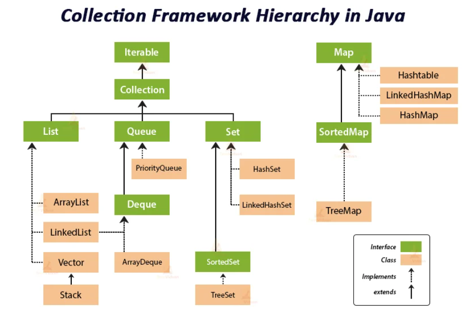
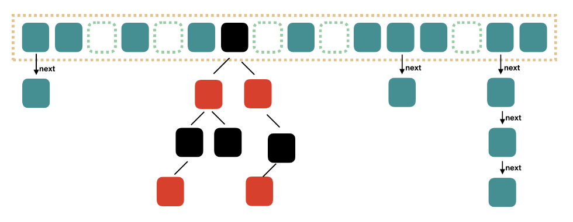

# Java Primitives and Containers

## Basic Java Data Types and Wrapper

In java, every thing is an object, even for the basic data types.

|Primitive|Wrapper|
|-|-|
|boolean | Boolean |
|byte | Byte |
|char | Character |
|float | Float |
|int | Integer |
|long | Long |
|short | Short |
|double | Double |

For example:

```java
Integer x = 1; // wrapping Integer.valueOf(1) implicitly
int y = x; // invoked X.intValue() implicitly
```

String is immutable/final for the stored data in `final char value[];`.
When a new string is constructed (via concatenation or some other methods), the original string object actually constructs a new `final char value[];` then points to the new char array.

Immutable char array is good for constant hash and multi-threading, 
and is stored in constant memory area in JVM as cache so that next time the char array's constructed/destroyed/read, there is no need of reallocating memory.

```java
public final class String
    implements java.io.Serializable, Comparable<String>, CharSequence {
    /** The value is used for character storage. */
    private final char value[];

    /** Cache the hash code for the string */
    private int hash; // Default to 0
}
```

The number of constructed objects by `new String("hello")` is two:

* `"hello"` is constructed at compile time stored as a char string object in a constant var pool
* `new` constructs  string object in heap

Since Java 9, `char[]` is changed to `byte[]` to save memory for char storage.

## Numbers

### Numeric Promotion

For primitive data types undergoing binary operation such as `+`/`-`/`*` and `==`, promotion is applied:

```java
class Test {
    public static void main(String[] args) {
        int i    = 0;
        float f  = 1.0f;
        double d = 2.0;
        // First int*float is promoted to float*float, then
        // float==double is promoted to double==double:
        if (i * f == d) System.out.println("oops");

        // A char&byte is promoted to int&int:
        byte b = 0x1f;
        char c = 'G';
        int control = c & b;
        System.out.println(Integer.toHexString(control));

        // Here int:float is promoted to float:float:
        f = (b==0) ? i : 4.0f;
        System.out.println(1.0/f);
    }
}
```

### Decimal Precision and Use of `java.math.BigDecimal`

There is loss of precision such as in the below computation cases.

```java
float x=2.0f;
float y=1.9f;
System.out.println("x-y = " + (x - y)); // print `x-y = 0.100000024`

double x=2.0f;
double y=1.9f;
System.out.println("x-y = " + (x - y)); // print `x-y = 0.10000002384185791`
```

Instead, should have used `java.math.BigDecimal`.

```java
BigDecimal x = new BigDecimal("2");
BigDecimal y = new BigDecimal("1.9");
System.out.println("x-y = " +  x.subtract(y)); // print `x-y = 0.1`
```

### Comparison

A numerical comparison operator (`<`, `<=`, `>`, `>=`, `==` and `!=`) must be a type that is convertible of the primitive, or the primitive itself:
`boolean`, `byte`, `char`, `short`, `int`, `long`, `float`, `double`.

Positive zero and negative zero are considered equal : `-0.0<0.0` is false, but `-0.0<=0.0` is true.

* `==` vs `equals()`

In numerical comparison, `==` simply means value comparison.

In reference/object comparison, `==` means object heap memory value comparison; `equals()` is used with overriden method to perform object member value comparison.

Analogously, `==` in C++ is

```cpp
int* a = new int(1);
int* b = a;
if ((void *)a == (void *)b) 
    std::cout << "Same obj." << std::endl;
```

`equals()` in C++ is

```cpp
class Example {
private:
    int val_a, val_b, val_c;
public:
    bool operator == (const Example &e){
      if (val_a == e.val_a && val_b == e.val_a && val_c == e.val_a) {
          std::cout << "Two objs have the same member values." << std::endl;
          return true;
      }
      return false;
    }
}
```

## Java Collections

Java collection provides common data structures and algorithms that store objects.

<div style="display: flex; justify-content: center;">
      
</div>
</br>

### ArrayList

The ArrayList (`std::vector` in c++) class maintains the insertion order and is non-synchronized. 
The elements stored in the ArrayList class can be randomly accessed. 

```java
import java.util.*;  
class TestJavaCollection1{  
  public static void main(String args[]){  

    ArrayList<String> list=new ArrayList<String>();//Creating an arraylist 
 
    list.add("Jack");//Adding object in the arraylist  
    list.add("Jason");  
    list.add("Jay");  
    list.add("Jason");  

    //Traversing list through Iterator  
    Iterator itr=list.iterator();  
    while(itr.hasNext()){  
      System.out.println(itr.next());  
    }  
  }  
}  
```

### LinkedList

It uses a doubly linked list internally to store the elements. 
It maintains the insertion order and is not synchronized. 

### Vector

Vector uses a dynamic array to store the data elements. It is similar to ArrayList. However, It is synchronized and contains many methods that are not the part of Collection framework.

### Stack and Queue

The stack is the subclass of Vector. It implements the **last-in-first-out** data structure.

Queue interface maintains the **first-in-first-out** order. 

```java
import java.util.*;  
public class TestJavaCollection{  
  public static void main(String args[]){  

    Stack<String> stack = new Stack<String>();  

    stack.push("Jason");  
    stack.push("Jay");  
    stack.push("Jayden");  
    stack.push("Jack");  
    stack.push("Jackson");  
    stack.pop();  // after pop, "Jackson" is removed

    Iterator<String> itr=stack.iterator();  
    while(itr.hasNext()){  
      System.out.println(itr.next());  
    }  
  }  
}  
```

### HashSet

By hash, in the below code only two items are stored in `set`.

```java
import java.util.*;  
class TestJavaCollection1{  
  public static void main(String args[]){  

    HashSet<String> set = new HashSet<String>();//Creating an HashSet 
 
    set.add("Jack"); // Adding object in the HashSet  
    set.add("Jason");  
    set.add("Jason");  // this item is duplicate and lost

    //Traversing set through Iterator  
    Iterator itr = set.iterator();  
    while(itr.hasNext()){  
      System.out.println(itr.next());  
    }  
  }  
}  
```

### HashMap, HashTable and ConcurrentHashMap

HashMap is non-synchronized and not thread-safe, can't be shared between many threads without proper mutex,
whereas Hashtable is synchronized, thread-safe and can be shared with many threads.

HashMap allows one null key and multiple null values whereas Hashtable doesn't allow any null key or value.

HashMap is generally preferred over HashTable if thread synchronization is not needed.

```java
// Java program to demonstrate
// HashMap and HashTable
import java.util.*;
import java.lang.*;
import java.io.*;
 
// Name of the class has to be "Main"
// only if the class is public
class JavaHashMapTable
{
    public static void main(String args[])
    {
        //----------hashtable -------------------------
        Hashtable<Integer,String> ht=new Hashtable<Integer,String>();
        ht.put(101,"Jason");
        ht.put(102,"Amy");
        ht.put(102,"Jack"); // value updated to Jack
        System.out.println("-------------Hash table--------------");
        for (Map.Entry m:ht.entrySet()) {
            System.out.println(m.getKey()+" "+m.getValue());
        }
 
        //----------------hashmap--------------------------------
        HashMap<Integer,String> hm=new HashMap<Integer,String>();
        hm.put(100,"Jason");
        hm.put(104,"Amy");
        hm.put(104,"Jack"); // value updated to Jack
        System.out.println("-----------Hash map-----------");
        for (Map.Entry m:hm.entrySet()) {
            System.out.println(m.getKey()+" "+m.getValue());
        }
    }
}
```

* Why HashMap is not thread-safe:

A hash map is based on an array, where each item represents a bucket (buckets stored as `std::vector<Bucket>` analogously in C++). 
As more keys are added, the buckets grow and at a certain threshold the array is recreated with a bigger size, its buckets rearranged so that they are spread more evenly (performance considerations).

It means that sometimes `HashMap#put()` will internally call `HashMap#resize()` to make the underlying array bigger. `HashMap#resize()` assigns the table field a new empty array with a bigger capacity and populates it with the old items. During re-population, when a thread accesses this HashMap, this HashMap may return `null`.

```java
final Map<Integer, String> map = new HashMap<>();

final Integer targetKey = 0b1111_1111_1111_1111; // 65 535, forced JVM to resize and populate
final String targetValue = "v";
map.put(targetKey, targetValue);

new Thread(() -> {
    IntStream.range(0, targetKey).forEach(key -> map.put(key, "someValue"));
}).start(); // start another thread to add key/value pairs


while (true) {
    if (!targetValue.equals(map.get(targetKey))) {
        throw new RuntimeException("HashMap is not thread safe."); // throw err
    }
}
```

* concurrentHashMap

`concurrentHashMap` is a thread safe key/value pair Java container. Java 8 added CAS (Comparison And Swap) atomics, red/black tree replacing list, and other optimizations.

Illustrated as below, the items in the orange-dotted rectangle are buckets, and buckets are contiguous in memory.
In other words, buckets are stored as `std::vector<Bucket>` analogously in C++.
The bucket vector grows when buckets contain too many items.

Each bucket contains a list of items; items are list-linked to each other.
If a list is long (searching items in this list can be time-consuming), the list is transformed into a red black tree.

The average search time in a red black tree is $O(\log{n})$, in a list is $O(n/2)$.
As a result, the list-to-tree transformation takes place when $O(n/2) > O(\log{n})$.

<div style="display: flex; justify-content: center;">
      
</div>
</br>

The `get()` method does not use lock, and is thread safety, that is guaranteed by checking hash value `eh`, that diff `eh`s represent diff thread safety scenarios such as undergoing bucket vector expansion.

```java
public V get(Object key) {
    Node<K,V>[] tab; Node<K,V> e, p; int n, eh; K ek;
    int h = spread(key.hashCode()); // compute hash
    if ((tab = table) != null && (n = tab.length) > 0 &&
        (e = tabAt(tab, (n - 1) & h)) != null) { // retrieve the head node
        if ((eh = e.hash) == h) { // return the node if the hash matches
            if ((ek = e.key) == key || (ek != null && key.equals(ek)))
                return e.val;
        }
        // eh=-1 means that the node is a ForwardingNode undergoing migration (bucket vector expansion)
        // eh=-2 means that the node is a TreeBin, use red black tree for traversal
        // eh>=0 means that the node is linked against a list of node, just traverse the list
        else if (eh < 0)
            return (p = e.find(h, key)) != null ? p.val : null;
        while ((e = e.next) != null) { // Not a head node nor a ForwardingNode, just
                                       // continue traversing the list till found a matched hash, then return
            if (e.hash== h &&
                ((ek = e.key) == key || (ek != null && key.equals(ek))))
                return e.vale.val;
        }
    }
    return null;
}
```

Notice here that nodes and their values are set to `volatile`, which forces CPUs fetching data from memory instead of from L1/L2 cache.

```java
/**
 * The array of bins. Lazily initialized upon first insertion.
 * Size is always a power of two. Accessed directly by iterators.
**/
transient volatile Node<K,V>[] table;

static class Node<K,V> implements Map.Entry<K,V> {
    final int hash;
    final K key;
    
    volatile V val;
    volatile Node<K,V> next;

    ...
}
```

### Stream

`Stream` is a view or a pipeline of data that can be processed in multiple stages.

It acts as a sequence of mapping + lambda operation.

```java
import java.util.Arrays;
import java.util.List;
import java.util.stream.Collectors;

public class StreamExample {
    public static void main(String[] args) {
        List<String> myList = Arrays.asList("apple", "banana", "cherry", "dragon fruit", "elderberry", "fig", "grape");

        List<String> filteredList = myList.stream()
                .filter(s -> s.startsWith("a"))
                .map(String::toUpperCase)
                .collect(Collectors.toList());

        System.out.println(filteredList); // Output: [APPLE]
    }
}
```
