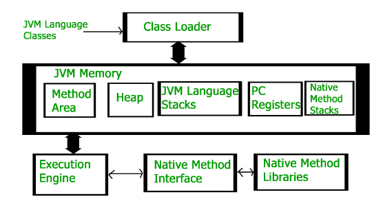
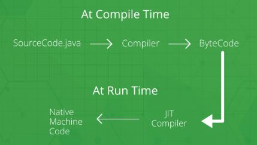
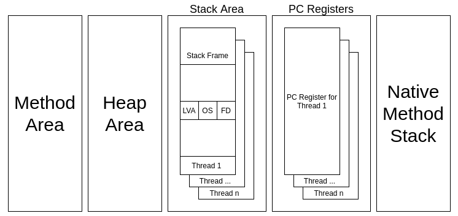
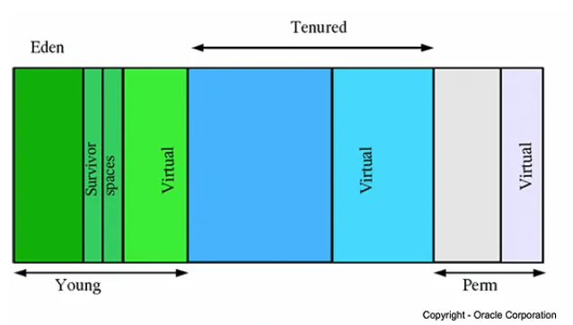
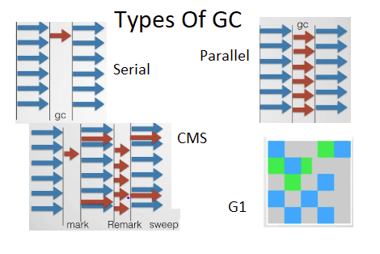
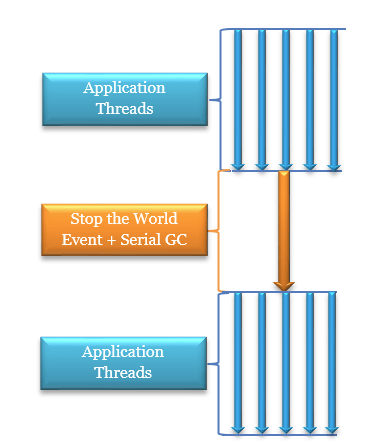
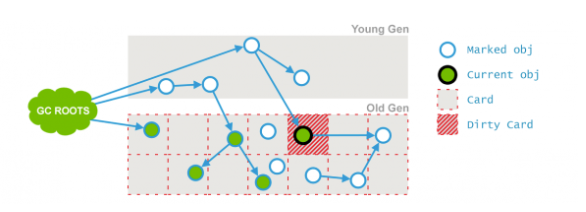
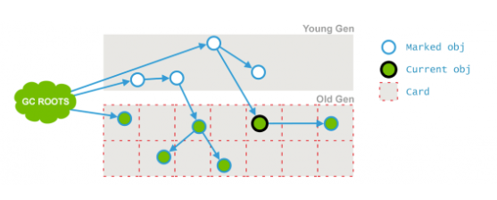

# Java Virtual Machine

JVM is a virtual machine, an abstract computer that has its own ISA, own memory, stack, heap, etc. 
It runs on the host OS and places its demands for resources to it.

It is a specification where diff companies have their own implementations, e.g. Oracle version, IBM version.


<div style="display: flex; justify-content: center;">
      
</div>
</br>

* HotSpot JVM

HotSpot, released as Java HotSpot Performance Engine is the most widely used Java virtual machine (JVM).

## JVM Start

Loading means reading `.class` to memory.

The name must be unique `package` + `class`.
Java creates `java.lang.Class` to represent this class.

Java performs checking on the loaded `.class` such as file format, etc.

Allocate memory to `static`/global and set/initialize value to zeros.

### Lifecycle

* Loading and Linking:

Static value inits.

* Init: 

Class loading and linking; 
init parent class first;
execute init functions/code.

* End:

The `main()` function ends;
execute `System.exit();`
hit error/exception that terminates JVM

## JVM vs JIT

Java Virtual Machine (JVM) is used in the java runtime environment(JRE). 
The original JVM was conceived as a bytecode interpreter.

Java Just In Time (JIT) compiler takes to be executed byte code and compiles it into machine code at run time.

In other words, the compiled `.class` files contain java byte code that is executable/compatible on multiple platforms; JIT converts the java byte code into machine code when the `.class` is loaded/executed.

<div style="display: flex; justify-content: center;">
      
</div>
</br>

## JVM Virtual Memory Layout

<div style="display: flex; justify-content: center;">
      
</div>
</br>

* Heap

The heap stores the actual objects by `new`; the JVM creates an instance for the object in a heap (the reference of that object is stored in thread stack area).

There exists only one heap for each running JVM process.
 When the heap is full, then the garbage collector runs & frees the space

* Method Area

Stores all class-level information, including static variables.

There is only one method area per JVM and it is a shared resource.

* Program Counter (PC) Register

Each thread has a Program Counter register associated with it.

Stores the return address of the JVM instructions currently being executed.

* Thread Stack

Each thread has a separate stack.

It contains references to heap objects.

A stack frame is a data structure that contains the thread, Each frame contains its Local Variable Array (LVA), Operand Stack (OS), and Frame Data (FD). The sizes of LVA, OS, and FD are determined at compile time.

* Native Method

Java Native Interface (JNI) calls the native stack.

Java through this can call C/C++ code.

To use it, basically decalre a class that loads binary libs by `System.loadLibrary`, and invoke by `public native String getSystemTime();`.

```java
public class DateTimeUtils {
    public native String getSystemTime();

    static {
        System.loadLibrary("nativedatetimeutils");
    }
}
```

In java, it is done via the below cpp implementation.

```cpp
JNIEXPORT void JNICALL
Java_java_nio_MappedByteBuffer_force0(JNIEnv *env, jobject obj, jobject fdo,
                                      jlong address, jlong len)
{
    void* a = (void *)jlong_to_ptr(address);
    int result = msync(a, (size_t)len, MS_SYNC);
    if (result == -1) {
        JNU_ThrowIOExceptionWithLastError(env, "msync failed");
    }
}
```

### MetaSpace/Permanent Generation

Permanent Generation or “Perm Gen” (renamed to MetaSpace since Java 8) contains the application metadata required by the JVM to describe the classes and methods used in the application.

### Young, Tenured and Perm generation

All objects in the heap survive when they are being referenced. 
When they're not more, the garbage collector (GC) will reclaim their memory.

Objects in an application live for varying lengths of time depending on where they are created and how they are used. 
The key insight here is that using different garbage collection strategies for short lived and long lived objects allows the GC to be optimised specifically for each case.

*PermGen*, *Young* and *Tenured/Old* are different classifications of objects.

* PermGen: these objects will be always there, they're not garbage collected, e.g., constant strings.

* Young: objects just created.

* Tenured/Old: objects "survive" repeated garbage collections in the Young Generation, e.g., objects frequently referenced, they are migrated to the Tenured Generation.

In detail, they can be further dissected into the below classifications.

For example, *Eden* objects are the easiest as well as newest to be removed by GC.
It is likely a local temp object.

The horizontal axis of the below figure is the degree of how likely an object can survive/not being removed by GC.

<div style="display: flex; justify-content: center;">
      
</div>
</br>

### `OutOfMemoryError` (OOM Error) and Debug

#### Heap Overflow

`java.lang.OutOfMemoryError: Java heap space` happens when JVM cannot allocate a new space for object.

Common causes could be generating too many memory holes or `-Xms` and `-Xmx` set too small.

Example: in an infinite loop creating new objects.

```java
public class HeapOOM {

   static class OOMObject {
      private int val;
   }

   public static void main(String[] args) {
     List<OOMObject> list = new ArrayList<OOMObject>();
     // create many objects in an infinite loop
     while (true) {
        list.add(new OOMObject());
     }
   }
}
```

#### PermGen/Meta Space Overflow

`Caused by: java.lang.OutOfMemoryError: Metaspace` happens for PermGen/Meta space cannot hold enough memory to store class definition.

For example, below code creates classes in a infinite loop that throws meta space overflow error.

```java
public class JavaMethodAreaOOM {
 public static void main(String[] args) { 
  while (true) {
    Enhancer enhancer = new Enhancer();
    enhancer.setSuperclass(OOMObject.class);
    enhancer.setUseCache(false);
    enhancer.setCallback(new MethodInterceptor() {
      public Object intercept(Object obj, Method method,
       Object[] args, MethodProxy proxy) throws Throwable {
       return proxy.invokeSuper(obj, args);
      }
     });
    enhancer.create();
   }
 }
  static class OOMObject {
    private int val;
   }
}
```

#### Stack Overflow

If of `StackOverflowError`, check recursions are out of max limit.

If of `OutOfMemoryError`, check is there is infinite loop launching new threads; check `-Xss`

```java
public class JavaVMStackOOM {
    private void dontStop(){
        while(true){}
    }
    
    public void stackLeakByThread(){
        while(true){
            Thread thread = new Thread(new Runnable(){
            public void run() {
                dontStop();
            }
        });
        thread.start();}
    }
    
    public static void main(String[] args) {
    JavaVMStackOOM oom = new JavaVMStackOOM();
           oom.stackLeakByThread();
    }
}
```

## JVM Annotations


## JVM Garbage Collection (GC) Tuning

Resources need to be recycled when 
* reference count of an object is zero
* reachability analysis that if an object is not linked/used/owned by any other object

### Types of GC

<div style="display: flex; justify-content: center;">
      
</div>
</br>

* Serial `-XX:+UseSerialGC` and Parallel `-XX:+UseParallelGC` (to set the number of GC threads `-XX:ParallelGCThreads=<n>`)

When GC conditions are met, just stop everything and start a thread performing GC tasks.

The parallel method is just the multi-threading version of the serial GC.

<div style="display: flex; justify-content: center;">
      
</div>
</br>

* Concurrent Mark Sweep (CMS) `-XX:+UseConcMarkSweepGC` and (to set the number of GC threads `-XX:ParallelCMSThreads=<n>`)

It attempts to **minimize the pauses due to garbage collection** by doing most of the garbage collection work concurrently with the application threads. 
Due to this reason, the CMS collector uses more CPU than other GCs. 

The process goes as below that
* It traversal starts from roots to each of the objects and check their dependencies, and marks relevant areas called *cards* as dirty if there is change in dependencies
* It sweeps out unused objects

<div style="display: flex; justify-content: center;">
      
</div>
</br>

<div style="display: flex; justify-content: center;">
      
</div>
</br>

Advantages: concurrent GC with low pauses/latency

Disadvantages: create lots of memory holes, resulting in memory not being continuous (consider using `-XX:+CMSFullGCsBeforeCompaction` to re-arrange memory holes after a number of CMS GC)

If there are too many memory holes, JVM might have trouble of finding enough memory if it attempts to allocate mem for a large object, hence forced to perform GC immediately.

* G1 `-XX:+UnlockExperimentalVMOptions` and `-XX:+UseG1GC`

Improvements: 

    * predictable pauses
    * Memory allocation optimization

G1 redefines heap layout that is segmented to many *regions*.

G1 has a built prediction algorithm that estimates what sizes of objects at what time they will be demised, so that it can better arrange regions into a continuous memory area.

### Log

* `-verbose:gc-Xloggc:$CATALINA_HOME/logs/gc.log`

Set verbose logging

* `-Djava.awt.headless=true`

Headless means that under this mode, in log there is no need to record monitor devices, keyboard and mouse. etc.

* `-XX:+PrintGCTimeStamps-XX:+PrintGCDetails`

Set up GC log format.

## Java Options for JVM Tuning

* `-Xms` and `-Xmx`

`Xmx` specifies max memory pool for JVM (Java Virtual Machine), `Xms` for initial allocated memory to jvm.

For example, 
```bash
java -Xms256m -Xmx2048m
```
* `-Xss`

Set thread stack size.

For example, the function `recur()` recursively gets invoked and eventually sees `StackOverflowError`, and prints `depth` value.

When `StackOverflowError` occurs depends on how large the stack size is relating to `-Xss`, that for instance, `Xss1m` gives `depth = 21638` and `-Xss2m` gives `depth = 48325`.

```java
public static void main(String[] args) {
    try{
        recur();
    }catch (StackOverflowError e){
        System.out.println("depth = " + depth);
    }
}

static int depth = 1;

public static void recur(){
    depth++;
    recur();
}
```

* `-server` and `-client`

JVM is tuned for either server or client services. 

`-server` JVM is optimize to provide best peak operating speed, executing long-term running applications, etc.

`-client` JVM provides great support for GUI applications, fast app startup time, etc.

### To Show JVM Statistics: `jstat`

jstat (JVM statistics Monitoring) monitors the on-going JVM statistics.

```bash
jstat [option] LVMID [interval] [count]
```

where 
* `option`: target
* `LVMID`: local virtual machine process ID
* `interval`: log output interval
* `count`: number of output records per each time

|Option | Displays |
|-|-|
|class | Statistics on the behavior of the class loader.|
|compiler | Statistics of the behavior of the HotSpot Just-in-Time compiler.|
|gc | Statistics of the behavior of the garbage collected heap.|
|gccapacity | Statistics of the capacities of the generations (young,old,perm) and their corresponding spaces.|
|gcutil | Summary of garbage collection statistics.|