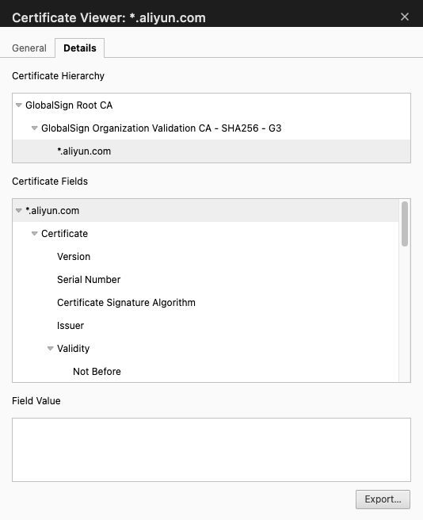
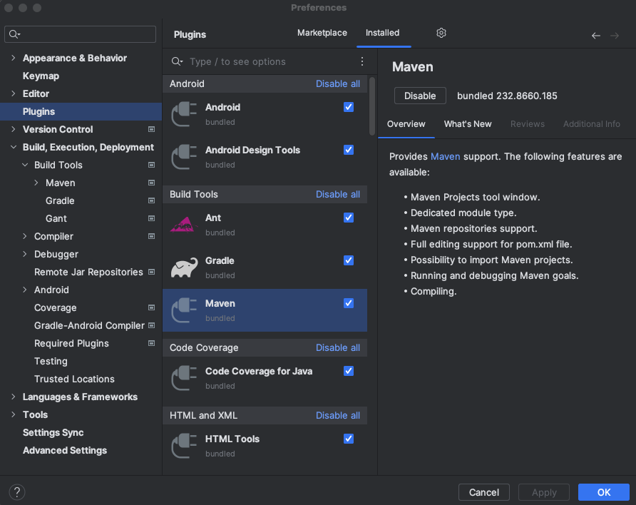
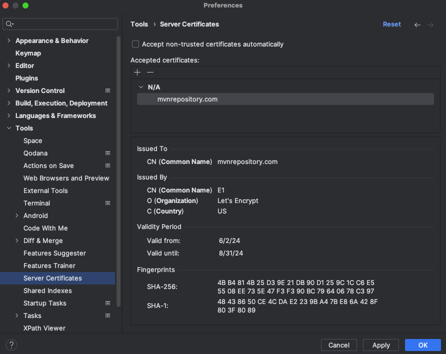
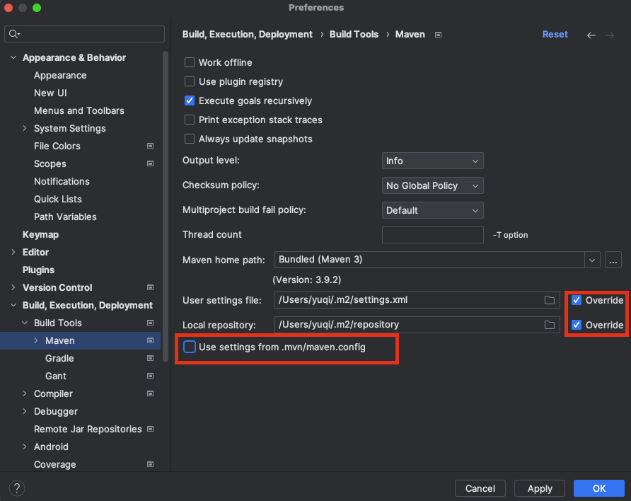
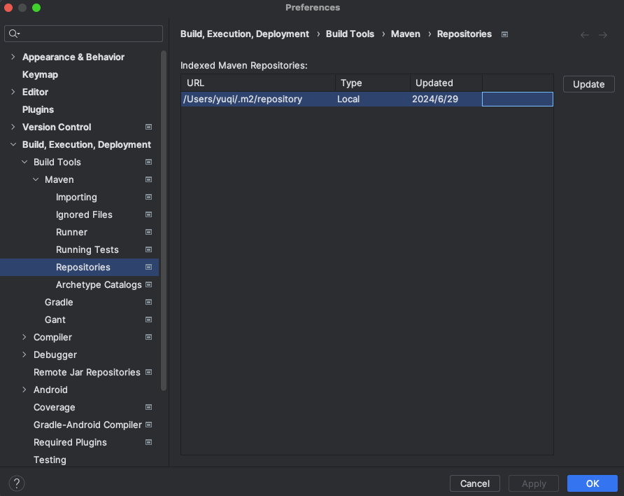
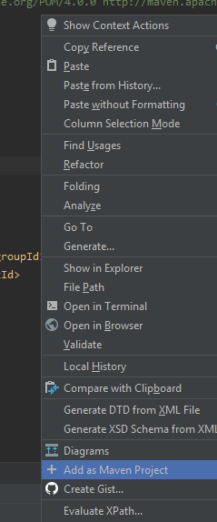
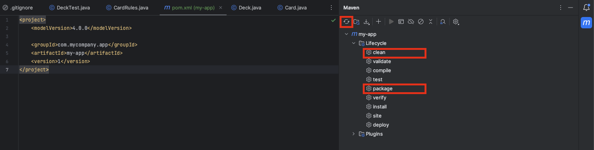

# Maven

## Maven Settings `~/.m2/setting.xml`

By default, maven settings are placed in `~/.m2/setting.xml`.

### Maven Goals

A goal in Maven represents a specific task that contributes to the building and managing of a project.

For example,

* Goal: `clean`/`mvn clean`

This command cleans the maven project by deleting the `target/` directory.

* Goal: `compile`/`mvn compile`

This command compiles the java source classes of the maven project into the `target/classes` directory.

* Goal: `package`/`mvn package`

This command builds the maven project and packages them into a JAR, WAR, etc.

* Goal: `install`/`mvn install`

Installs the package into the local repository, for use as a dependency in other projects locally.

Below config can specify where the local repo is to install/store.

```xml
<settings>
    <!-- Local Repository Location -->
    <localRepository>/path/to/your/local/repo</localRepository>
</settings>
```

### Config in China

Make sure `M2_HOME` (for maven repository) set properly for Maven

For a Maven to use CN Mainland mirrors, add the following in Maven root dir `~/.m2/settings.xml`

```xml
<mirror>
   <id>alimaven</id>
   <name>aliyun maven</name>
　　<url>http://maven.aliyun.com/nexus/content/groups/public/</url>
   <mirrorOf>central</mirrorOf>
</mirror>
```

### Inside `settings.xml`

* `<mirror/>`

`<mirror/>` is used to speed up downloading.
When there is a maven jar to download, maven will first download from mirror.

-> The `<mirrorOf>` specifies what maven repo to download dependencies, e.g., `<mirrorOf>central</mirrorOf>` indicates only `central` repos is allowed; `<mirrorOf>*</mirrorOf>` indicates all repos are allowed

* `<server/>`

`<server/>` is used to provide authentication, e.g., username and password.

P.S., `<id/>` must be the **same** across `<server/>`, `<repository/>`, `<pluginRepository/>` for maven to know by what credential for repository authentication.

* `<repository/>`

`<repository/>` is used to store the actual `.jar` and `.pom`.

Inside this xml tag, `<updatePolicy/>` specifies when maven checks new dependency update, e.g., `daily` means daily check; `always` means check on every build

-> `<releases/>` it means this package has done full test and stable, good for production; and usually have a big version number, e.g., `1.0.0`

-> `<snapshots/>` it means this package is still in dev; likely got a version number such as `1.0.0-SNAPSHOT`

* `<pluginRepository/>`

Similar to `<repository/>`, but `<pluginRepository/>` is used to store maven plugin.

For example, `maven-javadoc-plugin` has a goal javadoc:javadoc that generates Javadoc documentation.

* `<profile/>`

`<profile/>` allows user to define a control group.

`<activeProfile/>` must be set to activate a profile control group.

```xml
<settings xmlns="http://maven.apache.org/SETTINGS/1.0.0"
          xmlns:xsi="http://www.w3.org/2001/XMLSchema-instance"
          xsi:schemaLocation="http://maven.apache.org/SETTINGS/1.0.0 http://maven.apache.org/xsd/settings-1.0.0.xsd">

  <mirrors>
    <mirror>
      <id>central-mirror</id>
      <name>Central Mirror</name>
      <url>http://my.internal.repo/maven2</url>
      <mirrorOf>central</mirrorOf>
    </mirror>
  </mirrors>

  <servers>
    <server>
      <id>my-private-repo</id>
      <username>myUsername</username>
      <password>myPassword</password>
    </server>
    <server>
      <id>my-plugin-repo</id>
      <username>myUsername</username>
      <password>myPassword</password>
    </server>
  </servers>

  <profiles>
    <profile>
      <id>custom-repos</id>
      <repositories>
        <repository>
          <id>my-private-repo</id>
          <name>My Private Repository</name>
          <url>http://my.private.repo/maven2</url>
          <releases>
            <enabled>true</enabled>
            <updatePolicy>always</updatePolicy>
          </releases>
          <snapshots>
            <enabled>false</enabled>
          </snapshots>
        </repository>
      </repositories>
      <pluginRepositories>
        <pluginRepository>
          <id>my-plugin-repo</id>
          <name>My Plugin Repository</name>
          <url>http://my.plugin.repo/maven2</url>
          <releases>
            <enabled>true</enabled>
          </releases>
          <snapshots>
            <enabled>false</enabled>
          </snapshots>
        </pluginRepository>
      </pluginRepositories>
    </profile>
  </profiles>

  <activeProfiles>
    <activeProfile>custom-repos</activeProfile>
  </activeProfiles>

</settings>
```

### Setting Security

#### Security Password

First, run `mvn --encrypt-master-password <user-password>` that outputs `{encrypted_master_password}`.
In `${USER_HOME}/.m2/settings-security.xml`, copy `{encrypted_master_password}` into the below.

```xml
<settingsSecurity>
    <master>{encrypted_master_password}</master>
</settingsSecurity>
```

Run `mvn --encrypt-password <user-password>` that outputs `{encrypted_password_password}`.
In `${USER_HOME}/.m2/settings.xml`, copy `{encrypted_password_password}` into the below.

`example-mirror-id` `<id/>` should match between `<mirror/>` and `<server/>`

```xml
<settings>
    <mirrors>
        <mirror>
            <id>example-mirror-id</id>
            <mirrorOf>central</mirrorOf>
            <url>https://your-mirror-repository-url</url>
        </mirror>
    </mirrors>
    <servers>
        <server>
            <id>example-mirror-id</id>
            <username>your-username</username>
            <password>{encrypted_password_password}</password>
        </server>
    </servers>
</settings>
```

#### Certificate

Reference:

https://stackoverflow.com/questions/21076179/pkix-path-building-failed-and-unable-to-find-valid-certification-path-to-requ

https://www.cnblogs.com/wpbxin/p/11746229.html

Check from browser that the repo is permitted to access.

If permitted, from browser export the cert as `example-mirror-id.cer`.

<div style="display: flex; justify-content: center;">
    
</div>
</br>

Add `example-mirror-id.cer` to JRE security.

Failed to complete this step might raise "PKIX path building failed: sun.security.provider.certpath.SunCertPathBuilde" error.

```sh
keytool -import -alias example-mirror -keystore  "/path/to/<jre-version>/lib/security/cacerts" -file example-mirror-id.cer
```

## pom.xml

A minimal `POM.xml`

```xml
<project>
  <modelVersion>4.0.0</modelVersion>
  <groupId>com.mycompany.app</groupId>
  <artifactId>my-app</artifactId>
  <version>1</version>
</project>
```

## Maven Setup in IntelliJ IDEA

1. Make sure Maven plugin is installed.

<div style="display: flex; justify-content: center;">
    
</div>
</br>

2. Add cert so that IDEA can trust a maven repository host to download dependencies.

<div style="display: flex; justify-content: center;">
    
</div>
</br>

If to use private maven repository, e.g., enterprise nexus, remember to import the private maven repository cert to `"/path/to/<jre-version>/lib/security/cacerts"` as well.
The java home directory might be admin-protected, e.g., `C:\Program Data\java\`, copy to user home directory and import the cert.

3. Add custom Maven settings, where `Override` should be ticked to force using custom settings.

<div style="display: flex; justify-content: center;">
    
</div>
</br>

4. Index/sync between remote repo vs local env by `Update`, otherwise maven may see errors about many dependencies not found, though repos are present in maven repo host.

<div style="display: flex; justify-content: center;">
    
</div>
</br>

5. If Maven UI tab is not seen from the IDEA, make sure there is a `pom.xml` file present in the project, then add the project as a maven project.

<div style="display: flex; justify-content: center;">
    
</div>
</br>

6. Having all set up, trigger Maven for downloading dependencies by `refresh`, then select `maven clean` to remove cached builds, and `maven package` to compile the project.

<div style="display: flex; justify-content: center;">
    
</div>
</br>

IDEA uses `*.lastUpdated` file to record history failure dependency download, and forbids next download when `*.lastUpdated` has too many history failure records.
One can use this to clean up/remove `*.lastUpdated` to trigger IDEA re-download.

```sh
cd ~/.m2 # or your custom maven repo folder
find . -name '*.lastUpdated' | xargs rm -rf
```
