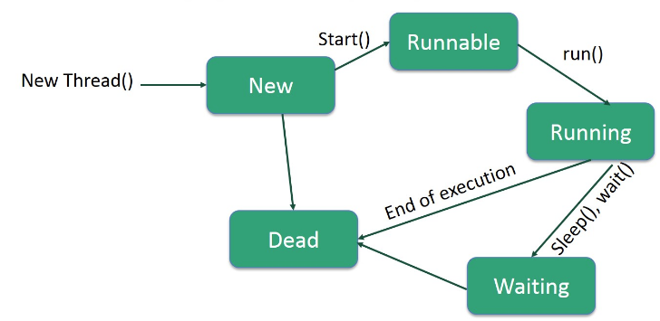

# Java Concurrency

The `java.util.concurrent` package provides tools for creating concurrent applications.

## Runnable and Multi-Threading

`java.lang.Runnable` is an interface that is to be implemented by a class whose instances are intended to be executed by a thread.

A lifecycle of Java multithreading object shows as below.

<div style="display: flex; justify-content: center;">
      
</div>
</br>

`Runnable` is a simple interface containing an `abstract void run();`.
User should override `run()` adding user-defined logic into it.
Once `Thread#start()` got executed, the code in `Thread#run()` starts executing as well.

```java
@FunctionalInterface
public interface Runnable {
    /**
     * When an object implementing interface <code>Runnable</code> is used
     * to create a thread, starting the thread causes the object's
     * <code>run</code> method to be called in that separately executing
     * thread.
     * <p>
     * The general contract of the method <code>run</code> is that it may
     * take any action whatsoever.
     *
     * @see     java.lang.Thread#run()
     */
    public abstract void run();
}

public class ExampleClass implements Runnable {  
  
    @Override  
    public void run() {  
        // put your logic here
        System.out.println("Thread has ended");  
    }  
   
    public static void main(String[] args) {  
        ExampleClass ex = new ExampleClass();  
        Thread t1= new Thread(ex);  
        t1.start();  
        System.out.println("Hi");  
    }  
}  
```

### Thread Local

The `TheadLocal` construct stores data that will be accessible only by a specific thread.

`ThreadLocal` instances are typically private static fields in classes that wish to associate state with a thread (e.g., a user ID or Transaction ID).

#### Example

Given `Connection connect` (defined in `java.sql.Connection`) that is supposed to be shared among different threads, simply passing `Connection connect` across different threads is NOT thread safe.

A naive solution is launching a new `Connection connect` in every thread, perform `connect.open();` when a thread picks up a task; perform `connect.close();` when a thread finishes a task (as typical in a thread pool working mechanism).
Obviously, this is very time-consuming.

By `ThreadLocal<Connection>` such as the code below, the `dbConnectionLocal` is a thread scope object.
In other words, each thread maintains a independent `dbConnectionLocal`.

```java
import java.sql.Connection;
import java.sql.DriverManager;
import java.sql.SQLException;

public class ConnectionManager {

    private static final ThreadLocal<Connection> dbConnectionLocal = new ThreadLocal<Connection>() {
        @Override
        protected Connection initialValue() {
            try {
                return DriverManager.getConnection("", "", "");
            } catch (SQLException e) {
                e.printStackTrace();
            }
            return null;
        }
    };

    public Connection getConnection() {
        return dbConnectionLocal.get();
    }
}
```

The implementation is by a `ThreadLocalMap` that takes the thread id as the key and the thread object addr as the value.
So that the retrieved value/thread local object is unique per thread.

```java
public T get() {
    Thread t = Thread.currentThread();
    ThreadLocalMap threadLocals = getMap(t);
    if (threadLocals != null) {
        ThreadLocalMap.Entry e = threadLocals.getEntry(this);
        if (e != null) {
            @SuppressWarnings("unchecked")
            T result = (T)e.value;
            return result;
        }
    }
    return setInitialValue();
}
```

#### Thread Local Memory Leak

`ThreadLocal<T>` must be used with `remove()` when a thread exits, otherwise memory leak happens.
This is caused by `ThreadLocal<T>` being declared `static` that is out of a thread's scope, hence not being released by a thread.

```java
import java.util.concurrent.LinkedBlockingQueue;
import java.util.concurrent.ThreadPoolExecutor;
import java.util.concurrent.TimeUnit;

public class ThreadLocalDemo {

    // set up a thread pool
    final static ThreadPoolExecutor poolExecutor = new ThreadPoolExecutor(5, 5, 1, TimeUnit.MINUTES,
            new LinkedBlockingQueue<>());

    // make localVariable as a `ThreadLocal<LocalVariable>`
    static class LocalVariable {
        private Long[] a = new Long[1024 * 1024];
    }
    final static ThreadLocal<LocalVariable> localVariable = new ThreadLocal<LocalVariable>();

    // main: submit 50 tasks launching new `LocalVariable`
    public static void main(String[] args) throws InterruptedException {
        for (int i = 0; i < 50; ++i) {
            poolExecutor.execute(new Runnable() {
                public void run() {
                    localVariable.set(new LocalVariable());
                    localVariable.remove(); // `remove()` is mandatory, otherwise memory leak happens
                }
            });
        }
    }
}
```

## Blocking and Non-Blocking vs Sync and Async

## Executor

An object that executes submitted Runnable tasks.
It helps decouple between a task actually that actually runs and the task submission to a thread.

For example, rather than by `new Thread(new(RunnableTask())).start()`, should try

```java
Executor executor = new Executor();
executor.execute(new RunnableTask1());
executor.execute(new RunnableTask2());
...
```

The `Executor` implementations provided in this package implement `ExecutorService`, which is a more extensive interface. 
The `ThreadPoolExecutor` class provides an extensible thread pool implementation. 
The `Executors` class provides convenient factory methods for these executors.

A more popular usage is by `ExecutorService` such as
```java
public class Task implements Runnable {
    @Override
    public void run() {
        // task details
    }
}

ExecutorService executor = Executors.newFixedThreadPool(10);
```

## Thread Interrupt

Thread Interrupt is used to signal a spawned thread by `Thread#interrupt()` to terminate/preempt the running of the spawned thread. 
The `Thread#interrupt()` sets a flag `Thread#interrupted = true`.

The spawned thread checks `isInterrupted()` that checks if `Thread#interrupted = true`.

When a thread is preempted by `Thread#interrupt()`, if this thread immediately checks if `Thread#interrupted = true` then exits, it shall be good.
If still ongoing processing some other work such as `Thread.sleep(1000);`, the thread throws `InterruptedException e`.

```java
public class RightWayStopThreadWithSleep {
    public static void main(String[] args) throws InterruptedException {
        Runnable runnable = () -> {
            int num = 0;
            while (num <= 300 && !Thread.currentThread().isInterrupted()) {
                if (num % 100 == 0) {
                    System.out.println("Code is running");
                }
                num++;
            }
            try {
                // sleep for 1 sec
                Thread.sleep(1000);
            } catch (InterruptedException e) {
                System.out.println("Thread died");
                e.printStackTrace();
            }
        };

        Thread thread = new Thread(runnable);
        thread.start();
        Thread.sleep(500);
        // signal the spawned thread to stop
        thread.interrupt();
    }
}
```

## Daemon Thread

A daemon thread is a low-priority thread in Java designed to provide background services to non-daemon threads.

Background services include MQ publish and receive, and garbage collection, etc.

If all non-daemon threads finish execution, the JVM will stop, terminating the daemon thread abruptly.

Example: If the main application exits, the producer thread will stop.

```java
import javax.jms.*;

public class DaemonMessageProducer implements Runnable {
    private volatile boolean running = true; // Control flag for stopping the thread
    private final String brokerURL;
    private final String queueName;

    public DaemonMessageProducer(String brokerURL, String queueName) {
        this.brokerURL = brokerURL;
        this.queueName = queueName;
    }

    public void stop() {
        running = false; // Set flag to stop the thread
    }

    @Override
    public void run() {
        Connection connection = null;
        Session session = null;
        MessageProducer producer = null;

        try {
            ConnectionFactory factory = new org.apache.activemq.ActiveMQConnectionFactory(brokerURL);
            connection = factory.createConnection();
            session = connection.createSession(false, Session.AUTO_ACKNOWLEDGE);
            Destination destination = session.createQueue(queueName);
            producer = session.createProducer(destination);
            producer.setDeliveryMode(DeliveryMode.NON_PERSISTENT);

            while (running) {
                String message = "Hello, World! - " + System.currentTimeMillis();
                TextMessage textMessage = session.createTextMessage(message);
                producer.send(textMessage);
                System.out.println("Sent: " + message);

                Thread.sleep(1000); // Send a message every second
            }
        } catch (Exception e) {
            e.printStackTrace();
        } finally {
            try {
                if (producer != null) producer.close();
                if (session != null) session.close();
                if (connection != null) connection.close();
            } catch (JMSException e) {
                e.printStackTrace();
            }
        }
    }

    public static void main(String[] args) throws InterruptedException {
        String brokerURL = "tcp://localhost:61616";
        String queueName = "TestQueue";

        DaemonMessageProducer producer = new DaemonMessageProducer(brokerURL, queueName);
        Thread producerThread = new Thread(producer);
        producerThread.setDaemon(true); // Set the thread as daemon
        producerThread.start();

        // Simulate application running for 10 seconds
        Thread.sleep(10000);

        // Stop the producer gracefully
        producer.stop();
    }
}
```

## Synchronized and Lock

A piece of logic marked with synchronized becomes a synchronized block, allowing only one thread to execute at any given time.

It is basically a function level mutex.

For example, there are multiple threads simultaneously incrementing the same object `summation`.
The result, if correct, should have been `1000`.
For not having applied a proper mutex by `synchronized`, the `@Test` fails.

```java
public class Increment {

    private int sum = 0;

    public void increment() {
        setSum(getSum() + 1);
    }

    public void setSum(int _sum) { this.sum = _sum; }
    public int getSum() { return this.sum; }
}

@Test
public void MultiThreadIncrement_NoSync() {
    ExecutorService service = Executors.newFixedThreadPool(3);
    Increment summation = new Increment();

    IntStream.range(0, 1000)
      .forEach(count -> service.submit(summation::increment));
    service.awaitTermination(1000, TimeUnit.MILLISECONDS);

    assertEquals(1000, summation.getSum()); // this fails
}
```

Solution is simply adding `synchronized` to `increment()`.
And this function's execution is protected by mutex.

```java
public class IncrementWithSync {

    private int sum = 0;

    public synchronized void increment() {
        setSum(getSum() + 1);
    }

    public void setSum(int _sum) { this.sum = _sum; }
    public int getSum() { return this.sum; }
}
```

In fact, for `getSum() + 1`, the `int sum` should have been defined `AtomicInteger`, and the increment can be done by `getAndIncrement();`.

### JUC Lock and Condition

Similar to c++ mutex and conditional_variable.

The below interfaces are defined in `java.util.concurrent` (J.U.C.).

```java
public interface Lock {
    // get lock
    void lock();
    // Try to acquire the lock, failed if the current thread is called `interrupted`, throw exception `InterruptedException`
    void lockInterruptibly() throws InterruptedException;
    // try lock
    boolean tryLock();
    // try lock with timeout
    boolean tryLock(long time, TimeUnit unit) throws InterruptedException;
    // release lock
    void unlock();
    // return `Condition` which is associated with the lock
    Condition newCondition();
}

public interface Condition {
    // Make the current thread wait until notified or interrupted
    void await() throws InterruptedException;
    // Same as `await()`, but continue waiting even being interrupted
    void awaitUninterruptibly();
    // Same as `await()` but added timeout
    boolean await(long time, TimeUnit unit) throws InterruptedException;
    // Same as above `await(long time, TimeUnit unit)`, but time unit is nanosec
    long awaitNanos(long nanosTimeout) throws InterruptedException;
    // wait by a deadline, not duration
    boolean awaitUntil(Date deadline) throws InterruptedException;
    // wake up a thread associated with this condition
    void signal();
    // wake up ALL threads associated with this condition
    void signalAll();
}
```

A `ReentrantLock` is the basic mutex (mutual exclusion) lock in java.

```java
class X {
    private final ReentrantLock lock = new ReentrantLock();
    // ...

    public void m() {
        lock.lock();  // block until condition holds
        try {
        // ... method body
        } finally {
          lock.unlock();
        }
    }
}
```

A `Semaphore` maintains a set of permits.
Each `acquire()` blocks if necessary until a permit is available, and then takes it.
Each `release()` adds a permit, potentially releasing a blocking acquirer.

Semaphores are often used to restrict the number of threads than can access some (physical or logical) resource. 
For example, here is a class that uses a semaphore to control access to a pool of items.

```java
class ItemQueueUsingSemaphore {

    private Semaphore semaphore;

    public ItemQueueUsingSemaphore(int slotLimit) {
        // set the num of threads that can simultaneously access the semaphore-controlled resources
        semaphore = new Semaphore(slotLimit); 
    }

    boolean tryItem() {
        return semaphore.tryAcquire();
    }

    void releaseItem() {
        semaphore.release();
    }

    int availableSlots() {
        return semaphore.availablePermits();
    }

}
```


### Producer-Consumer Multi-Threading Message Queue Example

Below code is an example of how a message queue cache `BoundedBuffer` of 100 element buffer size can be `put` and `get` via lock acquire/release.

The `put` and `get` are assumed used in multi-threaded env, where blocking takes place `notFull.await();` for `put` when the 100-element size buffer is full;
and `notEmpty.await();` for `get` if empty.

```java
package yuqiexample;

import java.util.concurrent.locks.Lock;
import java.util.concurrent.locks.ReentrantLock;
import java.util.concurrent.locks.Condition;


class BoundedBuffer {
    final Lock lock = new ReentrantLock();
    final Condition notFull  = lock.newCondition();
    final Condition notEmpty = lock.newCondition();

    final Object[] items = new Object[100];
    int putptr, takeptr, count;

    public void put(Object x) throws InterruptedException {
        lock.lock();
        try {
            while (count == items.length)
                notFull.await();
            items[putptr] = x;
            if (++putptr == items.length) putptr = 0;
            ++count;
            notEmpty.signal();
        } finally {
            lock.unlock();
        }
    }

    public Object get() throws InterruptedException {
        lock.lock();
        try {
            while (count == 0)
                notEmpty.await();
            Object x = items[takeptr];
            if (++takeptr == items.length) takeptr = 0;
            --count;
            notFull.signal();
            return x;
        } finally {
            lock.unlock();
        }
    }
}
```

The usage of the `BoundedBuffer` in the below example serves as a message queue.
Elements are taken out and stored in `ArrayBlockingQueue<Integer> q` and `ArrayList<Integer> a`.

The result is that, `q` can receive all 1000 elements, while `a` fails for not supporting multi-threaded `add`.

```java
package yuqiexample;

import java.util.ArrayList;
import java.util.concurrent.*;
import java.util.stream.IntStream;


public class Main {
    public static void main(String[] args) {
        ExecutorService servicePut = Executors.newFixedThreadPool(3);
        ExecutorService serviceGet = Executors.newFixedThreadPool(3);
        BoundedBuffer boundedBuffer = new BoundedBuffer();

        IntStream.range(0, 1000)
            .forEach(count -> servicePut.submit(() -> {
                try{
                    boundedBuffer.put(1);
                }
                catch (InterruptedException e) {
                    System.out.println(e.toString());
                }
                finally {}
            }));

        ArrayBlockingQueue<Integer> q = new ArrayBlockingQueue<Integer>(2000);
        ArrayList<Integer> a = new ArrayList<Integer>();
        IntStream.range(0, 1000)
            .forEach(count -> serviceGet.submit(() -> {
                try{
                    Integer objInt = (Integer) boundedBuffer.get();
                    q.put(objInt);
                    a.add(objInt);
                }
                catch (InterruptedException e) {
                    System.out.println(e.toString());
                }
                finally {}
            }));

        try {
            servicePut.awaitTermination(1000, TimeUnit.MILLISECONDS);
            serviceGet.awaitTermination(1000, TimeUnit.MILLISECONDS);
        }
        catch (InterruptedException e) {
            System.out.println(e.toString());
        }
        finally {
            System.out.println("ArrayBlockingQueue size: " + q.size());
            System.out.println("ArrayList size: " + a.size());
            servicePut.shutdown();
            serviceGet.shutdown();
        }
    }
}
```

### Dead Lock

A dead lock scenario refers to two or more threads waiting for lock release from each other, resulted in all threads blocking at the lock. 

For example, there are two balance accounts transferring money to each other (code shown as below).

Dead lock happens as both `account1` and `account2` lock themselves via `synchronized (this)`.
The next `synchronized (counterparty)` refers to the other account's lock, such as `account1`'s `synchronized (counterparty)` is `account2`'s `synchronized (this)`.
They both waiting for the other account to release lock, hence reached the dead lock dilemma.

```java
public class Balance {

private int amount;

public Balance(int amount){
   this.amount=amount;
}

public void transfer(Balance counterparty,int transferAmount){
    synchronized (this){
        synchronized (counterparty){
            if(amount< transferAmount){
                System.out.println("Withdrawal amount is greater than your remaining");
            }else{
                amount=amount-transferAmount;
                counterparty.amount=counterparty.amount+transferAmount;
            }
        }
    }
}

public static void main(String[] args) {
    Balance account1 = new Balance(1000);
    Balance account2 = new Balance(500);

    Runnable counterparty1= ()->account1.transfer(account2,200);
    Runnable counterparty2= ()->account2.transfer(account1,100);

    new Thread(counterparty1).start();
    new Thread(counterparty2).start();
}

}

```

The solution is using `tryLock()`.

The diff between `tryLock()` and `lock()` is immediate return from `tryLock()` vs `lock()` blocking such as by `spinLock()` implementation to acquire a lock.

In the code below, when `this.lock.tryLock()` fails acquiring a lock, it immediately returns following by `finally { this.lock.unlock(); }` releasing the lock, so that the another thread can succeed in `counterparty.lock.tryLock()`.
Therefore, the dead lock scenario is avoided.

```java
public class Balance {

...

private final Lock lock = new ReentrantLock();

public void transfer(Balance counterparty,int transferAmount) throws InterruptedException {
    while (true) {
        if (this.lock.tryLock()) {
            try {
                if (counterparty.lock.tryLock()) {
                    try {
                        if(amount< transferAmount){
                            System.out.println("Withdrawal amount is greater than your remaining");
                        }else{
                            amount=amount-transferAmount;
                            counterparty.amount=counterparty.amount+transferAmount;
                        }
                        break;
                    } finally {
                        counterparty.lock.unlock();
                    }
                }
            } finally {
                this.lock.unlock();
            }
        }
        // set up a timeout clock so that the lock will be released nevertheless
        Thread.sleep(1000+new Random(1000L).nextInt(1000));
    }
}

public static void main(String[] args) {
    ...
}

}

```

## Daemon Thread

Daemon is a concept referring to backend services independent from user services, and is used to provide assistance to the user services.

Java offers two types of threads: *user threads* and *daemon threads*.

Daemon thread handles low-priority tasks such as garbage collection that is often not executed when user threads are running.

A daemon thread is launched via setting a normal thread to `setDaemon(true);`.

```java
package yuqiexamples;

public class DaemonExample {
    public static void main(String[] args) {
        ThreadDemo threaddemo = new ThreadDemo();
        Thread threadson = new Thread(threaddemo);
        // set daemon
        threadson.setDaemon(true);
        // start thread
        threadson.start();
        System.out.println("bbb");
    }
}
class ThreadDemo implements Runnable{
    
    @Override
    public void run() {
        System.out.println("aaa");
        // if this thread is of user, shall never die; if of daemon, will die after the parent thread dies
        while(true); 
    }
    
}
```

When user threads are dead, daemon threads will be soon dead as well.

The code above prints

```txt
bbb
aaa
```

### Use Case in Servlet

In servlet, there are many spawned threads handling requests/responses.

If the main web container dies, all spawned threads should terminates as well.
Besides, in web container, there should be a high-priority thread that schedules what requests go to what thread, and the actual processing threads are of low-priority,

By the above consideration, the spawned threads can be set to daemons.