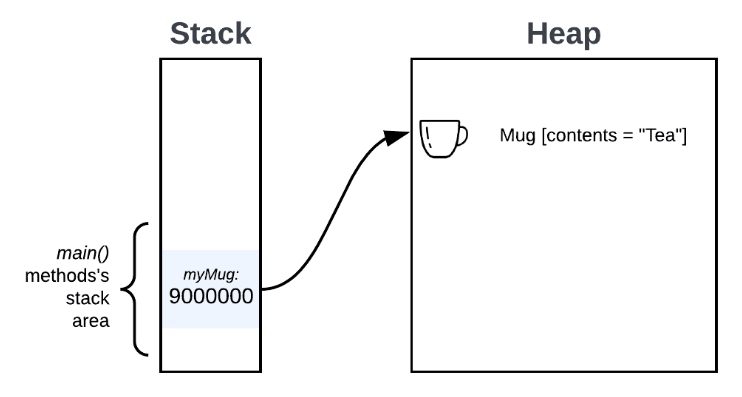
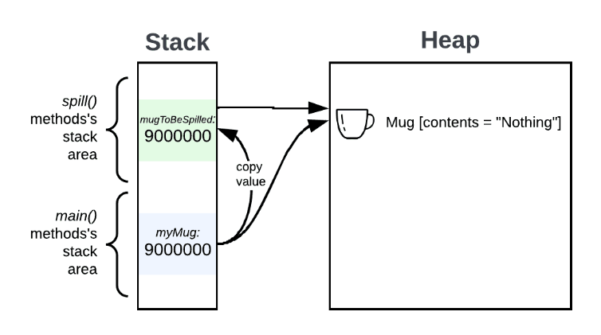
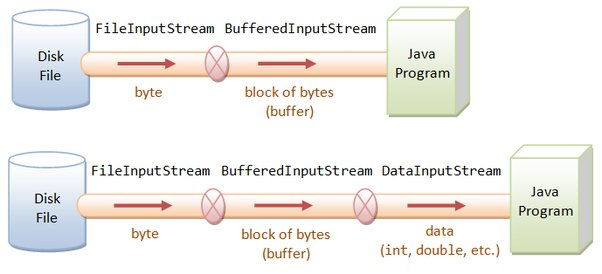

# Java Practices

## Typical Object Methods

The `Object` class is the parent class of all the classes in java by default.
It provides useful methods such as `toString()`.
It is defined in `Java.lang.Object`.

### Method/Scope Resolution Operator `::` vs `.`

`.` is a generic member resolution, while `::` is method reference operator directly referencing a class method.

For example, the below lambda expression `->` is same as using `::` operator.

```java
package yuqiexample;

import java.util.stream.*;

class GFG {

private void printItem(String s) 
{
    System.out.println(s);
}

public static void main(String[] args)
{
    // Get the stream
    Stream<String> stream
        = Stream.of("Geeks", "For",
                    "Geeks", "A",
                    "Computer",
                    "Portal");

    // Print the stream
    stream.forEach(s -> System.out.println(s));

    // Print the stream
    stream.forEach((new GFG())::printItem);

}
}
```

### `equals()` vs `==`, and `hashCode`

By default, the hash of an object is computed by its memory location.

```java
public class Cat {
    public static void main(String[] args) {
        System.out.println(new Cat().hashCode());
    }
    //out
    //1349277854
}
```

Use `==` operators for reference comparison (address comparison) and `.equals()` method for content comparison. 
In simple words, `==` checks if both objects point to the same memory location whereas `.equals()` evaluates to the comparison of values in the objects.

```java
public class Test {
    public static void main(String[] args)
    {
        String s1 = "HELLO";
        String s2 = "HELLO";
        String s3 =  new String("HELLO");
 
        System.out.println(s1 == s2); // true
        System.out.println(s1 == s3); // false
        System.out.println(s1.equals(s2)); // true
        System.out.println(s1.equals(s3)); // true
    }
}
```

Both `==` and `equals()` can be overriden.

* `equals()` vs `hashCode()`

Objects that are equal (according to their `equals()`) must return the same hash code.

`hashCode()` has usage in hash map serving as the key.

### `getClass()`, `forName(...)` and Reflection

`getClass()` gets object's class.

```java
public class Person {
    private String name;

    public Person(String name) {
        this.name = name;
    }

    public static void main(String[] args) {
        Person p = new Person("Jack");
        Class clz = p.getClass();
        System.out.println(clz);
        System.out.println(clz.getName());
    }
    /**
     * class com.tyson.basic.Person
     * com.tyson.basic.Person
     */
}
```

`forName()` method of `java.lang.Class` class is used to get the instance of this Class with the specified class name.
This class name is specified as the string parameter.

```java
public class Test {
    public static void main(String[] args)
        throws ClassNotFoundException
    {
        // get the Class instance using forName method
        Class c1 = Class.forName("java.lang.String");
 
        System.out.print("Class represented by c1: "
                         + c1.toString());
    }
}
```

Together, `getClass()` and `forName(...)` can be used in reflection to dynamically load classes/objects.

For example, in spring, objects are launched by an `xml` file that details what properties the object should have.

```java
public class BeanFactory {
       private Map<String, Object> beanMap = new HashMap<String, Object>();

       public void init(String xml) {
              try {
                     // read xml file and parse the xml, extract elements
                     SAXReader reader = new SAXReader();
                     ClassLoader classLoader = Thread.currentThread().getContextClassLoader();
                     InputStream ins = classLoader.getResourceAsStream(xml);
                     Document doc = reader.read(ins);
                     Element root = doc.getRootElement();  
                     Element foo;

                     // iterate specified beans in the xml file
                     for (Iterator i = root.elementIterator("bean"); i.hasNext();) {  
                            foo = (Element) i.next();

                            // read from beans then get the class
                            Attribute id = foo.attribute("id");  
                            Attribute cls = foo.attribute("class");
                            Class bean = Class.forName(cls.getText());

                            // further get the class's info
                            java.beans.BeanInfo info = java.beans.Introspector.getBeanInfo(bean);
                            java.beans.PropertyDescriptor pd[] = info.getPropertyDescriptors();
                            Method mSet = null;
                            
                            // launch a new inst for the class
                            Object obj = bean.newInstance();

                            // read properties of the inst and set the values
                            for (Iterator ite = foo.elementIterator("property"); ite.hasNext();) {  
                                   Element foo2 = (Element) ite.next();
                                   // get property name
                                   Attribute name = foo2.attribute("name");
                                   String value = null;

                                   // read property value
                                   for(Iterator ite1 = foo2.elementIterator("value"); ite1.hasNext();) {
                                          Element node = (Element) ite1.next();
                                          value = node.getText();
                                          break;
                                   }

                                   for (int k = 0; k < pd.length; k++) {
                                          if (pd[k].getName().equalsIgnoreCase(name.getText())) {
                                                 mSet = pd[k].getWriteMethod();
                                                 // set the property value to the inst
                                                 mSet.invoke(obj, value);
                                          }
                                   }
                            }

                            // finished and put the object into the bean map
                            beanMap.put(id.getText(), obj);
                     }
              } catch (Exception e) {
                     System.out.println(e.toString());
              }
       }

       //other codes
}
```

## Pass-By-Value vs Pass-By-Reference

* Pass by value: The method parameter values are copied to another variable and then the copied object is passed to the method. The method uses the copy.
* Pass by reference: An alias or reference to the actual parameter is passed to the method. The method accesses the actual parameter.

Technically, **Java is always pass by value**.

* For primitives such as `int` and `float`, the pass-by-value behavior does not alter the original value of the primitives.
For example, `setFoo(int bar)` does not change `int foo = 1;`.
```java
public class Run {

    public static void main(String args[]){
        int foo = 1;
        System.out.println(foo); // this will print "1"

        setFoo(foo);
        System.out.println(foo); // this will still print "1"
    }

    public static void setFoo(int bar){
        bar = 2;
    }
}
```

* For non-primitives, the pass-by-value simply means copying *reference value* (similar to c++ pointer).
The passed object in another function stack actually shares the same pointed heap area.

In other words, objects from the same `new` operator despite being passed to diff stacks, have the same members residing in the same heap area. 

For instance, `Mug myMug = new Mug("Tea");` sees its member `this.contents` updated by function `spill(myMug);`.

```java
public class Mug {

    private String contents;

    public Mug(String contents) { this.contents = contents; }

    public void setContents(String contents) { this.contents = contents; }
    public String getContents() { return contents; }
}

public class Run {

    public static void spill(Mug mugToBeSpilled) {
        mugToBeSpilled.setContents("Nothing");
    }

    public static void main(String args[]) {
        Mug myMug = new Mug("Tea"); // myMug contains "Tea".
        System.out.println(myMug.getContents());

        spill(myMug);  // myMug now contains "Nothing".
        System.out.println(myMug.getContents());

    }
}
```

<div style="display: flex; justify-content: center;">
      
</div>
</br>

<div style="display: flex; justify-content: center;">
      
</div>
</br>

### Clone vs Copy Constructor

Copy constructor is generally preferred over clone although they serve the same purpose.

The reason is that the `clone()` method of `java.lang.Object` has many assumptions such as that class must implement `Cloneable`, and parent class must invoke `super.clone()`, etc.

A copy function should `new` an object and set its fields.

```java
Foo copyFoo (Foo foo){
  Foo f = new Foo();
  //for all properties in Foo
  f.set(foo.get());
  return f;
}
```

Standard java containers have default copy constructor such as below.

```java
List<Double> original = new List<Double>{1.0, 2.0};
List<Double> copy = new ArrayList<Double>(original);
```

## `final`, `finally` and `finalize`

`final` is used to declare a variable as immutable. 
Similar to c++'s `const`, except that `final` cannot be inherited.

`finally` is used in `try`-`catch`-`finally` logic.

`finalize` is a method of `Object`, typically used in garbage collection.

## Common Exceptions and Examples

* `ClassCastException`

```java
Animal a = new Dog();
Dog d = (Dog) a; // No problem, the type animal can be casted to a dog, because it's a dog.
Cat c = (Dog) a; // Will cause a compiler error for type mismatch; you can't cast a dog to a cat.
```

* `NullPointerException`

It happens when dealing with null object.

For example, in the code below, `ptr.equals("gfg")` throws exception for `ptr` is null.
By simply changing it to `"gfg".equals(ptr)`, the err is solved.

```java
import java.io.*;
 
class GFGWrong
{
    public static void main (String[] args)
    {
        // Initializing String variable with null value
        String ptr = null;
 
        // Checking if ptr.equals null or works fine.
        try
        {
            // This line of code throws NullPointerException
            // because ptr is null
            if (ptr.equals("gfg"))
                System.out.print("Same");
            else
                System.out.print("Not Same");
        }
        catch(NullPointerException e)
        {
            System.out.print("NullPointerException Caught");
        }
    }
}
 
class GFGCorrect
{
    public static void main (String[] args)
    {
        // Initializing String variable with null value
        String ptr = null;
 
        // Checking if ptr is null using try catch.
        try
        {
            if ("gfg".equals(ptr))
                System.out.print("Same");
            else
                System.out.print("Not Same");           
        }
        catch(NullPointerException e)
        {
            System.out.print("Caught NullPointerException");
        }
    }
}
```

* `ArrayStoreException`

Thrown to indicate that an attempt has been made to store the wrong type of object into an array of objects.
For example, the following code generates an ArrayStoreException:

```java
Object x[] = new String[3];
x[0] = new Integer(0);
```

### `throw` and `throws` in Java

`throw` is used to explicitly throw an exception from a method or any block of code.

```java
// Java program to illustrate throws
class test {
    public static void main(String[] args)
    {
        throw new IllegalArgumentException("Invalid args: " + args);
    }
}
```

`throws` is used to output thrown exceptions to be caught in `catch`.

```java
// Java program to demonstrate working of throws
class ThrowsExecp {
 
    static void fun() throws IllegalAccessException
    {
        System.out.println("Inside fun(). ");
        throw new IllegalAccessException("demo");
    }
 
    public static void main(String args[])
    {
        try {
            fun();
        }
        catch (IllegalAccessException e) {
            System.out.println("caught in main.");
        }
    }
}
```

## JUnit Test

A JUnit test is a method contained in a class which is only used for testing. This is called a Test class. To define that a certain method is a test method, annotate it with the `@Test` annotation.

The following code shows a JUnit test using the JUnit 5 version. This test assumes that the MyClass class exists and has a multiply(int, int) method.

```java
import static org.junit.jupiter.api.Assertions.assertEquals;

import org.junit.jupiter.api.Test;

public class MyTests {

    @Test
    public void multiplicationOfZeroIntegersShouldReturnZero() {
        MyClass tester = new MyClass(); // MyClass is tested

        // assert statements
        assertEquals(0, tester.multiply(10, 0), "10 x 0 must be 0");
        assertEquals(0, tester.multiply(0, 10), "0 x 10 must be 0");
        assertEquals(0, tester.multiply(0, 0), "0 x 0 must be 0");
    }
}
``` 

## Java I/O

JAVA provides I/O services by the below classifications.

* by word

In `Reader`/`Writer` read/write two byte per time (or otherwise with implied encoding), interpretable to ASCII as well as Chinese characters. This mode is often used in `stdin` from keyboard, etc.

```java
import java.util.Scanner;

// this is defined in `java.util.Scanner`
public Scanner (@NotNull InputStream src) {
  this(new InputStreamReader(src), WHITESPACE_PATTERN);
}

public class TestScanner {
   public static void main(String[] args) {
       Scanner scanner = new Scanner(System.in);
       while (scanner.hasNextLine()){
           System.out.println(scanner.nextLine());
      }
  }
}
```

* by byte stream

In `InputStream`/`OutputStream` read/write one byte per time. This mode is often used in file reading and writing.

```java
import java.io.FileInputStream;
import java.io.FileOutputStream;
import java.io.IOException;

public class CopyFileWithStream {
   public static void main(String[] args) {
       int b = 0;
       String inFilePath = "D:\\wechat\\A.txt";
       String outFilePath = "D:\\wechat\\B.txt";
       try (FileInputStream in = new FileInputStream(inFilePath); 
            FileOutputStream out = new FileOutputStream(outFilePath)) {
           while ((b = in.read()) != -1) {
               out.write(b);
          }
      } catch (IOException e) {
           e.printStackTrace();
      }
  }
}
```

* by buffer

Added a buffer between program and disk file such as `BufferedInputStream` and `BufferedOutputStream`. The final read/write from/on a disk file is done by flush (or explicit read/write functions).

The buffer works on top of an existing I/O stream.

<div style="display: flex; justify-content: center;">
      
</div>
</br>

```java
import java.io.*;

public class CopyFileWithBuffer {
   public static void main(String[] args) throws Exception {
       String inFilePath = "D:\\wechat\\A.txt";
       String outFilePath = "D:\\wechat\\B.txt";
       try (BufferedInputStream bis = new BufferedInputStream(new FileInputStream(inFilePath));
            BufferedOutputStream bos = new BufferedOutputStream(new FileOutputStream(outFilePath))) {
           byte[] b = new byte[1024];
           int off = 0;
           while ((off = bis.read(b)) > 0) {
               bos.write(b, 0, off);
          }
      }
  }
}
```

### Serialization and Deserialization

`transient` in Java is used to indicate that a field should not be part of the serialization process.

## Java Message Service (JMS)

Java Message Service (JMS) is an API specification for java message queue for data transfer between a producer and a consumer.

```conf
# JMS Configuration
jms.connectionFactory = org.apache.activemq.ActiveMQConnectionFactory
jms.queue = ExampleQueue
jms.topic = ExampleTopic
jms.brokerURL = tcp://localhost:61616
```

where

* `queue`: A point-to-point destination where messages are sent and received.
* `topic`: A publish-subscribe destination where messages are broadcast to all subscribers.
