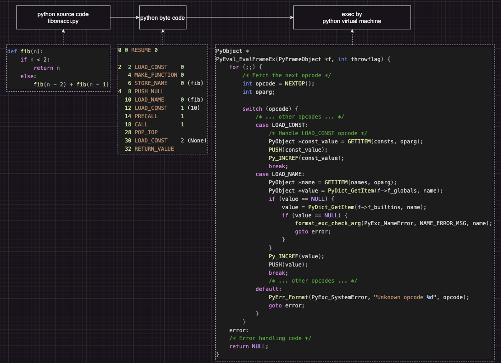

# Python Interpreters

## Python Interpreter and Python Virtual Machine (PVM)

Python interpreter is also named Python Virtual Machine (PVM).

Python source code is translated/compiled into byte code stored `.pyc` file.
then, PVM starts and execute the `.pyc` byte code.
Basically, it is a big loop retrieving byte code one by one, and take action per byte code.

In PVM, 

`POP()`: Pops the top value off the stack (right operand).
`TOP()`: Peeks at the top value of the stack without popping it (left operand).
`Py_INCREF(value)`: Increments the reference count of the value to ensure it is not garbage collected.
`Py_DECREF(value)`: Decrements the reference count of the value; when reached to zero, might trigger garbage collection.
`PUSH(value)`: Pushes the value onto the stack.
`DISPATCH()`: Continues to the next instruction.

<div style="display: flex; justify-content: center;">
      
</div>
</br>

### Interpreter Entry

The start of python execution first set up a new interpreter, then according to code input type, e.g., by file or cmd line, execute the python code.

```c
// cpython/Modules/main.c
static void
pymain_run_python(int *exitcode)
{
    PyObject *main_importer_path = NULL;
    PyInterpreterState *interp = _PyInterpreterState_GET();
    PyConfig *config = (PyConfig*)_PyInterpreterState_GetConfig(interp);

    ...

    if (config->run_filename != NULL) {
        *exitcode = pymain_run_file(config);
    }
    else if (config->run_command) {
        *exitcode = pymain_run_command(config->run_command);
    }
    else if (main_importer_path != NULL) {
        *exitcode = pymain_run_module(L"__main__", 0);
    }
    ...
    else {
        *exitcode = pymain_run_stdin(config);
    }
}
```

### Interpreter State

`_PyInterpreterState_GET()` gives an interpreter `PyInterpreterState *interp`, that in the creation of the interpreter:

* a runtime env is set up
* thread is bound
* Global Interpreter Lock (GIL) is set up

```c
// // cpython/Python/pystate.c
PyInterpreterState *
PyInterpreterState_New(void)
{
    // tstate can be NULL
    PyThreadState *tstate = current_fast_get();

    PyInterpreterState *interp;
    PyStatus status = _PyInterpreterState_New(tstate, &interp);
    if (_PyStatus_EXCEPTION(status)) {
        Py_ExitStatusException(status);
    }
    assert(interp != NULL);
    return interp;
}

// cpython/Python/pylifecycle.c
static PyStatus
new_interpreter(PyThreadState **tstate_p,
                const PyInterpreterConfig *config, long whence)
{
    PyStatus status;

    status = _PyRuntime_Initialize();
    if (_PyStatus_EXCEPTION(status)) {
        return status;
    }
    _PyRuntimeState *runtime = &_PyRuntime;

    ... // some checking

    PyInterpreterState *interp = PyInterpreterState_New();
    if (interp == NULL) {
        *tstate_p = NULL;
        return _PyStatus_OK();
    }
    _PyInterpreterState_SetWhence(interp, whence);
    interp->_ready = 1;

    // XXX Might new_interpreter() have been called without the GIL held?
    PyThreadState *save_tstate = _PyThreadState_GET();
    PyThreadState *tstate = NULL;

    /* From this point until the init_interp_create_gil() call,
       we must not do anything that requires that the GIL be held
       (or otherwise exist).  That applies whether or not the new
       interpreter has its own GIL (e.g. the main interpreter). */
    if (save_tstate != NULL) {
        _PyThreadState_Detach(save_tstate);
    }

    /* Copy the current interpreter config into the new interpreter */
    const PyConfig *src_config;
    if (save_tstate != NULL) {
        src_config = _PyInterpreterState_GetConfig(save_tstate->interp);
    }
    else
    {
        /* No current thread state, copy from the main interpreter */
        PyInterpreterState *main_interp = _PyInterpreterState_Main();
        src_config = _PyInterpreterState_GetConfig(main_interp);
    }

    ... // err handling

    tstate = _PyThreadState_New(interp, _PyThreadState_WHENCE_INIT);
    if (tstate == NULL) {
        status = _PyStatus_NO_MEMORY();
        goto error;
    }

    _PyThreadState_Bind(tstate);
    init_interp_create_gil(tstate, config->gil);

    /* No objects have been created yet. */

    status = pycore_interp_init(tstate);
    ... // err checking

    *tstate_p = tstate;
    return _PyStatus_OK();

error:
    ... // err checking

    return status;
}
```

For runtime creation, besides some checking, `runtime->main_thread = PyThread_get_thread_ident();` assigns a thread to the runtime.

```c
PyStatus
_PyRuntimeState_Init(_PyRuntimeState *runtime)
{
    /* We preserve the hook across init, because there is
       currently no public API to set it between runtime
       initialization and interpreter initialization. */
    void *open_code_hook = runtime->open_code_hook;
    void *open_code_userdata = runtime->open_code_userdata;
    _Py_AuditHookEntry *audit_hook_head = runtime->audit_hooks.head;
    // bpo-42882: Preserve next_index value if Py_Initialize()/Py_Finalize()
    // is called multiple times.
    Py_ssize_t unicode_next_index = runtime->unicode_state.ids.next_index;

    if (runtime->_initialized) {
        // Py_Initialize() must be running again.
        // Reset to _PyRuntimeState_INIT.
        memcpy(runtime, &initial, sizeof(*runtime));
        assert(!runtime->_initialized);
    }

    if (gilstate_tss_init(runtime) != 0) {
        _PyRuntimeState_Fini(runtime);
        return _PyStatus_NO_MEMORY();
    }

    if (PyThread_tss_create(&runtime->trashTSSkey) != 0) {
        _PyRuntimeState_Fini(runtime);
        return _PyStatus_NO_MEMORY();
    }

    init_runtime(runtime, open_code_hook, open_code_userdata, audit_hook_head,
                 unicode_next_index);

    return _PyStatus_OK();
}

static void
init_runtime(_PyRuntimeState *runtime,
             void *open_code_hook, void *open_code_userdata,
             _Py_AuditHookEntry *audit_hook_head,
             Py_ssize_t unicode_next_index)
{
    assert(!runtime->preinitializing);
    assert(!runtime->preinitialized);
    assert(!runtime->core_initialized);
    assert(!runtime->initialized);
    assert(!runtime->_initialized);

    runtime->open_code_hook = open_code_hook;
    runtime->open_code_userdata = open_code_userdata;
    runtime->audit_hooks.head = audit_hook_head;

    PyPreConfig_InitPythonConfig(&runtime->preconfig);

    // Set it to the ID of the main thread of the main interpreter.
    runtime->main_thread = PyThread_get_thread_ident();

    runtime->unicode_state.ids.next_index = unicode_next_index;

#if defined(__EMSCRIPTEN__) && defined(PY_CALL_TRAMPOLINE)
    _Py_EmscriptenTrampoline_Init(runtime);
#endif

    runtime->_initialized = 1;
}
```

### Code Execution by A Thread

Basically, an object call needs to first obtain a thread then invoke the object calling.

```c
PyObject *
PyObject_Call(PyObject *callable, PyObject *args, PyObject *kwargs)
{
    PyThreadState *tstate = _PyThreadState_GET();
    return _PyObject_Call(tstate, callable, args, kwargs);
}
```

To obtain a thread, first check if there already exists a local thread state, otherwise set up a binding between the current runtime and thread state by `current_fast_set(&_PyRuntime, tstate);`.

The thread has been init in the start of interpreter.

```c
static inline PyThreadState*
_PyThreadState_GET(void)
{
#if defined(HAVE_THREAD_LOCAL) && !defined(Py_BUILD_CORE_MODULE)
    return _Py_tss_tstate;
#else
    return _PyThreadState_GetCurrent();
#endif
}

PyThreadState *
_PyThreadState_GetCurrent(void)
{
    return current_fast_get();
}

static inline PyThreadState *
current_fast_get(void)
{
#ifdef HAVE_THREAD_LOCAL
    return _Py_tss_tstate;
#else
    // XXX Fall back to the PyThread_tss_*() API.
#  error "no supported thread-local variable storage classifier"
#endif
}

static inline void
current_fast_set(_PyRuntimeState *Py_UNUSED(runtime), PyThreadState *tstate)
{
    assert(tstate != NULL);
#ifdef HAVE_THREAD_LOCAL
    _Py_tss_tstate = tstate;
#else
    // XXX Fall back to the PyThread_tss_*() API.
#  error "no supported thread-local variable storage classifier"
#endif
}

// in cpython/Python/pystate.c
static PyThreadState *_Py_tss_tstate = tstate;
```

```c
void
_PyThreadState_Attach(PyThreadState *tstate) {

    _Py_EnsureTstateNotNULL(tstate);
    if (current_fast_get() != NULL) {
        Py_FatalError("non-NULL old thread state");
    }

    while (1) {
        _PyEval_AcquireLock(tstate);

        // XXX assert(tstate_is_alive(tstate));
        current_fast_set(&_PyRuntime, tstate);
        tstate_activate(tstate);

        if (!tstate_try_attach(tstate)) {
            tstate_wait_attach(tstate);
        }
        break;
    }

    // Resume previous critical section. This acquires the lock(s) from the
    // top-most critical section.
    if (tstate->critical_section != 0) {
        _PyCriticalSection_Resume(tstate);
    }

#if defined(Py_DEBUG)
    errno = err;
#endif
}
```

### Frames in Python Interpreter

Each function call in Python corresponds to a *frame*, which includes the function's execution context, e.g., local and global variables, stack.

For example, when there is exception, the currently executing frame got reset to `tstate->frame = f->f_back;`.

```c
PyObject *
PyEval_EvalFrameEx(PyFrameObject *f, int throwflag)
{
    PyThreadState *tstate = _PyThreadState_GET();
    return _PyEval_EvalFrame(tstate, f->f_frame, throwflag);
}

static inline PyObject*
_PyEval_EvalFrame(PyThreadState *tstate, struct _PyInterpreterFrame *frame, int throwflag)
{
    EVAL_CALL_STAT_INC(EVAL_CALL_TOTAL);
    if (tstate->interp->eval_frame == NULL) {
        return _PyEval_EvalFrameDefault(tstate, frame, throwflag);
    }
    return tstate->interp->eval_frame(tstate, frame, throwflag);
}
```

where

```c
void
_PyInterpreterState_SetEvalFrameFunc(PyInterpreterState *interp,
                                     _PyFrameEvalFunction eval_frame)
{
    if (eval_frame == _PyEval_EvalFrameDefault) {
        eval_frame = NULL;
    }
    if (eval_frame == interp->eval_frame) {
        return;
    }
    RARE_EVENT_INC(set_eval_frame_func);
    interp->eval_frame = eval_frame;
}
```

## Python Interpreter Types

* *CPython* is the default and most widely-used implementation of Python.

Written in C.

Garbage collection: CPython uses a reference counter (similar to c++ `std::shared_ptr`) to de-allocate objects.

Performance and runtime env: run `.pyc` (compiled python bytecode) in a virtual env.

* *PyPy* is an alternative implementation of Python focused on speed and efficiency.

Written in RPython (a subset of Python).

Performance and runtime env: a Just-In-Time (JIT) compiler translates hot spots code into machine code, no virtual env, hence faster than CPython.

PyPy's GC typically uses three generations — nursery (young, frequently collected since most objects die young), major (middle-aged), and old (long-lived).

* *IPython* (Interactive Python) is used the Python interpreter in Jupyter Notebook.

It provides an interactive Shell, including code blocks known as *cells*.

Special commands that start with `%` a.k.a. *magic commands* that are specific to Jupyter Notebook, e.g., `%matplotlib inline` to enable inline plots, and `!` for shell command, e.g., `!pip install flask`

* *MicroPython* is a lean and efficient implementation of Python designed to run on micro-controllers and in constrained environments.

Written in C.

Optimized for resource-constrained environments.

## Python Object and Thread

### Python Global Interpreter Lock (GIL) Implementation and Thread

Instead of having multiple threads, *pythread* has many `handles` to run virtual multi-threading functions.
In the progress of executing the `handle`, mutex `PyMutex_Lock(&self->mutex);` is applied and when virtual threads are joined, the mutex is released.

```c
// cpython/Modules/_threadmodule.c
static PyObject *
thread_PyThread_start_new_thread(PyObject *module, PyObject *fargs)
{
    ...
    ThreadHandle *handle = ThreadHandle_new();
    do_start_new_thread(state, func, args, kwargs, handle, /*daemon=*/1);
    ...
}

static ThreadHandle *
ThreadHandle_new(void)
{
    ThreadHandle *self =
        (ThreadHandle *)PyMem_RawCalloc(1, sizeof(ThreadHandle));
    if (self == NULL) {
        PyErr_NoMemory();
        return NULL;
    }
    self->ident = 0;
    self->os_handle = 0;
    self->has_os_handle = 0;
    self->thread_is_exiting = (PyEvent){0};
    self->mutex = (PyMutex){_Py_UNLOCKED};
    self->once = (_PyOnceFlag){0};
    self->state = THREAD_HANDLE_NOT_STARTED;
    self->refcount = 1;

    HEAD_LOCK(&_PyRuntime);
    llist_insert_tail(&_PyRuntime.threads.handles, &self->node);
    HEAD_UNLOCK(&_PyRuntime);

    return self;
}

static int
do_start_new_thread(thread_module_state *state, PyObject *func, PyObject *args,
                    PyObject *kwargs, ThreadHandle *handle, int daemon)
{
    PyInterpreterState *interp = _PyInterpreterState_GET();
    ... // error checking

    if (!daemon) {
        // Add the handle before starting the thread to avoid adding a handle
        // to a thread that has already finished (i.e. if the thread finishes
        // before the call to `ThreadHandle_start()` below returns).
        add_to_shutdown_handles(state, handle);
    }

    // Start the handle
    if (ThreadHandle_start(handle, func, args, kwargs) < 0) {
        if (!daemon) {
            remove_from_shutdown_handles(handle);
        }
        return -1;
    }

    return 0;
}

static int
ThreadHandle_start(ThreadHandle *self, PyObject *func, PyObject *args,
                   PyObject *kwargs)
{
    // Mark the handle as starting to prevent any other threads from doing so
    PyMutex_Lock(&self->mutex);
    ... // err handling
    self->state = THREAD_HANDLE_STARTING;
    PyMutex_Unlock(&self->mutex);

    // Do all the heavy lifting outside of the mutex. All other operations on
    // the handle should fail since the handle is in the starting state.

    // gh-109795: Use PyMem_RawMalloc() instead of PyMem_Malloc(),
    // because it should be possible to call thread_bootstate_free()
    // without holding the GIL.
    struct bootstate *boot = PyMem_RawMalloc(sizeof(struct bootstate));
    if (boot == NULL) {
        PyErr_NoMemory();
        goto start_failed;
    }
    PyInterpreterState *interp = _PyInterpreterState_GET();
    boot->tstate = _PyThreadState_New(interp, _PyThreadState_WHENCE_THREADING);
    ... // various boot settings and arg passing

    PyThread_ident_t ident;
    PyThread_handle_t os_handle;
    if (PyThread_start_joinable_thread(thread_run, boot, &ident, &os_handle)) {
        ... // failure handling
        goto start_failed;
    }

    // Mark the handle running
    PyMutex_Lock(&self->mutex);
    assert(self->state == THREAD_HANDLE_STARTING);
    self->ident = ident;
    self->has_os_handle = 1;
    self->os_handle = os_handle;
    self->state = THREAD_HANDLE_RUNNING;
    PyMutex_Unlock(&self->mutex);

    // Unblock the thread
    _PyEvent_Notify(&boot->handle_ready);

    return 0;

start_failed:
    _PyOnceFlag_CallOnce(&self->once, (_Py_once_fn_t *)force_done, self);
    return -1;
}
```

In `_pythread_runtime_state` defines `struct llist_node handles;`.

```c
// cpython/Include/internal/pycore_pythread.h
struct _pythread_runtime_state {
    int initialized;

#ifdef _USE_PTHREADS
    // This matches when thread_pthread.h is used.
    struct {
        /* NULL when pthread_condattr_setclock(CLOCK_MONOTONIC) is not supported. */
        pthread_condattr_t *ptr;
# ifdef CONDATTR_MONOTONIC
    /* The value to which condattr_monotonic is set. */
        pthread_condattr_t val;
# endif
    } _condattr_monotonic;

#if defined(HAVE_PTHREAD_STUBS)
    struct {
        struct py_stub_tls_entry tls_entries[PTHREAD_KEYS_MAX];
    } stubs;
#endif

    // Linked list of ThreadHandles
    struct llist_node handles;
};
```

Below are the 

```c
typedef struct _is PyInterpreterState;

/* PyInterpreterState holds the global state for one of the runtime's
   interpreters.  Typically the initial (main) interpreter is the only one.

   The PyInterpreterState typedef is in Include/pytypedefs.h.
   */
struct _is {
    /* This struct contains the eval_breaker,
     * which is by far the hottest field in this struct
     * and should be placed at the beginning. */
    struct _ceval_state ceval;

    PyInterpreterState *next;

    int64_t id;
    int64_t id_refcount;
    int requires_idref;
    PyThread_type_lock id_mutex;

    struct pythreads {
        uint64_t next_unique_id;
        /* The linked list of threads, newest first. */
        PyThreadState *head;
        /* The thread currently executing in the __main__ module, if any. */
        PyThreadState *main;
        /* Used in Modules/_threadmodule.c. */
        Py_ssize_t count;
        /* Support for runtime thread stack size tuning.
           A value of 0 means using the platform's default stack size
           or the size specified by the THREAD_STACK_SIZE macro. */
        /* Used in Python/thread.c. */
        size_t stacksize;
    } threads;

    /* The per-interpreter GIL, which might not be used. */
    struct _gil_runtime_state _gil;

    ...
}

// cpython/Include/internal/pycore_gil.h
struct _gil_runtime_state {
    /* microseconds (the Python API uses seconds, though) */
    unsigned long interval;
    /* Last PyThreadState holding / having held the GIL. This helps us
       know whether anyone else was scheduled after we dropped the GIL. */
    PyThreadState* last_holder;
    /* Whether the GIL is already taken (-1 if uninitialized). This is
       atomic because it can be read without any lock taken in ceval.c. */
    int locked;
    /* Number of GIL switches since the beginning. */
    unsigned long switch_number;
    /* This condition variable allows one or several threads to wait
       until the GIL is released. In addition, the mutex also protects
       the above variables. */
    PyCOND_T cond;
    PyMUTEX_T mutex;
#ifdef FORCE_SWITCHING
    /* This condition variable helps the GIL-releasing thread wait for
       a GIL-awaiting thread to be scheduled and take the GIL. */
    PyCOND_T switch_cond;
    PyMUTEX_T switch_mutex;
#endif
};
```

```c
// cpython/Python/ceval_gil.c
int
_PyEval_ThreadsInitialized(void)
{
    /* XXX This is only needed for an assert in PyGILState_Ensure(),
     * which currently does not work with subinterpreters.
     * Thus we only use the main interpreter. */
    PyInterpreterState *interp = _PyInterpreterState_Main();
    if (interp == NULL) {
        return 0;
    }
    struct _gil_runtime_state *gil = interp->ceval.gil;
    return gil_created(gil);
}

static inline PyInterpreterState *
_PyInterpreterState_Main(void)
{
    return _PyRuntime.interpreters.main;
}

static int gil_created(struct _gil_runtime_state *gil)
{
    if (gil == NULL) {
        return 0;
    }
    return (_Py_atomic_load_int_acquire(&gil->locked) >= 0);
}

static inline int
current_thread_holds_gil(struct _gil_runtime_state *gil, PyThreadState *tstate)
{
    int holds_gil = tstate->_status.holds_gil;

    // holds_gil is the source of truth; check that last_holder and gil->locked
    // are consistent with it.
    int locked = _Py_atomic_load_int_relaxed(&gil->locked);
    int is_last_holder =
        ((PyThreadState*)_Py_atomic_load_ptr_relaxed(&gil->last_holder)) == tstate;
    assert(!holds_gil || locked);
    assert(!holds_gil || is_last_holder);

    return holds_gil;
}
```


### Python Dynamic vs Static Typing

```c

PyObject *
_PyObject_Call(PyThreadState *tstate, PyObject *callable,
               PyObject *args, PyObject *kwargs)
{
    ternaryfunc call;
    PyObject *result;

    /* PyObject_Call() must not be called with an exception set,
       because it can clear it (directly or indirectly) and so the
       caller loses its exception */
    assert(!_PyErr_Occurred(tstate));
    assert(PyTuple_Check(args));
    assert(kwargs == NULL || PyDict_Check(kwargs));
    EVAL_CALL_STAT_INC_IF_FUNCTION(EVAL_CALL_API, callable);
    vectorcallfunc vector_func = PyVectorcall_Function(callable);
    if (vector_func != NULL) {
        return _PyVectorcall_Call(tstate, vector_func, callable, args, kwargs);
    }
    else {
        call = Py_TYPE(callable)->tp_call;
        if (call == NULL) {
            object_is_not_callable(tstate, callable);
            return NULL;
        }

        if (_Py_EnterRecursiveCallTstate(tstate, " while calling a Python object")) {
            return NULL;
        }

        result = (*call)(callable, args, kwargs);

        _Py_LeaveRecursiveCallTstate(tstate);

        return _Py_CheckFunctionResult(tstate, callable, result, NULL);
    }
}
```