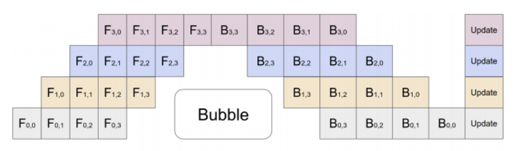

# Pytorch (Distributed) Data Parallel and K8S

## Pipeline Parallelism

Typically for large models which don’t fit on a single GPU, model parallelism is employed where certain parts of the model are placed on different GPUs.

The horizontal axis represents time; the vertical axis represents four GPUs.
Each cell represents a *Forward* $\text{F}_{i,j}$, *Back Propagation* $\text{B}_{i,j}$, or weight update.  
<div style="display: flex; justify-content: center;">
      
</div>
</br>

The "Bubble" means empty time GPUs have to wait for other GPUs finishing their work before continuing.

### Pipeline Parallelism Practice 

To use multiple GPUs, need to set up a local network that enables `rpc` (Remote Procedure Call), then select `cuda(<cuda_device_idx>)` to specify which cuda to run what nn model/layer, then arrange by `nn.Sequential(fc1, fc2, ...)`

```python
# Need to initialize RPC framework first.
os.environ['MASTER_ADDR'] = 'localhost'
os.environ['MASTER_PORT'] = '29500'
torch.distributed.rpc.init_rpc('worker', rank=0, world_size=1)

# Build pipe.
fc1 = nn.Linear(16, 8).cuda(0)
fc2 = nn.Linear(8, 4).cuda(1)
model = nn.Sequential(fc1, fc2)
model = Pipe(model, chunks=8)
input = torch.rand(16, 16).cuda(0)
output_rref = model(input)
```