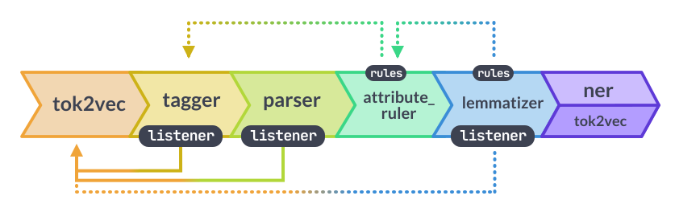
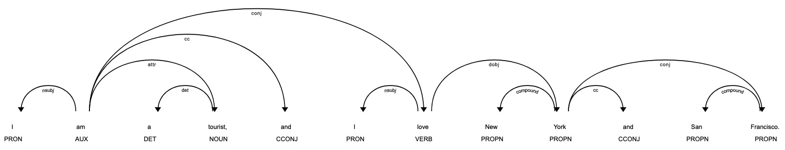

# Spacy

Spacy is an NLP tool for text semantic comprehension, not for generative text response, e.g., by LLMs such as ChatGPT and LLAMA.
It is often used for Named Entity Recognition (NER) and syntactic parsing (build a grammar dependency tree).

## Quick Start

```sh
pip install -U spacy
python -m spacy download en_core_web_md
```

## Pipeline

Having tokenized of texts, tokens are sent into this pipeline.

<div style="display: flex; justify-content: center;">
      
</div>
</br>

For example, below code shows `en_core_web_md-3.7.1` pipeline components.

```py
import spacy

# Load English tokenizer, tagger, parser and NER
nlp = spacy.load("en_core_web_md")

for pipe in nlp.pipe_names:
    print(nlp.get_pipe_config(pipe))
```

```jsonl
{'factory': 'tok2vec', 'model': {'@architectures': 'spacy.Tok2Vec.v2', 'embed': {'@architectures': 'spacy.MultiHashEmbed.v2', 'width': '${components.tok2vec.model.encode:width}', 'attrs': ['NORM', 'PREFIX', 'SUFFIX', 'SHAPE', 'SPACY', 'IS_SPACE'], 'rows': [5000, 1000, 2500, 2500, 50, 50], 'include_static_vectors': True}, 'encode': {'@architectures': 'spacy.MaxoutWindowEncoder.v2', 'width': 96, 'depth': 4, 'window_size': 1, 'maxout_pieces': 3}}}
{'factory': 'tagger', 'label_smoothing': 0.0, 'model': {'@architectures': 'spacy.Tagger.v2', 'nO': None, 'normalize': False, 'tok2vec': {'@architectures': 'spacy.Tok2VecListener.v1', 'width': '${components.tok2vec.model.encode:width}', 'upstream': 'tok2vec'}}, 'neg_prefix': '!', 'overwrite': False, 'scorer': {'@scorers': 'spacy.tagger_scorer.v1'}}
{'factory': 'parser', 'learn_tokens': False, 'min_action_freq': 30, 'model': {'@architectures': 'spacy.TransitionBasedParser.v2', 'state_type': 'parser', 'extra_state_tokens': False, 'hidden_width': 64, 'maxout_pieces': 2, 'use_upper': True, 'nO': None, 'tok2vec': {'@architectures': 'spacy.Tok2VecListener.v1', 'width': '${components.tok2vec.model.encode:width}', 'upstream': 'tok2vec'}}, 'moves': None, 'scorer': {'@scorers': 'spacy.parser_scorer.v1'}, 'update_with_oracle_cut_size': 100}
{'factory': 'attribute_ruler', 'scorer': {'@scorers': 'spacy.attribute_ruler_scorer.v1'}, 'validate': False}
{'factory': 'lemmatizer', 'mode': 'rule', 'model': None, 'overwrite': False, 'scorer': {'@scorers': 'spacy.lemmatizer_scorer.v1'}}
{'factory': 'ner', 'incorrect_spans_key': None, 'model': {'@architectures': 'spacy.TransitionBasedParser.v2', 'state_type': 'ner', 'extra_state_tokens': False, 'hidden_width': 64, 'maxout_pieces': 2, 'use_upper': True, 'nO': None, 'tok2vec': {'@architectures': 'spacy.Tok2Vec.v2', 'embed': {'@architectures': 'spacy.MultiHashEmbed.v2', 'width': 96, 'attrs': ['NORM', 'PREFIX', 'SUFFIX', 'SHAPE'], 'rows': [5000, 1000, 2500, 2500], 'include_static_vectors': True}, 'encode': {'@architectures': 'spacy.MaxoutWindowEncoder.v2', 'width': 96, 'depth': 4, 'window_size': 1, 'maxout_pieces': 3}}}, 'moves': None, 'scorer': {'@scorers': 'spacy.ner_scorer.v1'}, 'update_with_oracle_cut_size': 100}
```

### Component Explained

#### `tok2vec` and `spacy.Tok2Vec.v2`

* Served as the fundamental model for embedding, used by various other components/models, shared by `spacy.Tok2VecListener.v1` acted as wrapper
* Vector Representation: It produces dense vector representations for each token
* Contextualized Embeddings

#### `tagger` and `spacy.Tagger.v2`

* designed for part-of-speech (POS) tagging, for noun, verb, adjective, etc.
* Used `spacy.Tok2Vec.v2` for embedding through wrapper `spacy.Tok2VecListener.v1`
* Used `spacy.tagger_scorer.v1` for evaluation.

Reference: https://spacy.io/api/scorer

The scorer contains 

#### `parser` and `spacy.TransitionBasedParser.v2`

* Dependency Parsing: to analyze the syntactic structure, determining relationships between words and identifying dependencies.

For example, given "I am a tourist, and I love New York and San Francisco.", the parser result is

```txt
Token        Head         Dep        POS       
----------------------------------------
I            am           nsubj      PRON      
am           am           ROOT       AUX       
a            tourist      det        DET       
tourist      am           attr       NOUN      
,            am           punct      PUNCT     
and          am           cc         CCONJ     
I            love         nsubj      PRON      
love         am           conj       VERB      
New          York         compound   PROPN     
York         love         dobj       PROPN     
and          York         cc         CCONJ     
San          Francisco    compound   PROPN     
Francisco    York         conj       PROPN     
.            love         punct      PUNCT     
```

<div style="display: flex; justify-content: center;">
      
</div>

See https://explosion.ai/blog/parsing-english-in-python for syntactic dependency parsing background info.

#### `attribute_ruler`

* Add custom rules to transform texts with added lemma and pos.

#### `lemmatizer`

In linguistics, a *lemma* is the base or canonical form of a word.

For example,

* "running", "ran", "runs" -> "run"
* "eating", "ate", "eats" -> "eat"
* "best", "better" -> "good"

For spacy `lemmatizer`, there are

* Part-of-speech (POS) tags assigned to tokens to determine the correct lemma
* Used `spacy.lemmatizer_scorer.v1` for evaluation

#### `ner`
