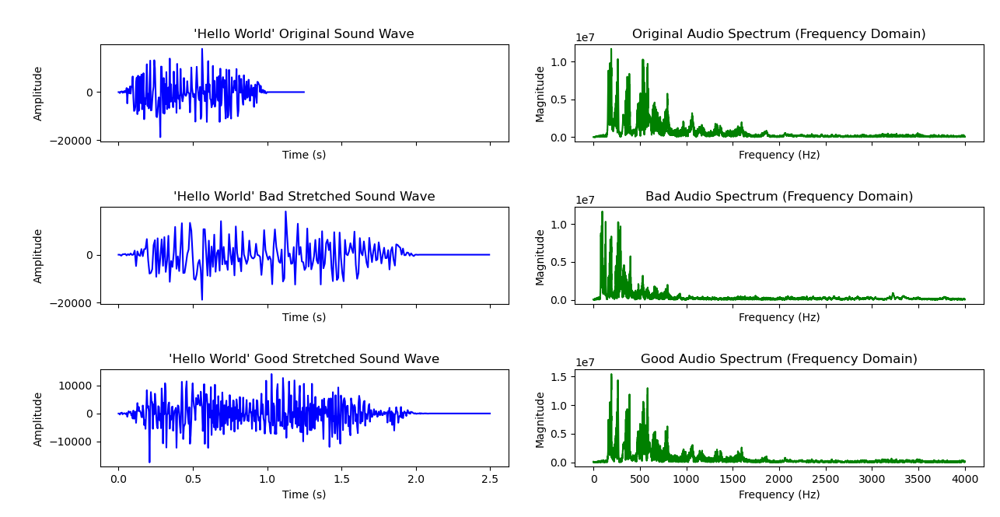

# Audio Frequency Explained

It can be heard that the badly stretched sound wave is of deep lower voice while the well stretched one preserves the original female voice.

This is attributed to the well stretched sound wave preserves the frequency domain while the badly stretched one simply does interpolation evenly on all sample points.

      

