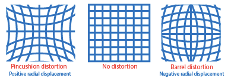

# Camera Calibration

Geometric camera calibration estimates the parameters of a lens and image sensor of an image or video camera.

It should be performed prior to image distortion removal and other tasks.

## Pinhole

A pinhole camera is a simple camera without a lens and with a single small aperture.


Define Intrinsic Parameters
$$
K=
\begin{bmatrix}
      f_x & 0 & 0 \\
      s & f_y & 0 \\
      c_x & c_y & 1
\end{bmatrix}
$$
where 
* $(c_x, c_y)$ Optical center (the principal point), in pixels.
* $F$ focal length in world units, often in millimeters
* $(f_x, f_y)$ focal length in pixels, where $f_x=F/p_x$, $f_y=F/p_y$, in which $p_x \times p_y$ are the size of an image

Define Extrinsic Parameters
$$
\begin{bmatrix}
      \bold{R} \\
      \bold{T}
\end{bmatrix}
$$
where $R$ and $T$ are rotation and translation matrices that adjust a camera physical orientation and lateral position.

The mapping relationship from world points to image pixels can be expressed as
$$
w
\begin{bmatrix}
      x_p \\
      y_p \\
      1
\end{bmatrix}^\text{T}
=
\begin{bmatrix}
      x_w \\
      y_w \\
      z_w \\
      1
\end{bmatrix}^\text{T}
\begin{bmatrix}
      \bold{R} \\
      \bold{T}
\end{bmatrix}
_{4 \times 3}
\begin{bmatrix}
      f_x & 0 & 0 \\
      s & f_y & 0 \\
      c_x & c_y & 1
\end{bmatrix}
$$
where $(x_p, y_p)$ is image pixel. $(x_w, y_w, z_w)$ is world point pixel. $w$ is the scaling factor.

## Fisheye

### Distortion Formulation

* Radial distortion

Radial distortion occurs when light rays bend more near the edges of a lens than they do at its optical center. The smaller the lens, the greater the distortion.



* Tangent distortion

Tangential distortion occurs when the lens and the image plane are not parallel. 


Distortion correction formula:

$$
\begin{align*}
x_u = & \space x_d+(x_d-x_c)(k_1r^2+k_2r^4+k_3r^6+...)
\\ &+ 
\big(p_1(r^2+2(x_d-x_c)^2)+2p_2(x_d-x_c)(y_d-y_c)\big)
(1+p_3r^2+p_4r^4+...)
\end{align*}
\\
\begin{align*}
y_u = & \space y_d+(y_d-y_c)(k_1r^2+k_2r^4+k_3r^6+...)
\\ &+ 
\big(p_1(r^2+2p_2(x_d-x_c)(y_d-y_c))+2p_2(y_d-y_c)^2\big)
(1+p_3r^2+p_4r^4+...)
\end{align*}
$$
where 
* $(x_d, y_d)$ is the distorted image pixel as projected on image plane using specified lens
* $(x_u, y_u)$ is the undistorted image pixel after correction
* $(x_c, y_c)$ is the distortion center
* $k_n$ is the $n$-th radial distortion coefficient
* $p_n$ is the $n$-th tangential distortion coefficient
* $r=\sqrt{(x_d-x_c)^2+(y_d-y_c)^2}$ is the Euclidean distance between the distorted image point and the distortion center

Usually, for small distortion images, $k_n$ is set to the power of $n=2$, for great distortion images, $k_n$ is set to the power of $n=3$.

### Fisheye intrinsic and extrinsic parameters

Define Extrinsic Parameters similar to that of pinhole's.
$$
\begin{bmatrix}
      \bold{R} \\
      \bold{T}
\end{bmatrix}
$$
where $R$ and $T$ are rotation and translation matrices.

Intrinsic parameters include the polynomial mapping coefficients of the projection function.
$$
\begin{bmatrix}
      x_w \\
      y_w \\
      z_w \\
      1
\end{bmatrix}^\text{T}
\begin{bmatrix}
      \bold{R} \\
      \bold{T}
\end{bmatrix}
_{4 \times 3}
=
w
\begin{bmatrix}
      x_d \\
      y_d \\
      a_0+a_2r^2+a_3r^3+a_4r^4
\end{bmatrix}^\text{T}
$$
where
* $(x_w, y_w, z_w)$ is a real world point
* $(x_d, y_d)$ is an ideal image projection (retaining fisheye distorted features) of a real-world point
* $w$ is a scaling factor
* $a_0, a_2, a_3, a_4$ are polynomial coefficients
* $r=\sqrt{(x_d-x_c)^2+(y_d-y_c)^2}$ is the distance of a point from the image center

## Distortion removal   

## Code in OpenCV

`findChessboardCorners` takes a src image (this image can distorted) and finds the corners stored in `corners`.

```cpp
int main(){

	cv::Mat srcMat = cv::imread("img.png", 1);

	if (srcMat.empty()){
		return -1;
	}

	std::vector<cv::Point2f> corners;
	cv::Size boardSize(27, 17);

	bool found = findChessboardCorners(srcMat, boardSize, corners);
	if (!found){
		return -1;
	}
      else
            // draw the image with annotated corners
            cv::drawChessboardCorners(srcMat, boardSize, corners, found);

      return 0;
}
```

`findChessboardCorners` operation in nut shell: it binarizes an image and finds contours. It then filters out non-quandrangle convex objects. Corners of rectangles are extracted and stored in `cv::OutputArray corners_`

```cpp
bool findChessboardCorners(InputArray image_, Size pattern_size,
                           OutputArray corners_) {

      bool found = false;

      // produce a binary image by a threshold
      cv::Mat thresh_img_new = img.clone();
      icvBinarizationHistogramBased(thresh_img_new); 

      // dilate the binary image to make edges obvious
      dilate( thresh_img_new, thresh_img_new, Mat(), Point(-1, -1), 1 );

      // generate quadrangles from chessboard image   
      auto generateQuads = [&](InputArray image_,std::vector<std::vector<Point> > contours) {
            std::vector<std::vector<Point> > contours;
            std::vector<Vec4i> hierarchy;
            cv::findContours(image_, contours, hierarchy, RETR_CCOMP, CHAIN_APPROX_SIMPLE);
      };
      std::vector<std::vector<Point> > contours;
      generateQuads(image_, contours);

      // process quadrangles into chessboard corners
      processQuads(contours, out_corners);

      // further refine and map corners to src img
      cv::cornerSubPix(img, out_corners, Size(2, 2), Size(-1,-1),
                         cv::TermCriteria(TermCriteria::EPS + TermCriteria::MAX_ITER, 15, 0.1));

      // copy as the result
      cv::Mat(out_corners).copyTo(corners_);
      return found;
}
```