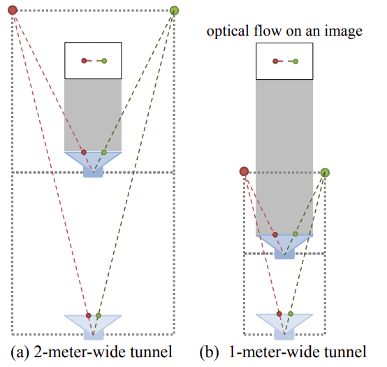
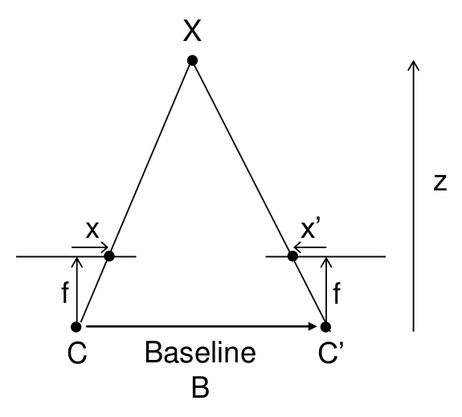
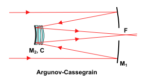
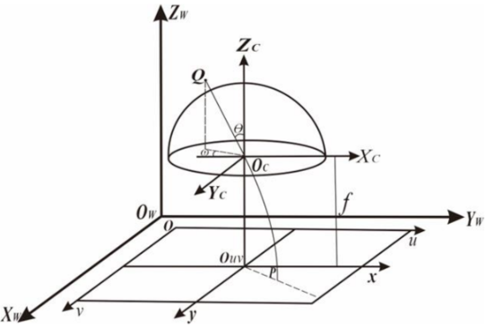
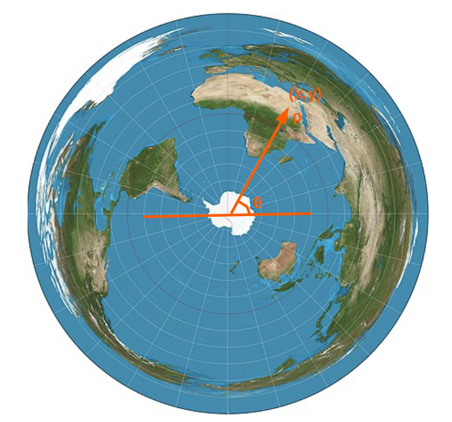
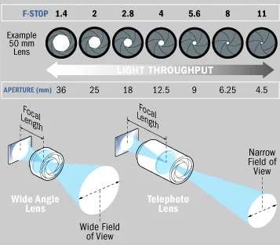
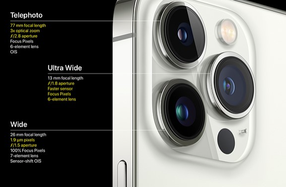

# Camera Types 

## Monocular camera

Mono camera computes depth info by selecting at least two key image frames from constant motion.

### Visual Feature Mapping

When the camera is monocular, we only know the 2D pixel coordinates, so the
problem is to estimate the motion according to two sets of 2D points. This
problem is solved by *epipolar geometry*.

### Pros and Cons

* Pros

Easy in computation and cheap

* Cons

Requiring camera constant movement/translation to find multiple key frames to detect disparity.

Scale Ambiguity: in figure (a), a camera moved forward and observed a pair of feature dots spanning two meter wide; in figure (b), a camera moved forward and observed an one-meter wide two dot feature pair. However, both scenarios see the same correspondance points on the monocular camera view, and camera itself cannot determine actual width of the feature pair, hence defined the scale ambiguity issue.

It is usually dealt with by adding other information such as sensors' input (IMU) or defining road as a plane.

## Binocular/Stereo Camera

Binocular camera uses triangulation from two physical camera positions to find object point depth.

The distance vector from object point $X$ to baseline $B$ is $z$, such that
$$
Bf=z(x-x')
$$

Hence, if we know the two optical center vector $B$, focal length (vector from camera view plane to optical center) $f$, two object correspondance points (left and right) on camera views relative to epipoles, we can compute the real world object point $X$ represented by $z$.

### Visual Feature Mapping

When the camera is binocular, RGB-D, or the distance is obtained by some
method, then the problem is to estimate the motion according to two sets of
3D points. This problem is usually solved by *ICP*.

### Pros and Cons

* Pros

Not dependant on other sensors' input.

* Cons

High computation cost; complicated calibration.

## RGB-D (RGB-Depth) Camera

RGB-D camera uses infrared light or Time-of-Flight (ToF) that a camera actively radiates light and accordingly receives light signals. It computes the elapsed time between two infrared light signals, by light speed, gives the results of depth/length to the camera.

### Depth Estimation Methods

There are two solutions of estimating depth:

* *structured infrared light*

Camera calculates the distance between the object and itself based on the returned structured light pattern.

* *time-of-flight* (ToF)

Camera emits a light pulse to the target
and then determines the distance according to the beam’s time of flight.

### Visual Feature Mapping

Same as that of Stereo Camera, use ICP.

### Pros and Cons

* Pros

Low depth computation resources, since a depth camera gives depth information directly.

* Cons

Highly dependant on infrared results, that infrared might be prone to errors for strong ambient light disturbance, incapability/difficult of/to penetrating some materials (such as dust and mist) to give depth results of distant object.

## Catadioptric Optical System 

A catadioptric optical system is one where refraction and reflection are combined in an optical system, usually via lenses (dioptrics) and curved mirrors (catoptrics). 

      

 

## Equidistant Optical System (Fisheye Model)

Equidistant projection is used in wide-angle lenses like a fisheye lens. It bends straight lines but can provide more than $180$ degrees of lens FOV (field-of-view). Moreover, this projection saves angles. 

All points along a given azimuth will project along a straight line from the center, and the angle $\theta$ that the line subtends from the vertical is the azimuth angle.
The distance from the center point to another projected point $\rho$ is the arc length along a great circle between them on the globe.
The Cartesian coordinate $(x,y)$ is computed as below.

$$
x = \rho \sin \theta,
\qquad
y = -\rho \cos \theta
$$

      
      &nbsp;&nbsp;&nbsp;&nbsp;
      

 

## Telephoto vs Wide Angle

A telephoto lens makes the objects in the background look bigger and closer to the foreground objects.
The background objects are blurred.

Wide lenses do the opposite and make background objects look smaller and further away from the camera.

      

 

### Telephoto

Telephoto cameras are good at capturing objects in distance such as wildlife animals.
It provides good background blurring to highlight the objects of interest.

The longer the focal length, the darker the image is (lens is long and opening is small, hence less light comes into camera).
To solve this, some higher-end telephoto lenses are integrated with a wider maximum aperture or iris opening to allow more light to enter the lens.

Telephoto lens focal length is typically **greater than 80 mm**.

### Wide Angle

Wide angle cameras are often used as the main rear camera for it provides indiscriminate image quality between foreground and background objects in most daily life scenarios.
Wide angle cameras are good at capturing ultra-near objects (object distance shorter than $10$ cm from camera).

Wide angle focal length is typically **smaller than 80 mm**.

### Example: iPhone 13 Pro

iPhone 13 Pro has a wide-angle lens (Main rear camera, labelled as $\small{\times}1.0$), an ultra-wide lens (labelled as $\small{\times}0.5$), and a telephoto lens (depending on actual focal length and image quality the phone switches to using a telephoto lens, usually labelled as $\small{\times}5.0+$). 

      

 