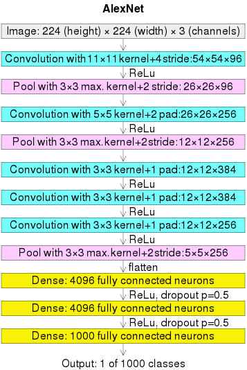

# Convolutional Neural Network (CNN)

## Convolutional Layer

### Convolution Forward and Back Propagation

Given an input image $X$ and a filter $F$, one forward pass of convolution is $O = X \otimes F$.
The result $O$ is termed *feature map*.

$$
\begin{bmatrix}
    O_{11} & O_{12} \\\\
    O_{21} & O_{22}
\end{bmatrix} =
\begin{bmatrix}
    X_{11} & X_{12} & X_{13} \\\\
    X_{21} & X_{22} & X_{23} \\\\
    X_{31} & X_{32} & X_{33}
\end{bmatrix} \otimes
\begin{bmatrix}
    F_{11} & F_{12} \\\\
    F_{21} & F_{22}
\end{bmatrix}
$$

unfold the $\otimes$ operator, there are

$$
\begin{align*}
O_{11} &= X_{11} F_{11} + X_{12} F_{12} + X_{21} F_{21} + X_{22} F_{22} \\\\
O_{12} &= X_{12} F_{11} + X_{13} F_{12} + X_{22} F_{21} + X_{23} F_{22} \\\\
O_{21} &= X_{21} F_{11} + X_{22} F_{12} + X_{31} F_{21} + X_{32} F_{22} \\\\
O_{22} &= X_{22} F_{11} + X_{23} F_{12} + X_{32} F_{21} + X_{33} F_{22} \\\\
\end{align*}
$$

Express convolution to element-wise multiplication, assumed filter size $K_M \times K_N$, for a spatial point at $(i,j)$, there is

$$
O_{i,j} = \sum_{m}^{K_M} \sum_{n}^{K_N} X_{i+m, j+n} \cdot F_{m,n}
$$

The back propagation of $F_{11}$ given loss $\mathcal{L}$ is

$$
\frac{\partial \mathcal{L}}{\partial F_{11}} =
\frac{\partial \mathcal{L}}{\partial O_{11}} X_{11} +
\frac{\partial \mathcal{L}}{\partial O_{12}} X_{12} +
\frac{\partial \mathcal{L}}{\partial O_{21}} X_{21} +
\frac{\partial \mathcal{L}}{\partial O_{22}} X_{22}
$$

### Other Setups in A Convolutional Layer

#### Channel

Assume filter size $K_M \times K_N$; there are $C_{in}$ input channels, for a spatial point at $(i,j)$, there is

$$
O_{i,j} = \sum_{m}^{K_M} \sum_{n}^{K_N} \sum_{c}^{C_{in}} X_{i+m, j+n, c} \cdot F_{m,n}
$$

This means that one output/feature map needs $K_M \times K_N \times C_{in}$ CNN parameters.
Assume there are $C_{out}$ output channels (also termed the num of filters), total parameters required are $K_M \times K_N \times C_{in} \times C_{out}$ for $C_{out}$ feature maps.

#### Stride

Skip a number of $s$ pixels then do next convolution.

It can break spatial info as feature points from adjacent convolutions are likely together contribute the same semantic visual feature.

Use large stride when image resolution is high; small when low.

#### Padding

Insert zeros to the surroundings of input so that the output remains the same size as the input's.
For example for $O = X \otimes F$, having done $X$ padding by zeros to $X_{\text{padding}} \in \mathbb{R}^{5 \times 5}$, there is convolution result $O \in \mathbb{R}^{3 \times 3}$ same as input $X \in \mathbb{R}^{3 \times 3}$.

$$
\begin{bmatrix}
    O_{11} & O_{12} & O_{13} \\\\
    O_{21} & O_{22} & O_{23} \\\\
    O_{31} & O_{32} & O_{33}
\end{bmatrix} =
\begin{bmatrix}
    0 & 0 & 0 & 0 & 0\\\\
    0 & X_{11} & X_{12} & X_{13} & 0\\\\
    0 & X_{21} & X_{22} & X_{23} & 0\\\\
    0 & X_{31} & X_{32} & X_{33} & 0\\\\
    0 & 0 & 0 & 0 & 0\\\\
\end{bmatrix} \otimes
\begin{bmatrix}
    F_{11} & F_{12} \\\\
    F_{21} & F_{22}
\end{bmatrix}
$$

#### Pooling

### Typical Computation Cost of A Convolutional Layer

* Filter kernel size: $K \times K$
* Image size $I_M \times I_N$ divided by stride $s$: $\frac{I_M \times I_N}{s \times s}$
* The number of filters/channels: $C_{in}$ and $C_{out}$

Total: $(K \times K) \times \frac{I_M \times I_N}{s \times s} \times C_{in} \times C_{out}$

### Calculation Example

Given an image $224 \times 224 \times 3$, consider $11 \times 11$ kernel with stride by $4$.
There are $64$ filters.

* Num convolutions over a row/col: $56=224/4$

## Up-Convolution

Up-convolution typically surrounds entries with zeros and apply a typical convolution operation.

Below is an example.

$$
A = \begin{bmatrix}
1 & 2 \\\\
3 & 4
\end{bmatrix}
\quad\xRightarrow[\text{zero insertion and padding}]{}
P = \begin{bmatrix}
0 & 0 & 0 & 0 & 0 \\\\
0 & 1 & 0 & 2 & 0 \\\\
0 & 0 & 0 & 0 & 0 \\\\
0 & 3 & 0 & 4 & 0 \\\\
0 & 0 & 0 & 0 & 0
\end{bmatrix}
$$

Denote $\otimes$ as a convolution operator.
Below $P$ is convolved by kernel $K$.

$$
K\otimes P = \begin{bmatrix}
1 & 0 & 1 \\\\
0 & 1 & 0 \\\\
1 & 0 & 1
\end{bmatrix} \otimes
\begin{bmatrix}
0 & 0 & 0 & 0 & 0 \\\\
0 & 1 & 0 & 2 & 0 \\\\
0 & 0 & 0 & 0 & 0 \\\\
0 & 3 & 0 & 4 & 0 \\\\
0 & 0 & 0 & 0 & 0
\end{bmatrix} =
\begin{bmatrix}
1 & 0 & 2 \\\\
0 & 10 & 0 \\\\
3 & 0 & 4 \\\\
\end{bmatrix}
$$

## Convolutional Neural Network (CNN) vs Fully Convolutional Network (FCN)

CNN includes fully connected layers that result in loss of image spatial info but that is preserved in FCN.

||CNN|FCN|
|-|-|-|
|Arch|Combines convolutional and pooling layers, **followed by fully connected layers**|Consists only of convolutional, pooling, and upsampling layers.|
|Tasks|Image classification, object detection (with post-processing like bounding boxes).|Semantic segmentation, dense prediction, depth estimation, super-resolution tasks.|

## AlexNet

      

 

### Why convolution then pooling, and why three convolutions then pooling

Intuitively,

* First and second convolution then pooling: contained large kernels $11 \times 11$ and $5 \times 5$, useful to quickly locate local image features and reduce image resolution; large kernels are good to capture semantic features.
* Multi-convolution then pooling: used small kernel of $3 \times 3$ for 3 times consecutively that enables learning highly abstract features; pooling discards spatial details, so delaying pooling allows the network to retain more fine-grained information for complex abstractions.

### Why two dense layers before the output dense layer

A dense layer is a fully connected layer $\mathbf{y}=\sigma(W\mathbf{x}+\mathbf{b})$.

Intuitively,

* First Dense Layer: Reshapes/flattens low-level features $256 \times 6 \times 6$ to a vector of size $9216$ higher-level abstractions. Activations primarily capture feature combinations (e.g., patterns like "edges forming an object").
* Second Dense Layer: Refines these abstractions into class-specific patterns, applying non-linear transformations to aggregate and focus the receptive fields.
* Third Dense Layer: output transform

Mathematical Insight:

* First Dense Layer: Local receptive field combinations (flattened convolutional outputs by $W_1 \in \mathbb{R}^{4096 \times 9216}$).
* Second Dense Layer: Global object representations (class scores by $W_2 \in \mathbb{R}^{4096 \times 4096}$).
* Third Dense Layer: output transform by $W_3 \in \mathbb{R}^{1000 \times 4096}$ with activation by softmax

Empirical study:

More dense layers can see $\text{ReLU}$ saturation that many activation values tend to get very large or zero, signaled redundancy in containing too many neurons (two layers are enough).

### Indicators of Saturation

#### Empirical Observations

* Training and validation accuracy/loss plateau even with extended training
* Larger/more convolution kernels do not yield better results
* Getting deeper/more layers does not give better results
* Getting wider/larger weight matrix/more neuron per layer does not give better results
* Having small/even no stride does not give better results

#### Theoretical Indicators

* If weight matrices $W$ have **small eigenvalues**, the weight matrix may not be effectively transforming the input space.
* If weight matrices $W$ have **large eigenvalues**, the transformations may be overly redundant or lead to gradient instability.
* A large fraction of neurons consistently output zero (dead neurons in ReLU layers), indicating wasted capacity.

Recall linear algebra that $W\mathbf{x}=\lambda\mathbf{x}$ means transforming input $\mathbf{x}$ by $W$ is same as getting scaled by $\lambda$.

If $\lambda \gg 0$, it leads to excessive amplification of inputs $\mathbf{x}$ along certain directions.

* Gradient Instability: Large eigenvalues propagate large gradients during back-propagation, which can destabilize training.
* Redundancy: Over-amplifying features may result in over-fitting or redundant transformations.

If $\lambda \approx 0$, it means low rank, not utilizing all degrees of freedom in the input.

* Some features are being ignored or not contributing to the output.

#### Human Evaluation

* Receptive Field Analysis: for low-level features are semantic to human understanding, one can manually review the convolution results of the first layer; if objects have too many filters repeatedly focusing on the same areas extracting similar features, it signals saturation.
