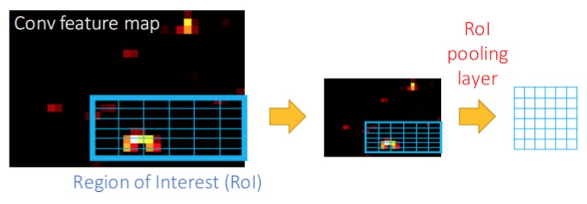
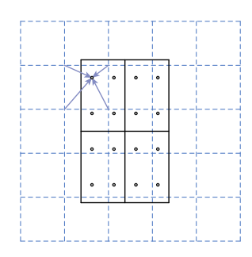

# Regions with CNN (R-CNN)

* Region Proposal: R-CNN uses *selective search* to generate approximately 2000 region proposals (candidate regions where objects might be located).
* Feature Extraction: Each region proposal is warped to a fixed size and passed through a pre-trained CNN (e.g., AlexNet) to extract feature vectors.
* Classification: The extracted features are fed into a set of class-specific linear SVMs to classify the object within each region.
* Bounding Box Regression: A regression model refines the bounding box coordinates for better localization.

where selective search is a traditional computer vision method that hierarchically groups similar regions in an image to identify potential object locations.

## Fast R-CNN

* RoI Pooling

An image is divided into a grid of fixed dimensions, e.g., $7 \times 7$ grid (a hyperparameter).
Find an rectangle region from selecting multiple small regions from the the $7 \times 7$ grid.

The proposed $7 \times 7$ small regions are called *quantization*, e.g., to map a $224 \times 224$ RoI to a $7 \times 7$ one.
RoI is always larger than the ground truth contour of the target object, and the overflown areas are called *quantization error*.

<div style="display: flex; justify-content: center;">
      
</div>
</br>

### Arch

```txt
Input Image
    |
    v
Backbone Network (e.g., VGG16, ResNet)
    |
    v
Region of Interest (RoI) Pooling
    |
    v
Fully Connected Layers +---------------> Detection Head (Bounding Box + Classification)

```

where heads are

|Output Head|Input|Output|Purpose|Formula|Loss Function|
|-|-|-|-|-|-|
|Classification Head|RoI-aligned or pooled features|Probabilities for each class + background|Predicts object class labels.|$p_c=\text{softmax}(z_c)$, where $z_c$ is the logits for class $c$|Cross-Entropy Loss:  $L_{cls}=-\frac{1}{N}\sum_i y_i \log(p_i)$, where $y_i$ is truth label|
|Bounding Box Head|RoI-aligned or pooled features|Refined box coordinates $[dx,dy,dw,dh]$|Refines bounding boxes for better localization.|anchor box offset $\mathbf{t}=[t_x,t_y,t_w,t_h]$|Smooth $L_1$ that $L_{box}=\frac{1}{N}\sum_i \text{Smooth}_{L_1}(\hat{\mathbf{t}}_i-\mathbf{t}_i)$|

where

$$
\text{Smooth}_{L_1}(x)=\begin{cases}
    0.5 x^2 & |x|<1 \\\\
    |x|-0.5 & \text{otherwise}
\end{cases}
$$

## Faster R-CNN

Faster R-CNN porposes Region Proposal Network (RPN) in replacement of Fully Connected Layers for better bounding box proposals.

Faster R-CNN consists of two stages.

1. The first stage, called a Region Proposal Network (RPN),
proposes candidate object bounding boxes
2. Extracts features using RoIPool (same as Fast R-CNN) from each candidate box and performs classification and bounding-box regression (also referred to as *detection head*).

```txt
Input Image
    |
    v
Backbone Network (e.g., ResNet)
    |
    v
Region Proposal Network (RPN)
    |
    v
RoI Pooling +---------------> Detection Head (Bounding Box + Classification)
```

where the detection head is same as that of Fast R-CNN, the novel heads are for PRN

|Output Head|Input|Output|Purpose|Formula|Loss Function|
|-|-|-|-|-|-|
|Classification Head|Feature map from backbone|Object/background probability|Identifies anchors likely to contain objects.|$p_{obj}=\text{softmax}(z_{obj})$, where $z_o$ is the logits for object presence|Binary Cross-Entropy Loss: $L_{obj}=-\frac{1}{N}\sum_{i}\Big(y_{i}\log(\hat{y}_{i})+\big(1-y_{i}\log(1-\hat{y}_{i})\big)\Big)$|
|RPN Box Regression Head|Feature map from backbone|Anchor box adjustments coordinates $[dx,dy,dw,dh]$|Refines bounding boxes for better proposals.|anchor box offset $\mathbf{t}=[t_x,t_y,t_w,t_h]$|Smooth $L_1$ that $L_{box}=\frac{1}{N}\sum_i \text{Smooth}_{L_1}(\hat{\mathbf{t}}_i-\mathbf{t}_i)$|


## Mask R-CNN

Mask R-CNN is used to do image segmentation as it retains image spatial info in output.

Mask R-CNN adopts the same two-stage procedure:

1. An identical first stage (which is RPN) same as Faster R-CNN's.
2. In parallel to predicting the class and box offset, Mask R-CNN also outputs a binary mask for each RoI.

* Loss Definition

$$
L = \underbrace{L_{cls} + L_{box}}_{\text{same as Fast R-CNN}} + L_{mask}
$$

where the mask branch $L_{mask}$ has $K m^2$ dimensional output for each RoI, which encodes $K$ binary masks of resolution $m \times m$, one for each of the $K$ classes.

### RoIAlign Pooling

To align to the ground truth with max ground truth coverage.

* dashed grid: feature map
* solid lines: RoI (with 2×2 bins in this example)
* the dots: 4 sampling points in each bin

RoIAlign computes the value of each sampling point by bilinear interpolation from the nearby grid points on the feature map.

<div style="display: flex; justify-content: center;">
      
</div>
</br>

#### Formula

##### Inputs

* Feature Map $F_l \in \mathbb{R}^{H \times W}$ at level $l$
* Region of Interest (ROI): $R_i$ defined by the coordinates $(\underbrace{x_{min}, y_{min}}_{\text{bottom-left}}, \underbrace{x_{max}, y_{max}}_{\text{upper-right}})$
* Output Grid Size $P \times P$, e.g., $7 \times 7$
* Scale factor: adjusts the ROI coordinates for the corresponding feature map resolution.

##### Process

1. Divide the ROI into a Grid: $R_i \rightarrow P \times P$ bins:

* bin width $w=\frac{x_{max}-x_{min}}{P}$
* bin height $h=\frac{y_{max}-y_{min}}{P}$

2. Sample points within Each Bin: For each bin $(p,q)$ in the grid, $k \times k$ sampling points are used (e.g., $k=2$ is common). Let:

* $x_{s,t} = x_{min} + p \cdot w + s \cdot \frac{w}{k}$
* $y_{s,t} = y_{min} + q \cdot h + t \cdot \frac{h}{k}$

where $s,t \in [0, k-1]$.

3. Bilinear Interpolation with weights: For each sampling point $(x_{s,t}, y_{s,t})$, interpolate its value from the feature map

$$
F_l(x_{s,t}, y_{s,t}) = \sum_{m,n\in\{0,1\}} w_{m,n} F_l(x_{m}, y_{n})
$$

where $(x_{m}, y_{n})$ are four neighbor points for $m,n\in\{0,1\}$, and $w_{m,n}=\big(1-|x_{s,t}-x_m|\big) \cdot \big(1-|y_{s,t}-y_n|\big)$.
This gives larger weights for more adjacent points.

4. Aggregate Sampling Points:

$$
G_i(p,q)=\frac{1}{k^2} \sum_{s=0}^{k-1} \sum_{s=0}^{k-1} F_l(x_{s,t}, y_{s,t})
$$

#### RoI Pooling vs RoIAlign Pooling

|Feature|RoI Pooling|RoIAlign Pooling|
|-|-|-|
|Quantization|Rounds coordinates to integers|Uses bilinear interpolation, avoiding rounding errors|
|Precision|May introduce misalignment|Maintains spatial precision|
|Applications|Fast R-CNN, Faster R-CNN|Mask R-CNN, precise detection/segmentation tasks|

### Arch

```txt
Input Image
    |
    v
Backbone Network (ResNet + FPN)
    |
    v
Region Proposal Network (RPN)
    |
    +--------> ROI Align +---------------> Detection Head (Bounding Box + Classification)
                         |
                         +---------------> Mask Head (Instance Segmentation)
```

where the detection head is same as that of Faster R-CNN, and Mask Head is

|Output Head|Input|Output|Purpose|Formula|Loss Function|
|-|-|-|-|-|-|
|Mask Head|RoI-aligned features (Mask R-CNN)|Binary masks $H \times W$|Predicts pixel-wise masks for instance segmentation.|$\hat{y}_{i,j}=\sigma(z_{i,j})$, where $z_{i,j}$ is the mask logits for pixel $(i,j)$|Binary Cross-Entropy Loss: $L_{mask}=-\frac{1}{N}\sum_{i,j}\Big(y_{i,j}\log(\hat{y}_{i,j})+\big(1-y_{i,j}\log(1-\hat{y}_{i,j})\big)\Big)$|
