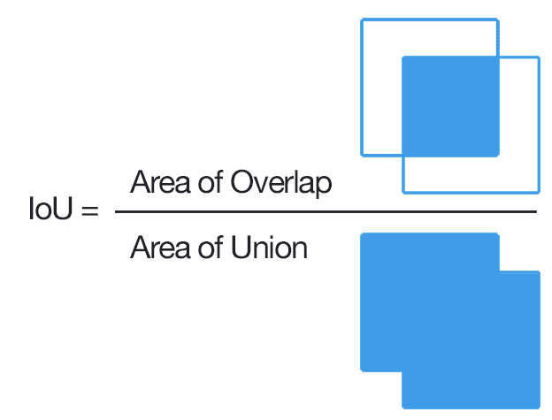
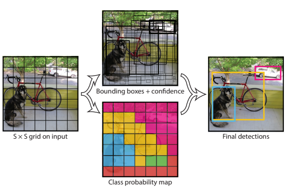
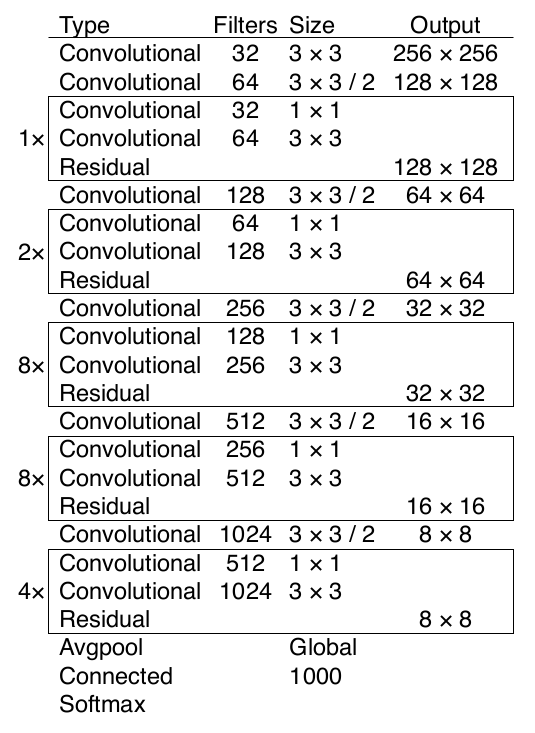
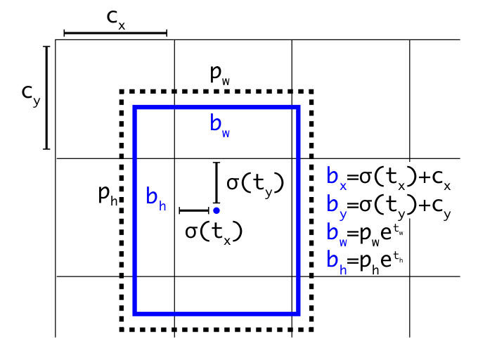

# You Only Look Once v3 (YOLOv3)

Divide the input image into an $S \times S$ grid.
If the center of an object falls into a grid cell, that grid cell
is responsible for detecting that object.

Each grid cell predicts $B$ bounding boxes and confidence scores for those boxes.
The confidence score represents the IOU-weighted probability of having an object present in a bounding box, and is computed by

$$
\text{Pr(Object)} \cdot \text{IOU}^{\text{truth}}\_{\text{pred}}
$$

IOU (Intersection Over Union) is simply computed by taking the overlapping area percentage of the total union area.

      

 

Each bounding box has five predictions:

* $(x,y)$ represents the center of an object bounding box relative to the bounds of a grid cell
* $(w, h)$ represents the width and height relative to the image size
* $C$ represents the number of classes, in which each class probability is conditional on having a present object $p_i(c)=\text{Pr}(\text{Class}\_i|\text{Object})$

The per-class per-bounding-box confidence score is 
$$
\text{Pr}(\text{Class}\_i|\text{Object}) \cdot
\text{Pr(Object)} \cdot \text{IOU}^{\text{truth}}\_{\text{pred}}
$$

Hence, predictions/outputs from the final dense layer are encoded in an $S \times S \times (5 \times B + C)$ tensor.

Below is an example that in PASCAL VOC dataset, config is $S=7, B=2, C=20$.

      

 

## Darknet53 as the backbone

Darknet53 is a CNN with below specifications for YOLOv3.

Darknet53 takes advantage of residual mechanism and adds more layers than YOLOv2 using Darknet19.

      

 

## Training and The Loss Function

* Input image size: $448 \times 448$

* Used leaky rectified linear activation:
* 
$$
a(x) =
\left\{
    \begin{matrix}
      x, & \text{if } x>0 \\
      0.1 x, & \text{otherwise}
    \end{matrix}
\right.
$$

* Set $\lambda_{coord}=5$ and $\lambda_{noobj}=0.5$ as the scaling factors to increase/decrease the loss of having/not having an object in a grid cell.

Otherwise, since most grid cells do not contain objects (data imbalance between grid cells with/without contained objects), training overpowers gradients to converge to having no object predictions.

### Loss Function

Define $\mathbb{1}^{obj}\_{ij} \in \{0,1\}$ representing if an object exists in the $i$-th grid cell predicted $j$-th bounding boxes (set to zero when contained no object),
and similarly there is $\mathbb{1}^{noobj}\_{ij} \in \{0,1\}$, set zero when contained an object.

The total loss function is the sum of the below five loss functions
$$
L = L\_{coord}  + L\_{size} + L\_{C-obj} + L\_{C-noobj} + L\_{c}
$$

* Object coordinate relative to grid cell loss $L\_{coord}$ per-grid-cell per-bounding-box

$$
L\_{coord} = 
\lambda_{coord} \sum^{S^2}\_{i=0} \sum^{B}\_{j=0}
\mathbb{1}^{obj}\_{ij} \Big( (x\_i-\hat{x}\_i)^2 + (y_i-\hat{y}\_i)^2 \Big)
$$

* Object rectangle/bounding box size loss $L\_{size}$ per-grid-cell per-bounding-box

$$
L\_{size} =
\lambda_{coord} \sum^{S^2}\_{i=0} \sum^{B}\_{j=0}
\mathbb{1}^{obj}\_{ij} \Big( \big(\sqrt{w}\_i-\sqrt{\hat{w}\_i} \big)^2 + \big(\sqrt{h}\_i-\sqrt{\hat{h}\_i} \big)^2 \Big)
$$

* Contained object prediction class loss $L\_{C-obj}$ (loss is zero when having predicted the correct class) per-grid-cell per-bounding-box

$$
L\_{C-obj} =
\sum^{S^2}\_{i=0} \sum^{B}\_{j=0}
\mathbb{1}^{obj}\_{ij} \big( C_i-\hat{C}\_i \big)^2
$$

* Non-contained object prediction class loss $L\_{C-noobj}$ (loss is zero when having predicted the correct class) per-grid-cell per-bounding-box

$$
L\_{C-noobj} = 
\lambda_{noord}
\sum^{S^2}\_{i=0} \sum^{B}\_{j=0}
\mathbb{1}^{noobj}\_{ij} \big( C_i-\hat{C}\_i \big)^2
$$

* All grid cells predicting all correct classes loss $L_c$ (one grid cell can contain many different objects)

$$
L\_{c} = \sum^{S^2}\_{i=0} \mathbb{1}^{obj}\_{ij}
\sum_{c \in \text{classes}} \big( p_i(c) - \hat{p}\_i(c) \big)^2
$$

## YOLOv3 Improvements

### Dimension clusters as anchor boxes

A bounding box can be defined as: $(x, y, w, h)$ and the class $c$.
However, for $(x, y, w, h)$ prediction being a continuous function across the whole image possible pixel coordinates, convergence can be slow.

Remediation can be to pre-define some boxes of various sizes (make continuous $(w, h)$ be discrete only containing a few combinations) as priors.
Once these prior bounding boxes are anchored, just simply fine-tune the bounding box should give good results.

For a bounding box should define four coordinates $(t_x, t_y, t_w, t_h)$. 
In addition, define $(c_x, c_y)$ as the grid cell offset from the top left corner of an image.
The bounding box width and height priors are $(p_w, p_h)$ that are fine-tuned by $(e^{t_w}, e^{t_h})$.

Then the four anchor prediction parameters are defined as
$$
\begin{align*}
    b_x &= \sigma(t_x) + c_x \\
    b_y &= \sigma(t_y) + c_y \\
    b_w &= p_w e^{t_w} \\
    b_h &= p_h e^{t_h} \\
\end{align*}
$$
where $\sigma(.)$ is a sigmoid function.

      

 

### Class Prediction by Cross-Entropy

For overlapping labels in grid cells, $softmax$ imposes the assumption that each box has exactly one class which is often not the case.

Remediation is using independent logistic classifiers $\sigma\big(p_i(c)\big)$. 
During training, use binary cross-entropy loss for class predictions.

### Predictions Across Scales by Pyramid

In detail, used 3 different scales of images.

### Darknet-53

Used Darknet-53 as the backbone network.