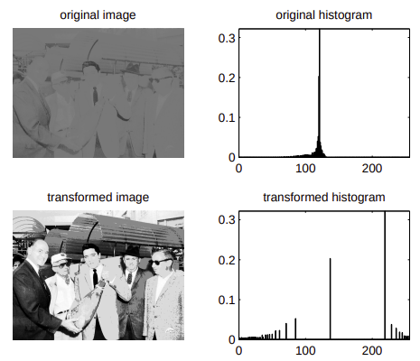
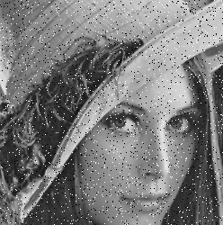
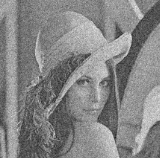
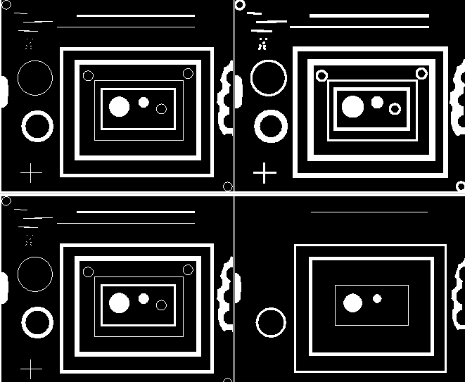

# Basic Image Process

## Histogram Equalization

*Histogram equalization* is a technique for adjusting image intensities to enhance contrast.
It is useful when an image has narrow range of pixel intensities, that by mapping to wider intensity range, the image quality with respect to contrast can be improved. 
Good quality image intensity (a.k.a brightness) typically ranges from $0$ to $255$.

Consider a discrete grayscale image $\{\mathbf{x}\}$ and let $n_i$ be the number of occurrences of gray level $i$. 
The probability of an occurrence of a pixel of level $i$ in the image is
$$
p_x(i) = p(x=i) = \frac{n_i}{n}
, \qquad 0 \le i \le L
$$

where $L$ is the total number of gray levels in the image (typically $255$), $n$ is the total number of pixels in the image, 
and $p_x(i)$ being in fact the image's histogram for pixel value $i$, normalized to $[0,1]$.

Define the cumulative distribution function corresponding to $i$ as
$$
c_x(i) = \sum_{j=0}^{i}  p(x=j)
$$

To map back to $[0,255]$, simply do linear scaling $\text{round} \big(L \cdot c_x(i) \big)$, where $L=255$ and $\text{round(.)}$ rounds a number to its nearest integer.

<div style="display: flex; justify-content: center;">
      
</div>
</br>

Intuition: for a normalized intensity value $\sum_{j=0}^{i} \frac{n_i}{n}$, for a large number of $n_i$ of a particular level $i$, the corresponding $j<i$ would see decreased intensity, while $j>i$ would see increased intensity, hence making the nearby intensity level $j \approx i$ have diverged levels away from $i$.

## Sharpening and Blurring

* Sharpening

$$
k_{\text{sharpening}} = 
\begin{bmatrix}
      -1 & -1 & -1 \\\\
      -1 & 9 & -1 \\\\
      -1 & -1 & -1 \\\\
\end{bmatrix}
$$

* Blurring

$$
k_{\text{blurring}} = 
\frac{1}{9}
\begin{bmatrix}
      1 & 1 & 1 \\\\
      1 & 1 & 1 \\\\
      1 & 1 & 1 \\\\
\end{bmatrix}
$$

## Noises

* Salt and pepper noise (sparse light and dark disturbances, impulse noise)

The defining characteristic is that the value of a noisy pixel bears no relation to the color of surrounding pixels.

<div style="display: flex; justify-content: center;">
      
</div>
</br>

* Gaussian noise

Each pixel in the image is changed from its original value by a (usually) small amount.

<div style="display: flex; justify-content: center;">
      
</div>
</br>

## Erosion and Dilation

Given binary image (pixel value being either $0$ for black and $1$ for white), *erode* shrinks image object "thickness"; *dilate* "enlarges" image objects.

For example, the left hand side is src image, the upper right hand side is dilation result; the lower right hand side is erosion result.


<div style="display: flex; justify-content: center;">
      
</div>
</br>

### Erode

Take $min$ operation on a pixel's neighbour peixls, such as
$$
p_{x,y}=
min\bigg(
\begin{bmatrix}
      p_{x-1,y-1} & p_{x,y-1} & p_{x,y+1} \\\\
      p_{x-1,y} & p_{x,y} & p_{x+1,y} \\\\
      p_{x-1,y+1} & p_{x,y+1} & p_{x+1,y+1}
\end{bmatrix} \bigg)
$$

### Dilate

Take $max$ operation on a pixel's neighbour peixls, such as
$$
p_{x,y}=
\max \bigg(
\begin{bmatrix}
      p_{x-1,y-1} & p_{x,y-1} & p_{x,y+1} \\\\
      p_{x-1,y} & p_{x,y} & p_{x+1,y} \\\\
      p_{x-1,y+1} & p_{x,y+1} & p_{x+1,y+1}
\end{bmatrix} \bigg)
$$

### Contour

Erosion and dilation can be used in
`cv::findContours(...)` to find contours in a binary image.

```cpp
void cv::findContours	(	InputArray 	image,
                              OutputArrayOfArrays 	contours,
                              OutputArray 	hierarchy,
                              int 	mode,
                              int 	method,
                              Point 	offset = Point() 
                              )	
```