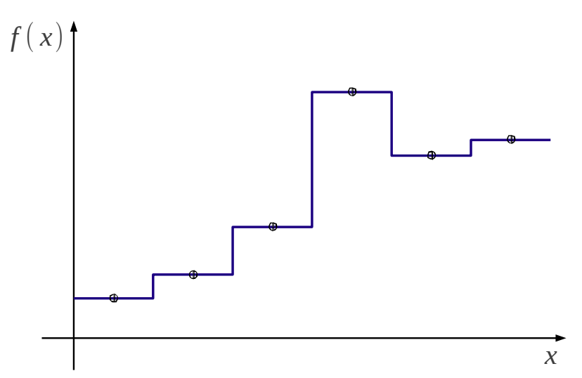
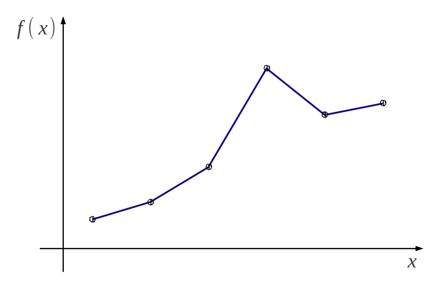
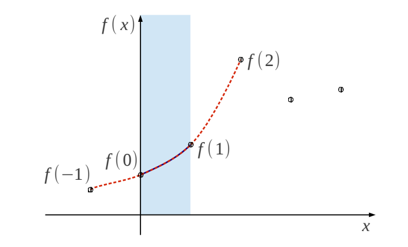
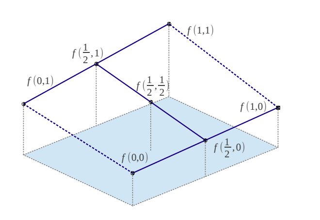
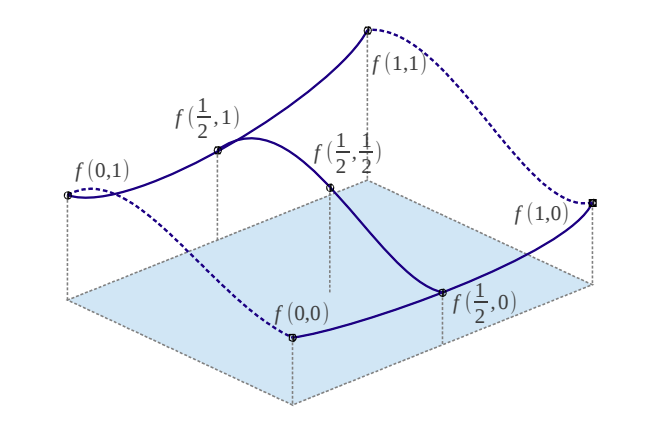
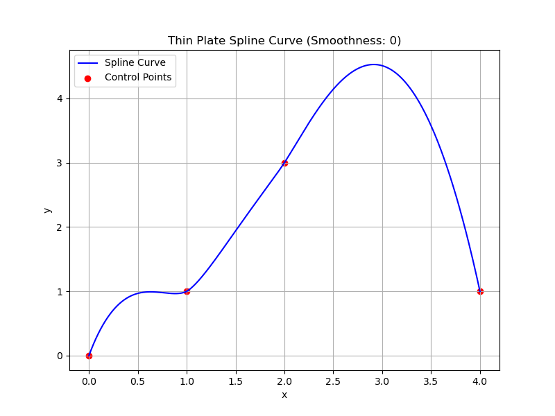
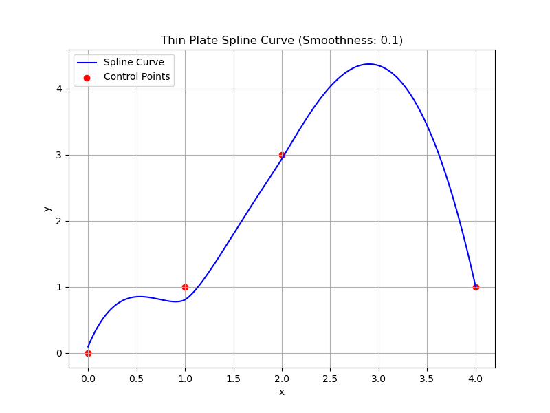

# Interpolation

Interpolation is used to fill "gaps" between each data points, such as construct a continuous function out of discrete data points.

## Nearest

Interpolation through taking the same value as its nearest neighbour's.

## Linear

$$
f(x) = a_1 x + a_0
$$

## Cubic

$$
f(x) = \sum^3_{i=0}a_i x^i = a_3x^3 + a_2x^2 + a_1x + a_0
$$

Every curve needs four neighbour data points to determine its coefficients $a_i$

$$
f(-1)=a_3(-1)^3+a_2(-1)^2+a_1(-1)^1+a_0
\\
f(0)=a_3(0)^3+a_2(0)^2+a_1(0)^1+a_0
\\
f(1)=a_3(1)^3+a_2(1)^2+a_1(1)^1+a_0
\\
f(2)=a_3(2)^3+a_2(2)^2+a_1(2)^1+a_0
$$

## Bilinear

Given a 2-d matrix with known four corners: $f(0,0), f(0,1), f(1,0), f(1,1)$, interpolation follows

* $f(\frac{1}{2}, 0)$ interpolation by $f(0,0), f(0,1)$
* $f(\frac{1}{2}, 1)$ interpolation by $f(1,0), f(1,1)$
* $f(\frac{1}{2}, \frac{1}{2})$ interpolation by $f(\frac{1}{2},0), f(\frac{1}{2},1)$

### Bilinear Interpolation with Weights

The weights control that if four neighbor points $(x\_i, y_j)$ for $i,j \in \{0,1\}$ (for example, the upper-left neighbor point is $(x_0, y_1)$) have different distances to the interpolation estimate $(\hat{x}, \hat{y})$, such that $\hat{x} \ne \frac{1}{2} (x_0+x_1)$ or $\hat{y} \ne \frac{1}{2} (y_0+y_1)$, the neighbor points should be linearly assigned different weights to reflect the distance closeness to the estimate point.
This gives larger weights for more adjacent points.

Given the interpolation point estimate $(\hat{x}, \hat{y})$, there should be

$$
\begin{align*}
    & x_0 \le \hat{x} \le x_1 \\
    & y_0 \le \hat{y} \le y_1
\end{align*}
$$

The weights for the interpolation point four neighbors are:

$$
w_{i,j} = \Big(1-\frac{\hat{x}-x\_i}{x_0-x_1}\Big) \cdot \Big(1-\frac{\hat{y}-y_j}{y_0-y_1}\Big)
$$

If the gaps $\hat{x}-x\_i$ and $\hat{y}-y_j$ are considered normalized already, the formula can be simplified as

$$
w_{i,j} = \big(1-|\hat{x}-x\_i|\big) \cdot \big(1-|\hat{y}-y_j|\big)
$$

Finally, the interpolated value at the point $(\hat{x}, \hat{y})$ by the function $f$ given the four neighbor points is

$$
f(\hat{x}, \hat{y}) = \sum_{i,j \in \{0, 1\}} w_{i,j} f(x\_i, y_j)
$$

## Bicubic

## Thin Plate Splines (TPS)

*Thin plate splines* (TPS) are a spline-based technique for data interpolation and smoothing by "bending" a curve to close/cross over control points.
The term "thin plate splines" refers to the analogy of the curve be like bending a thin metal plate by force applied on a few "knots" (control points).

Example: 4 control points' TPS curve.

      

 

Transformation by $f(\mathbf{x})$ in TPS given $n$ control points $(\mathbf{x}\_i, y_i)$ where observed value is $y_i$ at the location $\mathbf{x}\_i$.
$\mathbf{x}\in\mathbb{R}^d$ is assumed to be interpolated points and $f(\mathbf{x}) \in \mathbb{R}^1$ is the interpolated value.

$$
f(\mathbf{x})=
\underbrace{\mathbf{a}^{\top}\begin{bmatrix}
    1 \\ \mathbf{x}
\end{bmatrix}}\_{\substack{
    \scriptsize{\text{affine}} \\ \scriptsize{\text{transform}}}} +
\underbrace{\sum_{i=1}^n w_i U\big(||\mathbf{x}-\mathbf{x}\_i||\big)}\_{\text{radial kernel}}
$$

where

* $\mathbf{a}=[a_0,a_1,...,a_d]$ are the coefficients of the affine transformation.
* $w_i$ is the weights to be optimized by $J(f_{\mathbf{w}})$ to smooth the curve applied on individual control points
* $U(r)=r^2\log(r)$ is TPS radial function kernel
* $r=||\mathbf{x}-\mathbf{x}\_i||$ is Euclidean distance between a point and a control point.

Minimization by updating the weights $\mathbf{w} \in \mathbb{R}^n$:

$$
\argmin_{f_\mathbf{w}} J=\sum_{i=1}^{n}
\underbrace{\Big|\Big|y_i-f(\mathbf{x}\_i) \Big|\Big|^2}\_{\text{Data Fidelity Term}}+
\lambda\underbrace{\int_{\mathbb{R}^d} \Big|\Big|\nabla^2f(\mathbf{x})\Big|\Big|^2 d\mathbf{x}}\_{\text{Smoothness Term}}
$$

where

* Data Fidelity Term: $y_i$ are the target control points (desired output positions) corresponding to the control points $\mathbf{x}\_i$
* The TPS-transformed points are $f(\mathbf{x}\_i)$
* $\lambda>0$ is a regularization parameter controlling the trade-off between fidelity and smoothness
* $\lambda\approx 0$ Perfect interpolation of the control points, possibly leading to sharp or irregular transformations.
* Large $\lambda$ Prioritizes smoothness, potentially at the expense of exact alignment with control points.

For example, below is added $0.1$ smoothness TPS curve.
It is observed that the curve is curvier than that without smoothness, but to some extent deviates from the control points.

      

 
