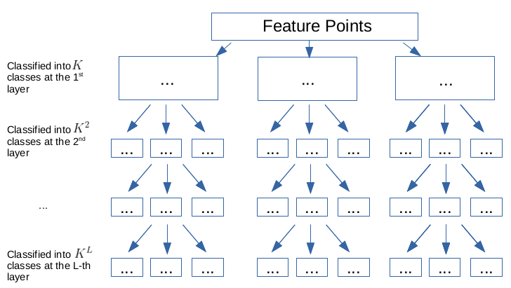
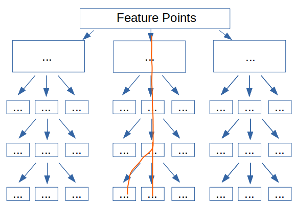

# BoW (Bags of Words)

The bag-of-words (BoW) model is a simplifying/compressing representation of a text (such as a sentence or a document) or visual features that are discarded of grammar and other semantics, but only keep some basic statistics such as the number of word occurrences.

### Example in text
```
John likes to watch movies. Mary likes movies too.
Mary also likes to watch football games.
```

By just counting the word occurrences, here derives the BoW representation of the text.
```json
BoW1 = {"John":1,"likes":2,"to":1,"watch":1,"movies":2,"Mary":1,"too":1};
BoW2 = {"Mary":1,"also":1,"likes":1,"to":1,"watch":1,"football":1,"games":1};
```

To further simplify the text representation, having removed the strings, `BoW1` and `BoW2` can be compressed into two simple vectors.
```
BoW1 = [1, 2, 1, 1, 2, 1, 1, 0, 0, 0]
BoW2 = [0, 1, 1, 1, 0, 1, 0, 1, 1, 1]
```

This kind of representation has several successful applications, such as email filtering.

### BoW Implementation in Computer Vision

In computer vision, words translate to features, and documents/sentences translate to images.

To describe the similarity between two images, usually compare the similarities of feature points.
Regard each feature point of an image as a "word", this image can be described in a way of vector containing many words.

For example, for BRIEF features, an image can be described by the vector $\bold{v}=\{v_1, v_2, ..., v_m \}$, where each word is $v_k = \sum^{n=256}_{i=1} 2^{i-1} t_{i}(p,q)$ for a total of $256$ test pairs $(p,q)$.

### BoW Vocabulary

BoW vocabulary is a mechanism of how to classify words in to "bags" (groups of similar words).

BoW Vocabulary building/training process:
* Have all feature points be clustered by k-means, and produce $K$ number of classes
* Then from the above results' clustered feature points (belonged to $K$ classes), compute again k-means that produces $K^2$ classes (each class feature points by once k-means produce $K$ sub-classes)
* The k-means goes on, and finally feature points are classified into $\frac{K^{L+1}}{K-1}=1+K+K^2+...+K^L$ classes stored in a tree-like structure of a total of $L+1$ layers.

<div style="display: flex; justify-content: center;">
      
</div>
</br>

Each class is represented by its "mean characteristic" (computed by k-means' mean value) called word, and each node of the tree is assigned a weight.
Usually by default, the weight is *TF-IDF* (Term-Frequency Inverse-Document-Frequency).
TF indicates the frequency of a word occurring in a document, and if the word's corresponding IDF is large, this word should be very unique to this document, and should be a good feature distinguishing between documents.

If a feature (represented at the $k$-th layer node) has a high value of $\text{TF-IDF}_k$, it is a good feature for 
* Large $\text{TF}_k$ indicates this feature shows up frequently in an image
* Large $\text{IDF}_k$ indicates the feature itself is highly distinguishable
* The multiplication result $\text{TF-IDF}_k = \text{IDF}_k \cdot \text{TF}_k$ can be a good feature indicator

$$
\begin{align*}
&&
\text{IDF}_k &= \log \Big(
    \frac{\text{NumberOfAllImages}}{\text{NumberOfImagesReachingTheK-thLeafNode}}
\Big)
\\ \space
\\ &&
\text{TF}_k &= 
\frac{\text{NumberOfFeaturesLocatedInLeafNodeK}}{\text{NumberOfAllFeatures}}
\\ \space
\\ \Rightarrow &&
\text{TF-IDF}_k &= \text{IDF}_k \cdot \text{TF}_k
\end{align*}
$$

A leaf node represents the most granular class of similar feature points.
If by non-loss compression, each leaf node should only contain one feature point.
For example there are $65536=4^8$ feature points, and they can be fit into a $K=4, L=8$ tree, where each leaf node represents a feature point.
By a compression rate of $75\%$, set $L=7$, then each leaf node represents four most similar feature points to each other determined by k-means.

The k-means distance for clustering can be in many implementations.
For example, if the feature is BRIEF, Hamming distance is used.

## DBoW2

DBoW2 is an open source C++ library for indexing and converting images into a bag-of-word representation.

DBoW2 has pre-trained ORB and BRIEF features.

### Training BoW

DBoW2 provides `TemplatedVocabulary<TDescriptor,F>::create(...)` to train a BoW, where `HKmeansStep(0, features, 1);` computes distances and assigns classes to features.
The feature quality is measured by weight that is computed according to $\text{TF-IDF}$ in `setNodeWeights(training_features);`.

```cpp
template<class TDescriptor, class F>
void TemplatedVocabulary<TDescriptor,F>::create(
  const std::vector<std::vector<TDescriptor> > &training_features,  // all training features
  int k,   // K classes from each k-means
  int L,   // number of tree layers
  WeightingType weighting,   // weight type: by default is TF-IDF
  ScoringType scoring)  // scoring/loss: by default is L1-norm
{
  m_nodes.clear();
  m_words.clear();

  // reserve mem given the number of total nodes
  int expected_nodes = (int)((pow((double)m_k, (double)m_L + 1) - 1)/(m_k - 1));
  m_nodes.reserve(expected_nodes); 
  
  // store features in a vec
  std::vector<pDescriptor> features;
  getFeatures(training_features, features);

  // tree root node
  m_nodes.push_back(Node(0)); // root

  // k-means++
  HKmeansStep(0, features, 1);

  // create one-vector words
  createWords();

  // weight nodes by IDF
  setNodeWeights(training_features);
  
}
```

`HKmeansStep(...)` computes features' distances (such as BRIEF by `m_bits[block_index(pos)] |= bit_mask(pos);`), 
and assigns features to the corresponding clusters/classes.

```cpp
template<class TDescriptor, class F>
void TemplatedVocabulary<TDescriptor, F>::HKmeansStep (
  NodeId parent_id,  
  const std::vector<pDescriptor> &descriptors,  // parent's feature
  int current_level  // current layer
)
{
  if (descriptors.empty()) return;

  // features associated to each child cluster
  std::vector<TDescriptor> clusters;
  // child clusters/groups' feature id/pointer 
  std::vector<std::vector<unsigned int> > groups; // groups[i] = [j1, j2, ...]
  // j1, j2, ... indices of descriptors associated to cluster i

  clusters.reserve(m_k);
  groups.reserve(m_k);

  // if the number of features is smaller than K, just do simple classification: each feature is a class
  if ((int)descriptors.size() <= m_k) {
    // trivial case: one cluster per feature
    groups.resize(descriptors.size());

    for (unsigned int i = 0; i < descriptors.size(); i++) {
      groups[i].push_back(i);
      clusters.push_back(*descriptors[i]);
    }
  } else {
    // k-means:
    bool first_time = true;
    bool goon = true;
    // to check if clusters move after iterations
    // if clusters do not move (add/remove features), k-means is converged
    std::vector<int> last_association, current_association;
    
    while (goon) {
      if (first_time) {
        // init k-means clustering
        // Implements kmeans++ seeding algorithm
        // Algorithm:
        // 1. Choose one center uniformly at random from among the data points.
        // 2. For each data point x, compute D(x), the distance between x and the nearest 
        //    center that has already been chosen.
        // 3. Add one new data point as a center. Each point x is chosen with probability 
        //    proportional to D(x)^2.
        // 4. Repeat Steps 2 and 3 until k centers have been chosen.
        // 5. Now that the initial centers have been chosen, proceed using standard k-means 
        //    clustering.
        initiateClusters(descriptors, clusters);
      } else {
        // compute mean value
        for (unsigned int c = 0; c < clusters.size(); ++c) {
          std::vector<pDescriptor> cluster_descriptors;
          cluster_descriptors.reserve(groups[c].size());

          std::vector<unsigned int>::const_iterator vit;
          for (vit = groups[c].begin(); vit != groups[c].end(); ++vit) {
            cluster_descriptors.push_back(descriptors[*vit]);
          }

          // compute mean value per class
          // for example, for BRIEF, mean val is `m_bits[block_index(pos)] |= bit_mask(pos);` 
          F::meanValue(cluster_descriptors, clusters[c]);
        }

      } // if(!first_time)

      // 2. assign features to clusters by nearest distance
      groups.clear();
      groups.resize(clusters.size(), std::vector<unsigned int>());
      current_association.resize(descriptors.size());
      typename std::vector<pDescriptor>::const_iterator fit;
      for (fit = descriptors.begin(); fit != descriptors.end(); ++fit) { //, ++d)
        double best_dist = F::distance(*(*fit), clusters[0]);
        unsigned int icluster = 0;
        for (unsigned int c = 1; c < clusters.size(); ++c) {
          double dist = F::distance(*(*fit), clusters[c]);
          if (dist < best_dist) {
            best_dist = dist;
            icluster = c;
          }
        }
        groups[icluster].push_back(fit - descriptors.begin());
        current_association[ fit - descriptors.begin() ] = icluster;
      }
      // kmeans++ ensures all the clusters has any feature associated with them
      // if clusters do not move (add/remove features), k-means is converged
      if (first_time) {
        first_time = false;
      } else {
        goon = false;
        for (unsigned int i = 0; i < current_association.size(); i++) {
          if (current_association[i] != last_association[i]) {
            goon = true;
            break;
          }
        }
      }
      if (goon) {
        // copy last feature-cluster association
        last_association = current_association;
      }
    } // while(goon)
  } // if must run kmeans

  // generate nodes for this layer, whose descriptor is its meanValue
  for (unsigned int i = 0; i < clusters.size(); ++i) {
    NodeId id = m_nodes.size();
    m_nodes.push_back(Node(id));
    m_nodes.back().descriptor = clusters[i];
    m_nodes.back().parent = parent_id;
    m_nodes[parent_id].children.push_back(id);
  }

  // continue k-means classification if not yet reached the L-th layer
  if (current_level < m_L) {
    // iterate again with the resulting clusters
    const std::vector<NodeId> &children_ids = m_nodes[parent_id].children;
    for (unsigned int i = 0; i < clusters.size(); ++i) {
      NodeId id = children_ids[i];
      std::vector<pDescriptor> child_features;
      child_features.reserve(groups[i].size());
      std::vector<unsigned int>::const_iterator vit;
      for (vit = groups[i].begin(); vit != groups[i].end(); ++vit) {
        child_features.push_back(descriptors[*vit]);
      }
      // recursive
      if (child_features.size() > 1) {
        HKmeansStep(id, child_features, current_level + 1);
      }
    }
  }
}
```

Weights are set  in `m_words[i]->weight = log((double)NDocs / (double)Ni[i]);` in accordance to the aforementioned formulas.

```cpp
template<class TDescriptor, class F>
void TemplatedVocabulary<TDescriptor,F>::setNodeWeights
  (const std::vector<std::vector<TDescriptor> > &training_features)
{
  const unsigned int NWords = m_words.size();
  const unsigned int NDocs = training_features.size();

  if(m_weighting == TF || m_weighting == BINARY)
  {
    // idf part must be 1 always
    for(unsigned int i = 0; i < NWords; i++)
      m_words[i]->weight = 1;
  }
  else if(m_weighting == IDF || m_weighting == TF_IDF)
  {
    // IDF and TF-IDF: we calculte the idf path now

    // Note: this actually calculates the idf part of the tf-idf score.
    // The complete tf-idf score is calculated in ::transform

    std::vector<unsigned int> Ni(NWords, 0);
    std::vector<bool> counted(NWords, false);
    
    typename std::vector<std::vector<TDescriptor> >::const_iterator mit;
    typename std::vector<TDescriptor>::const_iterator fit;

    for(mit = training_features.begin(); mit != training_features.end(); ++mit)
    {
      fill(counted.begin(), counted.end(), false);

      for(fit = mit->begin(); fit < mit->end(); ++fit)
      {
        WordId word_id;
        transform(*fit, word_id);

        if(!counted[word_id])
        {
          Ni[word_id]++;
          counted[word_id] = true;
        }
      }
    }

    // set ln(N/Ni)
    for(unsigned int i = 0; i < NWords; i++)
    {
      if(Ni[i] > 0)
      {
        m_words[i]->weight = log((double)NDocs / (double)Ni[i]);
      }// else // This cannot occur if using kmeans++
    }
  
  }
}
```

### Database and Index

DBoW2 has another concept "Database", that adds indexing for fast leaf node search.

* Inverted Index

For each leaf node record the corresponding images, so that during image recognition, if two images share many same leaf nodes, the two images should contain many similar features.

This is much faster than searching/matching feature top-down from tree root.

In the code implementation below, `InvertedFile` is the whole db, consisted of a vector of "row"s.
Each cell/entry in a row is an `IFPair` that contains the cell/entry id `entry_id` and its value `word_weight`.

To get the inverted file of a word, there is `InvertedFile[word_id]`, where a row represents a vector of images that contain this feature and the word/feature weight.
The higher of `word_weight`, the higher the probability of exclusiveness of this feature distinguishing images.

```cpp
template<class TDescriptor, class F>
class TemplatedDatabase
{
  // Item of IFRow
  struct IFPair
  {
    /// Entry id
    EntryId entry_id;
    
    /// Word weight in this entry
    WordValue word_weight;

    ...
  }

  /// Row of InvertedFile
  typedef std::list<IFPair> IFRow;
  // IFRows are sorted in ascending entry_id order
  
  /// Inverted index
  typedef std::vector<IFRow> InvertedFile; 
  // InvertedFile[word_id] --> inverted file of that word

  /// Inverted file (must have size() == |words|)
  InvertedFile m_ifile;
};
```

`m_ifile` is constructed as below, that a row represents a feature; each cell represents weight/word value of an image containing this feature.

```cpp
template<class TDescriptor, class F>
void TemplatedDatabase<TDescriptor, F>::load(const cv::FileStorage &fs,
  const std::string &name) {
    ...
    for(WordId wid = 0; wid < fn.size(); ++wid)
    {
      cv::FileNode fw = fn[wid];
      
      for(unsigned int i = 0; i < fw.size(); ++i)
      {
        EntryId eid = (int)fw[i]["imageId"];
        WordValue v = fw[i]["weight"];
        
        m_ifile[wid].push_back(IFPair(eid, v));
      }
    }
    ...
}
```

* Direct index

DBoW2 provides a searching facilitation mechanism that each image has a mapping direct index, where the image's BoW visited nodes are recorded, as well as those image features passing through these nodes.

In code, it is defined as below, where `FeatureVector` contains many nodes labelled by `node_id` associated with the pass-through features `std::vector<feature_id>`.

```cpp
template<class TDescriptor, class F>
class TemplatedDatabase
{
  // Each image has a FeatureVector，
  // Each FeaturVector is defined as std::map<node_id, std::vector<feature_id>>
  typedef std::vector<FeatureVector> DirectFile;
  // DirectFile[entry_id] --> [ node_id, vector<feature_id> ]
}

/// Vector of nodes with indexes of local features
class FeatureVector: public std::map<NodeId, std::vector<unsigned int> > 
{ ... };
```

For example, an image might have features belonged to the same class at some lower levels but diverge (different features classified to different classes) as approaching to leaf nodes.
As a result, the near-to-root `node_id`s may associate many features, but the near-to-leaf `node_id`s may associate fewer features.

<div style="display: flex; justify-content: center;">
      
</div>
</br>

### Database Adding A New Image

The new image vector add action on the direct and inverted file is shown as below.

`EntryId entry_id = m_nentries++;` auto increments `entry_id` when a new image `const BowVector &v` comes in.
Then, in direct file, `push_back`/add a key to `m_dfile` and `m_dBowfile`;
in inverted file, iterate every feature in this image, and associate every feature with this image (the image id and feature weight) by `ifrow.push_back(IFPair(entry_id, word_weight));`.

```cpp
template<class TDescriptor, class F>
EntryId TemplatedDatabase<TDescriptor, F>::add(const BowVector &v,
  const FeatureVector &fv)
{
  EntryId entry_id = m_nentries++;

  BowVector::const_iterator vit;
  std::vector<unsigned int>::const_iterator iit;

  if(m_use_di)
  {
    // update direct file
    if(entry_id == m_dfile.size())
    {
      m_dfile.push_back(fv);
      m_dBowfile.push_back(v);
    }
    else
    {
      m_dfile[entry_id] = fv;
      m_dBowfile[entry_id] = v;
    }
  }
  
  // update inverted file
  for(vit = v.begin(); vit != v.end(); ++vit)
  {
    const WordId& word_id = vit->first;
    const WordValue& word_weight = vit->second;
    
    IFRow& ifrow = m_ifile[word_id];
    ifrow.push_back(IFPair(entry_id, word_weight));
  }
  
  return entry_id;
}
```

Having done the training, the inverted index and direct index are saved such as below,
where the inverted index stores `imageId` associated with `weight`; direct index stores `nodeId` and associated with passed-through features `*(const std::vector<int>*)(&features)`.

```cpp
template<class TDescriptor, class F>
void TemplatedDatabase<TDescriptor, F>::save(cv::FileStorage &fs,
  const std::string &name) const
{
    fs << "invertedIndex" << "[";
    typename InvertedFile::const_iterator iit;
    typename IFRow::const_iterator irit;
    for(iit = m_ifile.begin(); iit != m_ifile.end(); ++iit)
    {
      fs << "["; // word of IF
      for(irit = iit->begin(); irit != iit->end(); ++irit)
      {
        fs << "{:" 
          << "imageId" << (int)irit->entry_id
          << "weight" << irit->word_weight
          << "}";
      }
      fs << "]"; // word of IF
    }

    ...
    fs << "directIndex" << "[";
    typename DirectFile::const_iterator dit;
    typename FeatureVector::const_iterator drit;
    for(dit = m_dfile.begin(); dit != m_dfile.end(); ++dit)
    {
      fs << "["; // entry of DF
      
      for(drit = dit->begin(); drit != dit->end(); ++drit)
      {
        NodeId nid = drit->first;
        const std::vector<unsigned int>& features = drit->second;
        
        // save info of last_nid
        fs << "{";
        fs << "nodeId" << (int)nid;
        // msvc++ 2010 with opencv 2.3.1 does not allow FileStorage::operator<<
        // with vectors of unsigned int
        fs << "features" << "[" 
          << *(const std::vector<int>*)(&features) << "]";
        fs << "}";
      }
      
      fs << "]"; // entry of DF
    }
}
```

### Image to BoW Vector And Weight Assignment

In DBoW2, weights $W$ are added to every features (or to compressed version of the features, the leaf nodes) of an image vector representation $W\bold{v}$.
So that only leaf nodes should get weighted.

Building BoW vector from images' features is done by `transform(...)`, where leaf nodes are accumulated of weights and associated with features.
Should know that `transform(*fit, id, w, &nid, levelsup);` only assigns weight to the final layer/leaf nodes, so that `v.addWeight(id, w);` only adds weights to the leaf node id.

Weighting is $\text{TF-IDF}$ for TF-IDF method (normalization puts $0\le \text{TF-IDF}\le 1$); set to $1$ for TF method.

```cpp
template<class TDescriptor, class F>
void TemplatedVocabulary<TDescriptor, F>::transform
(
  const std::vector<TDescriptor> &features, // all input features
  BowVector &v,   // bow vec: `std::map<leaf_node_id, weight>`
  FeatureVector &fv,   // feature vec, direct index: `std::map<direct_index_node_id, feature_id>`
  int levelsup  // L-levelsup
) const 
{
  // ignore some unimportant code here
  
  // whether a vector must be normalized before scoring according
  // to the scoring scheme
  LNorm norm;
  bool must = m_scoring_object->mustNormalize(norm);

  typename std::vector<TDescriptor>::const_iterator fit;

  if (m_weighting == TF || m_weighting == TF_IDF) {
    unsigned int i_feature = 0;
    for (fit = features.begin(); fit < features.end(); ++fit, ++i_feature) {
      WordId id;
      NodeId nid;
      WordValue w;
      // propagate the feature `*fit` through the tree, and record all nodes whose mean values are closest to the feature
      // w is the idf value if TF_IDF, 1 if TF
      transform(*fit, id, w, &nid, levelsup);
      // add weight
      // accumulate weight `v(id).weight += w` to all features reaching to the same leaf node
      // and associate all the similar features to the leaf node
      if (w > 0) { // not stopped
        v.addWeight(id, w);
        fv.addFeature(nid, i_feature);
      }
    }
    if (!v.empty() && !must) {
      // unnecessary when normalizing
      const double nd = v.size();
      for (BowVector::iterator vit = v.begin(); vit != v.end(); vit++)
        vit->second /= nd;
    }

  } else { // IDF || BINARY
    unsigned int i_feature = 0;
    for (fit = features.begin(); fit < features.end(); ++fit, ++i_feature) {
      WordId id;
      NodeId nid;
      WordValue w;
      transform(*fit, id, w, &nid, levelsup);
      if (w > 0) { // not stopped
        v.addIfNotExist(id, w);
        fv.addFeature(nid, i_feature);
      }
    }
  } // if m_weighting == ...

  // bow normalization v=v/|v|
  if (must) v.normalize(norm);
}
```

The `transform(*fit, id, w, &nid, levelsup);` that propagates through the tree is defined as below:

It assigns weights and node ids alongside propagating the feature down from root to leaf
nodes, the nodes' mean value closest to the feature are recorded.
As the propagation goes on, node id grows, that means larger node id indicates higher layer/higher precision of a feature matching against the mean value of the node.
The final recorded `m_nodes[final_id]` should be the one closest to the mean value computed by `F::distance(feature, m_nodes[id].descriptor);`, where `feature` is the input feature, and `m_nodes[id].descriptor` is the mean value.

```cpp
/**
* @brief
* @param  features               Input features
* @param  word_id		             To be extracted leaf node id (leaf node id, not tree branch node id)
* @param  weight                 Weight
* @param  nid                    Node id: direct indexing parent node id
* @param  levelsup               Direct index on the L-th layer
*/
template<class TDescriptor, class F>
void TemplatedVocabulary<TDescriptor,F>::transform(const TDescriptor &feature, 
  WordId &word_id, WordValue &weight, NodeId *nid, int levelsup) const
{ 
  // propagate the feature down the tree
  std::vector<NodeId> nodes;
  typename std::vector<NodeId>::const_iterator nit;

  // level at which the node must be stored in nid, if given
  const int nid_level = m_L - levelsup;
  if(nid_level <= 0 && nid != NULL) *nid = 0; // root

  NodeId final_id = 0; // root
  int current_level = 0;

  // two loops, start from root node `NodeId final_id = 0;`
  // while (node is not leaf):
  //     nodes = m_nodes[final_id].children;
  //     for(nit = nodes.begin() + 1; nit != nodes.end(); ++nit):
  //         record the node id that the node's feature mean value is the closest to the input feature
  do
  {
    ++current_level;
    nodes = m_nodes[final_id].children;
    final_id = nodes[0];
 
    double best_d = F::distance(feature, m_nodes[final_id].descriptor);

    for(nit = nodes.begin() + 1; nit != nodes.end(); ++nit)
    {
      NodeId id = *nit;
      double d = F::distance(feature, m_nodes[id].descriptor);
      if(d < best_d)
      {
        best_d = d;
        final_id = id;
      }
    }
    
    if(nid != NULL && current_level == nid_level)
      *nid = final_id;
    
  } while( !m_nodes[final_id].isLeaf() );

  // assign leaf node id and weight 
  // turn node id into word id
  word_id = m_nodes[final_id].word_id;
  weight = m_nodes[final_id].weight;
}
```

`addWeight(...)` and `addFeature(...)` are defined as below.

Weights are accumulated by `vit->second += v;` when the node id is found, otherwise, insert a new.
THe motivation of this weighting mechanism is that, since each weighting is computed as $\text{TF-IDF}$ that higher the value, more likely it is distinguishable, if there are some images have this feature of high $\text{TF-IDF}$, these images should be similar to each other, highly discriminant from other images.

```cpp
// every image has a BoWVector
// Used in TF-IDF or TF
// accumulate weights as nodes reaching to leaf node
// bow is an ordered vector by `WordId`
void BowVector::addWeight(WordId id, WordValue v)
{
  // `lower_bound(id)` finds the id's node, and add weight by `+= v;`
  BowVector::iterator vit = this->lower_bound(id);

  if(vit != this->end() && !(this->key_comp()(id, vit->first)))
  {
    vit->second += v;
  }
  else
  {
    this->insert(vit, BowVector::value_type(id, v));
  }
}

// Adds a feature to an existing node
void FeatureVector::addFeature(NodeId id, unsigned int i_feature)
{
  FeatureVector::iterator vit = this->lower_bound(id);
  if(vit != this->end() && vit->first == id)
  {
    vit->second.push_back(i_feature);
  }
  else
  {
    vit = this->insert(vit, FeatureVector::value_type(id, 
      std::vector<unsigned int>() ));
    vit->second.push_back(i_feature);
  }
}
```
where `lower_bound(const key_type& __x)` returns the first element of a subsequence of elements that matches the given key `__x`.

```cpp
/**
 *  @brief Finds the beginning of a subsequence matching given key.
 *  @param  __x  Key of (key, value) pair to be located.
 *  @return  Read-only (constant) iterator pointing to first element
 *           equal to or greater than key, or end().
 *
 *  This function returns the first element of a subsequence of elements
 *  that matches the given key.  If unsuccessful it returns an iterator
 *  pointing to the first element that has a greater value than given key
 *  or end() if no such element exists.
 */
const_iterator
lower_bound(const key_type& __x) const
{ return _M_t.lower_bound(__x); }
```

### Image Recognition and Correspondence

An image can be represented by a BoW vector $\bold{v}=\{w_1 v_1, w_2 v_2, ..., w_m v_m \}$.
Define two BoW vectors $\bold{v}_1$ and $\bold{v}_2$ to represent two images.

The two image similarity can be computed via 
$$
\text{s}(\bold{v}_1, \bold{v}_2) =
1 - \frac{1}{2}
\Bigg| \frac{\bold{v}_1}{|\bold{v}_1|} - \frac{\bold{v}_2}{|\bold{v}_2|} \Bigg|
$$

Image similarity *score* $\text{s}(\bold{v}_1, \bold{v}_2)$ can be used to compare the similarity between two images.
It can be used in loop closure if a vehicle has re-entered the same scene.

This formula has weights `vi` and `wi` ranged between $0$ and $1$, that gives a result in $[-2, 0]$, where $-2$ means good match.
A weight being $1$ means this feature is highly distinguishable in identifying an image, while being $0$ means the opposite.
```cpp
score += fabs(vi - wi) - fabs(vi) - fabs(wi);
```

The L1 scoring is defined as below.
```cpp
double L1Scoring::score(const BowVector &v1, const BowVector &v2) const
{
  BowVector::const_iterator v1_it, v2_it;
  const BowVector::const_iterator v1_end = v1.end();
  const BowVector::const_iterator v2_end = v2.end();
  
  v1_it = v1.begin();
  v2_it = v2.begin();
  
  double score = 0;
  
  while(v1_it != v1_end && v2_it != v2_end)
  {
    const WordValue& vi = v1_it->second;
    const WordValue& wi = v2_it->second;
    
    if(v1_it->first == v2_it->first)
    {
      score += fabs(vi - wi) - fabs(vi) - fabs(wi);
      
      // move v1 and v2 forward
      ++v1_it;
      ++v2_it;
    }
    else if(v1_it->first < v2_it->first)
    {
      // move v1 forward
      v1_it = v1.lower_bound(v2_it->first);
      // v1_it = (first element >= v2_it.id)
    }
    else
    {
      // move v2 forward
      v2_it = v2.lower_bound(v1_it->first);
      // v2_it = (first element >= v1_it.id)
    }
  }
  
  // ||v - w||_{L1} = 2 + Sum(|v_i - w_i| - |v_i| - |w_i|) 
  //		for all i | v_i != 0 and w_i != 0 
  // (Nister, 2006)
  // scaled_||v - w||_{L1} = 1 - 0.5 * ||v - w||_{L1}
  score = -score/2.0;

  return score; // [0..1]
}
```

### Best Image Feature Query

Below is an example computing the L1 query of an input image `const BowVector &vec`, and returns the most matched some other images `QueryResults &ret`.
The query result `QueryResults &ret` is an ordered vector of `std::map<EntryId, double>::iterator pit;` mapping image ids to their similarity scores $\text{s}$.

The first loop `for(vit = vec.begin(); vit != vec.end(); ++vit)` iterates feature id and weight; the second loop `for(rit = row.begin(); rit != row.end(); ++rit)` finds the ids and weights of the image's feature as it goes through the BoW tree.
The summed weight `pit->second += value;` is defined as the score such that `Result(pit->first, pit->second)` where `pit->second` is directly taken as the score value itself `inline Result(EntryId _id, double _score): Id(_id), Score(_score){}`.

The result `QueryResults &ret` is resized to `ret.resize(max_results);` to only contain the best `max_results` number of `qit->Score`s.

```cpp
template<class TDescriptor, class F>
void TemplatedDatabase<TDescriptor, F>::queryL1(const BowVector &vec, 
  QueryResults &ret, int max_results, int max_id) const
{
  BowVector::const_iterator vit;
  typename IFRow::const_iterator rit;
    
  std::map<EntryId, double> pairs;
  std::map<EntryId, double>::iterator pit;
  
  // iterate through features of an image represented as a `BowVector &vec`
  for(vit = vec.begin(); vit != vec.end(); ++vit)
  {
    const WordId word_id = vit->first;
    const WordValue& qvalue = vit->second;
        
    const IFRow& row = m_ifile[word_id];
    
    // IFRows are sorted in ascending entry_id order
    
    for(rit = row.begin(); rit != row.end(); ++rit)
    {
      const EntryId entry_id = rit->entry_id;
      const WordValue& dvalue = rit->word_weight;
      
      if((int)entry_id < max_id || max_id == -1 || (int)entry_id == m_nentries - 1)
      {
        double value = fabs(qvalue - dvalue) - fabs(qvalue) - fabs(dvalue);
        
        pit = pairs.lower_bound(entry_id);
        if(pit != pairs.end() && !(pairs.key_comp()(entry_id, pit->first)))
        {
          pit->second += value;
        }
        else
        {
          pairs.insert(pit, 
            std::map<EntryId, double>::value_type(entry_id, value));
        }
      }
      
    } // for each inverted row
  } // for each query word
	
  // move to vector
  ret.reserve(pairs.size());
  for(pit = pairs.begin(); pit != pairs.end(); ++pit)
  {
//  /**
//    * Creates a result with the given data
//    * @param _id entry id
//    * @param _score score
//  **/
//  inline Result(EntryId _id, double _score): Id(_id), Score(_score){}
    ret.push_back(Result(pit->first, pit->second));
  }
	
  // resulting "scores" are now in [-2 best .. 0 worst]	
  
  // sort vector in ascending order of score
  std::sort(ret.begin(), ret.end());
  // (ret is inverted now --the lower the better--)

  // cut vector
  if(max_results > 0 && (int)ret.size() > max_results)
    ret.resize(max_results);
  
  // complete and scale score to [0 worst .. 1 best]
  // ||v - w||_{L1} = 2 + Sum(|v_i - w_i| - |v_i| - |w_i|) 
  //		for all i | v_i != 0 and w_i != 0 
  // (Nister, 2006)
  // scaled_||v - w||_{L1} = 1 - 0.5 * ||v - w||_{L1}
  QueryResults::iterator qit;
  for(qit = ret.begin(); qit != ret.end(); qit++) 
    qit->Score = -qit->Score/2.0;
}
```
