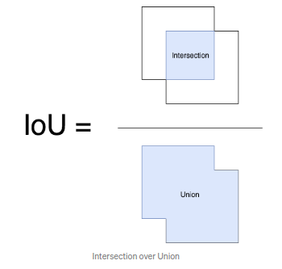
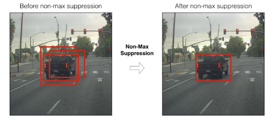

# Canny Detector

reference: http://www.pages.drexel.edu/~nk752/cannyTut2.html

## Apply Gaussian Blur

A Gaussian blur is applied. E.g., a $5 \times 5$ Gaussian blur matrix is

$$
\begin{bmatrix}
    2/159 & 4/159 & 5/159 & 4/159 & 2/159 \\\\
    4/159 & 9/159 & 12/159 & 9/159 & 4/159 \\\\
    5/159 & 12/159 & 15/159 & 12/159 & 5/159 \\\\
    4/159 & 9/159 & 12/159 & 9/159 & 4/159 \\\\
    2/159 & 4/159 & 5/159 & 4/159 & 2/159
\end{bmatrix}
$$

Gaussian blur can remove noises of an image so that next steps finding edges can be reliable without highlighting pixel gradient sudden changes due to the present noises.

## Find the intensity gradient

The next step is to use *Sobel* masks to find the edge gradient strength and direction for each pixel.

Sobel operator uses two $3 \times 3$ kernels which are convolved with the original image to calculate approximations of the derivatives – one for horizontal changes, and one for vertical. The process goes as below (an example)

$$
G_x=
\begin{bmatrix}
+1 & 0 & -1 \\\\
+2 & 0 & -2 \\\\
+1 & 0 & -1
\end{bmatrix}
$$

$$
G_y=
\begin{bmatrix}
+1 & +2 & +1 \\\\
0 & 0 & 0 \\\\
-1 & -2 & -1
\end{bmatrix}
$$

### Find the gradient strength and direction
$$
G = \sqrt{G_x^2 + G_y^2} \\\\
\Theta = atan(\frac{G_x}{G_y})
$$

```cpp
int edgeDir[maxRow][maxCol];			
float gradient[maxRow][maxCol];		

for (row = 1; row < H-1; row++) {
    for (col = 1; col < W-1; col++) {
        gradient[row][col] = sqrt(pow(Gx,2.0) + pow(Gy,2.0));	// Calculate gradient strength			
        thisAngle = (atan2(Gx,Gy)/3.14159) * 180.0;		// Calculate actual direction of edge
        
        /* Convert actual edge direction to approximate value */
        if ( ( (thisAngle < 22.5) && (thisAngle > -22.5) ) || (thisAngle > 157.5) || (thisAngle < -157.5) )
            newAngle = 0;
        if ( ( (thisAngle > 22.5) && (thisAngle < 67.5) ) || ( (thisAngle < -112.5) && (thisAngle > -157.5) ) )
            newAngle = 45;
        if ( ( (thisAngle > 67.5) && (thisAngle < 112.5) ) || ( (thisAngle < -67.5) && (thisAngle > -112.5) ) )
            newAngle = 90;
        if ( ( (thisAngle > 112.5) && (thisAngle < 157.5) ) || ( (thisAngle < -22.5) && (thisAngle > -67.5) ) )
            newAngle = 135;
            
        edgeDir[row][col] = newAngle;
    }
}	
```

## Non-maximum suppression

Here finds weak edges that are parallel to strong edges and eliminate them. This is accomplished by examining the pixels perpendicular to a particular edge pixel, and eliminating the non-maximum edges.

* IoU

IoU refers to *Intersection over Union*.



* Non-maximum suppression (NMS)

Non-maximum suppression (NMS) uses a threshold score to "shrinks" multiple intersected frames labeled on a single object (judged by IoU), so that only one rectangular frame is applied on exactly one object, and redundant others are removed, such as




|**Algorithm**: Non-Max Suppression $\quad\quad\quad\quad\quad\quad\quad\quad\quad\quad\quad\quad\quad\quad\quad\quad\quad\quad\quad\quad\quad\quad\quad\quad\quad\quad\quad$|
|-|
$$
\begin{align*}
&\mathbf{\text{procedure}} \text{ NMS}(B,c)
\\& \quad 
B_{nms} \leftarrow \emptyset 
&& \text{Init } B_{nms} \text{ to an empty set} 
\\& \quad 
\mathbf{\text{for }} b_i \in B \mathbf{\text{ do}}
&& \text{Iterate all } B
\\& \quad\quad
discard = False
&& \text{Init } discard \text{ to False }
\\& \quad\quad 
\mathbf{\text{for }} b_j \in B \mathbf{\text{ do}}
&& \text{Iterate all } B \text{(the second loop)}
\\& \quad\quad\quad
\mathbf{\text{if }} same(b_i, b_j) > \lambda_{nms} \mathbf{\text{ then}}
&& \text{Test if the two boxes have the same IoU,}
\\\\ & && \quad\text{having the same IoU indicates two }
\\\\ & && \quad\text{rectangular frames are referring to the same object }
\\& \quad\quad\quad\quad
\mathbf{\text{if }} score(c, b_j) > score(c, b_i) \mathbf{\text{ then}}
&& \text{Score judgement, higher the score, }
\\\\ & && \quad\text{more accurate the box fits the object}
\\& \quad\quad\quad\quad\quad
discard = True
&& \text{Set } discard \text{ to True, } b_i \text{ should be discarded}
\\& \quad\quad
\mathbf{\text{if not }} discard \mathbf{\text{ then}}
\\& \quad\quad\quad
B_{nms} \leftarrow B_{nms} \cup b_i
&& \text{Collect } b_i \text{ when not discarded}
\\& \quad
\mathbf{\text{return }} B_{nms}
\end{align*}
$$

where $B$ is the input set consisting of many rectangular frames where one object may see multiple frames overlapping each other; $B_{nms}$ is the total number of retained rectangular frames, where each frame corresponds to one object.

## Hysteresis: Thresholding

* If a pixel gradient is higher than the upper threshold, the pixel is accepted as an edge
* If a pixel gradient value is below the lower threshold, then it is rejected.
* If the pixel gradient is between the two thresholds, then it will be accepted only if it is connected to a pixel that is above the upper threshold.

Canny recommended a upper:lower ratio between 2:1 and 3:1.

 The pseduocode below summarizes this process.

 ```cpp
void findEdge(int rowShift, int colShift, int row, int col, int dir, int lowerThreshold){
    int newCol = col + colShift;
    int newRow = row + rowShift;
    while ( (edgeDir[newRow][newCol]==dir) && !edgeEnd && (gradient[newRow][newCol] > lowerThreshold) ) {
        newCol = col + colShift;
        newRow = row + rowShift;
        image[newRow][newCol] = 255; // white, indicates an edge
    }
}

for (int row = 1; row < H - 1; row++) {
	for (int col = 1; col < W - 1; col++) {
        if (gradient[row][col] > upperThreshold) {
            switch (edgeDir[row][col]){		
                case 0:
                    findEdge(0, 1, row, col, 0, lowerThreshold);
                    break;
                case 45:
                    findEdge(1, 1, row, col, 45, lowerThreshold);
                    break;
                case 90:
                    findEdge(1, 0, row, col, 90, lowerThreshold);
                    break;
                case 135:
                    findEdge(1, -1, row, col, 135, lowerThreshold);
                    break;
                default :
                    image[row][col] = 0; // black
                    break;
            }
        }
    }
}
 ```
