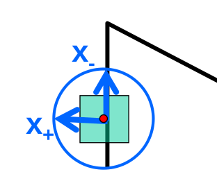

# Harris Operator

## Sum of squared differences (SSD)

Define a shifting window ${W}$ of a size of $m \times n$, window moving step of $(u,v)$ on an image $I$, and define an error *sum of squared differences* (SSD) which is the squared differences of all pixels in a window before and after window's shifting.

$$
E_{ssd}(u,v)=\sum_{(x,y)\in {W}_{m \times n}} 
\big[
    I(x+u, y+v)-I(x,y)    
\big]^2
$$

By first order approximation (this implies that the window slding step $(u,v)$ should be small), there is this expression ($I_{dx}$ and $I_{dy}$ are just shorthand notations of $\frac{\partial I}{\partial x}$ and $\frac{\partial I}{\partial y}$, respectively).

$$
\begin{align*}
I(x+u, y+v) &\approx
I(x,y) +\frac{\partial I}{\partial x} u+\frac{\partial I}{\partial y} v
\\\\ &\approx
I(x,y) + 
\begin{bmatrix}
    I_{dx} & I_{dy}
\end{bmatrix}
\begin{bmatrix}
    u \\\\
    v
\end{bmatrix}
\end{align*}
$$

So that $E_{ssd}(u,v)$ can be expressed as 
$$
\begin{align*}
E_{ssd}(u,v)&=
\sum_{(x,y)\in {W}_{m \times n}} 
\big[
    I(x+u, y+v)-I(x,y)    
\big]^2
\\\\ &\approx
\sum_{(x,y)\in {W}_{m \times n}} 
\bigg[
    I(x,y) + 
\begin{bmatrix}
    I_{dx} & I_{dy}
\end{bmatrix}
\begin{bmatrix}
    u \\\\
    v
\end{bmatrix}
-I(x,y)    
\bigg]^2
\\\\ & \approx
\sum_{(x,y)\in {W}_{m \times n}} 
\bigg(
\begin{bmatrix}
    I_{dx} & I_{dy}
\end{bmatrix}
\begin{bmatrix}
    u \\\\
    v
\end{bmatrix}
\bigg)^2
\\\\ & \approx
\begin{bmatrix}
    u & v
\end{bmatrix}
\bigg(
\sum_{(x,y)\in {W}_{m \times n}} 
\begin{bmatrix}
    I_{dx}^2 & I_{dx}I_{dy} \\\\
    I_{dy}I_{dx} & I_{dy}^2
\end{bmatrix}
\bigg)
\begin{bmatrix}
    u \\\\
    v
\end{bmatrix}
\end{align*}
$$

## Harris operator

Define $H$ as below to rewrite $E_{ssd}$

$$
H=
\sum_{(x,y)\in {W}_{m \times n}} 
\begin{bmatrix}
    I_{dx}^2 & I_{dx}I_{dy} \\\\
    I_{dy}I_{dx} & I_{dy}^2
\end{bmatrix}
$$

So that

$$
E_{ssd}(u,v) \approx
\begin{bmatrix}
    u & v
\end{bmatrix}
H
\begin{bmatrix}
    u \\\\
    v
\end{bmatrix}
$$

Since $rank(H)=2$, there are two eigenvalues corresponding to two eigenvectors
$$
H \mathbf{x}\_+ = \lambda_+\mathbf{x}\_+ \\\\
H \mathbf{x}\_- = \lambda_-\mathbf{x}\_-
$$

Intuitively,
* $\lambda_+ >> \lambda_-$, the window found feature is an edge
* Both $\lambda_+$ and $\lambda_-$ are large, the window found feature is a corner
* Both $\lambda_+$ and $\lambda_-$ are small, the window found feature is flat

### Harris operator

Define the harris operator

$$
\begin{align*}
f_{Harris}&=
\lambda_+ \lambda_- - k(\lambda_+ + \lambda_-)^2
\\\\ &=
det(H) + k \space tr(H)^2
\end{align*}
$$

where $det$ denotes determinant and $tr$ denotes the sum of diagonal elements of a matrix.

In comparison to eigen-decomposition, it is fast in computation.

### Use case

Given a window $W$ convolving an image, $f_{Harris}$ is computed (there is a $f_{Harris}$ for every window). Higher the $f_{Harris}$, more likely is a corner feature.

We can set a threshold to filter out low $f_{Harris}$'s window, and the left retained windows should have likely corner features.