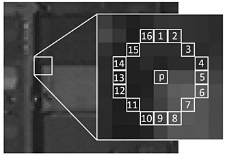

# ORB (Oriented FAST and Rotated BRIEF)

## FAST (Features from Accelerated and Segments Test)

FAST is a fast corner detection method.

### Segment Test Detector

Given a pixel $i(x,y)$ in an array, fast compares the brightness of this pixel $i(x,y)$ to surrounding $16$ pixels (a *Bresenham circle* of radius 3) that are in a small circle around $i(x,y)$. Pixels in the circle is then sorted into three classes (lighter than $i(x,y)$, darker than $i(x,y)$ or similar to $i(x,y)$). If more than $8$ pixels are darker or brighter than $i(x,y)$ than it is selected as a keypoint.



### High-speed Test

The high-speed test for rejecting non-corner points is operated by examining 4 example pixels, namely pixel $1$, $9$, $5$ and $13$ (up, down, right, left relative to the $i(x,y)$). If the four pixels have similar brightness level, the candidate corner keypoint $i(x,y)$ is rejected

### Pyramid Scaling

Each level in the pyramid contains the downsampled version of the image than the previous level. ORB applies the $16$-pixel corner detector on images of various scales.

*Non-Maximum Suppression* (NMX) is used to prevent redundant candidate keypoints describing the same visual feature.

### Keypoint Localization and Rotation FAST (rFAST)

After locating keypoints orb now assign an orientation to each keypoint like left or right facing depending on how the levels of intensity change around that keypoint. For detecting intensity change orb uses *intensity centroid*. 
The intensity centroid assumes that a corner’s intensity is offset from its center, and this vector may be used to impute an orientation.

An image moment is a certain particular weighted average (moment) of the image pixels' intensities/brightness levels. Given a patch $B$ Rosin's image moment is

$$
m_{pq} = \sum_{x,y \in B} x^p y^q i(x,y), \quad p,q = \{0,1\}
$$

For example, for a radius of $15$ patch, there is

$$
\begin{align*}
m_{10} &= 
\sum^{15}_{x=-15} \sum^{15}_{y=-15} x^1 y^0 i(x,y)
\\\\ &=
\sum^{15}_{x=-15} \sum^{15}_{y=-15} x \space i(x,y)

\end{align*}
$$

The centroid of the patch $B$ is

$$
C = \big(
    \frac{m_{10}}{m_{00}}, \frac{m_{01}}{m_{00}}
\big)
$$

The orientation is computed as

$$
\theta = 
atan2(m_{01}, m_{10})
$$

## BRIEF (Binary robust independent elementary feature)

The BRIEF descriptor is a bit string description of an image patch constructed from a set of binary intensity/brightness tests. BRIEF takes all keypoints found by the FAST and converts it into a binary feature vector so that together they can represent an object.

First, images are smoothed by Gaussians (commonly $\sigma \in [1,3]$) since pixel-level process is prone to noises' interference.

Randomly select two pixels denoted as $p$ and $q$ (pixel value represents intensity/brightness) around a keypoint, then do the test $t(p,q)$: if $p$ is greater than $q$, then take $1$, otherwise take $0$. Repeat $256$ tests for such $p, q$ pairs, and derive a $256$-dimensional vector consisting of $0$s and $1$s. This process can be summarized

$$
t(p,q) = 
\left\{ 
    \begin{matrix}
        1 & \quad p > q \\\\
        0 & \quad p \le q \\\\
    \end{matrix}
\right.
$$

The $256$-dimensional bit vector can be expressed as (where $2^{i-1}$ is for binary-decimal conversion)
$$
v = 
\sum^{n=256}_{i=1} 2^{i-1} t_{i}(p,q)
$$

$(p,q)$ pair sampling can follows *Gaussian distribution* or *Coarse Polar Grid*:
* $(p, q)$ being evenly distributed
* $p \sim N(0, \frac{1}{25}\sigma^2)$, and $q \sim N(0, \frac{1}{25}\sigma^2)$
* $p \sim N(0, \frac{1}{25}\sigma^2)$, and $q \sim N(0, \frac{1}{100}\sigma^2)$
* $(p, q)$ being evenly distributed in polar coordinates
* in polar coordinates, set $p=(0,0)$, while $q$ is sampled randomly

The $256$-dimensional test vector is represented in a $2 \times n$ matrix $S$ such as $(x\_i, y_i), i=1,2,...,256$.

$$
S = 
\begin{bmatrix}
    x_1, ..., x_n \\\\
    y_1, ..., y_n \\\\
\end{bmatrix}=
\begin{bmatrix}
    \mathbf{x} \\\\
    \mathbf{y} \\\\
\end{bmatrix}
$$

### Hamming Distance

The Hamming distance between two strings of equal length is the number of positions at which the corresponding symbols are different. 

For example, the Hamming distance is $D_h(v_1, v2)=5$ for there are $5$ positions where $v_1$ and $v_2$ have the opposite $0$ and $1$.

$$
\begin{align*}
    v_1 = 00100101011101
    \\\\
    v_2 = 01110000010101
\end{align*}
$$

Hamming distance is implemented to see how different/similar the two binary tests.

### Steered BRIEF

Steered BRIEF makes keypoint features be invariant to in-plane rotation. 

Using the patch orientation $\theta$ and the corresponding rotation matrix $R_{\theta}$, here constructs a “steered” version $S_{\theta}$

$$
S_{\theta} = R_{\theta} S
$$

where

$$
R_{\theta} = 
\begin{bmatrix}
    cos\theta & -sin\theta \\\\
    sin\theta & cos\theta
\end{bmatrix}
$$

To facilitate computation, an discretized increment of $\frac{2\pi}{30}$ is used rather a continuous model; A lookup table of precomputed BRIEF patterns is implemented instead of real-time computation.

### Rotation BRIEF (rBRIEF)

The mean $\mu_v$ and variance $\sigma^2_v$ of $v$ indicate how similar/different (Hamming distance) the two bit strings $v_i$ and $v_j$. 

If the $\sigma_v^2$ is high, it means the sampled pairs $(p,q)$ are biased against being evenly distributed, indicating a distinct visual feature. 

Since $v$ consists of either $0$ or $1$, $\mu_v$ being $0.5$ indicates evenly distribution of $0$ and $1$. For example, if both $1 \ge\mu_{v_i} \gg 0.5$ and $1 \ge\mu_{v_j} \gg 0.5$, both $v_i$ and $v_j$ have many $1$s.

For feature matching purposes, rBRIEF attempts to find best match between $v_i$ and $v_j$, by keeping the sampled $v$ having $\mu_v \approx 0.5$ and maximizing $\sigma_v^2$. So that the corresponding visual features are most likely distinct.

* rBRIEF's Unique $(p,q)$ Sampling Method By Training

In order to approach $\mu_v \approx 0.5$ and maximize $\sigma_v^2$, rBRIEF collects about $300,000$ features from the standard image dataset *PASCAL 2006*, and learns from the $300,000$ features' binary tests' result distribution.

Each feature is a $31 \times 31$ image patch (denote the patch width $w_p=31$). Define a sub-window of a size $5 \times 5$ (denote the width of the sub-window as $w_s = 5$). So that for each image patch, there is $N=(w_p - w_s)^2$ possible sub-windows. Consider permutation and combination that $(p,q)$ and $(q,p)$ are considered as one test, so that there are $\bigg(\begin{matrix} N \\\\ 2\end{matrix}\bigg)$ binary tests. Minus some overlapping tests, there are $M=20559$ tests.

The training process goes as below:
1. Run all binary tests in all $300,000$ image patches, where each patch runs $M=20559$ tests
2. Order the tests by their distance to $\mu_v=0.5$, and form a vector called $T$
3. Greed search:

(a) Put the first test into the result vector $R$ and move one from $T$

(b)  Take the next test $t$ from $T$, and compare it against all tests in $R$. If its absolute correlation is greater
than a threshold, discard it; else add it to $R$

(c)  Repeat the previous step until there are $256$ tests in $R$. If there are fewer than $256$, raise the threshold and try again.

After the training, the found $256$ test patterns are regarded the most distinct/uncorrelated features whose $\mu_v \approx 0.5$.

### BRIEF Implementation

*DBoW2* provides the below implementation.

1. The image `const cv::Mat &image` is first converted to a gray image `cv::cvtColor(image, aux, CV_RGB2GRAY);`
2. Gaussian blur is applied `cv::GaussianBlur(aux, im, ksize, sigma, sigma);`
3. Test points are pre-generated by `generateTestPoints()` in accordance with Gaussian sigmas.
    ```cpp
    m_x1[i] = x1;
    m_y1[i] = y1;
    m_x2[i] = x2;
    m_y2[i] = y2;
    ```
4. Conduct a test $2^{i-1} t_{i}(p,q)$ by `if(x1 >= 0 && x1 < W && y1 >= 0 && y1 < H && x2 >= 0 && x2 < W && y2 >= 0 && y2 < H) { ... }`, and set $1$ if true by `dit->set(i);`


```cpp
void BRIEF::compute(const cv::Mat &image, 
    const std::vector<cv::KeyPoint> &points,
    vector<bitset> &descriptors,
    bool treat_image) const
{
  const float sigma = 2.f;
  const cv::Size ksize(9, 9);
  
  cv::Mat im;
  if(treat_image)
  {
    cv::Mat aux;
    if(image.depth() == 3)
    {
      cv::cvtColor(image, aux, CV_RGB2GRAY);
    }
    else
    {
      aux = image;
    }

    cv::GaussianBlur(aux, im, ksize, sigma, sigma);
    
  }
  else
  {
    im = image;
  }
  
  assert(im.type() == CV_8UC1);
  assert(im.isContinuous());
  
  // use im now
  const int W = im.cols;
  const int H = im.rows;
  
  descriptors.resize(points.size());
  std::vector<bitset>::iterator dit;

  std::vector<cv::KeyPoint>::const_iterator kit;
  
  int x1, y1, x2, y2;
  
  dit = descriptors.begin();
  for(kit = points.begin(); kit != points.end(); ++kit, ++dit)
  {
    dit->resize(m_bit_length);
    dit->reset();

    for(unsigned int i = 0; i < m_x1.size(); ++i)
    {
      x1 = (int)(kit->pt.x + m_x1[i]);
      y1 = (int)(kit->pt.y + m_y1[i]);
      x2 = (int)(kit->pt.x + m_x2[i]);
      y2 = (int)(kit->pt.y + m_y2[i]);
      
      if(x1 >= 0 && x1 < W && y1 >= 0 && y1 < H 
        && x2 >= 0 && x2 < W && y2 >= 0 && y2 < H)
      {
        if( im.ptr<unsigned char>(y1)[x1] < im.ptr<unsigned char>(y2)[x2] )
        {
          dit->set(i);
        }        
      } // if (x,y)_1 and (x,y)_2 are in the image
            
    } // for each (x,y)
  } // for each keypoint
}


void BRIEF::generateTestPoints()
{  
  m_x1.resize(m_bit_length);
  m_y1.resize(m_bit_length);
  m_x2.resize(m_bit_length);
  m_y2.resize(m_bit_length);

  const float g_mean = 0.f;
  const float g_sigma = 0.2f * (float)m_patch_size;
  const float c_sigma = 0.08f * (float)m_patch_size;
  
  float sigma2;
  if(m_type == RANDOM)
    sigma2 = g_sigma;
  else
    sigma2 = c_sigma;
  
  const int max_v = m_patch_size / 2;
  
  DUtils::Random::SeedRandOnce();
  
  for(int i = 0; i < m_bit_length; ++i)
  {
    int x1, y1, x2, y2;
    
    do
    {
      x1 = DUtils::Random::RandomGaussianValue(g_mean, g_sigma);
    } while( x1 > max_v || x1 < -max_v);
    
    do
    {
      y1 = DUtils::Random::RandomGaussianValue(g_mean, g_sigma);
    } while( y1 > max_v || y1 < -max_v);
    
    float meanx, meany;
    if(m_type == RANDOM)
      meanx = meany = g_mean;
    else
    {
      meanx = x1;
      meany = y1;
    }
    
    do
    {
      x2 = DUtils::Random::RandomGaussianValue(meanx, sigma2);
    } while( x2 > max_v || x2 < -max_v);
    
    do
    {
      y2 = DUtils::Random::RandomGaussianValue(meany, sigma2);
    } while( y2 > max_v || y2 < -max_v);
    
    m_x1[i] = x1;
    m_y1[i] = y1;
    m_x2[i] = x2;
    m_y2[i] = y2;
  }

}
```