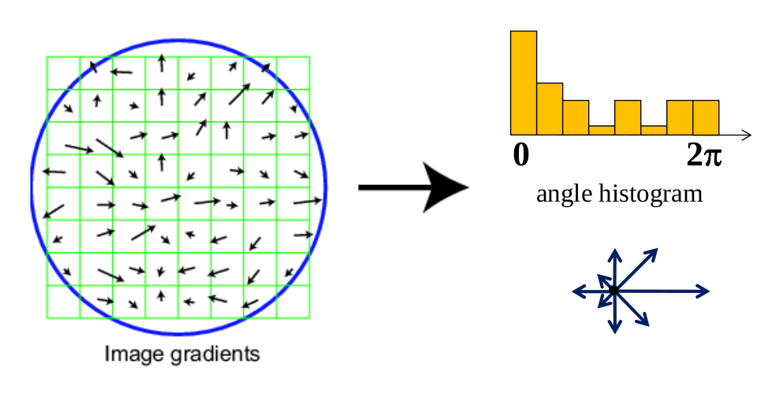

# Scale-invariant feature transform (SIFT)

## Scale-Space Extrema Detection

Starting with key point detection, the image $I$ is convolved with Gaussian filters at different scales, and then the difference of successive Gaussian-blurred images are taken. 
Keypoints are then taken as maxima/minima of the *Difference of Gaussians* (DoG) that occur at multiple scales. Specifically, a DoG image $D(x,y,\sigma)$ is given by
$$
D(x,y,\sigma) = 
L(x,y,k_i \sigma) - L(x,y,k_j \sigma)
$$
where $L(x,y,k \sigma)$ is the convolution (operation denoted as $\otimes$) of the input image $I(x,y)$ with the Gaussian blur $g(x,y, k\sigma)$ at the scale $k\sigma$ , i.e.,
$$
L(x,y,k \sigma) = 
g(x,y, k\sigma) \otimes I(x,y)
$$

Hence a DoG image between scales $k_i \sigma$  and $k_j \sigma$  is just the difference of the Gaussian-blurred images at the two scales.

Image $I$ is convolved with $g$ at different scales, the derived images are group by octave. DoG images are obtained from adjacent Gaussian-blurred images per octave.

Keypoints are selected as local minima/maxima of the DoG images across scales, by comparing the pixel and its neighbor pixels.

## Keypoint localization

Next is to perform a detailed fit to the nearby data (neighbor pixels of keypoints) for accurate location, scale, and ratio of principal curvatures.

Using the quadratic Taylor expansion of the Difference-of-Gaussian (DoG) scale-space function, DoG can be expressed as
$$
D(\bold{x}) = D + 
\frac{\partial D^\text{T}}{\partial \bold{x}} \bold{x} +
\frac{1}{2} \bold{x}^\text{T} \frac{\partial^2 D}{\partial \bold{x}^2} \bold{x}
$$
where $\bold{x}=(x_{-}, y_{-}, \sigma)^\text{T}$ is the offset from a candidate keypoint 

## sift

Given a window $W$ convolving an image $I$, compute the gradient and edge orientation of each pixel.

Discard low gradient elements in this window, the compute the histogram of this window's angles (usually 8 bins).

The 8 magnitudes and angles of this window can be used for describing this window's feature.

It can be used to interesting feature (corner and edge) dettection and feature match/location.

