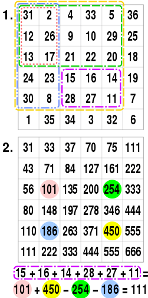
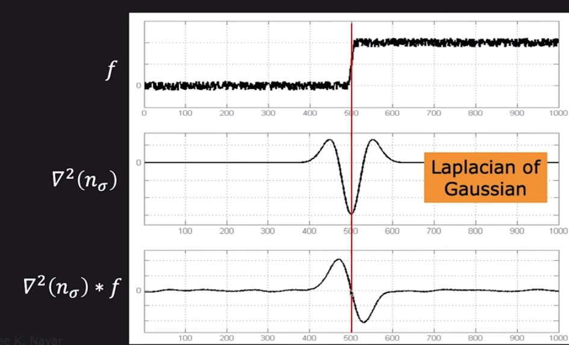
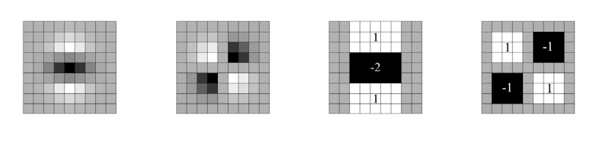
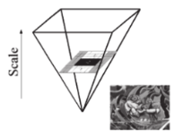

# SURF (Speeded-Up Robust Features)

## Integral Image

An *integral image* (a.k.a *summed-area table*) is a data structure and algorithm for generating the sum of values in a rectangular subset of a grid by a precomputed summed table.

In computer vision, the integral image is used as a quick and effective way of calculating the sum of values (pixel values) in a given image — or a rectangular subset of a grid (the given image). It can also, or is mainly, used for calculating the average intensity within a given image.

* Definition

The value $I$ at any point $(x, y)$, together denoted as $I_{sum}(x,y)$ in the summed-area table is the sum of all the pixels above and to the left of $i(x, y)$, inclusive, such as
$$
I_{sum}(x,y) = 
\sum_{
    \scriptsize{
    \begin{matrix}
        \forall\space x' \le x \\
        \forall\space y' \le y
    \end{matrix}
    }
}
i (x',y')
$$
where $i(x',y')$ is a pixel value.

Once the summed-area table has been computed, evaluating the sum of intensities over any rectangular area requires exactly four array references regardless of the area size.
$$
\sum_{
    \scriptsize{
    \begin{matrix}
        x_0 \le x \le x_1 \\
        y_0 \le y \le y_1
    \end{matrix}
    }
} i (x,y) =
I_{sum}(x_0, y_0) + I_{sum}(x_1, y_1) - I_{sum}(x_0, y_1) - I_{sum}(x_1, y_0)
$$

* Example

In the example below, the $2.$ matrix is the summed-area table of the $1.$ matrix with each entry computed by $I(x,y)$.
The purple rectangle sum from the $1.$ matrix is equal to the four angle points' sum from the $2.$ matrix.

## Fast-Hessian Detector

For selecting the location and the scale (Hessian-Laplace detector), Hessian affine region detector relies on the determinant of the Hessian matrix.

*  Laplacian

The *Laplace operator* or *Laplacian* is a differential operator given by the divergence of the gradient of a scalar function on Euclidean space, denoted as $\nabla \cdot \nabla$, or simply $\nabla^2$, or $\Delta$.

In a Cartesian coordinate system, the Laplacian is given by the sum of second partial derivatives of the function with respect to each independent variable.
$$
\Delta f = \nabla^2 f = 
\sum_{i=1}^{n} \frac{\partial^2 f}{\partial x^2_i}
$$

Given a pixel $i(x,y)$, the Hessian of this pixel $i(x,y)$ is defined
$$
\begin{align*}
H\big(i(x,y)\big) &= 
\begin{bmatrix}
    \frac{\partial^2 i}{\partial x^2} & \frac{\partial^2 i}{\partial x \partial y} \\
    \frac{\partial^2 i}{\partial y \partial x} & \frac{\partial^2 i}{\partial y^2}
\end{bmatrix}
\\ &=
\begin{bmatrix}
    L\_{xx} & L\_{xy} \\
    L\_{yx} & L\_{yy}
\end{bmatrix}
\end{align*}
$$

An image edge feature is present when its second-order derivative is (nearly) zero, hence here employs the Laplacian. 

* Laplacian of Gaussians (LoG)

Because the Laplacians are approximating a second-order derivative measurement on the image, they are very sensitive to noise. To counter this, the image is often Gaussian smoothed before applying the Laplacian filter. This pre-processing step reduces the high frequency noise components prior to the differentiation step.

Convolution operation is associative, so that Gaussian smoothing filter $n_\sigma$ can be convolved with the Laplacian filter $\nabla^2$ first of all, and then convolve this hybrid filter $LoG_k(x,y) =\nabla^2(n_\sigma)$ with the image $I$ to achieve the required result.

$$
LoG_k(x,y) = 
-\frac{1}{\pi \sigma_k^4}\bigg(
    1-\frac{x^2+y^2}{2\sigma_k^2}
\bigg)
e^{-\frac{x^2+y^2}{2\sigma_k^2}}
$$

Given an input image $I(x,y)$, this image is convolved (convolution denoted as $*$) with the aforementioned hybrid filter $\nabla^2(n_\sigma * I) = \nabla^2(n_\sigma) * I$

At each scale $\sigma_k^2$, interest points are those points that simultaneously are local extrema of both the determinant and trace of the Hessian matrix. The trace of Hessian matrix is identical to the Laplacian of Gaussians (LoG)

$$
\begin{align*}
det(H) &= 
\sigma_k^2 \big(
    L\_{xx} L\_{yy} - L\_{xy}^2
\big)
\\
tr(H) &=
\sigma_k (L\_{xx}+L\_{yy})
\end{align*}$$

By choosing points that maximize the determinant of the Hessian, this measure penalizes longer structures that have small second derivatives (signal changes) in a single direction.

* Difference of Gaussians (DoG)

DoG is an approximation to LoG by a simple subtraction.

Consider Gaussian kernels with different adjacent scaling factor $\sigma_k$ and $\sigma_{k+1}$ (conditional on $\sigma_k < \sigma_{k+1}$), there is
$$
\begin{align*}
DoG_{\sigma_k, \sigma_{k+1}} (x,y)&=
I *
\frac{1}{2\pi \sigma_k^2}
e^{-\frac{x^2+y^2}{2\sigma_k^2}}
-
I *
\frac{1}{2\pi \sigma_{k+1}^2}
e^{-\frac{x^2+y^2}{2\sigma_{k+1}^2}}
\\ &=
I * \bigg(
    \frac{1}{2\pi \sigma_k^2}
e^{-\frac{x^2+y^2}{2\sigma_k^2}}
-
\frac{1}{2\pi \sigma_{k+1}^2}
e^{-\frac{x^2+y^2}{2\sigma_{k+1}^2}}
\bigg)
\end{align*}
$$

In conclusion, DoG just convolves the image with the difference between the Gaussians with variance $\sigma_k < \sigma_{k+1}$.

* DoG Approximation by Integral Image (*Fast-Hessian* detector)

SURF approximates second-order Gaussian derivatives by a box filter, that can be evaluated at a very low computational cost using integral images and independently of size, requiring evaluations at the rectangle's four corners, in contrast to SIFT using difference of Gaussians (DoG) that is calculated on rescaled images progressively.

The box filter used in SURF is of $9 \times 9$ size. Illustrated as below, the two left hand side are Gaussian filters with respect to $D_{yy}$ and $D_{xy}$; the two right hand side are the approximation box filters. Denote the approximation result image $I_{\approx}$.

Represent the determinant of the Hessian (approximated) as:
$$
det(H_{\approx}) = 
D_{xx}D_{yy} - (\sigma_k D_{xy})^2
$$

* Pyramid Scaling

Keypoints can be found at different scales, partly because the search for correspondences often requires comparison images where they are seen at different scales.

Scale spaces are usually implemented as image pyramids. Given the implementation of integral image approximation $I_{\approx}$, the sampling is implemented by applying box filters of different sizes to up-scale sample images with filter sizes $9 \times 9, 15\times 15, 21\times 21, 27\times 27,...$. Accordingly, $\sigma_1=1.2, \sigma_2=1.2 \times \frac{15}{9}=2.0$.

Non-maximum suppression (NMS) in a $3 \times 3 \times 3$ neighborhood is applied to localize interest points in the image and over scales.

The candidate keypoints (and their neighbouring areas) selected by NMS are regarded as keypoints.

## Feature/Keypoint Descriptor

*Feature descriptor* describes a distribution of Haar-wavelet responses within the interest point neighbourhood. Again, it takes advantage of integral images for speed.

### Orientation Assignment

First calculate the Haar-wavelet responses in $x$ and $y$ direction, and this in a circular neighbourhood of
radius $6$s around the interest point, with $s$ the scale at which the interest point was detected. 

The dominant orientation is estimated by calculating the sum of all responses within a sliding orientation window covering an angle of $\frac{\pi}{3}$. 
The longest such vector lends its orientation to the interest point. 

### Descriptor Components

The first step consists of constructing a square region of radius $20$s centered around the keypoint, and oriented along the orientation selected in the previous section.

"Horizontal" $d_x$ and "vertical" $d_y$
here are defined in relation to the selected keypoint orientation. Then, the wavelet responses $d_x$ and $d_y$ are summed up over each $4 \times 4$ subregion and form a first set of entries to the feature vector $\mathbf{v}$ that
$$
\mathbf{v} = 
\bigg(
    \sum d_x, \sum d_y, \sum |d_x|, \sum |d_y|
\bigg)
$$

