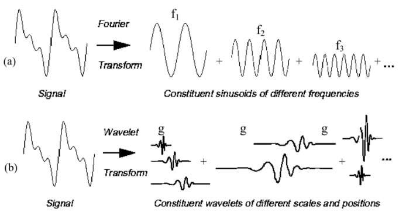
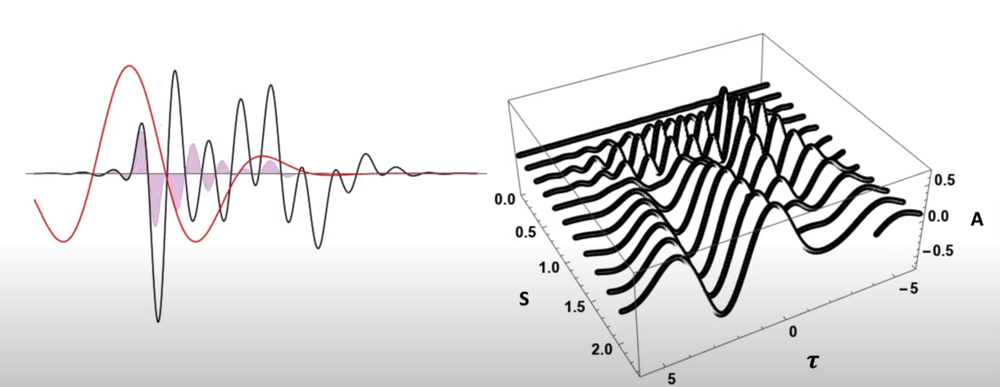
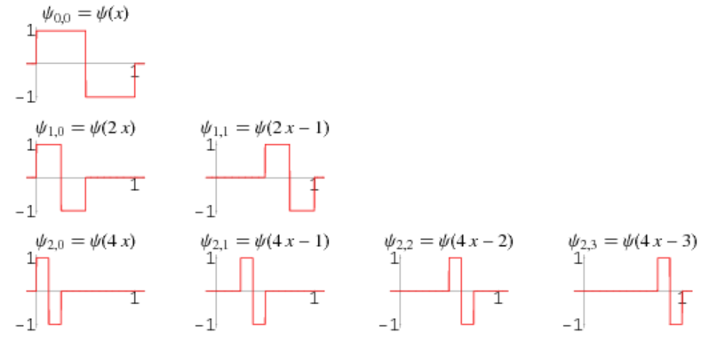

# Wavelet Transform

A wavelet series is a representation of a square-integrable (real- or complex-valued) function by a certain orthonormal series generated by a wavelet. 

## Inspiration from Fourier Series

### Fourier series definition

Given a Fourier series in amplitude-phase form：
$$
s_N = 
\frac{A_0}{2} +
\sum_{n=1}^N A_n \cdot cos(\frac{2\pi}{P} n \omega_0 - \varphi_n)
$$
where
* The $n$-th harmonic is $A_n \cdot cos(\frac{2\pi}{P} n \omega_0 - \varphi_n)$
* $\omega_0=\frac{2\pi}{T}$ is the base frequency
* $A_n$ is the amplitude
* $\varphi_n$ is the phase shift

Since $\varphi_n$ is a phase shift constant, here defines the derivations of $a_n$ and $b_n$
$$
\begin{align*}
sin(\varphi_n) &= \frac{b_n}{A_n}
\\
cos(\varphi_n) &= \frac{a_n}{A_n}
\end{align*}
$$

So that a Fourier series can be expressed with $a_n$ and $b_n$:
$$
s_N = 
\frac{a_0}{2} +
\sum_{n=1}^N
\big(
    a_n cos(\frac{2\pi}{P} n \omega_0) +
    b_n sin(\frac{2\pi}{P} n \omega_0) 
\big)
$$

Expand the harmonic $A_n \cdot cos(\frac{2\pi}{P} n \omega_0 - \varphi_n)$, there is
$$
\begin{align*}
A_n \cdot cos(\frac{2\pi}{P} n \omega_0 - \varphi_n)
&=
\frac{A_n}{2} e^{i(\frac{2\pi n \omega_0}{P}-\varphi_n)} +
\frac{A_n}{2} e^{-i(\frac{2\pi n \omega_0}{P}-\varphi_n)}
\\ &=
\big(\frac{A_n}{2} e^{-i\varphi_n}\big) \cdot e^{i \frac{2\pi n \omega_0}{P}} +
\big(\frac{A_n}{2} e^{-i\varphi_n}\big)^* \cdot e^{i \frac{-2\pi n \omega_0}{P}}
\end{align*}$$
where $*$ denotes complex conjugate.

Substitute $a_n$ and $b_n$ into $\big(\frac{A_n}{2} e^{-i\varphi_n}\big)$, there is
$$
s_N = 
\frac{a_0}{2} + \sum_{n=1}^N
\frac{1}{2} (a_n - ib_n) e^{-i(\frac{2\pi n \omega_0}{P})}
$$

### Fourier Series Orthogonality

For $m \ne n$, there are
$$
\begin{align*}
\int_\tau sin(nx) sin(mx) dx &= 0
\\
\int_\tau cos(nx) cos(mx) dx &= 0
\end{align*}
$$

Therefore, the bases of Fourier series are orthogonal to each other.

### Fourier Transform

For absolutely integrable time signals $x(t)$, the Fourier transform can be used to get the frequency domain description.
$$
X(\omega) = 
\int^{+\infty}_{-\infty}
x(t) e^{-i n\omega_0 t} dt
$$

### Short Time Fourier Transform (STFT)

$$
STFT\{x(t)\}(\tau,\omega)
\equiv X(\tau, \omega)
=
\int^{+\infty}_{-\infty}
x(t) w(t-\tau) e^{-i n\omega_0 t} dt
$$
where $w(t-\tau)$ is the window function,  commonly a Hann window or Gaussian window centered around zero. $\tau$ is the time localization term so that the Fourier transform only targets a fraction of a signal.

### Fourier Drawbacks

Any wave (source signal) can be constructed by Fourier series. However, Fourier bases are non-decaying sinusoidal waves that have bad approximation around sharp corners of a source signal wave. This is attributed to Fourier bases having constant frequencies and amplitudes.

A better approximation should be using bases with changeable amplitudes along with frequencies.

### Wave Representation and Inspiration

Define a wavelet basis $\psi$ over a trivial time period window $\Delta t$ and the angular frequency $\Delta \omega$ within this window. 
$$
\Delta t \Delta \omega = \frac{1}{2}
$$

As a result, $\psi$ has the following properties:

* When $\Delta t$ is large:

Bad time resolution; Good frequency resolution; Low frequency, large scaling factor

* When $\Delta t$ is small:

Good time resolution; Bad frequency resolution; High frequency, small scaling factor

In other words, the basis function $\psi$  can be regarded as an impulse response of a system with which the function $x(t)$  has been filtered. 

## Wavelet Definition

$\psi_{s,\tau}(t)$ is an orthonormal wavelet such as
$$
\psi_{s,\tau}(t) = 
\frac{1}{\sqrt{s}} \psi \big( \frac{t-\tau}{s} \big)
$$
where $s$ is positive and defines the frequency scale/frequency band， higher the $\psi$'s frequency, smaller the $s$ (or $s$ is the inverse of the frequency)

$\tau$ defines the shift/translation version of the mother wavelet $\psi(t)$ (often centered at zero).

$\psi$ can be in many different forms. A typical $sinc$ version wavelet function $\psi$ with $s=1, \tau=0$ is
$$
\psi(t) = 
sinc(t) = \frac{sin(\pi t)}{\pi t}
$$

The $sinc$ has the shape as in the figure below marked in red. First, set an $s$ such as $s=0$ then move/translate $sinc$ across the signal (translation is done by increasing $\tau$). The convolution result is shown in the right hand side. As $s$ increases, the $sinc$ gets "fat" catching low frequency components.

Other common wavelet examples are 
* Poisson wavelet
* Morlet wavelet
* Mexican hat wavelet
* Haar wavelet

The discrete version describes sampled points $x(t_m)$ from signal convolved with $\psi[s,\tau]$ where 
$$
\psi[s,\tau] = 
\frac{1}{\sqrt{s}} \sum^{p-1}_{m=0} x(t_m) \psi \big( \frac{t_m - \tau}{s} \big)
$$
where $\forall \space k,j \in \mathbb{Z}$, there are
$$
s = 2^{-j}, \quad \tau = k 2^{-j} 
$$

### Continuous Wavelet Transform (CWT)

The continuous wavelet transform (CWT) is a formal (i.e., non-numerical) tool that provides an overcomplete representation of a signal by letting the translation $\tau$ and scale parameter $s$ of the wavelets vary continuously.
$$
\begin{align*}
X_\omega(s,\tau) &= 
\frac{1}{\sqrt{s}} \int^{+\infty}_{-\infty}
x(t) \overline{\psi}\big( \frac{t-\tau}{s} \big) dt
\\ &=
<x(t), \psi_{s,\tau}(t)>
\end{align*}
$$
where $\psi(t)$ is a continuous function in both the time domain and the frequency domain called the mother wavelet and the overline represents operation of complex conjugate. Daughter wavelets are various translation and frequency scaling versions of the mother wavelet.

The reverse transform that recovers the source signal $x(t)$ is
$$
x(t) = C^{-1}_\psi 
\int^{\infty}_{0} \int^{\infty}_{-\infty}
\bold{C}(s,\tau) \frac{1}{\sqrt{s}}
\~{\psi}(\frac{t - \tau}{s}) \frac{dsd\tau}{s^2}
$$

## Haar Wavelet Image Processing Example

The Haar wavelet's mother wavelet function $\psi(t)$ is
$$
\psi(t) =
\left\{
    \begin{array}{r}
        1 & 0 \le t \le \frac{1}{2}, \\
        -1 & \frac{1}{2} \le t \le 1, \\
        0 & \text{otherwise.}
    \end{array}
\right.
$$
and its scaling function $s(t)$
$$
s(t) = 
\left\{
    \begin{array}{r}
        1 & 0 \le t \le 1, \\
        0 & \text{otherwise.}
    \end{array}
\right.
$$

### Shape and Orthogonality

Very intuitive, Haar     wavelet $\psi_{s,\tau}$'s daughter wavelets are pairwise orthogonal for the integral area either having the opposite values $1$ and $-1$, or being zero.

$$
\int_{\mathbb{R}} 
\psi_{s_1,\tau_1}(t) \psi_{s_2,\tau_2}(t) dt
=
\delta_{s_1,\tau_1} \delta_{s_2,\tau_2}
$$
where $\delta_{i,j}$ is *Kronecker delta* that
$$
\delta_{i,j} = \left\{ 
    \begin{array}{c}
        0 & & i \ne j \\
        1 & & i = j
    \end{array}
\right.
$$

### 1D Haar Wavelet

Define a 1d 4-element Haar bases $\bold{h}=[h_1, h_2, h_3, h_4]$, and signal $\bold{x}=[x_1, x_2, ,x_3 , x_4]$.

$$
h_1 = 
\begin{bmatrix}
    1 \\
    1 \\
    1 \\
    1
\end{bmatrix}
,
h_2 = 
\begin{bmatrix}
    1 \\
    1 \\
    -1 \\
    -1
\end{bmatrix}
,
h_3 = 
\begin{bmatrix}
    1 \\
    -1 \\
    0 \\
    0
\end{bmatrix}
,
h_4 = 
\begin{bmatrix}
    0 \\
    0 \\
    1 \\
    -1
\end{bmatrix}
$$

So that combine all $h_i$
$$
\bold{h} = 
\begin{bmatrix}
    1 & 1 & 1 & 0\\
    1 & 1 & -1 & 0\\
    1 & -1 & 0 & 1\\
    1 & -1 & 0 & -1
\end{bmatrix}^{\text{T}}
$$

Then normalize $\bold{h}$, the result is
$$
\bold{h}_{norm} = 
\begin{bmatrix}
    1 & 1 & \sqrt{2} & 0\\
    1 & 1 & -\sqrt{2} & 0\\
    1 & -1 & 0 & \sqrt{2}\\
    1 & -1 & 0 & -\sqrt{2}
\end{bmatrix}^{\text{T}}
$$

Compute the product of the signal $\bold{x}$ with $\bold{h}_{norm}$, and derives the frequency-deduced vector $\bold{c}$
$$
\bold{c} = 
\bold{h}_{norm} \bold{x}^{\text{T}}
$$

To recover the signal, the recovered estimate is denoted as $\hat{\bold{x}}$, there is
$$
\hat{\bold{x}} = 
\bold{h}_{norm}^{\text{T}} \bold{c}
$$
where $\bold{h}_{norm}^{\text{T}}$ is orthogonal and normalized, there is $\bold{h}_{norm} \bold{h}_{norm}^{\text{T}} = \bold{h}_{norm} \bold{h}_{norm}^{-1}  = I$

Inside $\bold{c}=[c_1, c_2, c_3, c_4]$, each element corresponds to a frequency. For example, just take $[c_1, c_2]$, the recovery signal estimate $\hat{\bold{x}}$ takes care of low frequency features.

If the 1d source signal $\bold{x}$ has the exact frequencies as in Haar's (such as $\bold{x}$ is a low frequency square wave), or has only four elements, $\hat{\bold{x}}$ is a perfect recovery $\hat{\bold{x}} = \bold{x}$.

### 2D Haar Wavelet

Define a 2d signal $X \in \mathbb{R}^{4 \times 4}$.

Define 2d orthogonal Haar bases $\bold{H}$, and each element $H_{ij} \in \bold{H}$ is the result of outer product (operator denoted as $\otimes$) from respective Haar bases $h_i$ and $h_j$, such as
$$
H_{ij} = h_i \otimes h_j
$$

So that (only the first 8 are shown as below, in total they are 16 $H_{ij}$s)
$$
\begin{align*}
H_{11} &= 
\begin{bmatrix}
    1 & 1 & 1 & 1 \\
    1 & 1 & 1 & 1 \\
    1 & 1 & 1 & 1 \\
    1 & 1 & 1 & 1
\end{bmatrix}
, &
H_{12} &= 
\begin{bmatrix}
    1 & 1 & 1 & 1 \\
    1 & 1 & 1 & 1 \\
    -1 & -1 & -1 & -1 \\
    -1 & -1 & -1 & -1
\end{bmatrix}
\\
H_{13} &= 
\begin{bmatrix}
    1 & 1 & 1 & 1 \\
    -1 & -1 & -1 & -1 \\
    0 & 0 & 0 & 0 \\
    0 & 0 & 0 & 0
\end{bmatrix}
, &
H_{14} &= 
\begin{bmatrix}
    0 & 0 & 0 & 0 \\
    0 & 0 & 0 & 0 \\
    1 & 1 & 1 & 1 \\
    -1 & -1 & -1 & -1
\end{bmatrix}
\\
H_{21} &= 
\begin{bmatrix}
    1 & 1 & -1 & -1 \\
    1 & 1 & -1 & -1 \\
    1 & 1 & -1 & -1 \\
    1 & 1 & -1 & -1
\end{bmatrix}
, &
H_{22} &= 
\begin{bmatrix}
    1 & 1 & -1 & -1 \\
    1 & 1 & -1 & -1 \\
    -1 & -1 & 1 & 1 \\
    -1 & -1 & 1 & 1
\end{bmatrix}
\\
H_{23} &= 
\begin{bmatrix}
    1 & 1 & -1 & -1 \\
    -1 & -1 & 1 & 1 \\
    0 & 0 & 0 & 0 \\
    0 & 0 & 0 & 0
\end{bmatrix}
, &
H_{24} &= 
\begin{bmatrix}
    0 & 0 & 0 & 0 \\
    0 & 0 & 0 & 0 \\
    1 & 1 & -1 & -1 \\
    -1 & -1 & 1 & 1 
\end{bmatrix}
\end{align*}
$$

The 2d signal $X$ can be decomposed as
$$
X = \sum_{i,j} c_{ij} H_{ij}
$$