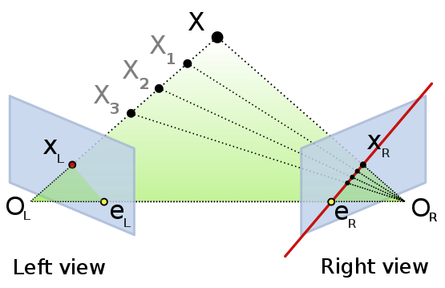
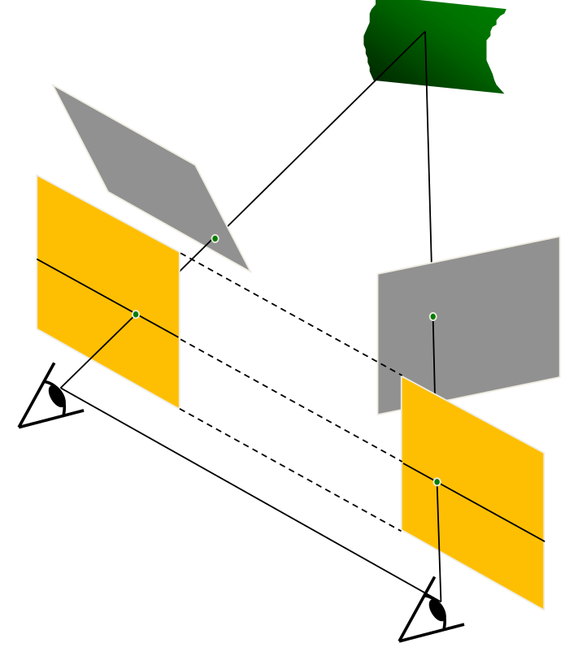
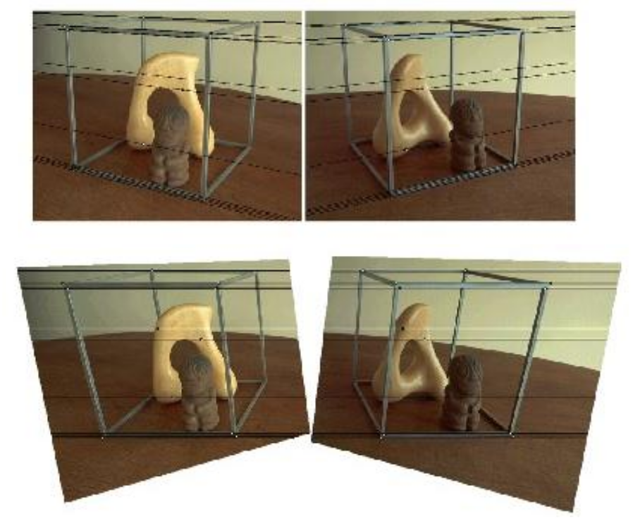
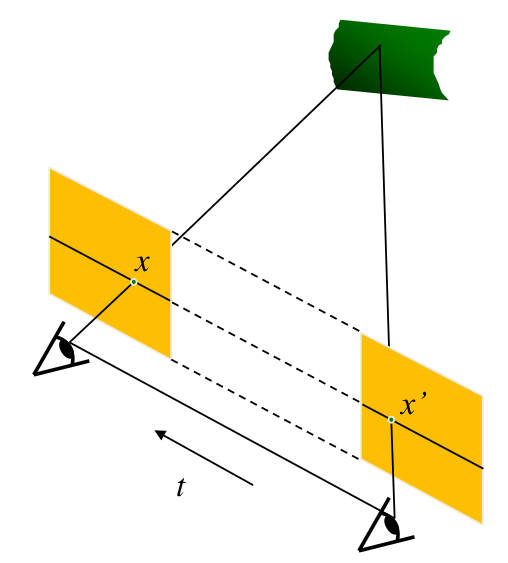
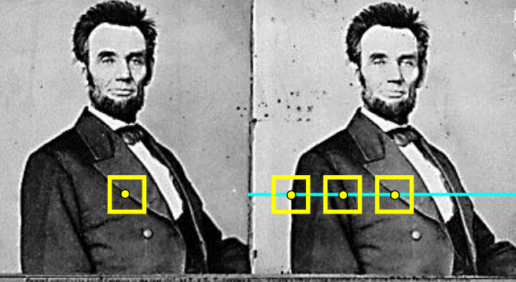

# Epipolar geometry

Epipolar geometry is the geometry of stereo vision. When two cameras view a 3D scene from two distinct positions, there are a number of geometric relations between the 3D points and their projections onto the 2D images that lead to constraints between the image points.

## Image Formulation

      

 

### Epipolar Geo

* Epipole/epipolar point

$\mathbf{e}_L$ and $\mathbf{e}_R$ are called epipoles, defined as the two points on a *base line* $\mathbf{l}_{LR} = O_L - O_R$ penetrating through left and right camera views. $O_L$ and $O_R$ are called *optical centers*.

* Epipolar line

The line $\mathbf{l}_l = O_L - X$ is seen by the left camera view as a single point $X_L$ projected on the left view plane. Other points $[\mathbf{x}_1, \mathbf{x}_2, \mathbf{x}_3, ...]$ on this line $O_L - X$ are seen by the right camera view projected on the line $\mathbf{e}_R - \mathbf{x}_R$. The red line $\mathbf{e}_R - \mathbf{x}_R$ is called epilolar line.

* Epipolar plane

The triangular plane $\mathbf{x} - O_L - O_R$ is called epipolar plane.

* Epipolar constraints

The projection of a real world point $x$ on the right camera plane as $\mathbf{x}_R$ must be contained in the $\mathbf{e}_R - \mathbf{x}_R$ epipolar line. 

## Essential Matrix

Essential matrix $E$ describes a camera motion (extrinsics $M_{ex}$: rotation and translation) from $O_L$ to $O_R$.

If the right camera's intrinsics $K$ is same as the left's, the right camera can be said a rotation and translation result of the left camera. 

### Extrinsic calibration
Extrinsic calibration provides a 3d rigid coordinate transformation $\mathbf{x}_{\tiny{C,L}}=M_{ex}[x^\text{T}_W, 1]^\text{T}$ from real world coordinates to left camera's coordinates, in which 
$$
M_{ex}=[R_L \space -R_L \overrightarrow{O}_{\tiny{W,L}}]_{3 \times 4}
$$

where $\overrightarrow{O}_{\tiny{W,L}}$ denotes left camera optical center in the real world coordinates; $R_L$ is a $3 \times 3$ rotation matrix. Intuitively, $M_{ex}$ can be interpreted as transformation by rotation $R_L$ then translation by $R_L\overrightarrow{O}_{\tiny{W,L}}$.

### Epipolar constraint 

Let $\times$ represent a cross product, hence $(O_{\tiny{W,L}}-O_{\tiny{W,R}})\times(\mathbf{x}_{\tiny{W,R}}-O_{\tiny{W,R}})$ represents the normal to epilolar plane. Since $\mathbf{x}_{\tiny{W,L}}, O_{\tiny{W,L}}, \mathbf{x}_{\tiny{W,R}}, O_{\tiny{W,R}}$ are coplanar, the scalar product by $(\mathbf{x}_{\tiny{W,L}}-O_{\tiny{W,L}})^\text{T}$ and the epipolar plane normal should be zero.

$$
(\mathbf{x}_{\tiny{W,L}}-O_{\tiny{W,L}})^\text{T}[(O_{\tiny{W,L}}-O_{\tiny{W,R}})
\times
(\mathbf{x}_{\tiny{W,R}}-O_{\tiny{W,R}})]=0
$$

### Essential matrix

Since $(O_{\tiny{W,L}}-O_{\tiny{W,R}})\times$ is a vector cross product operation, it can be transformed into an anti-symmetric/skew matrix operation:
$$
(O_{\tiny{W,L}}-O_{\tiny{W,R}})\times=
[O_{b}]_{\times}=
\begin{bmatrix}
    0 & -o_3 & o_2 \\\\
    o_3 & 0 & -o_1 \\\\
    -o_2 & o_1 & 0
\end{bmatrix}
$$

This transforms a vector multiplication into a matrix multiplication. Some articles denote this vector to matrix transformation as $O_{b}^{\vee}=[O_{b}]_{\times}$. 

The vector representation of a real world point in the left camera frame $\mathbf{x}_{\tiny{W,L}}-O_{\tiny{W,L}}$ can be computed with its pixel vector $\mathbf{x}_{\tiny{C,L}}$ multiplied by the orientation $R^\text{T}_{L}$ of the left camera

$$
\mathbf{x}_{\tiny{W,L}}-O_{\tiny{W,L}} = R^\text{T}_{L}\mathbf{x}_{\tiny{C,L}}
$$

Similarly for the right camera view:
$$
\mathbf{x}_{\tiny{W,R}}-O_{\tiny{W,R}} = R^\text{T}_{R}\mathbf{x}_{\tiny{C,R}}
$$

So that the epipolar constraint can be written as

$$
\begin{align*}
& \space \space \space \space \space 
R^\text{T}_{L}\mathbf{x}_{\tiny{C,L}}
\big((O_{\tiny{W,L}}-O_{\tiny{W,R}})
\times R^\text{T}_{R}\mathbf{x}_{\tiny{C,R}}\big)
\\\\ &=
\mathbf{x}_{\tiny{C,L}}^\text{T}R_{L}
\big((O_{\tiny{W,L}}-O_{\tiny{W,R}})
\times R^\text{T}_{R}\mathbf{x}_{\tiny{C,R}}\big)
\\\\ &=
\mathbf{x}_{\tiny{C,L}}^\text{T}R_{L}
[O_{b}]_{\times}
R^\text{T}_{R}\mathbf{x}_{\tiny{C,R}}
\\\\ &=
\mathbf{x}_{\tiny{C,L}}^\text{T}
E
\mathbf{x}_{\tiny{C,R}}
\\\\ &= 
0
\end{align*}
$$

where $E=R_{L}\big((O_{\tiny{W,L}}-O_{\tiny{W,R}})\times R^\text{T}_{R}\big)$ is the essential matrix.

### Essential Matrix Degree of Freedom (DoF)

$E$ has $rank(E)=2$ for its homogeneous coordinates' representation scaling by $f$.

Since translation and rotation each have 3 degrees of freedom, $E$ has $6$ degrees of freedom. 
But due to the equivalence of scales $f$, $E$ actually has 5 degrees of freedom.

### Essential Matrix Computation

For $\mathbf{x}_{\tiny{L}}$ and $\mathbf{x}_{\tiny{R}}$ such as
$$
\mathbf{x}_{\tiny{L}}=
\begin{bmatrix}
    u \\\\
    v \\\\
    1
\end{bmatrix}
\text{, }
\mathbf{x}_{\tiny{R}}=
\begin{bmatrix}
    u' \\\\
    v' \\\\
    1
\end{bmatrix}
$$

given $\mathbf{x}_{\tiny{C,L}}^\text{T} E \mathbf{x}_{\tiny{C,R}} = 0$, that gives
$$
[u, v, 1]
\begin{bmatrix}
    e_1 & e_2 & e_3 \\\\
    e_4 & e_5 & e_6 \\\\
    e_7 & e_8 & e_9 \\\\
\end{bmatrix}
\begin{bmatrix}
    u' \\\\
    v' \\\\
    1
\end{bmatrix}=
0
$$

*Eight-Point Algorithm* requires $8$ point pairs $\mathbf{x}_{\tiny{L}}$ and $\mathbf{x}_{\tiny{R}}$ (the scaling factor $f$ is considered equivalent to setting $f=1$), rearrange the equation above, there is

$$
\begin{bmatrix}
    u_1'u_1 & u_1'v_1 & u_1' & v_1'v_1 & v_1'u_1 & v_1' & u_1 & v_1 & 1 \\\\
    u_2'u_2 & u_2'v_2 & u_2' & v_2'v_2 & v_2'u_2 & v_2' & u_2 & v_2 & 1 \\\\
    \vdots & \vdots &\vdots &\vdots &\vdots &\vdots &\vdots &\vdots &\vdots \\\\
    u_8'u_8 & u_8'v_8 & u_8' & v_8'v_8 & v_8'u_8 & v_8' & u_8 & v_8 & 1 \\\\
\end{bmatrix}
\begin{bmatrix}
    e_1 \\\\
    e_2 \\\\
    e_3 \\\\
    e_4 \\\\
    e_5 \\\\
    e_6 \\\\
    e_7 \\\\
    e_8 \\\\
    e_9 \\\\
\end{bmatrix}=0
$$

### Essential Matrix to Camera Motion Recovery

Since the essential matrix $E$ describes a camera motion (extrinsics $M_{ex}$: rotation and translation) from $O_L$ to $O_R$, 
there should be a mapping decomposing $E$ into rotation and translation (here defines $M_{ex}$ composed of rotation $R$ and translation $T$.) such that $E \rightarrow M_{ex}$. SVD can help in this mapping.

$$
E = U \Sigma V^\text{T}
$$

## Fundamental matrix

An instrinsic camera calibration matrix $M_{in}$ defines the transformation from a camera coordinate point $\mathbf{x}_{\tiny{W,C}}$ to its homogeneous coorsdinate point $\mathbf{x}_{\tiny{W,h}}$.

$$
\mathbf{x}_{\tiny{W,h}} = M_{in} \mathbf{x}_{\tiny{W,C}}
$$

For a camera with rectangular pixels of size $1/s_x \times 1/s_y$, optical center $(o_x, o_y)$ and focus length $f$, there is
$$
M_{in}=
\begin{bmatrix}
    s_x & 0 & o_x/f \\\\
    0 & s_y & o_y/f \\\\
    0 & 0 & 1/f \\\\
\end{bmatrix}
$$

Given an essential matrix $E$, the left and right camera instrinsics are $M_{L,in}, M_{R,in}$, here defines a fundamental matrix $F$
$$
F=
(M_{L,in}^{-1})^\text{T} E M_{R,in}^{-1}
$$

The epipolar constraint can be rewritten in homogeneous coordinates.

$$
\mathbf{x}_{\tiny{L, h}}^\text{T}
F
\mathbf{x}_{\tiny{R, h}}=
0
$$

### Fundamental matrix use case

$F \mathbf{x}_{\tiny{R, h}}$ is the epipolar line $\mathbf{x}_{\tiny{L, h}}-\mathbf{e}_{\tiny{L}}$ associated with $\mathbf{x}_{\tiny{R, h}}$.

$F^\text{T} \mathbf{x}_{\tiny{L, h}}$ is the epipolar line $\mathbf{x}_{\tiny{R, h}}-\mathbf{e}_{\tiny{R}}$ associated with $\mathbf{x}_{\tiny{L, h}}$ 

For epipoles, there are $F \mathbf{e}_{\tiny{L}} = 0$ and $F^\text{T} \mathbf{e}_{\tiny{R}} = 0$

In a common scenario, camera views start as the grey image planes, we can use two homographies to transform them into parallel camera views such as yellow image planes.

      

 

The below figure shows an example of such a rectification result.

      

 

A pair of parallel camera views give simple essential matrix performing one-dimension translation such that
$$
\mathbf{x}_{\tiny{R}}^\text{T} E \mathbf{x}_{\tiny{L}} = 0
$$

where
$$
E=
T \times R=
\begin{bmatrix}
    0 & 0 & 0 \\\\
    0 & 0 & -t \\\\
    0 & t & 0
\end{bmatrix}
$$

Define $\mathbf{x}_{\tiny{R}}$ and $\mathbf{x}_{\tiny{L}}$ as unit homogeneous vectors
$$
\mathbf{x}_{\tiny{L}}=
\begin{bmatrix}
    u \\\\
    v \\\\
    1
\end{bmatrix}
\text{, }
\mathbf{x}_{\tiny{R}}=
\begin{bmatrix}
    u' \\\\
    v' \\\\
    1
\end{bmatrix}
$$

Hence, we can prove that $\mathbf{x}_{\tiny{R}}$ and $\mathbf{x}_{\tiny{L}}$ are on the same epipolar line that at the height of $v=v'$.

$$
\begin{align*}
\begin{bmatrix}
    u & v & 1
\end{bmatrix}
\begin{bmatrix}
    0 & 0 & 0 \\\\
    0 & 0 & -t \\\\
    0 & t & 0
\end{bmatrix}
\begin{bmatrix}
    u' \\\\
    v' \\\\
    1
\end{bmatrix}&= 0 \\\\
\begin{bmatrix}
    u & v & 1
\end{bmatrix}
\begin{bmatrix}
    0 \\\\
    -t \\\\
    tv'
\end{bmatrix}&= 0 \\\\
tv &= tv'
\end{align*}
$$

      

 

## Correspondence search

By Fundamental matrix, a point $\mathbf{x}_{\tiny{L}}$ on the left camera view should exist on its corresponding epipolar line $\mathbf{x}_{\tiny{R}}-\mathbf{e}_{\tiny{R}}$. Since having implemented homographical transformation that two camera views are now in parallel, the point $\mathbf{x}_{\tiny{L}}$'s correspondant point $\mathbf{x}_{\tiny{R}}$ must be on this horizontal scanline.

Consider a shifting window $\mathbf{W}$ of a size of $m \times n$, window moving step of $(u,v)$ on an image $I$, and define an error *sum of squared differences* (SSD) which is the squared differences of all pixels in a window before and after window's shifting.

$$
E_{ssd}(u,v)=\sum_{(x,y)\in\mathbf{W}_{m \times n}} 
\big[
    I(x+u, y+v)-I(x,y)    
\big]^2
$$

      

 

other error formulas are
* SAD (Sum of Absolute Difference):
$$
E_{sad}(u,v)=\sum_{(x,y)\in\mathbf{W}_{m \times n}} 
\bigg|
    I(x+u, y+v)-I(x,y)    
\bigg|
$$

* NCC (Normalized Cross Correlation):
$$
E_{ncc}(u,v)=
\frac{
  \sum_{(x,y)\in\mathbf{W}_{m \times n}} 
  I(x+u, y+v)I(x,y)    
}{
  \sqrt{
    \sum_{(x,y)\in\mathbf{W}_{m \times n}} 
      I(x+u, y+v)^2
    \sum_{(x,y)\in\mathbf{W}_{m \times n}} 
      I(x, y)^2
  }
}
$$

### Correspondence priors and constraints

There are priors that can help windows fast locate feature points.

* Uniqueness

There should be only one $\mathbf{x}_{\tiny{R}}$ on $\mathbf{x}_{\tiny{L}}$'s epipolar line.

* Ordering

If there are more than one feature points on the same correspondant epipolar lines $\mathbf{x}_{\tiny{R}} - \mathbf{e}_{\tiny{R}}$ and $\mathbf{x}_{\tiny{L}} - \mathbf{e}_{\tiny{L}}$, their corresponding points should have the same order on epipolar lines.

* Smoothness

If features changes slowly, the drastic changing feature points are discarded.

## Fundamental Matrix Estimation by RANSAC

For $\mathbf{x}_{\tiny{L}}$ and $\mathbf{x}_{\tiny{R}}$ such as
$$
\mathbf{x}_{\tiny{L}}=
\begin{bmatrix}
    u \\\\
    v \\\\
    1
\end{bmatrix}
, \quad
\mathbf{x}_{\tiny{R}}=
\begin{bmatrix}
    u' \\\\
    v' \\\\
    1
\end{bmatrix}
, \quad
F_{\tiny{LR}}=
\begin{bmatrix}
    f_1 & f_2 & f_3 \\\\
    f_4 & f_5 & f_6 \\\\
    f_7 & f_8 & f_9 \\\\
\end{bmatrix}
$$

*Eight-Point Algorithm* requires $8$ point pairs $\mathbf{x}_{\tiny{L}}$ and $\mathbf{x}_{\tiny{R}}$ to directly solve for the fundamental matrix $F_{\tiny{LR}}$ that denotes the transform $\mathbf{x}_{\tiny{L}}$ to the epipolar line to the left epipolar line $\mathbf{l}_l = O_L - X$.

### To solve for $F_{\tiny{LR}}$
$$
\begin{bmatrix}
    u_1'u_1 & u_1'v_1 & u_1' & v_1'v_1 & v_1'u_1 & v_1' & u_1 & v_1 & 1 \\\\
    u_2'u_2 & u_2'v_2 & u_2' & v_2'v_2 & v_2'u_2 & v_2' & u_2 & v_2 & 1 \\\\
    \vdots & \vdots &\vdots &\vdots &\vdots &\vdots &\vdots &\vdots &\vdots \\\\
    u_8'u_8 & u_8'v_8 & u_8' & v_8'v_8 & v_8'u_8 & v_8' & u_8 & v_8 & 1 \\\\
\end{bmatrix}
\begin{bmatrix}
    f_1 \\\\
    f_2 \\\\
    f_3 \\\\
    f_4 \\\\
    f_5 \\\\
    f_6 \\\\
    f_7 \\\\
    f_8 \\\\
    f_9 \\\\
\end{bmatrix}=0
$$

### Define error function:

First, project a point to the opposite side epipolar line; 

$$
\mathbf{l}_L = F_{\tiny{LR}} \mathbf{x}_R= \begin{bmatrix}
    a_L \\\\ b_L \\\\ c_L
\end{bmatrix}
, \quad
\mathbf{l}_R = \mathbf{x}^\top_R F_{\tiny{LR}}= \begin{bmatrix}
    a_R \\\\ b_R \\\\ c_R
\end{bmatrix}
$$

Then, compute the reprojection error;
$$
e_L = \frac{1}{\sigma}
\frac{\mathbf{x}^\top_L \mathbf{l}_L}
    {\sqrt{a_L^2+b_L^2}}
, \quad
e_R = \frac{1}{\sigma}
\frac{\mathbf{l}_R \mathbf{x}^\top_R}
    {\sqrt{a_R^2+b_R^2}}
$$

Finally, sum all errors with threshold cut $t$

$$
\begin{align*}
\text{score}_L &= \sum^N_{i=1} \big(
t-e_{Li} \big) \qquad \text{if } e_{Li} < t \\\\
\text{score}_R &= \sum^N_{i=1} \big(
t-e_{Ri} \big) \qquad \text{if } e_{Ri} < t   \\\\
\text{score} &= \text{score}_L + \text{score}_R
\end{align*}
$$

### RANSAC Process

Repeat many times of the above process randomly selecting $8$ points and compute $\text{score}$.

If $\text{score}$ is low and no longer updates, choose the accordingly set values for the fundamental matrix $F_{LR}$.

## Essential Matrix Derivation by Five Point Algorithm

Recall that translation and rotation each have 3 degrees of freedom, $E$ has $6$ degrees of freedom. 
But due to the equivalence of scales $f$, $E$ actually has 5 degrees of freedom, so that a minimal of 5 points can recover $E$.

Derived from epipolar constraints, a real non-zero $3 \times 3$ matrix $E$ is an essential matrix if and only if it satisfies the equation:
$$
E E^\top E - \frac{1}{2} tr(E E^\top) E = 0
$$