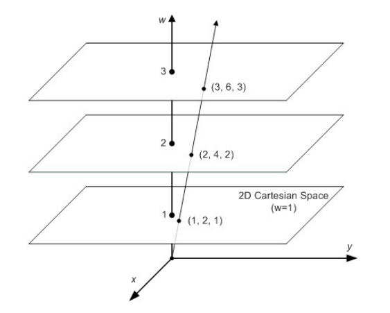
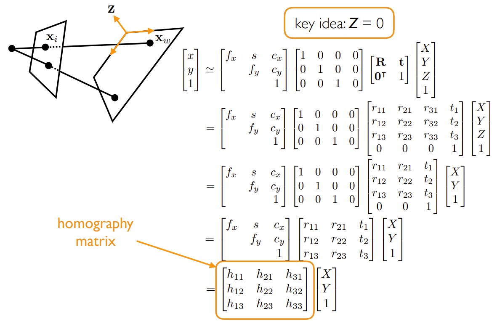
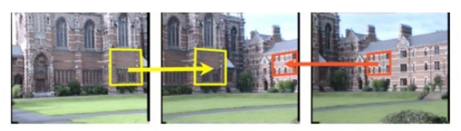
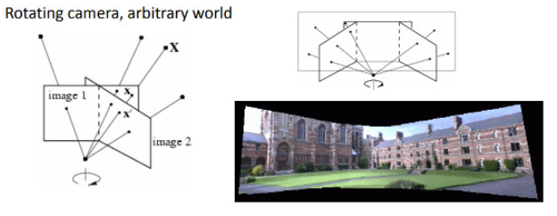
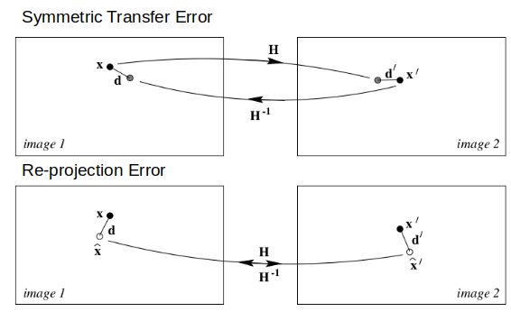

# Homography

## Homogeneous coordinates

Mapping between homogeneous coordinates and Cartesian's is about an added scaling factor $w$. Points in homogeneous coordinates given the same $(x,y)$ but a different scaling factor $w$ represent a direction. 

$$
\begin{align*}
\text{Homogeneous} & \quad\space\space\space  \text{Cartesian} \\\\
(x,y,w) & \Leftrightarrow (\frac{x}{w}, \frac{y}{w}) \\\\
(1,2,1) & \Leftrightarrow (\frac{1}{1}, \frac{2}{1}) = (1,2) \\\\
(2,4,2) & \Leftrightarrow (\frac{2}{2}, \frac{4}{2}) = (\frac{1}{1}, \frac{2}{1}) = (1,2) \\\\
(3,6,3) & \Leftrightarrow (\frac{3}{3}, \frac{6}{3}) = (\frac{1}{1}, \frac{2}{1}) = (1,2)
\end{align*}
$$


<div style="display: flex; justify-content: center;">
      
</div>
</br>

By setting $w=1$, we have homogeneous coordinate $(x,y,1)$ and its Cartesian representation $(x,y)$

## Homography

A homography is an isomorphism of projective spaces, or the transformation between two camera image planes: $\mathbf{x}_2 \sim H \mathbf{x}_1$

Define $\mathbf{x}_1=(x_1,y_1,w_1)$ as an image point on the first camera view and $\mathbf{x}_2=(x_2,y_2,w_2)$ on the second camera view. $\mathbf{x}_1$ corresponds to $\mathbf{x}_2$, describing the same real world object point.

Define a transform matrix $H$ that maps this projective relationship, there is (in homogeneous coordinates)

$$
\mathbf{x}_2=H \mathbf{x}_1
$$

where

$$
H=
\begin{bmatrix}
    h_{11} & h_{12} & h_{13} \\\\
    h_{21} & h_{22} & h_{23} \\\\
    h_{31} & h_{32} & h_{33} \\\\
\end{bmatrix}
$$

Removed the scaling factors $w$ and $w'$, there is

$$
\begin{bmatrix}
    x_2 \\\\
    y_2 \\\\
    w_2
\end{bmatrix}=
\begin{bmatrix}
    h_{11} & h_{12} & h_{13} \\\\
    h_{21} & h_{22} & h_{23} \\\\
    h_{31} & h_{32} & h_{33} \\\\
\end{bmatrix}
\begin{bmatrix}
    x_1 \\\\
    y_1 \\\\
    w_1
\end{bmatrix}
$$

where $h_{33}$ is a scaling factor that does not impact the expressions of $x_2$ and $y_2$, so that it can be set to $h_{33}=1$.

The Degree of Freedom (DoF) is $8$ for homography matrix $H$.

Set $w_1=1$ (easy for computation defining $w_1$ ) and ignore $w_2$ (do not need to compute $w_2$). $x_2'=\frac{x_2}{w_2}, y_2'=\frac{y_2}{w_2}$:

$$
x_2'=
\frac{h_{11}x_1+h_{12}y_1+h_{13}}{h_{31}x_1+h_{32}y_1+h_{33}} \\\\
y_2'=
\frac{h_{21}x_1+h_{22}y_1+h_{23}}{h_{31}x_1+h_{32}y_1+h_{33}}
$$

### Least squares problem to search for $H$

Given the above $x_2'$ and $y_2'$ expressions, we have

$$
\mathbf{a}_x^\text{T} \mathbf{h} = \mathbf{0} \\\\
\mathbf{a}_y^\text{T} \mathbf{h} = \mathbf{0}
$$

where

$$
\begin{align*}
\mathbf{h}&=
(h_{11}, h_{12}, h_{13}, h_{21}, h_{22}, h_{23}, h_{31}, h_{32}, h_{33})^\text{T} \\\\
\mathbf{a}_x &=
(-x_1, -y_1, -1, 0, 0, 0, x_2'x_1, x_2'y_1, x_2')^\text{T} \\\\
\mathbf{a}_y &=
(0, 0, 0, -x_1, -y_1, -1, y_2'y_1, y_2'x_1, y_2')^\text{T}
\end{align*}
$$

Given $n$ points to compute

$$
A \mathbf{h} = \mathbf{0}
$$

where

$$
A=
\begin{bmatrix}
    \mathbf{a}_{x_1}^\text{T} \\\\
    \mathbf{a}_{y_1}^\text{T} \\\\
    \vdots \\\\
    \mathbf{a}_{x_n}^\text{T} \\\\
    \mathbf{a}_{x_n}^\text{T}
\end{bmatrix}
$$

### Least squares solutions

* Solution 1: SVD

$$
A=U \Sigma V^\text{T}=\sum^9_{i=1}\sigma_i \mathbf{u}_i\mathbf{v}_i^\text{T}
$$

Since solution $\mathbf{h}$ is over-determined and Dof for $H$ is $8$, the smallest $\sigma_i$ represents the residual. The other 8 homography entries $h_{ij}$ are equal to their corresponding $\sigma_i$.

* Solution 2: Derivative

The objective function for minimization problem is

$$
\begin{align*}
f(\mathbf{h}) &= \frac{1}{2} (A \mathbf{h} - \mathbf{0})^\text{T} (A \mathbf{h} - \mathbf{0})
\\\\ &=
\frac{1}{2} (A \mathbf{h})^\text{T} (A \mathbf{h})
\\\\ &=
\frac{1}{2} \mathbf{h}^\text{T} A^\text{T} A \mathbf{h}
\end{align*}
$$

whose derivative is

$$
\begin{align*}
\frac{df}{d\mathbf{h}} &= 
\frac{1}{2} (A^\text{T} A + (A^\text{T} A)^\text{T}) \mathbf{h}
\\\\ &= 
A^\text{T} A \mathbf{h}
\\\\ &=
0
\end{align*}
$$

Eigen-decomposition of $A^\text{T} A$ should have 8 non-zero eigenvalues, same as the result from SVD. 

## Derivation

In practice, we assume real world points on the $z=0$ plane, that is, camera plane and real world plane are parallel to each other.

$\begin{bmatrix}\mathbf{R} & \mathbf{t} \\\\ \mathbf{0}^\top & 1 \end{bmatrix}$ is the rotation and translation operation from one camera view to the second.

<div style="display: flex; justify-content: center;">
      
</div>
</br>


### Image panorama application example

Panorama application example shows that $\mathbf{x}, \mathbf{x}' \in \mathbf{X}$ are on the same projective line, captured by two camera images $Image 1$ and $Image 2$. $\mathbf{x}$ and $\mathbf{x}'$ are mapped by a homography matrix $H$.

<div style="display: flex; justify-content: center;">
      
</div>
</br>
<div style="display: flex; justify-content: center;">
      
</div>
</br>

## Homography vs Fundamental matrix

Both are used to find correspondence points between two camera views, but homography is a special case where all points must be planar ($z=0$), camera views move by rotation.

Given two vectors of points from two images `vP1` and `vP2`, compute the fundamental matrix $F$ and homography matrix $H$ such as below.

### Fundamental Matrix $F$

Given $n$ matching points from the left and right images, compute the below equation.

$$
\underbrace{\begin{bmatrix}
    u_1'u_1 & u_1'v_1 & u_1' & v_1'v_1 & v_1'u_1 & v_1' & u_1 & v_1 & 1 \\\\
    u_2'u_2 & u_2'v_2 & u_2' & v_2'v_2 & v_2'u_2 & v_2' & u_2 & v_2 & 1 \\\\
    \vdots & \vdots &\vdots &\vdots &\vdots &\vdots &\vdots &\vdots &\vdots \\\\
    u_8'u_8 & u_8'v_8 & u_8' & v_8'v_8 & v_8'u_8 & v_8' & u_8 & v_8 & 1 \\\\
    \vdots & \vdots &\vdots &\vdots &\vdots &\vdots &\vdots &\vdots &\vdots \\\\
    u_n'u_n & u_n'v_n & u_n' & v_n'v_n & v_n'u_n & v_n' & u_n & v_n & 1 \\\\
\end{bmatrix}}_{:= A}
\begin{bmatrix}
    f_1 \\\\
    f_2 \\\\
    f_3 \\\\
    f_4 \\\\
    f_5 \\\\
    f_6 \\\\
    f_7 \\\\
    f_8 \\\\
    f_9 \\\\
\end{bmatrix}=0
$$

In the below implementation, first perform SVD decomposition of $A$, By Rayleigh Quotient theory, the smallest eigenvalue $\lambda_{\min}$ corresponding eigenvector `vt.row(8)` is the least squares solution.

By reshaping to `vt.row(8).reshape(0, 3);`, then, the $F_{\text{pre}} \in \mathbb{R}^{3 \times 3}$ is decomposed again by SVD, and the $\lambda_{\min}=0$.

Finally, the fundamental matrix is recomposed by $F = U \Sigma V^\text{T}$ implemented as the code `u * cv::Mat::diag(w) * vt;`.

```cpp
cv::Mat computeF21(const std::vector<cv::Point2f> &vP1,const std::vector<cv::Point2f> &vP2)
{
    const int N = vP1.size();

    cv::Mat A(N,9,CV_32F);

    for(int i=0; i<N; i++)
    {
        const float u1 = vP1[i].x;
        const float v1 = vP1[i].y;
        const float u2 = vP2[i].x;
        const float v2 = vP2[i].y;

        A.at<float>(i,0) = u2*u1;
        A.at<float>(i,1) = u2*v1;
        A.at<float>(i,2) = u2;
        A.at<float>(i,3) = v2*u1;
        A.at<float>(i,4) = v2*v1;
        A.at<float>(i,5) = v2;
        A.at<float>(i,6) = u1;
        A.at<float>(i,7) = v1;
        A.at<float>(i,8) = 1;
    }

    cv::Mat u,w,vt;

    // void SVDecomp(
    // 	InputArray^ src, 
    // 	OutputArray^ w, 
    // 	OutputArray^ u, 
    // 	OutputArray^ vt, 
    // 	SVD::Flags flags = SVD::Flags::None
    // )
    // * src
    // Type: cv::InputArray
    // decomposed matrix. The depth has to be CV_32F or CV_64F.
    // * w
    // Type: cv::OutputArray
    // calculated singular values
    // * u
    // Type: cv::OutputArray
    // calculated left singular vectors
    // * vt
    // Type: cv::OutputArray
    // transposed matrix of right singular vectors
    // * flags (Optional)
    // Type: cv.SVD.Flags
    // peration flags - see SVD::Flags.

    cv::SVDecomp(A,w,u,vt,cv::SVD::MODIFY_A | cv::SVD::FULL_UV);

    cv::Mat Fpre = vt.row(8).reshape(0, 3);

    cv::SVDecomp(Fpre,w,u,vt,cv::SVD::MODIFY_A | cv::SVD::FULL_UV);

    w.at<float>(2)=0;

    return  u * cv::Mat::diag(w) * vt;
}
```

Alternatively, in OpenCV, there is `findFundamentalMat(...)`.
```cpp
Mat cv::findFundamentalMat	(	InputArray 	points1,
                              InputArray 	points2,
                              OutputArray 	mask,
                              int 	method = FM_RANSAC,
                              double 	ransacReprojThreshold = 3.,
                              double 	confidence = 0.99 
                              )	
```

### Homography $H$

Given $n$ points to compute 

$$
\begin{bmatrix}
    \mathbf{a}_{x_1}^\text{T} \\\\
    \mathbf{a}_{y_1}^\text{T} \\\\
    \vdots \\\\
    \mathbf{a}_{x_n}^\text{T} \\\\
    \mathbf{a}_{x_n}^\text{T}
\end{bmatrix}
\begin{bmatrix}
    h_{11} \\\\ h_{12} \\\\ h_{13} \\\\ h_{21} \\\\ h_{22} \\\\ h_{23} \\\\ h_{31} \\\\ h_{32} \\\\ h_{33}
\end{bmatrix}= \mathbf{0}
$$

where

$$
\begin{align*}
\mathbf{a}_x &=
[-x_1, -y_1, -1, 0, 0, 0, x_2'x_1, x_2'y_1, x_2']^\text{T} \\\\
\mathbf{a}_y &=
[0, 0, 0, -x_1, -y_1, -1, y_2'y_1, y_2'x_1, y_2']^\text{T}    
\end{align*}
$$

```cpp
cv::Mat Initializer::ComputeH21(const vector<cv::Point2f> &vP1, const vector<cv::Point2f> &vP2)
{
    const int N = vP1.size();

    cv::Mat A(2*N,9,CV_32F);

    for(int i=0; i<N; i++)
    {
        const float u1 = vP1[i].x;
        const float v1 = vP1[i].y;
        const float u2 = vP2[i].x;
        const float v2 = vP2[i].y;

        A.at<float>(2*i,0) = 0.0;
        A.at<float>(2*i,1) = 0.0;
        A.at<float>(2*i,2) = 0.0;
        A.at<float>(2*i,3) = -u1;
        A.at<float>(2*i,4) = -v1;
        A.at<float>(2*i,5) = -1;
        A.at<float>(2*i,6) = v2*u1;
        A.at<float>(2*i,7) = v2*v1;
        A.at<float>(2*i,8) = v2;

        A.at<float>(2*i+1,0) = u1;
        A.at<float>(2*i+1,1) = v1;
        A.at<float>(2*i+1,2) = 1;
        A.at<float>(2*i+1,3) = 0.0;
        A.at<float>(2*i+1,4) = 0.0;
        A.at<float>(2*i+1,5) = 0.0;
        A.at<float>(2*i+1,6) = -u2*u1;
        A.at<float>(2*i+1,7) = -u2*v1;
        A.at<float>(2*i+1,8) = -u2;

    }

    cv::Mat u,w,vt;

    cv::SVDecomp(A,w,u,vt,cv::SVD::MODIFY_A | cv::SVD::FULL_UV);

    return vt.row(8).reshape(0, 3);
}
```

Alternatively, in OpenCV, there is `findHomography(...)`.
```cpp

Mat cv::findHomography	(	InputArray 	srcPoints,
                            InputArray 	dstPoints,
                            int 	method = 0,
                            double 	ransacReprojThreshold = 3,
                            OutputArray 	mask = noArray(),
                            const int 	maxIters = 2000,
                            const double 	confidence = 0.995 
                            )	
```

## Symmetric Transfer Error vs Reprojection Error

$d( \space . \space, \space . \space )$ is the Euclidean distance between two matches. $H$ is the homography transform.

<div style="display: flex; justify-content: center;">
      
</div>
</br>

* Symmetric Transfer Error

Symmetric Transfer Error measures how accurate is two matches transferring from one image to another by $H$.

$$
H^* = 
\min_{H} \sum_{i}
d(\mathbf{x}_i, H^{-1}\mathbf{x}')^2
+
d(\mathbf{x}'_i, H\mathbf{x})^2
$$


* Reprojection Error

The *reprojection error* measures how close is between an observation $\mathbf{x}$ and an estimate $\hat{\mathbf{x}}$. 
First the error between the observation and the estimate is computed, 
then after applying homography $H$, the error of the correspondence point $\mathbf{x}'$'s observation and estimate is computed.

$$
H^* = 
\min_{H} \sum_{i}
d(\mathbf{x}_i, \hat{\mathbf{x}}_i)^2
+
d(\mathbf{x}'_i, \hat{\mathbf{x}}'_i)^2
$$
