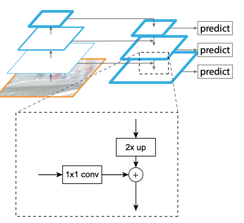
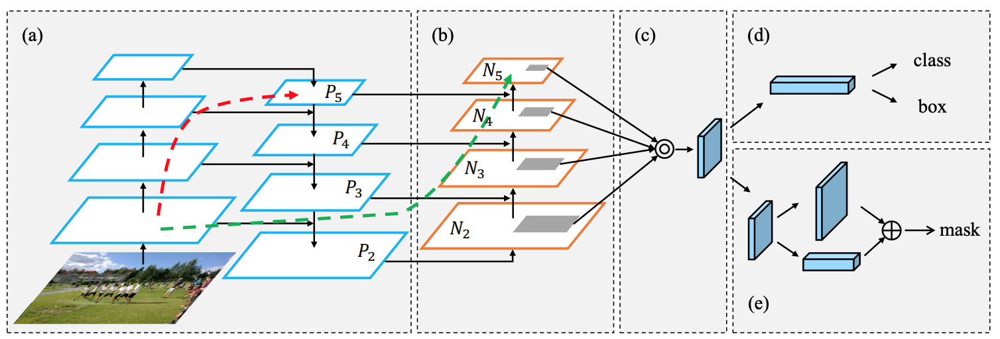
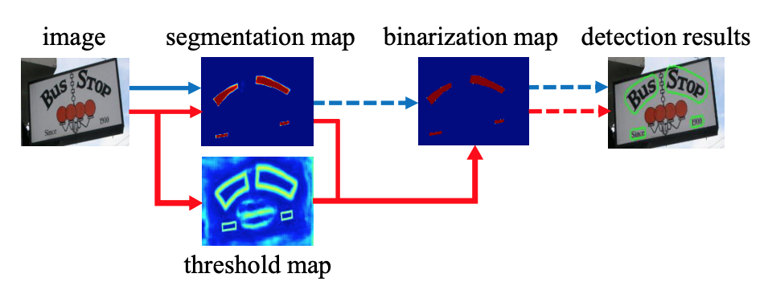
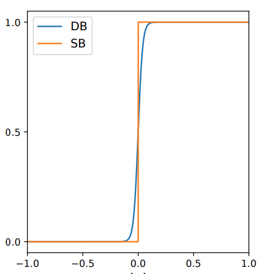
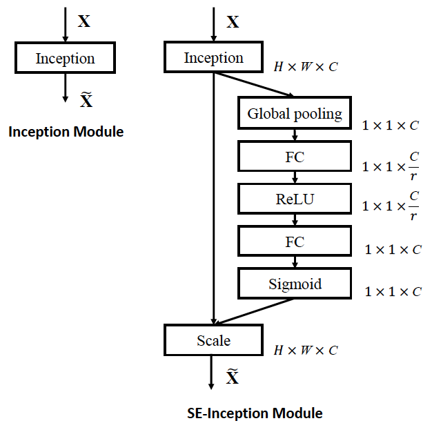
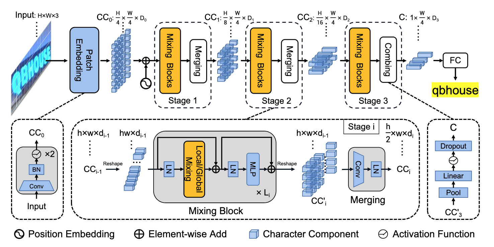
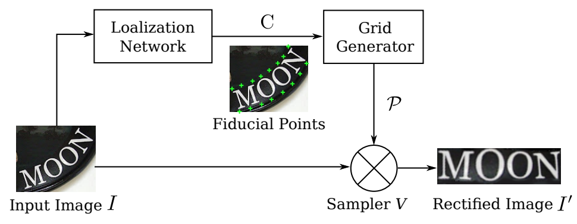
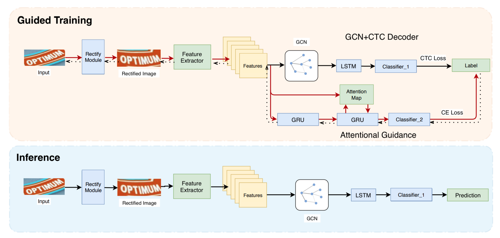
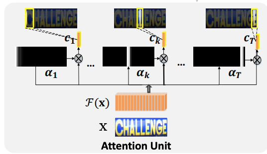

# Paddle OCR (Optical Character Recognition)

Paddle is Baidu developed deep learning framework.
Paddle OCR is Baidu implementation of OCR task, characterized by light weight and high accuracy.

By Dec 2024, Paddle OCR v3 is the latest implementation.

Reference:

* https://github.com/PaddlePaddle/PaddleOCR/blob/release/2.5/doc/doc_en/PP-OCRv3_introduction_en.md
* https://zhuanlan.zhihu.com/p/511564666
* https://arxiv.org/pdf/2205.00159

In summary, there are two major tasks:

* Text Detection (segmentation by bounding box contained text)
* Text Recognition (visual to text)

## LK-PAN: Large Kernel Path Aggregation Network

LK-PAN (Large Kernel PAN) is a lightweight PAN (Path Aggregation Network) for instance segmentation aiming to predict class label and pixelwise instance mask to localize varying numbers of instances presented in images.

Reference:

* https://arxiv.org/pdf/2206.03001
* https://arxiv.org/pdf/1803.01534

### Inspiration/motivation: Feature Pyramid Network (FPN)

Reference:

* https://arxiv.org/pdf/1612.03144

Pyramid refers to various image sizes by up/down-sampling so that convolution kernels can capture different scale visual features.
It makes small feature proposals assigned to low feature levels and
large proposals to higher ones.

FPN has two pyramids:

* Bottom-up pathway: a feed-forward ConvNet with a scaling step of $2$, where each layer's outputs are stored for feature reference (lateral connection to latter top-down pathway)
* Top-down pathway and lateral connections: top-down pathway hallucinates higher resolution features by up-sampling spatially coarser, but semantically stronger, feature maps from higher pyramid levels.

"Hallucination" means that higher layer outputs are "guessed" by up-sampling （e.g., bi-linear interpolation） for the interpolated pixels are not contained strong semantics.
The guess/up-sampling is corrected by lateral connection.

      

 

where the lateral connection on the layer $C_l$ is 

$$
C^{\text{top-down}}_l=\text{Upsample}(C^{\text{top-down}}\_{l+1}) + \text{Conv}\_{1 \times 1}(C^{\text{bottom-up}}\_{l})
$$

The $+$ is element-wise addition for the up-sampled $l+1$-th layer has the same image size as the $l$-th layer's.

FPN uses ResNet (basic block) as the backbone (assumed $x$ is the original image input)

A basic residual block contains

* $3 \times 3$ Convolution Layers.
* Batch Normalization (BN) and ReLU activation.
* Shortcut (residual) connections to mitigate the vanishing gradient problem.

$$
F(x, W) = \underbrace{\text{ReLU}(\text{BN}(\text{Cov}\_{3 \times 3}}\_{\text{the }l_{+1}\text{-th layer output}}(
    \underbrace{\text{ReLU}(\text{BN}(\text{Cov}\_{3 \times 3}(x)))}\_{\text{the }l\text{-th layer output}}))) + x
$$

|Feature Level|Stage|Resolution ($H \times W$)|Output Channels|Sampling|
|-|-|-|-|-|
|$C_1$|Initial Conv + Pooling|$\frac{1}{4} \times x$|64|2x down-sampling|
|$C_2$|conv2_x|$\frac{1}{4} \times x$|256|no down-sampling|
|$C_3$|conv3_x|$\frac{1}{8} \times x$|512|2x down-sampling|
|$C_4$|conv4_x|$\frac{1}{16} \times x$|1024|2x down-sampling|
|$C_5$|conv5_x|$\frac{1}{32} \times x$|2048|2x down-sampling|

### The LK-PAN has below enhancements based on FPN

(a) FPN backbone
(b) Bottom-up path augmentation
(c) Adaptive feature pooling
(d) and (e) Box branch and Fully-connected fusion

      

 

#### Bottom-up Path Augmentation

Besides the FPN existing lateral connection, LK-PAN added additional lateral connections in the bottom-up process.

This augmentation works for the layers $\{C_2, C_3, C_4, C_5\}$, or denoted as $\{P_2, P_3, P_4, P_5\}$ in KL-PAN.
They are the same such that $C_l=P_l$.

Let $\{N_2, N_3, N_4, N_5\}$ be the newly generated feature maps in KL-PAN corresponding to $\{P_2, P_3, P_4, P_5\}$.

The $l+1$-th layer feature maps in KL-PAN are generated by

$$
N_{l+1}=\text{Conv}\_{3 \times 3}\big(\text{Conv}\_{3 \times 3}(N_l, \text{stride}=2) + P_{l+1}\big)
$$

#### Adaptive Feature Pooling

It is a simple component to aggregate features from all feature levels for each proposal.

ROIAlign is used to pool feature grids from each level.
Then a fusion operation (element-wise max or sum) is utilized to fuse feature grids from different levels.

Up-sampling (e.g., by bi-linear interpolation) is used to align image scales.

#### Box Branch and Fully-Connected Fusion

LK-PAN referenced Mask R-CNN and proposed some customization.

## DBNet (Differentiable Binarization Net)

DBNet performs binarization process in a segmentation network.
Optimized along with a Differentiable Binarization (DB) module, a segmentation network can adaptively set the thresholds for binarization, which not only simplifies the post-processing but also enhances the performance of text detection.

Reference:

* https://github.com/MhLiao/DB
* https://arxiv.org/pdf/1911.08947
* https://arxiv.org/pdf/2202.10304

Illustrated in below, DBNet is basically an enhancement (red flow) to segmentation so that the areas of interest can be more likely got picked up.

      

 

Given a pixel $p_{i,j}$ on an image $\mathbb{R}^{H \times W}$, standard binarization is simply a step function returning a value either $0$ or $1$ conditioned on a threshold $t$:

$$
p_{i,j} = \begin{cases}
  1 & \text{if } p_{i,j} < t, \\\\
  0 & \text{if } \text{otherwise}
\end{cases}
$$

This step function is not differentiable hence not trainable.
The static threshold $t$ is applied to global image $\mathbb{R}^{H \times W}$ rather than discriminative between local image areas.

DBNet proposes a novel binarization function

$$
\hat{p}\_{i,j} =
\frac{1}{1+e^{-k(p_{i,j}-t_{i,j})}}
$$

where $t_{i,j}$ is the adaptive threshold map learned from the network; $k$ indicates the amplifying factor. $k$ is set to $50$ empirically.

The final result is as below Standard Binirization (SB) vs Differentiable Binirization (DB).

      

 

## Deep Mutual Learning (DML)

Deep Mutual Learning (DML) is for model distillation to transfer from a powerful large network or ensemble to a small network.

Reference: https://arxiv.org/pdf/1706.00384

Key advantage is that DML does not require a pre-trained, fixed teacher model, but allow for two or multiple models learning from each other.

Given two models $\Theta_1$ and $\Theta_2$ for multi-class prediction $y_i\in\{1,2,3,...,M\}$ for a set of sample labels $Y=\{y_i\}^N_{i=1}$, suppose the prediction is by softmax such that

$$
p_1^m(\mathbf{x}\_i)=\frac{\exp(z_1^m)}{\sum^M_{m=1} \exp(z_1^m)} \qquad
p_2^m(\mathbf{x}\_i)=\frac{\exp(z_2^m)}{\sum^M_{m=1} \exp(z_2^m)}
$$

For prediction vs truth labels, cross entropy error is used.

$$
L\_{C_1} = -\sum_{i=1}^N \sum_{m=1}^M t_i(y_i,m) \log\big(p_1^m(\mathbf{x}\_i)\big) \qquad
L\_{C_2} = -\sum_{i=1}^N \sum_{m=1}^M t_i(y_i,m) \log\big(p_2^m(\mathbf{x}\_i)\big)
$$

where $t_i(y_i,m)=\begin{cases} 1 & y_i=m \\\\ 0 & y_i\ne m \end{cases}$ is an indicator function.

To align two models, Kullback Leibler (KL) Divergence ($D_{KL}(P || Q)$ says how prediction probability distribution $Q$ is different from actual probability distribution $P$) is used

$$
\begin{align*}
    \text{From } \mathbf{p}_1 \text{ to } \mathbf{p}_2 \qquad
    D_{KL}(\mathbf{p}_2||\mathbf{p}_1)=\sum_{i=1}^N \sum_{m=1}^M p_2^m(\mathbf{x}\_i) \log\frac{p_2^m(\mathbf{x}\_i)}{p_1^m(\mathbf{x}\_i)} \\\\
    \text{From } \mathbf{p}_2 \text{ to } \mathbf{p}_1 \qquad
    D_{KL}(\mathbf{p}_1||\mathbf{p}_2)=\sum_{i=1}^N \sum_{m=1}^M p_1^m(\mathbf{x}\_i) \log\frac{p_1^m(\mathbf{x}\_i)}{p_2^m(\mathbf{x}\_i)}
\end{align*}
$$

The loss is defined as **predictions vs truth labels** plus **two model prediction divergence**.
The key novelty lies on

* $D_{KL}(\mathbf{p}\_i||\mathbf{p}_j)$ that it is about the two model prediction probabilities instead of model prediction against the truth label probability distribution.
* In traditional model distillation, there is a fixed teacher model and a student model that only the student model sees parameter updates/learning, while the teacher model is static; in contrast to mutual learning that both models see parameter updates learning from each other.

$$
\begin{align*}
    L\_{\Theta_1} &= L\_{C_1} + D_{KL}(\mathbf{p}_2||\mathbf{p}_1) \\\\
    L\_{\Theta_2} &= L\_{C_2} + D_{KL}(\mathbf{p}_1||\mathbf{p}_2)
\end{align*}
$$

### In PaddleOCR

DML can be applied to train multiple detection/recognition models collaboratively, enhancing their accuracy and robustness.

## RSE-FPN (Residual Squeeze-and-Excitation Feature Pyramid Network)

RSE-FPN is inspired by

* Feature Pyramid Network (FPN):

Feature Pyramid Networks for Object Detection

Reference: https://arxiv.org/abs/1612.03144

* Squeeze-and-Excitation (SE) Networks:

Squeeze-and-Excitation Networks

Reference: https://arxiv.org/abs/1709.01507

* Residual Networks (ResNet):

Deep Residual Learning for Image Recognition

Reference: https://arxiv.org/abs/1512.03385

### Squeeze-and-Excitation (SE) Networks

The *Squeeze-and-Excitation* (SE) block adaptively recalibrates channel-wise feature responses by explicitly modelling inter-dependencies between channels.

Inspiration: for a typical convolution operation over an image $X$ by a kernel filter $F$ such that: assumed filter size $K_M \times K_N$; there are $C_{in}$ input channels, for a spatial point at $(i,j)$, there is

$$
\tilde{x}\_{i,j} = \sum_{m}^{K_M} \sum_{n}^{K_N} \sum_{c}^{C_{in}} x_{i+m, j+n, c} \cdot F_{m,n}
$$

The output feature map $\tilde{x}\_{i,j}$ is a scalar value computed across all-channel as in $\sum_{c}^{C_{in}}$, hence no discrimination between channels.

SE exploits the inter-channel dependency info by global pooling each channel to a statistic, then use two dense networks to encode channel-dependent statistics; the result is then used to scale original input $X$ per channel.

Basically,

* it computes a mean statistic $z_c$ (global pooling by average) per channel from source image $X$

$$
z_c = \frac{1}{H \times W} \sum^H_{i=1} \sum^W_{j=1} {x}_c(i,j)
$$

In total, there is $\mathbf{z}\in\mathbb{R}^{C}$.

* adaptive calibration is done via a ReLU (denoted as $\delta$) and sigmoid (denoted as $\sigma$) gating mechanism to linear transformations

$$
\mathbf{s} = \sigma(W_2 \delta(W_1 \mathbf{z}))
$$

where $W_1 \in \mathbb{R}^{\frac{C}{r}\times C}$ and $W_2 \in \mathbb{R}^{C \times \frac{C}{r}}$, inside which $r$ is called linear transformation *reduction ratio* to reduce dense network output size.

* scale the input $X$ by the adaptive calibration score $\mathbf{s}$

$$
\tilde{{X}} = \mathbf{s} X
$$

      

 

## SVTR

SVTR (Scene Text Recognition with a Single Visual Model) proposed an efficient unified arch for text recognition.

Reference:

https://arxiv.org/pdf/2205.00159
https://arxiv.org/abs/2205.00160

Traditional text recognition pipelines consist of three stages:

1. Visual Feature Extraction: Extracts spatial features from the input image.
2. Sequence Modeling: Captures contextual dependencies (e.g., using RNNs or transformers).
3. Prediction: Decodes the sequence into text (e.g., using CTC or attention-based decoders).

These stages are often designed independently, leading to redundant computations and suboptimal feature representations.
SVTR unifies these stages into a single visual model.

      

 

### Input Pre-processing by Distortion Rectification

It rectifies distorted text image to horizontal text.

Reference:

* https://arxiv.org/pdf/1603.03915
* https://arxiv.org/pdf/2103.06495

Process

* Predicts a set of *fiducial points* via its localization network
* inside the grid generator, calculate the *Thin-Plate-Spline* (TPS) transformation parameters from the fiducial points, and generates a sampling grid on image $I$
* The sampler takes both the grid and the input image, and produces a rectified image $I'$ by sampling on the grid points.

      

 

### Patch Embedding

Patches refer to segmentation of the input image $X \in \mathbb{R}^{H \times W \times 3}$ to a num of $4 \times 4$ segmented image patches $X_{CC_0} \in \mathbb{R}^{\frac{H}{4} \times \frac{W}{4} \times D_0}$.

The embedding on the $4 \times 4$ image patches is generated by two consecutive convolutions and batch normalizations.

1. $3 \times 3 \text{ Conv}$ with stride of $2$
2. Batch Normalization
3. $3 \times 3 \text{ Conv}$ with stride of $2$
4. Batch Normalization

### The backbone: global/local Mixing

At the $i$-th layer, go through this process until the output layer

1. Reshape $\mathbb{R}^{h \times w \times d_{i-1}}$ to $\mathbb{R}^{h \cdot w \times d_{i-1}}$
2. Layer Normalization
3. Attention with added residual $\oplus$: $\text{Softmax}\Big(\frac{Q K^{\top}}{\sqrt{d}}\Big)V$
4. Layer Normalization
5. Dense network with added residual $\oplus$
6. Reshape $\mathbb{R}^{h \cdot w \times d_{i-1}}$ back to $\mathbb{R}^{h \times w \times d_{i-1}}$
7. Merge by $3 \times 3 \text{ Conv}$ with stride of $2$ (this gives $\mathbb{R}^{\frac{h}{2} \times w \times d_{i}}$)
8. Layer Normalization

#### The attention

The global/local mixing block is basically an attention such that

$$
\text{Softmax}\Big(\frac{Q K^{\top}}{\sqrt{d}}\Big)V
$$

The attention is multi-head self-attention such that

$$
Q = X W_Q,
\qquad
K = X W_K,
\qquad
V = X W_V,
\qquad
$$

where $X \in \mathbb{R}^{h \cdot w \times d_{i-1}}$ is the reshaped input.

#### Global/local Mixing

* Global mixing: the input $X$ refers to the whole input
* Local mixing: the input is a sliding window (empirically set to $7 \times 11$)

In SVTR, the blocks are recurrently applied many times in each stage for comprehensive feature extraction.

#### Reshape to $\mathbb{R}^{\frac{h}{2} \times w \times d_{i}}$

Typically, most image text appears horizontally or near horizontally, hence by halving the height to $\frac{h}{2}$, the result feature map should still retain text/char info.

### Output: Combining and Prediction

It pools the height dimension to 1 at first, followed by a fully-connected layer, non-linear activation and dropout.

The output labels are $37$ for English chars and $6625$ for Chinese.

### Config

||$[D_0, D_1, D_2]$|$[L_0, L_1, L_2]$|Attention Heads|$D_3$|Global/Local Mixing Permutation|
|-|-|-|-|-|-|
|SVTR-T (Tiny)|[64,128,256]|[3,6,3]|[2,4,8]|192|$[L]_6[G]_6$|
|SVTR-S (Small)|[96,192,256]|[3,6,6]|[3,6,8]|192|$[L]_8[G]_7$|
|SVTR-B (Base)|[128,256,384]|[3,6,9]|[4,8,12]|256|$[L]_8[G]_{10}$|
|SVTR-L (Large)|[192,256,512]|[3,9,9]|[6,8,16]|384|$[L]_{10}[G]_{11}$|

* Global/Local Mixing Permutation
For example, $[G]_6[L]_6$ means for each stage, six global mixing blocks are carried out at first, and then six local mixing blocks. They are placed in $[L_0, L_1, L_2]$.
* Attention head dimension: $32$.

## GTC: Attention guides CTC training strategy

Reference: https://arxiv.org/pdf/2002.01276

The attention guided training in this implementation means that in training for the label $y_t$ prediction, the previous truth label $y_{t-1}$ is added as well as attention in assistance.
Such assistance only exists in training and is removed in inference.

The main route (existed in both training and inference) is ResNet50 (feature extraction) -> GCN -> BiLSTM -> Prediction

      

 

### CTC (Connectionist Temporal Classification)

CTC is used to train models for sequence-to-sequence tasks where the input length $T$ and the output length $L$ differ, and the alignment is unknown.

Assume there are $T$ text truth labels,

* $\mathbf{x}^{1:T}=(\mathbf{x}_1, \mathbf{x}_2, ..., \mathbf{x}\_{T})$: Input vector sequence of length $T$ (e.g., features extracted from an image), in which $\mathbf{x}\_i\in\mathbb{R}^{D}$ is a $D$-dimensional feature vector that corresponds to a local region of an image through its corresponding receptive field.
* $\mathbf{y}=(y_1, y_2, ..., y_{L})$: Ground truth sequence of length $L$ (e.g., text labels), $y_i$ is the char label at the $i$ position.
* $\hat{\mathbf{y}}=(\hat{y}_1, \hat{y}_2, ..., \hat{y}\_{T})$ is the corresponding prediction form $\mathbf{x}\_i$ to a label in $\mathbf{y}$
* $\hat{\mathbf{y}}_p$ is one probability distribution/one alignment path for a truth sequence $\mathbf{y}$
* $\hat{Y}$: Set of all possible alignments (paths) for $\mathbf{y}$, including repetitions and blanks.

The CTC loss is

$$
\mathcal{L}\_{CTC} = -\ln \sum_{\hat{\mathbf{y}}_p\in \hat{Y}} P(\hat{\mathbf{y}}_p|\mathbf{x}^{1:T})
$$

where $P(\hat{\mathbf{y}}_p|\mathbf{x}^{1:T})=\prod_{t=1}^{T}p(\hat{y}_t|\mathbf{x}^{1:T})$

#### Alignment Ambiguity

For the number of feature vectors not likely equal to the number of truth labels $T \ne L$ as $\mathbf{x}\_i$ only covers partial vision feature of a character $y_i$, so that for one truth label $y_i$ there might be multiple $\mathbf{x}\_i$.
As a result CTC has alignment problems.

Besides, CTC introduces a blank token (denoted as $\emptyset$) to handle cases where input frames (e.g., image or audio features) outnumber the target sequence length.

This is problematic such that for example for "MOON", there are likely predictions

* $["M", "O", "O", "N"]$
* $["M", "O", "O", "O", "N"]$
* $["M", "O", "O", "O", "N", "N"]$
* $["M", \emptyset, "O", "O", "N"]$
* $["M", \emptyset, "O", \emptyset, "O", "N"]$
* $["M", \emptyset, "O", \emptyset, "O", \emptyset, "N"]$
* $["M", \emptyset, \emptyset, "O", \emptyset, "O", \emptyset, "N"]$

These alignments all correspond to the same output: "MOON".
in other words, $["M", "O", "O", "N"]$ is truth path $\mathbf{y}$, while others are $\hat{\mathbf{y}}\in \hat{Y}$.

### Attention Guidance

Attention guidance aims to mitigate the misalignment problem by *alignment attention* (what feature $\mathbf{x}\_i$ likely corresponds to what label $y_i$) applied on Gated Recurrent Unit (GRU) for $y_k$ prediction dependent on previous label $y_{k-1}$.

Here $y_i$ is a truth label at the $i$-th position of a text sequence, while $\hat{y}_k$ means recurrent sequence prediction at the time-step $k$.

Reference:

* https://arxiv.org/pdf/1508.04025
* https://arxiv.org/pdf/1603.03101
* https://openaccess.thecvf.com/content_CVPR_2019/papers/Zhang_Sequence-To-Sequence_Domain_Adaptation_Network_for_Robust_Text_Image_Recognition_CVPR_2019_paper.pdf

Let $\mathbf{s}_k$ be the hidden state of a Gated Recurrent Cell (GRU).
Given $\mathbf{x}\_i$ as the $i$-th feature vector, the alignment attention score $\tilde{h}\_{k,i}\in\mathbb{R}$ (not the LLM attention) is computed as follows:

$$
\begin{align*}
    \tilde{\mathbf{h}}\_{k,i} &= \tanh(W_c [\mathbf{s}\_{k-1}; \mathbf{x}\_i]) \\\\
    \tilde{h}\_{k,i} &= W_h \tilde{\mathbf{h}}\_{k,i}
\end{align*}
$$

where $[...]$ is concatenation.

The alignment attention is a $T$-step process, at time-step $k$, the representation of the most relevant part to character $y_k$ of encoding feature map $\mathbf{x}=F(X)$ is defined as a *context vector* $\mathbf{c}_k$.

      

 

The alignment attention weight $a_{k,i}\in\mathbb{R}$ is by normalizing the scores via softmax:

$$
a_{k,i}=\frac{\exp(\tilde{h}\_{k,i})}{\sum_{j=1}^T \exp(\tilde{h}\_{k,j})}
$$

Context vector $\mathbf{c}_k$ is alignment attention weighted vector

$$
\mathbf{c}_k=\sum^T_{i=1} a_{k,i}\mathbf{x}\_i
$$

The $\mathbf{c}_k$ is also termed *Glimpse vector* in computer vision that it learns to focus on specific parts of an input, often by "gathering glimpses" from different regions of an image or sequence.

The hidden state $\mathbf{s}_k$ is updated via the recurrent process of GRU:

$$
\mathbf{s}_k=GRU(\mathbf{y}\_{prev}, \mathbf{c}_k, \mathbf{s}\_{k-1})
$$

expressed as update gate ($\mathbf{z_t}$) and reset gate ($\mathbf{r_t}$):

$$
\begin{align*}
    \mathbf{z_t}&=\sigma(W_z\cdot[\mathbf{y}\_{prev}; \mathbf{c}_k; \mathbf{s}\_{k-1}]) \\\\
    \mathbf{r_t}&=\sigma(W_r\cdot[\mathbf{y}\_{prev}; \mathbf{c}_k; \mathbf{s}\_{k-1}])
\end{align*}
$$

where $\mathbf{y}\_{prev}$ is the embedding vector of the previous output $\hat{y}\_{k-1}$.
However, truth label ${y}\_{k-1}$ is used in training rather than just feeding $\hat{y}\_{k-1}$ as input.

Finally, the prediction is

$$
\hat{y}_k = \text{Softmax}(W_{s}^{\top}\mathbf{s}_k)
$$

### GCN + CTC Decoder

#### Graph Convolutional Network (GCN)

GCNs generalize the concept of convolutions from Euclidean data (like images) to graph data.
The core idea is that the features of a node can be updated by aggregating features from its neighbors.

For a graph $G=(V,E)$ with $N$ nodes, the GCN layer updates this layer hidden features $\mathbf{h}^{(l)}$.

$$
\mathbf{h}^{(l+1)}=\sigma(\tilde{A} \mathbf{h}^{(l)} W)
$$

where

* $\tilde{A}=D^{-\frac{1}{2}}(A+I)D^{-\frac{1}{2}}$ is the normalized adjacency matrix, in which $A$ is the adjacency matrix of the graph
* $\sigma(.)$ is an activation function
* $W$ is a learned weight matrix

#### GCN with Similarity and Distance Info

Given the feature map $\mathbf{x}^{1:T}$ from ResNet CNN, the adjacency matrix is learned by computing pairwise similarity between every two sequence slices:

$$
A_S(i,j)=\frac{\mathbf{c}\_i \cdot \mathbf{c}_j}{||\mathbf{c}\_i|| \space || \mathbf{c}_j ||}
$$

where $\mathbf{c}\_i$ is a linear transformation result of $\mathbf{x}\_i$.

In addition, a distance matrix is also used to constrain the similarity to focus on neighboring features.

$$
A_D(i,j)=\frac{\exp(-d_{ij}+\beta)}{\exp(-d_{ij}+\beta)+1}
$$

where $d_{ij}=|i-j|$ and $\beta$ is a scale factor.

By convolution $A_S$ over $A_D$

$$
\hat{\mathbf{x}}^{1:T}=(A_S * A_D) \mathbf{x}^{1:T} W_g
$$

The convolution gives that for a feature vector $\mathbf{x}\_i$, $A_{S,ij} * A_{D,ij}$ is large when the another feature vector $\mathbf{x}_j$ is both spatially-adjacent and embedding-similar.

The $\hat{\mathbf{x}}^{1:T}$ is then passed to the BiLSTM for sequence modelling.

$$
\text{logits}=\text{BiLSTM}(\hat{\mathbf{x}}^{1:T})W_c
$$

where $W_c$ is a weight matrix for classification.
BiLSTM with the hidden size of $512$.

The logits and truth label $\mathbf{y}$ are finally used to calculate CTC loss $\mathcal{L}\_{CTC}$ to train the GCN+CTC decoder.
