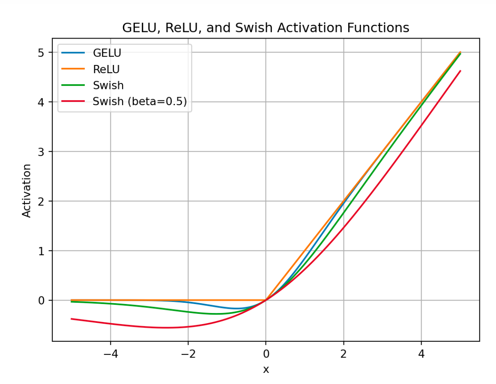
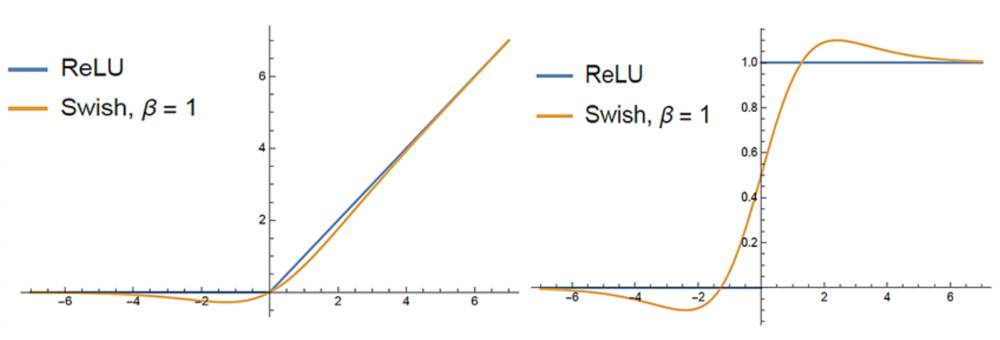

# Activation Functions

## sigmoid

$$
\text{sigmoid} (x) =
\frac{e^{x}}{e^x+1} =
\frac{1}{1+e^{-x}}
$$

$\text{sigmoid}$ maps input $(-\infty, +\infty)$ to output $(0,1)$. It is used to represent zero/full information flow. For example, in LSTM, it guards in/out/forget gates to permit data flow.

### Sigmoid Derivative

$$
\begin{align*}
  \frac{d}{d x} \text{sigmoid}(x) &=
  \frac{d}{d x} \Big( \frac{1}{1+e^{-x}} \Big) 
\\ &=
  \frac{d}{d x} ( {1+e^{-x}} )^{-1}
\\ &=
  -( {1+e^{-x}} )^{-2} (-e^{-x})
\\ &=
  \frac{e^{-x}}{({1+e^{-x}})^2}
\\ &=
  \frac{e^{-x}}{{1+e^{-x}}}   \frac{1}{{1+e^{-x}}}
\\ &=
  \frac{(e^{-x}+1)-1}{{1+e^{-x}}}   \frac{1}{{1+e^{-x}}}
\\ &=
  \Big( \frac{e^{-x}+1}{{1+e^{-x}}} - \frac{1}{{1+e^{-x}}} \Big) \frac{1}{{1+e^{-x}}}
\\ &=
  \Big( 1 - \frac{1}{{1+e^{-x}}} \Big) \frac{1}{{1+e^{-x}}}
\\ &=
  \sigma(x) \cdot \big( 1-\sigma(x) \big)
\end{align*}
$$

## Softmax

Defien a standard (unit) softmax function $\sigma: \mathbb{R}^n \rightarrow (0,1)^n$

$$
\sigma(\mathbf{z})_i=
\frac{e^{z_i}}{\sum^n\_{j=1}e^{z_j}}
$$

for $i=1,2,...,n$ and $\mathbf{z}=(z_1, z_2, ..., z_n)\in \mathbb{R}^n$

$softmax$ is often used in the final layer of a classifier network that outputs each class energy and in attention mechanism to normalize input energy.

Given one-hot encoded true labels $\mathbf{y}$, one forward pass of softmax is as below.

$$
\begin{align*}
    \hat{\mathbf{y}} &= \text{softmax}(\mathbf{z}) 
\\  \mathcal{L} &= - \mathbf{y}^{\top} \log \hat{\mathbf{y}}
\end{align*}
$$

### Softmax Derivative

Recall there is $\frac{\partial {\mathcal{L}}}{\partial \hat{y}\_{i}} \frac{\partial \hat{y}\_{i}}{\partial z_{i}} = \frac{1}{\hat{y}\_{i}} \frac{\partial \hat{y}\_{i}}{\partial z_{i}} = \frac{\partial }{\partial z_{t,j}} \Big( -\log \big( \underbrace{\text{softmax}({z}\_{i})}\_{\hat{y}\_{i}} \big) \Big)$,
so that by simply moving $\hat{y}\_{i}$ to the opposite side of the equal operator, there derives the derivative for $\text{softmax}$ such that

$$
\begin{align*}
  \frac{\partial \hat{y}\_{i}}{\partial z_{i}} &=
  \hat{y}\_{i} \frac{\partial }{\partial z_{t,j}} \Big( -\log \big( \underbrace{\text{softmax}({z}\_{i})}\_{\hat{y}\_{i}} \big) \Big) 
\\ &=
  \hat{y}\_{i} \Big( \underbrace{\frac{e^{z_{t,j}}}{\sum_i^n e^{z_{i}}}}\_{\hat{y}\_{j}} - \frac{\partial z_{i}}{\partial z_{t,j}} \Big)
\\ &=
    \left\{ \begin{array}{r}
        \hat{y}\_{i} (\hat{y}\_{j} - 1) \qquad i = j \\
        \hat{y}\_{i}\hat{y}\_{j} \qquad i \ne j
    \end{array}\right.
\end{align*}
$$

### Softmax Translation Invariance

Example: given $Z$ such as below, apply Softmax along Axis $-1$ (Last Axis):

$$
Z=\begin{bmatrix}
    1 & 2 & 3 \\
    4 & 5 & 6 \\
    7 & 8 & 9 \\
\end{bmatrix}
$$

For each row $i$:

$$
\text{softmax}(z_i)=\frac{e^{z_i}}{\sum^n\_{j=1}e^{z_{ij}}}
$$

that gives

|Input|Output|Explained|
|-|-|-|
|$[1,2,3]$|$[0.0900, 0.2447, 0.6652]$|$\frac{\exp(1)}{\exp(1)+\exp(2)+\exp(3)},\frac{\exp(2)}{\exp(1)+\exp(2)+\exp(3)},\frac{\exp(3)}{\exp(1)+\exp(2)+\exp(3)}$|
|$[4,5,6]$|$[0.0900, 0.2447, 0.6652]$|$\frac{\exp(4)}{\exp(4)+\exp(5)+\exp(6)},\frac{\exp(5)}{\exp(4)+\exp(5)+\exp(6)},\frac{\exp(6)}{\exp(4)+\exp(5)+\exp(6)}$|
|$[7,8,9]$|$[0.0900, 0.2447, 0.6652]$|$\frac{\exp(7)}{\exp(7)+\exp(8)+\exp(9)},\frac{\exp(7)}{\exp(8)+\exp(8)+\exp(9)},\frac{\exp(9)}{\exp(7)+\exp(8)+\exp(9)}$|

#### Softmax Translation Invariance Proof

The uniform output example (all results are identical as $[0.0900, 0.2447, 0.6652]$) is for that softmax function is invariant to adding the same constant $c$ to every input.

Consider

$$
z_i=z_i, \quad\text{and}\quad \tilde{z}\_i=z_i+c
$$

then

$$
s_i=\frac{\exp(z_i+c)}{\sum_k \exp(z_k+c)}=
\frac{\exp(z_i)\exp(c)}{\exp(c) \sum_k \exp(z_k)}=
\frac{\exp(z_i)}{\sum_k \exp(z_k)}
$$

### Softmax Output Range vs Input Distribution and Vector Similarity

Consider the softmax expression for $\mathbf{x}\_i, \mathbf{y}\_i \in \mathbb{R}^{1 \times d}$ for a total of $n$ samples, and study the $\mathbf{x}\_i, \mathbf{y}\_i$ distribution for the resulted $s_i$.
Here proves that, let $z_i=\mathbf{x}\_i^{\top}\mathbf{y}_j$, the optimal result of $\min\text{softmax}(z_i)$ is the uniform input $z_1=z_2=...=z_n=c$.

$$
s_i=\text{softmax}(\mathbf{x}\_i^{\top}\mathbf{y}_j)=
\frac{\exp(\mathbf{x}\_i^{\top}\mathbf{y}_j)}{\sum_k \exp(\mathbf{x}\_i^{\top}\mathbf{y}_k)}
$$

#### Result of Uniform Scores

For $z_1=z_2=...=z_n=c$, then for all $s_i$, there is this constant output.

$$
s_i=\frac{\exp(z_i)}{\sum_j^n \exp(z_j)}=
\frac{\exp(z_i)}{n \exp(z_j)}=\frac{1}{n}
$$

#### Result of Uneven Scores

Now assume one score $z_k$ is higher than the others $z_{j\ne k}$ by excess of $\delta>0$ such that $z_k=z_j+\delta$.
Assume the other $n-1$ scores have the same output, i.e., $z_{j\ne k}=c$.

Then the normalization constant becomes:

$$
\sum_{j=1}^n z_j=\exp(c+\delta)+(n-1)\exp(c)=\exp(c)\Big(\exp(\delta)+(n-1)\Big)
$$

Thus, for $z_k=z_j+\delta$, there is

$$
s_{k}=\frac{\exp(c+\delta)}{\sum_{j=1}^n z_j}=
\frac{\exp(c+\delta)}{\exp(c)\Big(\exp(\delta)+(n-1)\Big)}=
\frac{\exp(\delta)}{\exp(\delta)+(n-1)}
$$

For $\delta>0$, there is $\exp(\delta)>1$, and let $\exp(\delta)=\epsilon+1$, it is easy to prove that (for $\epsilon>0$ and $n\in\mathbb{Z}^{+}$)

$$
\frac{\exp(\delta)}{\exp(\delta)+(n-1)}=
\frac{1+\epsilon}{1+\epsilon+(n-1)}=
\frac{1+\epsilon}{\epsilon+n}\ge
\frac{1}{n}
$$

In conclusion, the uneven score has higher softmax values,
and the optimal result of $\min\text{softmax}(\mathbf{x}\_i^{\top}\mathbf{y}_j)$ is the uniform input $z_1=z_2=...=z_n=c$.

#### About Vector Similarity

Recall the property of softmax translation invariance, $\mathbf{x}\_i$ and $\mathbf{y}\_i$ can be different (have a small $z_i$) or similar (have a large $z_i$), the softmax value remains unchanged.
This means, regardless of $\mathbf{x}\_i$ and $\mathbf{y}\_i$ being similar or different, the important focus is that the distance $\mathbf{x}\_i^{\top}\mathbf{y}_j$ should keep the same to reach $z_1=z_2=...=z_n$.

## ReLU

$$
\text{relu} \space x =
\max(0, x)
$$

$\text{relu}$ retains a constant gradient regardless of the input $x$. For $sigmoid$, gradeint approaches to zero when $x \rightarrow +\infty$, however, for $relu$, gradient remain constant.

$sigmoid$ generates positive gradients despite $x<0$, which might wrongfully encourage weight updates, while $relu$ simply puts it zero.

$\text{relu}$ is easy in computation.

### Gaussian error linear unit  (GeLU)

$$
GeLU(x) = \frac{x}{2} \Big( 1 + \text{erf}\big( \frac{x}{\sqrt{2}} \big) \Big)
$$

where $\text{erf}(z)=\frac{2}{\sqrt{\pi}}\int^z_0 e^{-t^2} dt$ is called *Gauss error function*.

Python implementtaion: `cdf` is a normal cummulative distribution function.

```py
import math

def gelu(x):
    return [0.5 * z * (1 + math.tanh(math.sqrt(2 / np.pi) * (z + 0.044715 * math.pow(z, 3)))) for z in x]
```


### SwiGLU (Swish GeLU)

$$
\text{silu}(x) = 
x \cdot \sigma(\beta x)
$$
where $\beta$ is a coefficient default to $\beta = 1$, and $\cdot$ is a element-wise dot multiplication.
$\sigma(x)=\frac{e^{x}}{e^x+1}$ is a sigmoid function.

```py
import numpy as np

def sigmoid(x_elem):
  return 1/(1 + np.exp(-x_elem))
def silu(x, theda = 1.0):
    return [x_elem * sigmoid(theda *x_elem) for x_elem in x]
```

### Discussions

In comparison to ReLU, GeLU and SwiGLU have continuous (differentiable) on-zero values for $x \in (-\infty, 0)$ that have derivatives ().

The global minimum, where the derivative is zero, serves as a "soft floor" on the weights that acts as an implicit regularizer that inhibits the learning of weights of large magnitudes.

<div style="display: flex; justify-content: center;">
      
</div>
</br>

The funcs and derivatives of ReLU and SwiGLU.

It can see that ReLU's derivative is a step function either 0 or 1, while SwiGLU has one zero point ($\frac{\partial \space\text{SwiGLU}}{\partial z}|_{z=z_0}=0$) at $z_0 \in (-2, 0)$.
For $z=0$, the derivative $\frac{\partial \space\text{SwiGLU}}{\partial z}|_{z=0}$ is differentiable that sees significant changes even overshooting when $z \in (-4, -2)$ and $z \in (2, 4)$.

This design by SwiGLU amplifies error feedback when switching back and forth positive/negative from back-propagation, and treats error far away from $z=0$ similar as that of by ReLU.

<div style="display: flex; justify-content: center;">
      
</div>
</br>

## tanh

$$
\text{tanh} \space x =
\frac{e^{2x-1}}{e^{2x+1}} =
\frac{e^x - e^{-x}}{e^x + e^{-x}}
$$

$\text{tanh}$ maps input $(-\infty, +\infty)$ to output $(-1,1)$, that is good for features requiring both negative and positive gradients updating weights of neurons. 

$\text{tanh}$ is a good activation function to tackling vanishing gradient issues.

### tanh Derivative

$$
\begin{align*}
  \frac{d}{d x} \text{tanh}(x) &=
  \frac{d}{d x} \Big( \frac{e^x - e^{-x}}{e^x + e^{-x}} \Big)
\\ &=
  \frac{(e^x + e^{-x})(e^x + e^{-x}) - (e^x - e^{-x})(e^x - e^{-x})}{(e^x + e^{-x})^2}
\\ &=
  1 - \frac{(e^x - e^{-x})^2}{(e^x + e^{-x})^2}
\\ &=
  1 - \text{tanh}^2(x)
\end{align*}
$$