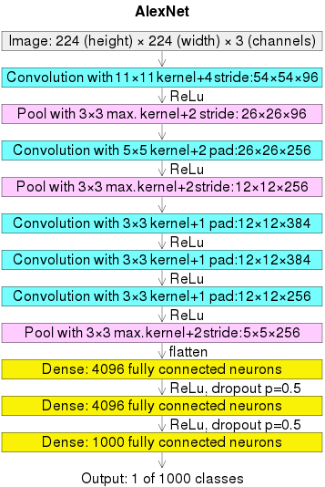

# CNN

## Convolutional Layer Forward

### Typical Computation Cost of A Convolutional Layer

* Filter kernel size: $k \times k$
* Image size divided by stride: $\frac{m \times n}{s \times s}$
* The number of filters $l$

Total: $(k \times k) \times \frac{m \times n}{s \times s} \times l$

## Convolutional Layer Back Propagation

## AlexNet

      

 