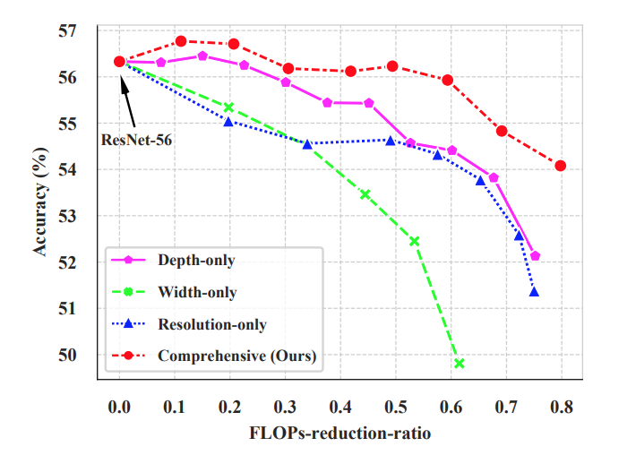
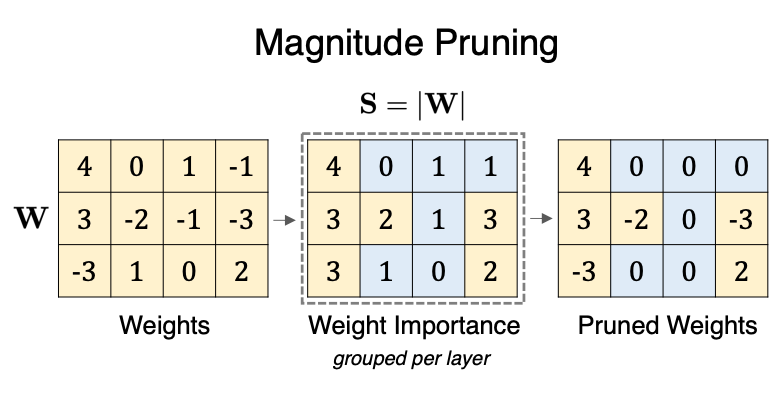

# Model Compression: Pruning/Distillation and Quantization

## Pruning

Pruning permanently drops certain weights.

In pytorch, there is `import torch.nn.utils.prune as prune`.

```python
device = torch.device("cuda" if torch.cuda.is_available() else "cpu")

class LeNet(nn.Module):
    def __init__(self):
        super(LeNet, self).__init__()
        # 1 input image channel, 6 output channels, 5x5 square conv kernel
        self.conv1 = nn.Conv2d(1, 6, 5)
        self.conv2 = nn.Conv2d(6, 16, 5)
        self.fc1 = nn.Linear(16 * 5 * 5, 120)  # 5x5 image dimension
        self.fc2 = nn.Linear(120, 84)
        self.fc3 = nn.Linear(84, 10)

    def forward(self, x):
        x = F.max_pool2d(F.relu(self.conv1(x)), (2, 2))
        x = F.max_pool2d(F.relu(self.conv2(x)), 2)
        x = x.view(-1, int(x.nelement() / x.shape[0]))
        x = F.relu(self.fc1(x))
        x = F.relu(self.fc2(x))
        x = self.fc3(x)
        return x

model = LeNet().to(device=device)

parameters_to_prune = (
            (model.conv1, 'weight'),
            (model.conv2, 'weight'),
            (model.fc1, 'weight'),
            (model.fc2, 'weight'),
            (model.fc3, 'weight'))

## prune all layer parameters removing 20% of which by L1 unstructured pruning method (individual neuron removals by L1)
prune.global_unstructured(parameters_to_prune, pruning_method=prune.L1Unstructured, amount=0.2)
```

### Best Practices and Lottery Ticket Hypothesis

*The Lottery Ticket Hypothesis: Training Pruned Neural Networks* proves that a subnet contains the same inference capability as a its parent large network.

*lottery ticket hypothesis*: dense, randomly-initialized, feed-forward networks contain subnetworks (winning tickets) that, when trained in isolation, reach test accuracy comparable to the original network in a similar number of iterations.

Good parameter initialization achieves more than $90\%$ compression rate.
Finding good parameter initialization is particularly important.

### Unstructured vs Structured Pruning

* Unstructured Pruning: prune individual parameters
* Structured Pruning: removes entire structures of parameters (e.g., the whole layer of parameters)

### Local vs Global Pruning

* Local: prune as per layer
* Global: prune as multiple layers, or all layers

Model's width per layer represents content of input;
model's depth represents non-linearity capability of transforming input.

Figure below shows that comprehensive pruning (width + depth) is better rather than just pruning on single layer neurons.

<div style="display: flex; justify-content: center;">
      
</div>
</br>

### Pruning Methods: By L1, Ln Norms

The key idea is that, norm of a matrix $||W||_p$ describes the average info contained in one neuron.
Insignificant neurons should see low activation energy (low input value), hence the weights should have small $|w_i|_p$.

A small $|w_i|_p$ multiplied with input $x_i$ gives a small value, that when passed to activation function, the activation outputs are almost certain for its input is almost always zeros.

For example, illustrated in the figure below, for a pruning rate of $50\%$ (remove half of parameters) and by $\mathcal{L}_1$ norm of $|W|$, the lowest $|w_i|$ are set to zeros.

<div style="display: flex; justify-content: center;">
      
</div>
</br>

The above $\mathcal{L}_1$ norm removal can be done in Pytorch such as below.
The original weight $W$ is renamed by prune as `weight_orig`, and the corresponding binary mask is `weight_mask` that sets lowest element to zeros, and retains full pass of original weights element-wise multiplying by $1$.

$$
W \odot M_{mask} = W_{pruned}, \qquad
\text{where }
M_{mask} = \begin{bmatrix}
    1 & 0 & 0 & 0 \\
    1 & 1 & 0 & 1 \\
    1 & 0 & 0 & 1 \\
\end{bmatrix}
$$

where $\odot$ is an element-wise multiplication operator.

```python
m = prune.l1_unstructured(nn.Linear(3, 4), 'weight', amount=0.5)
m.state_dict().keys()
# print
# odict_keys(['bias', 'weight_orig', 'weight_mask'])
```

* $\mathcal{L}_1$ Norm: remove the lowest $|w_i|$:

PyTorch implementation (remove the specified `amount` of (currently un-pruned) units with the lowest L1-norm) reference:
https://pytorch.org/docs/stable/generated/torch.nn.utils.prune.l1_unstructured.html#torch.nn.utils.prune.l1_unstructured

```python
torch.nn.utils.prune.l1_unstructured(module, name, amount, importance_scores=None)
```

* $\mathcal{L}_2$ Norm: remove lowest $w_i^2$

PyTorch implementation (remove the specified `amount` of (currently un-pruned) channels along the specified `dim` with the lowest L`n=2`-norm) reference:
https://pytorch.org/docs/stable/generated/torch.nn.utils.prune.ln_structured.html

```python
torch.nn.utils.prune.ln_structured(module, name, amount, n, dim, importance_scores=None)
```

### Whole Model Pruning

For efficient memory storage purposes, large models need pruning.
However, the unstructured pruning (set small $w_i$ to zeros) cannot help for in memory data/tensors need to be aligned in storage, hence all tensors should have the same size.

To reduce memory consumption, need to prune on a whole layer at least.

## Quantization

*Quantization* refers to techniques for performing computations and storing tensors at lower bitwidths than floating point precision, such as `float32` $\rightarrow$ `int8`.

PyTorch supports INT8 quantization compared to typical FP32 models allowing for a 4x reduction in the model size as well as memory bandwidth.

In pytorch, simply add `<model_name>` and `dtype=torch.qint8` to `torch.ao.quantization.quantize_dynamic(...)`.

Reference: https://pytorch.org/docs/stable/quantization.html.

## Distillation

