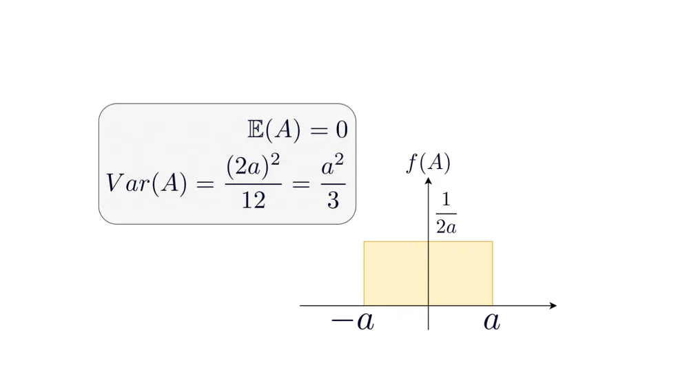

# Model Parameter Initialization

Reference:

* https://www.deeplearning.ai/ai-notes/initialization/index.html
* https://machinelearningmastery.com/weight-initialization-for-deep-learning-neural-networks/
* https://stats.stackexchange.com/questions/390105/what-are-the-theoretical-practical-reasons-to-use-normal-distribution-to-initial
* https://www.pinecone.io/learn/weight-initialization/

## Issues to Model Parameter Initialization

* Equal/zero parameter model initialization

Initializing all the weights with zeros leads the neurons to learn the same features during training.

For example, given an input having two features $(x_1, x_2)$, and associated wights $(w_1, w_2)$, by equal parameter initialization such that $w_1=w_2$,
both hidden units (learned feature $w_1 x_1+w_2 x_2$) will have identical influence on the cost, which will lead to identical gradients.

* A too-large/small initialization leads to exploding/vanishing gradients, respectively

Given $l\in\{1,2,...,L\}$ layers of a network, init weights to large values such that $|W^{[l]}|>1$.
After chained weight matrix multiplications $W^{[1]} W^{[2]} ... W^{[L]}$, the final result could be very large.
Choosing a right/dynamic learning rate $\eta$ is critical.

On the other side, init weights to very small values such that $|W^{[l]}| \approx 0$, there will be $W^{[1]} W^{[2]} ... W^{[L]} \approx \mathbf{0}$, besides having a learning rate that is often $\eta \ll 1$ contributing to gradients and weight updates.

## Reasons of Different Initialization Method Designs

To prevent the gradients of the network's activations from vanishing or exploding, here advises the following rules of thumb:

* The mean of the activations should be zero.
* The variance of the activations should stay the same across every layer.

Set $\mathbf{a}^{[l]}=\sigma(\mathbf{z}^{[l]})$ as the $l$-th layer neuron output, to keep gradient from vanishing/exploding, the pass-down neuron energy should be contained.
In detail, for different layer neuron outputs $\mathbf{a}^{[l]}$, should normalize them to the same normal distribution.

$$
\begin{align*}
    E(\mathbf{a}^{[l]}) &= E(\mathbf{a}^{[l-1]}) \\\\
    Var(\mathbf{a}^{[l]}) &= Var(\mathbf{a}^{[l-1]})
\end{align*}
$$

The scale of neuron output should stay constant such that $Var(\mathbf{a}^{[l]}) = Var(\mathbf{a}^{[l-1]})$.
Quotes from *Deep Learning* from Goodfellow et al:

```txt
We almost always initialize all the weights in the model to values drawn randomly from a Gaussian or uniform distribution.
The choice of Gaussian or uniform distribution does not seem to matter very much, but has not been exhaustively studied.
The scale of the initial distribution, however, does have a large effect on both the outcome of the optimization procedure and on the ability of the network to generalize.
```

For significance of scale:

* Initialization method should encourage large gradients for training.

### Mean and Var of Uniform Distribution

Set $f(x)=\frac{1}{2a}, \forall x \in [-a, a]$ as probability density function (PDF) of $f(A)$ (indicative as height in the $f(A)$).

<div style="display: flex; justify-content: center;">
      
</div>
</br>

* Mean

$$
\begin{align*}
E(X) &= \int_{-a}^{a} x f(x) dx \\\\
&= \int_{-a}^{a} x \frac{1}{2a} dx \\\\
&= 0
\end{align*}
$$

* Variance

$$
\begin{align*}
Var(X) &= E(X^2) - \big(E(X)\big)^2 \\\\
&= \int_{-a}^{a} x^2 \frac{1}{2a} dx - 0 \\\\
&= \frac{1}{2a} \frac{x^3}{3}\bigg|^{a}_{-a} - 0 \\\\
&= \frac{1}{2a} \frac{2a^3}{3} - 0 \\\\
&= \frac{a^2}{3} \\\\
\end{align*}
$$

### Parameter Initialization by Uniform Distribution Var

Set $n^{[l]}$ as the input dimension of the $l$-th layer, the lower and upper boundary of 

$$
\frac{a^2}{3}=\frac{1}{n^{[l]}}
\quad \Rightarrow \quad
a= \pm \sqrt{\frac{3}{n^{[l]}}}
$$

or

$$
\frac{a^2}{3}=\frac{2}{n^{[l]}+n^{[l-1]}}
\quad \Rightarrow \quad
a= \pm \sqrt{\frac{6}{n^{[l]}+n^{[l-1]}}}
$$

## Methods to Model Parameter Initialization

Generally speaking, good model parameter initialization should

* diversify error back-propagating to different weight parameters to learn different features
* be scale-invariant to prevent gradient exploding/vanishing
* encourage large gradients for training, prevent the scenarios where $\mathbf{z}^{[l]} \ll 0$ nor $\mathbf{z}^{[l]} \gg 0$, that activation function e.g., the gradients of sigmoid/tanh and relu, are $\approx 0$.

### LeCun Initialization

LeCun initialization sets the weights $W$ in the network according to a normal distribution with a mean of $0$ and a variance of $\frac{1}{n}$

$$
W\sim \mathcal{N}(0, \frac{1}{n})
$$

where $n$ is the number of input units (or neurons) in the layer.

LeCun initialization helps in maintaining the variance of the activations through the layers, which can prevent the gradients from vanishing or exploding.
Specifically, it works well with sigmoid and tanh activation functions since these functions have steep gradients near zero.

#### Proof of Gradient Stability by LeCun Initialization

Suppose $\mathbf{x}\sim\mathcal{N}(0, 1)$, if the weights are initialized with variance $\frac{1}{n}$, then the output of the $W\mathbf{x}$ is

$$
Var\big(W\mathbf{x}\big) = E\big(W^2\mathbf{x}^2\big) = \frac{1}{n}E\big(\mathbf{x}^2\big) = \frac{1}{n}
$$

This ensures that the variance of $W\mathbf{x}$ (which is the input to the activation function) is neither too large nor too small, keeping the activations in a reasonable range.

Denote activation pass as $\mathbf{a}^{[l]}=\sigma(\mathbf{z}^{[l-1]})=\sigma(W^{[l-1]}\mathbf{a}^{[l-1]}+\mathbf{b}^{[l-1]})$ at the $l$-th layer.
Often, such as the sigmoid or tanh function, activation function has infinitesimal/very flat derivatives when $\mathbf{z}^{[l-1]}\rightarrow \pm\infty$, and the largest derivative is at $\mathbf{z}^{[l-1]}=0$.

By maintaining the scale of $Var\big(\mathbf{z}^{[l-1]}\big)=\frac{1}{n}$ with a mean of $0$, the derivative of activation function $\sigma$ is kept around the largest.

### Uniform vs Normal Distribution Initialization

* Uniform Distribution $U$ Initialization: a uniform distribution has the equal probability of picking any number from a set of numbers.

Create diverse asymmetric parameter distribution with highest entropy, hence the uniform.
Have larger absolute weights the gradients will back-propagate better in a deep network.

$$
\begin{align*}
W^{[l]} &\sim \mathcal{U} \Big(-\frac{1}{\sqrt{n^{[l]}}}, \frac{1}{\sqrt{n^{[l]}}} \Big) \\\\
\mathbf{b}^{[l]} &= \mathbf{0}
\end{align*}
$$

* Normal Distribution $N$ Initialization: should have a mean of $\mu=0$ and a standard deviation of $\sigma=1/\sqrt{n^{[l]}}$

Effective in batch normalization to center distribution at $N(\mu=0, \sigma^2=1/n^{[l-1]})$.

$$
\begin{align*}
W^{[l]} &\sim \mathcal{N}(\mu=0, \sigma^2=1/n^{[l-1]}) \\\\
\mathbf{b}^{[l]} &= \mathbf{0}
\end{align*}
$$

### Xavier vs He Weight Initialization

* Xavier Weight Initialization

Preferred for sigmoid/tanh.

**For normal distribution:**

$$
W^{[l]} \sim \mathcal{N}\left(0, \frac{2}{n^{[l-1]} + n^{[l]}}\right)
$$

**For uniform distribution:**

$$
W^{[l]} \sim \mathcal{U}\left(-\sqrt{\frac{6}{n^{[l-1]} + n^{[l]}}}, \sqrt{\frac{6}{n^{[l-1]} + n^{[l]}}}\right)
$$

* He Weight Initialization

Preferred for ReLU and its variants.

**For normal distribution:**

$$
W^{[l]} \sim \mathcal{N}\left(0, \frac{2}{n^{[l-1]}}\right)
$$

**For uniform distribution:**

$$
W^{[l]} \sim \mathcal{U}\left(-\sqrt{\frac{6}{n^{[l-1]}}}, \sqrt{\frac{6}{n^{[l-1]}}}\right)
$$
