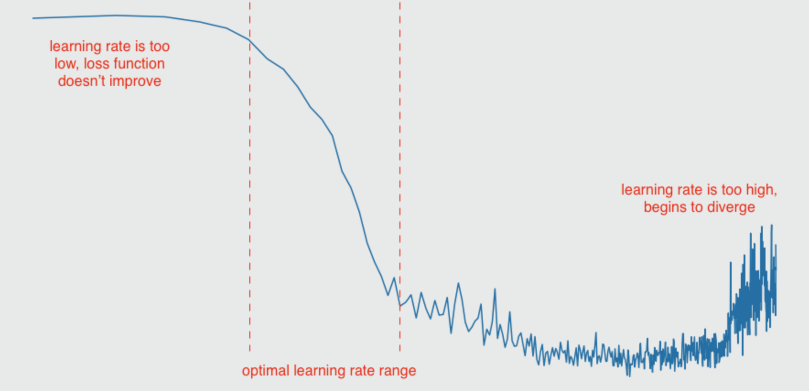
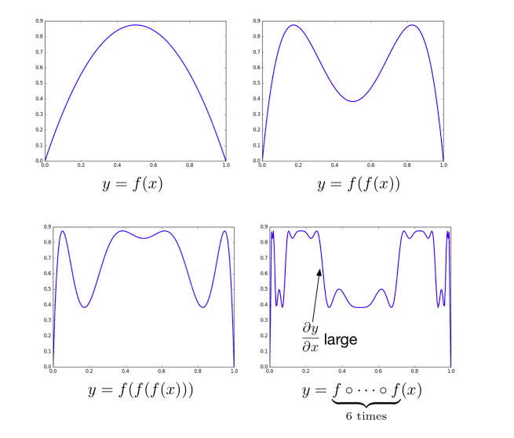
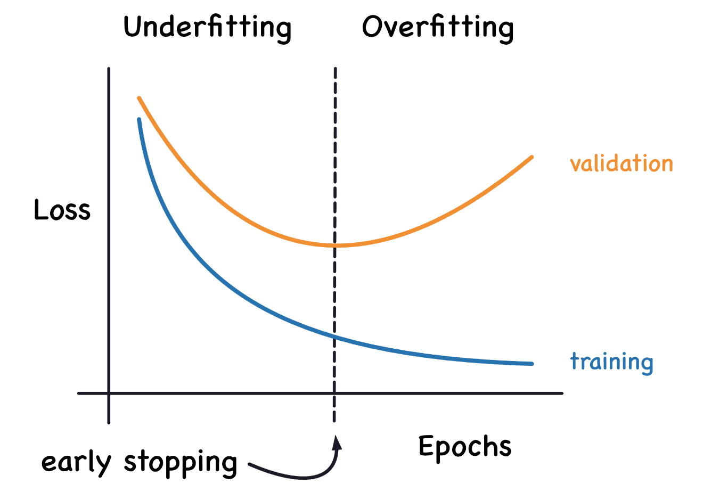
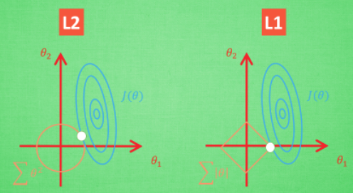

# Some Best Practice Discussions

## Loss Exploding

Training loss grows as iteration increases.

* Large learning rate

Large learning rate renders instability as iteration grows.

<div style="display: flex; justify-content: center;">
      
</div>
</br>

* ADAM Failed for large iteration $n$

For ADAM optimizer $\Delta W_{n+1} = \eta \frac{\hat{m}_{n+1}}{\sqrt{\hat{v}_{n+1}}+\epsilon}$ that takes into account the momentum, whose controlling parameters approach to zeros $\lim_{n \rightarrow +\infty} \beta_1^n = 0$ and $\lim_{n \rightarrow +\infty} \beta_2^n = 0$ when the iteration num $n$ goes very large.

* Instability of Gradients

$\frac{\partial \mathcal{L}}{\partial \bold{\theta}_k}$ can suddenly be very large due to gradient exploding.
This causes instability of the produced weights (totally large meaningless values) and the loss.

## Gradient Exploding/Vanishing

### Phenomena and Definitions

* Gradient Vanishing

By chain rule $\frac{\partial \mathcal{L}}{\partial \bold{\theta}_k}=\frac{\partial \mathcal{L}}{\partial \hat{y}}\frac{\partial \hat{y}}{\partial \bold{h}_l}\frac{\partial \bold{h}_l}{\partial \bold{h}_{l-1}}...\frac{\partial \bold{h}_{k+1}}{\partial \bold{h}_{k}} \frac{\partial \bold{h}_{k}}{\partial \bold{\theta}_k}$,
when a neural network is very deep, the gradient can be very small, and the weight/parameter/update $\bold{\theta}_k \leftarrow \eta\frac{\partial \mathcal{L}}{\partial \bold{\theta}_k} + \bold{\theta}_k$ is almost unchanged for $\frac{\partial \mathcal{L}}{\partial \bold{\theta}_k} \approx \bold{0}$.
Here, $\eta$ is learning rate.

A typical observation is that $\frac{\partial \mathcal{L}}{\partial \bold{h}_l}$ is large and $\frac{\partial \mathcal{L}}{\partial \bold{\theta}_k}$ is small.

* Gradient Exploding

The parameter update $\bold{\theta}_k \leftarrow \eta\frac{\partial \mathcal{L}}{\partial \bold{\theta}_{k}} + \bold{\theta}_k$ keeps increasing fast/is too large for `float32`/`double64` to hold full value that leads to overflow to `nan`.

There are many reasons.
It can be $\mathcal{L}(\bold{\theta})$ space being to mountainous containing abrupt cliffs that lead to sudden increase of derivatives.
It can be used optimizer having too strong accumulated momentum that rushes out/misses its nearby minimum.

Non-linearity introduces lots of abrupt cliffs.
In neural network, the activation function $\sigma(\space \cdot \space)$ is often non-linear (this is why one remediation solution is to use $\text{ReLU}$ as the activation function).
$$
\hat{\bold{y}} = \sigma \big( W_l \big( ... \sigma \big(W_2 \space \sigma(W_1 \bold{x} + \bold{b}_1) + \bold{b}_2) + ... + \big) + \bold{b}_l \big)
$$

For example, define $f(x)=-3.5 x^2 + 3.5x$.
Take $f(x)$'s output as another $f(x)$'s input, and keep stacking them, it can see the produced function space is very "mountainous".

<div style="display: flex; justify-content: center;">
      
</div>
</br>

### Measurement

For a typical forward pass $\bold{h}_{k+1}=\sigma(W_k \bold{h}_k + \bold{b}_k )$,
there exists derivative $\frac{\partial \bold{h}_{k+1}}{\partial \bold{h}_k}=\frac{\partial }{\partial \bold{h}_k} \Big(\sigma(W_k \bold{h}_k + \bold{b}_k )\Big)=W_k \space \sigma'(W_k \bold{h}_k + \bold{b}_k )$.

Diagonalizing a matrix $A$ is also equivalent to finding the matrix's eigenvalues $\lambda_i$, that comprise the diagonal values of $\Lambda$, whose rank is $\text{rank}(\Lambda)=r$.
Here, $P$ is the eigenvector-composed matrix.

$$
P^{-1} A P = D \Rightarrow
AP = PD =
\underbrace{
\begin{bmatrix}
  \bold{v}_1 & \bold{v}_2 & ... & \bold{v}_r
\end{bmatrix}}_{P}
\underbrace{
\begin{bmatrix}
  \lambda_1 & 0 & 0&  & 0\\
  0 & \lambda_2 & 0 &  & 0 \\
  0 & 0 & \lambda_3 &  & 0 \\
   &  &  & \ddots &  \\
  0 & 0 & 0 &  & \lambda_r
\end{bmatrix}}_{\Lambda}
$$

For spectral radius $||A\bold{x}|| \le \lambda_{max}||\bold{x}||$ that states that the max length stretching by $A$ is the max eigenvalue $\lambda_{max}$, here sets $A=\frac{\partial \bold{h}_{k+1}}{\partial \bold{h}_k}$.
$||A||$ describes the overall length/volume of a transform.
$||\frac{\partial \bold{h}_l}{\partial \bold{h}_{l-1}}||...||\frac{\partial \bold{h}_{k+1}}{\partial \bold{h}_{k}}|| \space ||\frac{\partial \bold{h}_{k}}{\partial \bold{\theta}_k}||$ can quantitatively describe the volume of change down to which layer of transform.

### Remediation for Both Vanishing and Exploding Gradient

* Batch Normalization

For gradient $\frac{\partial \mathcal{L}}{\partial \bold{\theta}_k}$ that works on sample input, take input $\bold{x}$ by large batch can resist extreme samples.

* Adam-Adjustable Learning Rate

ADAM updates any parameter with an individual learning rate.

### Remediation for Vanishing Gradient

* Use ResNet Bypass

* ReLU replacing non-linear activation function.

* Do not go too deep

By chain rule $\frac{\partial \mathcal{L}}{\partial \bold{\theta}_k}=\frac{\partial \mathcal{L}}{\partial \hat{y}}\frac{\partial \hat{y}}{\partial \bold{h}_l}\frac{\partial \bold{h}_l}{\partial \bold{h}_{l-1}}...\frac{\partial \bold{h}_{k+1}}{\partial \bold{h}_{k}} \frac{\partial \bold{h}_{k}}{\partial \bold{\theta}_k}$, 
when a neural network is very deep, the gradient can be very small.

* Weight Init

The parameter/weight init is to provide $W_0$ for $\mathcal{L}(\bold{\theta})$ to converge by updating $W$.
The initial parameters matter guiding where optimizer starts.

Typically, $W_0$ is init with standard normal distribution $W_0 \sim N(0, 1)$.

Large variances of initial parameters can render large gradient step, and $W_0 \sim N(0, \frac{1}{\sqrt{n}})$ is a remediation solution, where $n$ is the batch size.
Having assumed data sample is agreed to normal distribution, a large sample size/batch size should see small variances anyway.
Therefore, small variances $\sigma^2=\frac{1}{\sqrt{n}}$ can be used rather than $\sigma^2=1$.

### Remediation for Exploding Gradient

* Small learning rate

* Gradient Clipping

Simply set a threshold $t$ that if gradient $||\bold{g}||$ is too large, multiply gradient $\bold{g}$ with a small value $\epsilon$.

$$
\bold{g} \leftarrow \left\{
    \begin{array}{c}
        \epsilon \bold{g} & ||\bold{g}|| > t \\
        \bold{g} & ||\bold{g}|| \le t \\
    \end{array}
\right.
$$

* $\mathcal{L}^2$-norm regularization

Regularization can contain parameters from increasing too fast/to large values.

## Matrix Symmetry and Stable Training

Symmetric matrices have real eigenvalues and orthogonal eigenvectors that make training stable.

* If weight matrices $W$ have **small eigenvalues**, the weight matrix may not be effectively transforming the input space.
* If weight matrices $W$ have **large eigenvalues**, the transformations may be overly redundant or lead to gradient instability.

### Proof: Symmetric Matrices Have Real Eigenvalues Orthogonal Eigenvectors

Let $W$ be a real symmetric matrix, meaning: $W^{\top}=W$.
Let $\bold{v}$ be eigenvector and $\lambda$ be eigenvalue, there is

$$
W\bold{v}=\lambda\bold{v}
$$

#### Symmetric Matrices Have Real Eigenvalues

Let $\bold{v}^{H}$ be Hermitian transpose of $\bold{v}$,

$$
\begin{align*}
&& W\bold{v}&=\lambda\bold{v} \\
\Rightarrow && \bold{v}^{H} W\bold{v}&=\lambda\bold{v}^{H}\bold{v}
\end{align*}
$$

Recall the complex number property that mutually conjugate number multiplication must be real and greater than/equal to zero: $(a+bi)(a-bi)=a^2+b^2\ge 0$.

If a complex number's conjugate is equal to the complex number itself, this complex number is real: $a+bi=a-bi$, here the imaginary part could only be zero $bi=0$ so that the equation $a+bi=a-bi$ holds true.

$$
\begin{align*}
    \bold{v}^{H} W\bold{v} &=
    \sum_{i}\sum_{j} \overline{v}_i w_{ij} v_j \\
    &= \sum_{i=j} \overline{v}_i w_{ii} v_i + \sum_{i\ne j} \overline{v}_i w_{ij} v_j \\
\end{align*}
$$

Decompose $\sum_{i\ne j}^{n} \overline{v}_i w_{ij} v_j \Rightarrow \sum_{i\ne j}^{\frac{n}{2}} \overline{v}_i w_{ij} v_j + \overline{v}_j w_{ji} v_i$, and for $\bold{v}^H$ is the hermitian transpose of $\bold{v}$ and $W$ is symmetric, denote $(.)^*$ as conjugate operator, there is

$$
(\overline{v}_i w_{ij} v_j + \overline{v}_j w_{ji} v_i)^* =
\overline{v}_j w_{ji} v_i + \overline{v}_i w_{ij} v_j
$$

For a complex number's conjugate is itself, this complex number must be real.

$\overline{v}_i w_{ii} v_i$ is real for $\overline{v}_i v_i \ge 0$ and $w_{ii}$ is real for $W$ by definition is a real matrix.

For $\bold{v}^{H}\bold{v}$ and $\bold{v}^{H} W\bold{v}$ are real, the eigenvalues $\lambda$ are real as well in $\bold{v}^{H} W\bold{v}=\lambda\bold{v}^{H}\bold{v}$.

#### Symmetric Matrices Have Orthogonal Eigenvectors

Define

$$
W\bold{v}_1=\lambda_1\bold{v}_1 \qquad
W\bold{v}_2=\lambda_2\bold{v}_2
$$

then multiply by $\bold{v}_2^{\top}$, there is

$$
\begin{align*}
    && \bold{v}_2^{\top}W\bold{v}_1 &=
  \bold{v}_2^{\top}\lambda_1\bold{v}_1 \\
  \Rightarrow && (W\bold{v}_2)^{\top}\bold{v}_1 &=
  \bold{v}_2^{\top}\lambda_1\bold{v}_1 \\
  \Rightarrow && \lambda_2\bold{v}_2^{\top}\bold{v}_1 &=
  \lambda_1\bold{v}_2^{\top}\bold{v}_1 \\
\end{align*}
$$

For by eigen-decomposition, there is $\lambda_1 \ne \lambda_2 \ne 0$, there could be only $\bold{v}_2^{\top}\bold{v}_1=0$, hence orthogonal.

## Overfitting

When training loss curve vs validation loss curve diverge.
Should record the checkpoint model parameters and stop training.

<div style="display: flex; justify-content: center;">
      
</div>
</br>

### Use *Dropout* to enhance robustness of a network

Usually cut off $10\%$ neural connections of a dense layer (set some entries of a weight matrix to zeros).

### Regularization

Optimizer attempts to learn parameter $\bold{\theta} \in \mathbb{R}^d$.
Cost with added regularization can be defined as below.

$$
\min_{\bold{\theta}}
\mathcal{J}(\bold{\theta}) = 
\underbrace{\big( \bold{y} - \hat{\bold{y}} \big)^2}_{\text{traditional loss}} +
\underbrace{\lambda \sum_{i=1}^d \theta^p_i}_{\text{regularization}}
$$

where $\mathcal{L}_1$ penalty is $\lambda \sum^d_{i=1} |\theta_i|$ and $\mathcal{L}_2$ penalty is $\lambda \sum^d_{i=1} \theta^2_i$.

Explained (see the figure below for example): 

An optimizer attempts to learn the best $\bold{\theta} = \{\theta_1, \theta_2\}$ by $\min_{\bold{\theta}}\mathcal{J}(\bold{\theta})$.
Intuitively, the minimum (represented as the smallest blue inner circle) is located at somewhere $\bold{\theta} > \bold{0}$, and along the $\theta_1$-axis direction see steeper gradient (see contour lines, where contour intervals are small) than that of the $\theta_2$-axis' (indicating optimizer likely going along the $\theta_1$-axis' direction).

To regularize it, add $\lambda \sum_{i=1}^2 \theta^p_i$ (shown as orange contours).

The regularizer $\lambda \sum_{i=1}^d \theta^p_i$ increases cost when $\bold{\theta}$ stray away from the origin coordinate $(0, 0)$, hence, to reduce the overall cost $\mathcal{J}(\bold{\theta})$, $\theta_1 \rightarrow 0$ and $\theta_2 \rightarrow 0$ are contained close to the origin.
As a result, the best $\bold{\theta}$ are likely small values.

There are diffs between $\mathcal{L}_1$ (p=1) vs $\mathcal{L}_2$ (p=2),
that when converging $\mathcal{J}(\bold{\theta})$ by $|\theta_i|$ (the $\mathcal{L}_1$ scenario), individual $|\theta_1|$ would have more sway over $|\theta_2|$, dragging the new minimum (the white point in the figure) to the $\theta_1$-axis.
This results in totally missing out the $\theta_2$ info for the learned $\theta_2=0$ and $\theta_1 \gg \theta_2$.

In the $\mathcal{L}_2$ scenario, the regularizer is "rounded" that both $\theta_1 \ne 0$ and $\theta_2 \ne 0$ are learned.

<div style="display: flex; justify-content: center;">
      
</div>
</br>

### PyTorch Implementation

$\mathcal{L}_1$ penalty in python/pytorch is simply $\lambda|\bold{\theta|}$ by `torch.linalg.norm(param, p=1)`, where $\lambda=10^{-5}$.
The 

```python
l1_reg = torch.tensor(0., requires_grad=True)

for name, param in model.named_parameters():
    if 'weight' in name:
        l1_reg += torch.linalg.norm(param, p=1)

total_loss += 10e-5 * l1_reg
```

The $\lambda=10^{-5}$ is named `weight_decay` in pytroch.
It is often set to $\lambda=10^{-10} \eta$ proportional to learning rate $\eta$.

$\mathcal{L}_2$ penalty in python/pytorch is by `torch.linalg.norm(param, p=2)`.

```python
l2_reg = torch.tensor(0., requires_grad=True)

for param in model.parameters():
    if 'weight' in name:
        l2_reg += torch.linalg.norm(param, p=2)

loss += 10e-5 * l2_reg
```

By default, `torch.linalg.norm(...)` uses Frobenius norm if `p` is not set.

In PyTorch Adam optimizer, $\mathcal{L}_2$ regularizer (Decoupled Weight Decay Regularization) is added by default when `weight_decay` is not zero.

```python
optimizer = torch.optim.Adam(model.parameters(), lr=1e-4, weight_decay=1e-2)
```

### For CV

* Random Image Crop
* Random Flip/Rotation

### For NLP

## Warmup

Traditionally, training starts with a large learning rate $\eta$ then gradually decreases as iteration num $t$ grows such as $0.95^{t}\eta$.
This approach is deprecated for novel learning rate *warmup* schemes.

https://d2l.ai/chapter_optimization/lr-scheduler.html