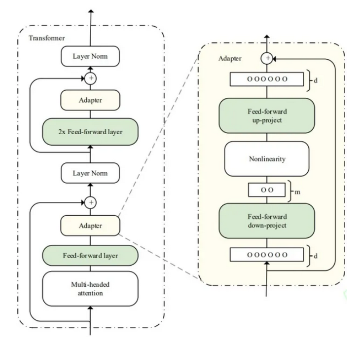

# Some Best Practice Discussions

## Gradient Explosion/Vanishing

A typical layer of neural network has a matrix multiplication operation and an activation function mapping $h_{k+1}=\sigma(W h_k)$,
whose derivative is $\frac{\partial h_{k+1}}{\partial h_k}=\text{diag}\big( \sigma'(W h_k) \big) W$ (for $\sigma(.)$ is a 2d to 1d mapping function, its derivative can be represented by $\text{diag}(.)$ ).

The determinant of $\text{diag}\big( \sigma'(W h_k) \big)$ is smaller than $1$, and the determinant of $W$ varies (could be greater/less than $1$).
Hence, the total result $\frac{\partial h_{k+1}}{\partial h_k}=\text{diag}\big( \sigma'(W h_k) \big) W$ could be greater/less than $1$, and if $\frac{\partial h_{k+1}}{\partial h_k}$ cannot stay around $1$, there is a risk of gradient explosion/vanishing.

## Overfitting

* Use *Dropout* to enhance robustness of a network 

### For CV

* Random Image Crop
* Random Flip/Rotation

## Optimization Tuning

* Use Adam

## Saddle Point Escape

* Data Augmentation: manually introduced some noises to source training data
* batch size: 

Large batch size can facilitate training by bulk processing by GPU, and has better generalization.

Small batch size has the opposite effect. One alien sample can be obvious in error but this can lead to saddle point escape.

## Fine Tuning

Fine tuning is used for large model to adapt small sample data based on pre-trained parameters.

Parameter trainings:

* From scratch: totally from random parameters
* Full-parameter fine-tuning: all parameter fine-tuning
* Parameter-efficient fine-tuning: only less than $10\%$ of parameters are put in training

### LoRA: Low-Rank Adaptation of Large Language Models

For input $\bold{x} \in \mathbb{R}^{n \times d}$, where $d$ is for dimensionality, to fine tune an pretrained model, LoRA proposes below idea.
* $W_0 \in \mathbb{R}^{d \times d}$ is the pretrained parameters. 
* $A \sim N(0, \sigma^2) \in \mathbb{R}^{r \times d}$ is a weight matrix to be learned; it parameters are init by Gaussian distribution. $A$'s output reduces dimension to $r$
* $B = \bold{0} \in \mathbb{R}^{r \times d}$ is another weight matrix init to zeros. $B$'s output reset the dimension to $d$.

The training goes as below, that $W_0$ is kept unchanged/freezed; $B^{\top} A^{\top}$ are trainable parameter matrices. 

$r \ll d$ is referred to as *low-rank*.
$r=8$ is a typical implementation.
A small $r$ can help reduce computation maintaining small sizes for $A$ and $B$.

      

 

The new hidden layer matrix is computed as below.
$$
\bold{h} = W^{\top}_0\bold{x} + B^{\top} A^{\top} \bold{x}
$$

For intrinsic dimension (intrinsic dimension for a data set can be thought of as the number of variables needed in a minimal representation of the data), the number of neurons is small $r \ll d$ but can produce good approximation results.

###  Adapter: Parameter-Efficient Transfer Learning for NLP

Adapter adds new modules (called *adapter*) between layers of pre-trained transformer network.

Compared to LoRA, the adapter's Feed-forward down-project matrix is comparable to $A$, the up-project is comparable to $B$.
$m$ serves the same purposes as $r$'s reducing dimensions.

Adapter adds non-linearity between $A$ and $B$.

      

 

#### Improvement: Adapter Fusion

Adapter fusion adds attentions (value, key and query) that take adapter's output as value and key, and query from adapter's input.

Define the below parameter groups:
* Pretrained parameters $W_0$
* Adapter parameters $\Psi$
* Adapter Fusion parameters $\Phi$

The adapter fusion training goes as below:
1. fixed $W_0$, just train $\Psi$: there are multiple modules of adapters learning different knowledge
2. fixed $W_0$ and $\Psi$, train $\Phi$: attention serves as a filter that only task-specific knowledge is stored.

      

 

###  Prefix-tuning

