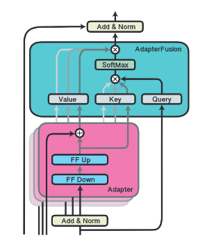

# Some Best Practice Discussions

## Gradient Explosion/Vanishing

### Phenomena and Definitions

* Gradient Vanishing

By chain rule $\frac{\partial \mathcal{L}}{\partial \bold{x}}=\frac{\partial \mathcal{L}}{\partial \hat{y}}\frac{\partial \hat{y}}{\partial \bold{h}_l}\frac{\partial \bold{h}_l}{\partial \bold{h}_{l-1}}...\frac{\partial \bold{h}_{2}}{\partial \bold{h}_{1}} \frac{\partial \bold{h}_{1}}{\partial \bold{x}}$, 
when a neural network is very deep, the gradient can be very small, and the weight update $W_1 \leftarrow \eta\frac{\partial \mathcal{L}}{\partial \bold{x}} + W_1$ is almost unchanged for $\frac{\partial \mathcal{L}}{\partial \bold{x}} \approx \bold{0}$.

* Gradient Exploding

The weight update $W_k \leftarrow \eta\frac{\partial \mathcal{L}}{\partial \bold{h}_{k}} + W_k$ keeps increasing fast/is too large for `float32`/`double64` to hold full value that leads to overflow to `nan`.

There are many reasons. 
It can be $\mathcal{L}(\bold{x})$ space being to mountainous containing abrupt cliffs that lead to sudden increase of derivatives.
It can be used optimizer having too strong accumulated momentum that rushes out/misses its nearby minimum.

Non-linearity introduces lots of abrupt cliffs.
In neural network, the activation function $\sigma(\space \cdot \space)$ is often non-linear (this is why one remediation solution is to use $\text{ReLU}$ as the activation function).
$$
\hat{\bold{y}} = \sigma \big( W_l \big( ... \sigma \big(W_2 \space \sigma(W_1 \bold{x} + \bold{b}_1) + \bold{b}_2) + ... + \big) + \bold{b}_l \big)
$$

For example, define $f(x)=-3.5 x^2 + 3.5x$.
Take $f(x)$'s output as another $f(x)$'s input, and keep stacking them, it can see the produced function space is very "mountainous".

      

 

### Reasons

For a typical forward pass $\bold{h}_{k+1}=\sigma(W_k \bold{h}_k + \bold{b}_k )$,
there exists derivative $\frac{\partial \bold{h}_{k+1}}{\partial \bold{h}_k}=\frac{\partial }{\partial \bold{h}_k} \Big(\sigma(W_k \bold{h}_k + \bold{b}_k )\Big)=W_k \space \sigma'(W_k \bold{h}_k + \bold{b}_k )$.

Diagonalizing a matrix $A$ is also equivalent to finding the matrix's eigenvalues $\lambda_i$, that comprise the diagonal values of $\Lambda$, whose rank is $\text{rank}(\Lambda)=r$.
Here, $P$ is the eigenvector-composed matrix.

$$
P^{-1} A P = D
\Rightarrow
AP = PD
=
\underbrace{
\begin{bmatrix}
  \bold{v}_1 & \bold{v}_2 & ... & \bold{v}_r
\end{bmatrix}}_{P}
\underbrace{
\begin{bmatrix}
  \lambda_1 & 0 & 0&  & 0\\
  0 & \lambda_2 & 0 &  & 0 \\
  0 & 0 & \lambda_3 &  & 0 \\
   &  &  & \ddots &  \\
  0 & 0 & 0 &  & \lambda_r
\end{bmatrix}}_{\Lambda}
$$

For spectral radius $||A\bold{x}|| \le \lambda_{max}||\bold{x}||$ that states that the max length stretching by $A$ is the max eigenvalue $\lambda_{max}$, here sets $A=\frac{\partial \bold{h}_{k+1}}{\partial \bold{h}_k}$.
$||A||$ describes the overall length/volume of a transform.
$||\frac{\partial \bold{h}_l}{\partial \bold{h}_{l-1}}||...||\frac{\partial \bold{h}_{2}}{\partial \bold{h}_{1}}|| \space ||\frac{\partial \bold{h}_{1}}{\partial \bold{x}}||$ can quantitatively describe the volume of change down to which layer of transform.

### Remediation for Both Vanishing and Exploding Gradient

* Batch Normalization

For gradient $\frac{\partial \mathcal{L}}{\partial \bold{x}}$ that works on sample input, take input $\bold{x}$ by large batch can resist extreme samples.

### Remediation for Vanishing Gradient

* Use ResNet Bypass

* ReLU replacing non-linear activation function.

* Do not go too deep

By chain rule $\frac{\partial \mathcal{L}}{\partial \bold{x}}=\frac{\partial \mathcal{L}}{\partial \hat{y}}\frac{\partial \hat{y}}{\partial \bold{h}_l}\frac{\partial \bold{h}_l}{\partial \bold{h}_{l-1}}...\frac{\partial \bold{h}_{2}}{\partial \bold{h}_{1}} \frac{\partial \bold{h}_{1}}{\partial \bold{x}}$, 
when a neural network is very deep, the gradient can be very small.

* Weight Init

The weight init is to provide $W_0$ for $\mathcal{L}(\bold{x})$ to converge by updating $W$.
The initial parameters matter guiding where optimizer starts.

Typically, $W_0$ is init with standard normal distribution $W_0 \sim N(0, 1)$.

Large variances of initial parameters can render large gradient step, and $W_0 \sim N(0, \frac{1}{\sqrt{n}})$ is a remediation solution, where $n$ is the batch size.
Having assumed data sample is agreed to normal distribution, a large sample size/batch size should see small variances anyway.
Therefore, small variances $\sigma^2=\frac{1}{\sqrt{n}}$ can be used rather than $\sigma^2=1$.

### Remediation for Exploding Gradient

* Small learning rate

* Gradient Clipping

Simply set a threshold $t$ that if gradient $||\bold{g}||$ is too large, multiply gradient $\bold{g}$ with a small value $\epsilon$.

$$
\bold{g} \leftarrow \left\{
    \begin{array}{c}
        \epsilon \bold{g} & ||\bold{g}|| > t \\
        \bold{g} & ||\bold{g}|| \le t \\
    \end{array}
\right.
$$

* $\mathcal{L}^2$-norm regularization

Regularization can contain parameters from increasing too fast/to large values.

## Overfitting

* Use *Dropout* to enhance robustness of a network

Usually cut off $10\%$ neural connections of a dense layer (set some entries of a weight matrix to zeros).

* Regularization

Optimizer attempts to learn parameter $\bold{\theta} \in \mathbb{R}^d$.
Cost with added regularization can be defined as below.

$$
\min_{\bold{\theta}}
\mathcal{J}(\bold{\theta}) = 
\underbrace{\big( \bold{y} - \hat{\bold{y}} \big)^2}_{\text{traditional loss}} +
\underbrace{\lambda \sum_{i=1}^d \theta^p_i}_{\text{regularization}}
$$

where $\mathcal{L}_1$ penalty is $\lambda \sum^d_{i=1} |\theta_i|$ and $\mathcal{L}_2$ penalty is $\lambda \sum^d_{i=1} \theta^2_i$.

Explained (see the figure below for example): 

An optimizer attempts to learn the best $\theta_1$ and $\theta_2$ by $\min_{\bold{\theta}}\mathcal{J}(\bold{\theta})$.
Intuitively, the minimum (represented as the smallest blue inner circle) is located at somewhere $\theta_1 > 0$ and $\theta_2 > 0$, and along the $\theta_1$-axis direction see steeper gradient (see contour lines, where contour intervals are small) than that of the $\theta_2$-axis' (indicating optimizer likely going along the $\theta_1$-axis' direction).

To regularize it, add $\lambda \sum_{i=1}^2 \theta^p_i$ (shown as orange contours).

The regularizer $\lambda \sum_{i=1}^d \theta^p_i$ increases cost when $\theta_1$ and $\theta_2$ stray away from the origin coordinate $(0, 0)$, hence, to reduce the overall cost $\mathcal{J}(\bold{\theta})$, $\theta_1$ and $\theta_2$ are contained close to the origin.
As a result, the best $\theta_1$ and $\theta_2$ are likely small values.

There are diffs between $\mathcal{L}_1$ (p=1) vs $\mathcal{L}_2$ (p=2),
that when converging $\mathcal{J}(\bold{\theta})$ by $|\theta_i|$ (the $\mathcal{L}_1$ scenario), individual $|\theta_1|$ would have more sway over $|\theta_2|$, dragging the new minimum (the white point in the figure) to the $\theta_1$-axis.
This results in totally missing out the $\theta_2$ info for the learned $\theta_2=0$.

In the $\mathcal{L}_2$ scenario, the regularizer is "rounded" that both $\theta_1$ and $\theta_2$ are learned.

      

 

### For CV

* Random Image Crop
* Random Flip/Rotation

## Fine Tuning

Fine tuning is used for large model to adapt small sample data based on pre-trained parameters.

Parameter trainings:

* From scratch: totally from random parameters
* Full-parameter fine-tuning: all parameter fine-tuning
* Parameter-efficient fine-tuning: only less than $10\%$ of parameters are put in training

### LoRA: Low-Rank Adaptation of Large Language Models

For input $\bold{x} \in \mathbb{R}^{n \times d}$, where $d$ is for dimensionality, to fine tune an pretrained model, LoRA proposes below idea.
* $W_0 \in \mathbb{R}^{d \times d}$ is the pretrained parameters. 
* $A \sim N(0, \sigma^2) \in \mathbb{R}^{r \times d}$ is a weight matrix to be learned; it parameters are init by Gaussian distribution. $A$'s output reduces dimension to $r$
* $B = \bold{0} \in \mathbb{R}^{r \times d}$ is another weight matrix init to zeros. $B$'s output reset the dimension to $d$.

The training goes as below, that $W_0$ is kept unchanged/freezed; $B^{\top} A^{\top}$ are trainable parameter matrices. 

$r \ll d$ is referred to as *low-rank*.
$r=8$ is a typical implementation.
A small $r$ can help reduce computation maintaining small sizes for $A$ and $B$.

      

 

The new hidden layer matrix is computed as below.
$$
\bold{h} = W^{\top}_0\bold{x} + B^{\top} A^{\top} \bold{x}
$$

For intrinsic dimension (intrinsic dimension for a data set can be thought of as the number of variables needed in a minimal representation of the data), the number of neurons is small $r \ll d$ but can produce good approximation results.

###  Adapter: Parameter-Efficient Transfer Learning for NLP

Adapter adds new modules (called *adapter*) between layers of pre-trained transformer network.

Compared to LoRA, the adapter's Feed-forward down-project matrix is comparable to $A$, the up-project is comparable to $B$.
$m$ serves the same purposes as $r$'s reducing dimensions.

Adapter adds non-linearity between $A$ and $B$.

      

 

#### Improvement: Adapter Fusion

Adapter fusion adds attentions (value, key and query) that take adapter's output as value and key, and query from adapter's input.

Define the below parameter groups:
* Pretrained parameters $W_0$
* Adapter parameters $\Psi$
* Adapter Fusion parameters $\Phi$

The adapter fusion training goes as below:
1. fixed $W_0$, just train $\Psi$: there are multiple modules of adapters learning different knowledge
2. fixed $W_0$ and $\Psi$, train $\Phi$: attention serves as a filter that only task-specific knowledge is stored.

      

 

###  Prefix-tuning

