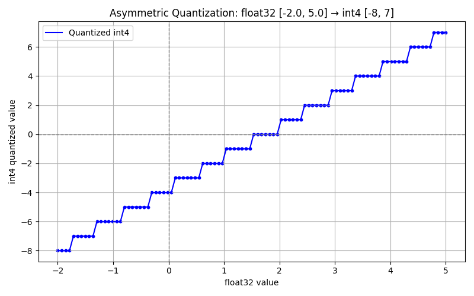
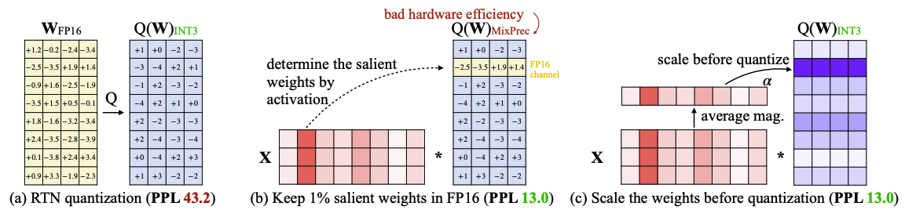

# LLM Quantization

*Quantization* refers to techniques for performing computations and storing tensors at lower bitwidths than floating point precision, such as `float32` $\rightarrow$ `int8` (almost no impact on LLM performance) and `float32` $\rightarrow$ `int4` (may see trivial drops on LLM performance).

There are two types of quantization:

* Post-Training Quantization (PTQ): quantize model after training
* Quantization-Aware Training (QAT): retrain model while simulating quantization

By 2024, the most popular quantization methods without retraining are GPTQ (Generative Pre-trained (GPT) Quantization) and AWQ (Activation-aware Weight Quantization).

GPTQ (Generative Pre-trained (GPT) Quantization)

* Uses Hessian-based optimization to determine which weights are important.
* Greedily selects quantization values to minimize total error.

AWQ (Activation-aware Weight Quantization)

* Focuses on weights that influence large activations (important computation paths).

## Floating-Point Resolution and Range

Floating-Point Representation Formula

$$
x=(-1)^s \times 2^{e-\text{bias}} \times (1+m)
$$

where

* Sign bit (s)
* Exponent (e)
* Mantissa (m)

Mantissa is often referred as decimal resolution; exponential decides the max/min values.

||Mantissa Bits|Decimal Precision (Approx.)|Exponential Bits|Max Value|
|-|-|-|-|-|
|FP32|23|~7 decimal digits|8|$3.4\times 10^{38}\approx(2-2^{-23})\times 2^{2^{7}-1}$|
|BF16|7|~2-3 decimal digits|8|$3.4\times 10^{38}\approx(2-2^{-7})\times 2^{2^{7}-1}$|
|FP16|10|~3-4 decimal digits|5|$65504=(2-2^{-10})\times 2^{2^{5}-1}$|
|FP8 (E4M3)|3|~1 decimal digit|4|$240=(2-2^{-3})\times 2^{2^{4}-1}$|
|FP8 (E5M2)|2|~0.5 decimal digits|5|$57344=(2-2^{-2})\times 2^{2^{5}-1}$|

### Example by FP32, Float32

32-bit floating point (IEEE 754 standard)

* 23-bit mantissa
* 8-bit exponent
* 1-bit sign

A number like $5.75$ (in decimal) in IEEE-754 FP32 would be stored as: $1.0111\times 2^2$

* Mantissa: $01110000000000000000000$ (23 bits)
* Exponent: $2+127=129$ (Stored as $10000001$)

Explained derivation of $1.0111\times 2^2$:

* Convert the integer part: $5_{10}=101_{2}$
* Convert the decimal part: there is $0.75_{10}=0.11_{2}$ given 1st round: $0.75\times 2=1.5$, 2nd round: $0.5\times 2=1.0$
* The binary representation is $5.75_{10}=101.11_2$
* Use exponential so there is exactly one leading 1 before the radix point $101.11_2=1.0111\times 2^2$

Normalize the Binary Number

* Mantissa: $0111...$ (remaining bits after the leading $1.$)
* Exponent: The exponent is $2$, but IEEE-754 uses a biased exponent. The bias for FP32 is $127$.

Encode in IEEE-754 Format

* Sign bit: $0$ (since 5.75 is positive)
* Exponent (8-bit, biased by 127): $129_{10}=10000001_2$, or $2^2=2^{129-127}$
* Mantissa (23-bit, dropping the leading 1): $01110000000000000000000_2$

Recall $1.0111\times 2^2$, to represent in binary format, there is

$$
\underbrace{0}\_{\text{sign}} \underbrace{10000001}\_{2^2} \underbrace{01110000000000000000000}\_{.0111}
$$

## INT4 Quantization (Round To Nearest (RTN))

INT4 can be derived/quantized from FLOAT to the int range $[-8, 7]\in\mathbb{Z}$ by the below formula (below assumed *Asymmetric Quantization*, there are other quantization methods, e.g., Symmetric Quantization):

$$
\begin{align*}
\text{scale}&=\frac{x_{\max}-x_{\min}}{2^4-1}=\frac{x_{\max}-x_{\min}}{15} \\\\
\text{zeroPointFloat}&=\text{round}\Big(\frac{-x_{\min}}{\text{scale}}\Big) \\\\
\text{zeroPointInt}&=\text{zeroPointFloat}+\text{INT4}\_{\min} \\\\
\text{quantizedValue}&=\text{clamp}\Big(\text{round}\big(\frac{x}{\text{scale}}+\text{zeroPointInt}\big), -8, 7\Big) \\\\
\end{align*}
$$

where

* Scale: Determines the step size between integer values.
* Zero Point: Shifts the integer range to match the floating-point range, and $\text{INT4}\_{\min}=-8$.

### Asymmetric Quantization Example of FP32 -> INT4

Given FP32 range $[−2.0,5.0]$, here shows quantization results by asymmetric quantization.

```py
# Quantization function
def quantize(val):
    q = round((val - zero_point_float) / scale) + int4_min
    return np.clip(q, int4_min, int4_max)

# Dequantization function
def dequantize(q):
    return (q - int4_min) * scale + zero_point_float
```

Quantized results

<div style="display: flex; justify-content: center;">
      
</div>
</br>

## GPTQ (Generative Pre-trained (GPT) Quantization)

Let $X_l\in\mathbb{R}^{n\times d}$ be the $l$-th layer input,
at a high level, GPTQ quantizes model weights $W_l\in\mathbb{R}^{m\times n}$ layer by layer,
The beginning input $X_0$ is a small subset of training dataset.

GPTQ aims to

$$
\argmin_{\hat{W}} ||WX-\hat{W}X||^2_2
$$

where $\hat{W}$ denotes the quantized weights.
The multiplication result is $WX\in\mathbb{R}^{m\times d}$.

Recall Frobenius norm definition $||A||_F = \sqrt{\sum_{i=1}^m \sum_{j=1}^n |a_{ij}|^2}$ that is the sqrt of variance sum, the objective $||WX-\hat{W}X||^2_2$ by Frobenius norm basically means the sum of all individual variances $|w_{ij}x_{ij}-\hat{w}\_{ij}x_{ij}|^2$.
In other words, the quantized result with input $\hat{w}\_{ij}x_{ij}$ should approximate as much as possible to the full-precision equivalent $w_{ij}x_{ij}$.

### The Hessian of the Objective $||WX-\hat{W}X||^2_2$

Expand and compute the loss $\mathcal{L}=||WX-\hat{W}X||^2_2$,
for $W\in\mathbb{R}^{m\times n}$, vectorize it to $\text{vec}(W)=\mathbf{w}\in\mathbb{R}^{mn\times 1}$.

Frobenius norm expansion:

$$
\begin{align*}
    \mathcal{L}&=\text{trace}\big((WX-\hat{W}X)^{\top}(WX-\hat{W}X)\big) \\\\
    &=\text{vec}(WX-\hat{W}X)^{\top}\text{vec}(WX-\hat{W}X) \\\\
\end{align*}
$$

By Kronercker product (denoted as $\otimes$), there is

$$
\text{vec}(\hat{W}X)=
(X^{\top}\otimes I_m)\text{vec}(\hat{W})=
(X^{\top}\otimes I_m)\hat{\mathbf{w}}
$$

Loss function can be written as

$$
\mathcal{L}=
||(X^{\top}\otimes I_m)(\mathbf{w}_0-\mathbf{w})||^2_2
$$

#### First-Order Derivative (Jacobian)

$$
\begin{align*}
    \nabla\mathcal{L}&=-2(X\otimes I_m)(X^{\top}\otimes I_m)(\mathbf{w}_0-\mathbf{w}) \\\\
    &= -2(XX^{\top}\otimes I_m)(\mathbf{w}_0-\mathbf{w})
\end{align*}
$$

#### Second-Order Derivative (Hessian)

$$
H=\frac{\partial^2 \mathcal{L}}{\partial \mathbf{w}^2}=
-2(XX^{\top}\otimes I_m)
$$

where $H\in\mathbb{R}^{mn\times mn}$ that is the Kronercker product result by $\otimes I_m$.

### Optimal Brain Surgeon (OBS) Framework

Optimal Brain Quantization (OBQ) is built on OBS, here introduces OBS as prerequisite.

The OBS framework uses a second‐order Taylor series approximation of the error function to determine how much the error will increase if a particular weight $w_p$ is removed.

$$
w_p=\argmin_{w_p} \frac{w_p^2}{2H_{pp}^{-1}}
$$

where $H_{pp}^{-1}$ is the $p$-th diagonal element of the inverse Hessian of the loss function with respect to the weights.

* A smaller weight $w_p$ implies that its contribution is less critical, so the squared term naturally suggests a lower cost for removal.
* $H_{pp}^{-1}$ reflects the curvature of the error surface in the direction of $w_p$.
A large $H_{pp}^{-1}$ indicates a flatter error landscape along that weight, meaning that the system is less sensitive to changes in $w_p$. Hence, the penalty for removing it is reduced.

#### OBS Derivation by Lagrangian Multiplier

Let $\delta\mathbf{w}$ be the weight quantization adjustment, the loss by second-order Taylor series expansion is

$$
\mathcal{L}(\mathbf{w}+\delta\mathbf{w})=
\mathcal{L}(\mathbf{w})+\nabla\mathcal{L}^{\top}\delta\mathbf{w}+
\frac{1}{2}\delta\mathbf{w}^{\top}H\delta\mathbf{w}
$$

At a (local) optimum, the gradient is $\nabla\mathcal{L}=0$, so the change in error simplifies to:

$$
\Delta\mathcal{L}\approx
\frac{1}{2}\delta\mathbf{w}^{\top}H\delta\mathbf{w}
$$

To study the importance of individual weight $w_p$, suppose to totally remove this weight $w_p$ (i.e., set it to zero).
This forces a change:

$$
\delta\mathbf{w}=-w_p
$$

However, by simply setting the weight $w_p$ to empty and leave all other weights unchanged, the increase in error might be significant.
To mitigate this, the OBS framework allows the other weights to adjust optimally to minimize the error increase while keeping the constraint that the $p$-th weight is eliminated.

The optimization problem wishes to find an optimal adjustment $\delta w_p$ that minimizes the increase in error, subject to the constraint $\delta w_p=-w_p$.

Introduce the vector $\mathbf{e}_p=[\underbrace{0, 0, ..., 0, 1}\_{p \text{ entries}}, 0, ..., 0]$ which is zero everywhere except for a $1$ at the $p$-th position.
The constraint can be written as $\mathbf{e}_p^{\top}\delta\mathbf{w}=-w_p$.

To solve the optimization problem $\frac{1}{2}\delta\mathbf{w}^{\top}H\delta\mathbf{w}$ subject to the constraint $\mathbf{e}_p^{\top}\delta\mathbf{w}=-w_p$, one can use Lagrangian Multiplier (denoted by $\lambda$).

$$
\mathcal{L}(\delta \mathbf{w}, \lambda)=\frac{1}{2}\delta\mathbf{w}^{\top}H\delta\mathbf{w}+
\lambda(\mathbf{e}_p^{\top}\delta\mathbf{w}+w_p)
$$

Compute the derivatives:

$$
\begin{align*}
    \frac{\partial \mathcal{L}}{\partial \delta \mathbf{w}}&=
    H\delta \mathbf{w} + \lambda\mathbf{e}_p = 0\\\\
    \frac{\partial \mathcal{L}}{\partial \lambda}&=
    \mathbf{e}_p^{\top}\delta\mathbf{w}+w_p = 0
\end{align*}
$$

Then, substitute $\delta \mathbf{w} = -\lambda H^{-1} \mathbf{e}_p$ to $\frac{\partial \mathcal{L}}{\partial \lambda}$,

$$
-\lambda \mathbf{e}_p^{\top} H^{-1} \mathbf{e}_p=-w_p
$$

Notice that $\mathbf{e}_p^{\top} H^{-1} \mathbf{e}_p=H^{-1}\_{pp}$ is the $p$-th diagonal element of $H^{-1}$, hence,

$$
-\lambda H^{-1}\_{pp} = -w_p
\qquad\Rightarrow\qquad \lambda=\frac{w_p}{H^{-1}\_{pp}}
$$

Finally,

$$
H\delta \mathbf{w} + \frac{w_p}{H^{-1}\_{pp}}\mathbf{e}_p=0 \qquad\Rightarrow\qquad
\delta \mathbf{w}=-\frac{w_p}{H^{-1}\_{pp}}H^{-1}\mathbf{e}_p=-\frac{w_p}{H^{-1}\_{pp}}H^{-1}\_{:,p}
$$

and for the loss $\Delta\mathcal{L}\approx\frac{1}{2}\delta\mathbf{w}^{\top}H\delta\mathbf{w}$,

$$
\begin{align*}
    \frac{1}{2}\delta\mathbf{w}^{\top}H\delta\mathbf{w}&=
    \frac{1}{2}\big(\frac{w_p}{H^{-1}\_{pp}}H^{-1}\mathbf{e}_p\big)^{\top} H \frac{w_p}{H^{-1}\_{pp}}H^{-1}\mathbf{e}_p \\\\
    &= \frac{1}{2} \frac{w_p}{H^{-1}\_{pp}} \big(\mathbf{e}^{\top}_p H^{-1} H H^{-1}\mathbf{e}_p \big)\frac{w_p}{H^{-1}\_{pp}} \\\\
    &= \frac{1}{2} \frac{w_p}{H^{-1}\_{pp}} H_{pp}^{-1} \frac{w_p}{H^{-1}\_{pp}} \\\\
    &= \frac{w_p^2}{2H^{-1}\_{pp}}
\end{align*}
$$

#### OBS Computation Complexity

In the strict form of the OBS framework, pruning is done one weight at a time.
Given that $H\in\mathbb{R}^{mn\times mn}$ where often $mn>10^{5}$, every weight $w_p$ update requires computing the inverse of the Hessian $H^{-1}$, and this needs $\mathcal{O}\big((mn)^3\big)$ (matrix inversion itself for a $d\times d$ matrix typically has a computational complexity of $\mathcal{O}\big(d^3\big)$).

Then, there are all $mn$ weights to update, the final total computation complexity is $\mathcal{O}\big((mn)^4\big)$.

#### ExactOBS to Reduce Computation Complexity

ExactOBS achieves $\mathcal{O}\big(n \cdot m^3\big)$ without approximation by avoiding full recomputation of $H^{-1}$.

ExactOBS rewrites the above Frobenius error term as the sum of the squared errors for each row in the weight matrix $W\in\mathbb{R}^{n\times m}$ such that

$$
\min_{\hat{W}} \sum^n\_{i=1}||W_{i,:}X-\hat{W}\_{i,:}X||^2_2
$$

where $W_{i,:}\in\mathbb{R}^{1\times m}$, and accordingly its Hessian is $H_{i,:}\in\mathbb{R}^{m\times m}$.

This way of writing the error makes it clear that removing a single weight $w_{ij}$ only affects the error of the corresponding output row $W_{i,:}X$.
Hence, there is no Hessian interaction between different rows and so it suffices to work only with the individual $m\times m$ Hessians corresponding to each of the $n$ rows.

##### Per-Row Initial Hessian Inversion

For each row of the weight matrix $W\in\mathbb{R}^{n\times m}$, OBQ starts by computing the inverse Hessian block for that row.
Each block has dimensions $m\times m$ and its inversion costs $\mathcal{O}(m^3)$.

In total for all rows there are $\mathcal{O}(n\times m^3)$.

##### Sherman-Morrison Formula Recap

The Sherman-Morrison formula provides a way to update the inverse of a matrix when the matrix is modified by a rank-one update.

Given $A$ as invertible, if $\tilde{A}$ is updated by a rank-one row/col such that

$$
\tilde{A}=A+\mathbf{u}\mathbf{v}^{\top}
$$

then, provided that $1+\mathbf{v}^{\top}A^{-1}\mathbf{u}\ne 0$, the inverse of $\tilde{A}$ is given by

$$
\tilde{A}^{-1}=
A^{-1}-\frac{A^{-1}\mathbf{u}\mathbf{v}^{\top}A^{-1}}{1+\mathbf{v}^{\top}A^{-1}\mathbf{u}}
$$

##### Sherman-Morrison Formula Application to OBS Framework

The removal (or "zero out") of the $p$-th weight from a weight row is equivalent to adding a rank-one modification to the system $H^{-1}$.

Substitute $\mathbf{u}=-\frac{\mathbf{e}\_ p}{\sqrt{H^{-1}\_{pp}}}$ and $\mathbf{v}=\frac{\mathbf{e}\_ p}{\sqrt{H^{-1}\_{pp}}}$ into the Sherman-Morrison Formula,

$$
\tilde{H}\_{i,:}^{-1}=
H_{i,:}^{-1}-\frac{H_{i,:}^{-1}\mathbf{e}_p\mathbf{e}_p^{\top}H_{i,:}^{-1}}{H^{-1}\_{pp}}
$$

This is equivalent to performing Gaussian elimination of row and column $p$ in $H_{i,:}^{−1}$ followed by dropping them completely.

$H_{i,:}^{−1}\in\mathbb{R}^{m\times m}$ costs $\mathcal{O}(m^2)$ for only element-wise operation is conducted in computing $\tilde{H}\_{i,:}^{-1}$.

Total cost for all $n$ rows in each row all $m$ individual weights are $\mathcal{O}(n\cdot m \cdot m^2)$.

### Optimal Brain Quantization (OBQ)

To map OBS to a quantized projection, rewrite the target of the Lagrangian constraint to $\hat{w}_p-w_p$, where $\hat{w}_p$ is the estimated optimal quantized/rounding weight for the $p$-th weight.

$$
w_p=\argmin_{w_p}\frac{(\hat{w}_p-w_p)^2}{H^{-1}\_{pp}},\qquad
\delta \mathbf{w}=-\frac{\hat{w}_p-w_p}{H^{-1}\_{pp}}H^{-1}\_{:,p}
$$

This is greedy because it makes locally optimal decisions (i.e., pick the best weight to quantize next) at each step based on second-order information.
It is optimal in the sense that the local choices use the exact Hessian curvature (via $H^{-1}\_{pp}$) for accurate loss prediction.

### The GPTQ Algorithm

GPTQ aims to approximate OBQ with (parallelism and matrix manipulation) tricks to accelerate computation speed.

#### Arbitrary Order Insight

OBQ quantizes weights one at a time in a heuristic order (e.g., largest Hessian diagonal first), while GPTQ runs in parallel that does not account for weight update order.

Quotes from https://arxiv.org/pdf/2210.17323 GPTQ: ACCURATE POST-TRAINING QUANTIZATION FOR GENERATIVE PRE-TRAINED TRANSFORMERS

```txt
While this (OBQ) quite natural strategy does indeed seem to perform very well,
its improvement over quantizing the weights in arbitrary order is generally small,
in particular on large, heavily-parametrized layers.
Most likely, this is because the slightly lower number of quantized weights with large individual error is balanced out
by those weights being quantized towards the end of the process,
when only few other unquantized weights that can be adjusted for compensation remain.
```

#### GPTQ Parallelism

GPTQ splits weights into groups of size $B$ (e.g., 128) and processes them independently.

##### Lazy Batch-Updates

The "batch" in lazy batch-updates refers to aggregating updates within a group $B$ altogether.

The final rounding decisions for column $j$ in $B$ are only affected by updates performed on this very column, and so updates to later columns are irrelevant at this point in the process.
This makes it possible to "lazily batch" updates together, thus achieving much better GPU utilization (less CPU-GPU memory transfer/access).

##### Cholesky Decomposition

Solves the Hessian inverse for each group in $\mathcal{O}(B^3)$ time.
In particular, Cholesky is a well-known matrix decomposition that should see built-in hardware acceleration in most devices.

##### Total Parallelism

There are $nm/B$ groups after split.
If they are all run in parallel, the total consumption time is $\mathcal{O}(\frac{nm}{B} \cdot B^3)$.

By batch updates, the CPU-GPU memory access is accelerated by (estimated) 2-10 times.

## Activation-Aware Wight Quantization (AWQ)

Motivations and Summary:

* Some salient weights are much more important than others (empirical study shows that 1% retained FP16 weights can significantly improve prediction)
* Salient weights are determined by average activation magnitude (larger the average magnitudes, more salient the weights)
* However, some weights are FP16 and some are INT4/INT3 and it makes hardware process extremely inefficient, need to make all weights be INT4/INT3 while keeping weight saliency
* AWQ proposes dynamic scaling to weights so that salient weights do not lose wide activation magnitude range/precision while getting quantized to INT4/INT3
* The underlying rationale is that the scaling factor is applied to weights of various significant levels (weight contributions to activation are NOT uniform, some are salient some are not), and quantization should dynamically adapt such weights via scaling

Let $Q$ be the weight quantization function (e.g., INT3/INT4 quantization with group size 128).,
AWQ aims to find the optimal scaling factors $\mathbf{s}^*$ for weights.

$$
\mathbf{s}^*=\argmin_{\mathbf{s}}
\mathcal{L}(\mathbf{s}),\qquad
\mathcal{L}(\mathbf{s})=\big|\big|Q\big(W\cdot\text{diag}(\mathbf{s})\big)\big(X\cdot\text{diag}(\mathbf{s})^{-1}\big)-WX\big|\big|
$$

The above description can be summarized in this figure,
where "PPL" means perplexity, the lower the better.

<div style="display: flex; justify-content: center;">
      
</div>
</br>

The scaling factor $s$ is of per-input channel,
i.e., for $W\in\mathbb{R}^{d_{in}\times d_{out}}$, there is $\mathbf{s}\in\mathbb{R}^{d_{out}}$ in which each individual $s$ covers the whole $\mathbf{w}\in\mathbb{R}^{d_{in}}$.

### Analysis on Scaling and Quantization Error

Consider a group/block of weights $\mathbf{w}$, e.g., size of 128;  the linear operation can be written as $y = \mathbf{w}\mathbf{x}$, and the quantized counterpart is $y = Q(\mathbf{w})\mathbf{x}$.

A typical quantization function is defined as

$$
Q(\mathbf{w})=\Delta \cdot \text{Round}(\frac{\mathbf{w}}{\Delta}), \qquad
\Delta=\frac{\max |\mathbf{w}|}{2^{N-1}}
$$

where $\Delta$ is quantization grid/step whose precision is determined by the number of bits $N$.

Now consider a weight element $w\in\mathbf{w}$ and it is scaled by $s>1$, and the input $x$ is inversely scaled by the same $s$ such that

$$
Q(w\cdot s)\cdot\frac{x}{s}=\Delta'\cdot\text{Round}(\frac{w\cdot s}{\Delta'})\cdot\frac{x}{s}
$$

where $\Delta'$ is the new quantization scaler after applying $s$.

Statistically speaking, there is $\Delta'\approx\Delta$.
This is for that AWQ is activation-aware, and the highest weight value $w_{\max}\in\mathbf{w}$ does not necessarily correlate to the highest activation value
(need input $x_{\max}\in\mathbf{x}$ to resonate with $w_{\max}$ as well so that the $w_{\max}x_{\max}$ can give a max activation value, but this does not happen frequently).

#### Quantization Error by Rounding

The $\text{Round}(.)$ introduces a quantization error term $\text{RoundErr}(.)$.
Since the round function maps a floating-point number to an integer, the error is roughly uniformly distributed from $[0, 0.5]$,
and this gives an average error of $0.25$, i.e., $\text{RoundErr}(.)\sim 0.25$.

Compare the non-scaling vs scaling quantization error.

$$
\begin{align*}
    \text{Err}\big(Q(wx)\big)&=\Delta \cdot \text{RoundErr}(\frac{w}{\Delta})x \\\\
    \text{Err}\big(Q(w\cdot s)\cdot\frac{x}{s}\big)&=\Delta'\cdot\text{RoundErr}(\frac{w\cdot s}{\Delta'})\cdot\frac{x}{s} \\\\
\end{align*}
$$

where $\text{RoundErr}(\frac{w}{\Delta})\sim\text{RoundErr}(\frac{w\cdot s}{\Delta'})\sim 0.25$.
As a result, the ratio of the new error to the original error is $\frac{\Delta'}{\Delta}\frac{1}{s}$, and the $\text{RoundErr}(.)\sim 0.25$ is cancelled out in the ratio.

Given $\Delta'\approx\Delta$ and $s>1$, the scaling-implemented quantization error is $\frac{1}{s}$ of the original non-scaling one.

#### Search for Optimal Scaling Factors

The per-input channel scaling $s$ has below impacts:

* Large $s$: will increase the relative error for the non-salient channels when $\Delta$ increases (the error of non-salient channels will be amplified by $\frac{\Delta'}{\Delta}$)
* Small $s$: does not retain adequate saliency of weights. In particular when $s\approx 1$, it behaves as if there is no scaling

To automatically search for an optimal (per input channel) scaling factor that minimizes the output difference after quantization for a certain layer,
need to balance quantization sensitivity to salient weights and quantization grid not to scaled too much that non-salient weights are distorted.

For the saliency of weight channels is actually determined by the activation scale (thus "activation-awareness"),
the scale factor search space is defined

$$
\mathbf{s}=\mathbf{s}\_{X}^{\alpha},\qquad
\alpha^{*}=\argmin_{\alpha}\mathcal{L}(\mathbf{s}\_{X}^{\alpha})
$$

$\mathbf{s}\_{X}$ is the average magnitude of activation (per-channel) observed over a calibration dataset (a small subset of training dataset), $\alpha$ a single hyper-parameter to balance between the protection of salient and non-salient channels.

$\alpha\in[0,1]$ is defined when $\alpha=0$, there is no scaling $\mathbf{s}=\mathbf{1}$;
when $\alpha=1$, this corresponds to the most aggressive scaling in search space.
