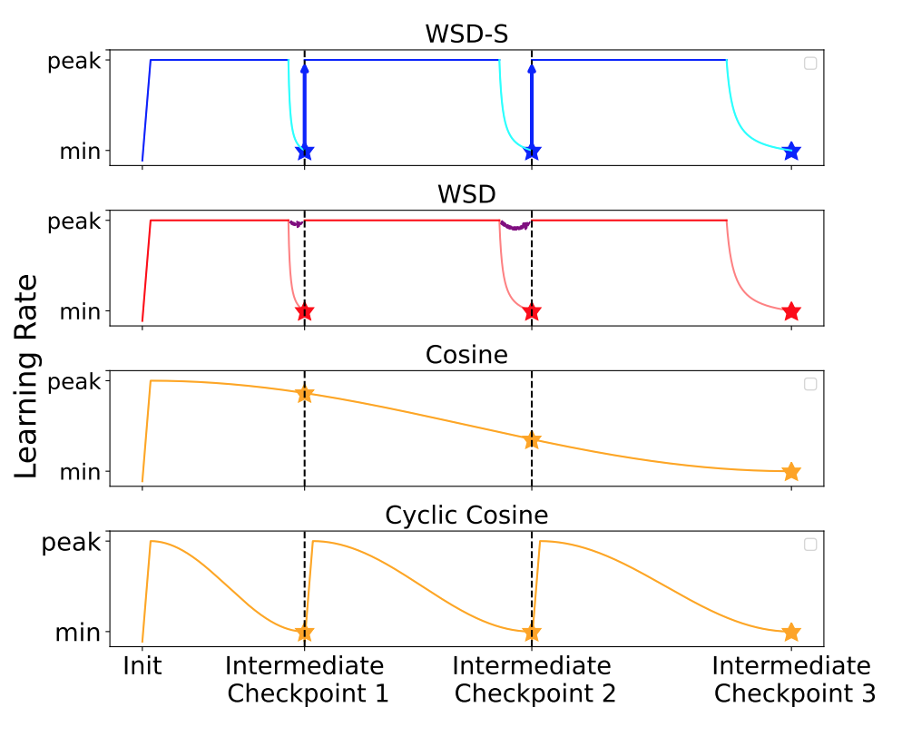

# Training Rate Scheduling

Generally speaking, large learning rate causes oscillation, but small learning rate might stagnate at local minima and need much more computation resource for iteration.

The optimal learning rate should be adaptive first found a likely global minimum area, then converge to the minimum by small iterative steps.

Reference:

* https://arxiv.org/pdf/2106.03763

## Preliminaries on Loss Landscape

### Implications of the 4-th Order Derivative

* First Moment (Mean): The mean of the loss gives us the average value of the loss, which is a basic indicator of the overall performance of the model.
* Second Moment (Variance): The variance tells us about the spread or uncertainty of the loss values around the mean. A high variance indicates a landscape with steep gradients and sharp curvatures, which can make optimization difficult.
* Third Moment (Skewness): Skewness measures the asymmetry of the loss landscape. If the loss landscape is skewed, it means that the optimizer might experience bias towards certain regions, making the optimization process less symmetric and harder to converge in some cases.
* Fourth Moment (Kurtosis): The fourth moment, or kurtosis, captures the tailedness or peakedness of the distribution of the loss. This is where things get interesting in the context of training neural networks.

## Cyclic Cosine

Cycles the learning rate between a base and maximum value following a cosine curve, restarting periodically.

## Warmup-Step-Decay

      

 
