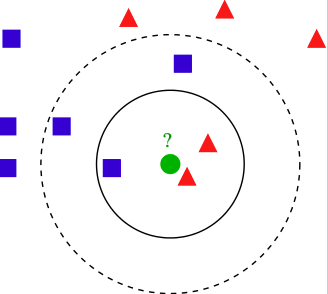

# K-means and KNN

K-means vs KNN:

* k-means is a clustering algo partitioning points into k sets.
* knn is to find classification of a point assigned to the nearest k neighbors' label.

## K-means

*K-means* is a clustering algorithm that tries to partition a set of points into K sets (clusters) such that the points in each cluster tend to be near each other.

The number of clusters is unknown in the beginning, and this is different from KNN that the number of clusters is known as a prior.

### Definition

Given a set of observations $[\mathbf{x}_1, \mathbf{x}_2, ..., \mathbf{x}_n]$, where each observation is a $d$-dimensional real vector,  k-means clustering aims to partition the $n$ observations into $k \le n$ sets $S = \{S_1, S_2, ..., S_k\}$.

Define the mean of a subset $S_i$ as $\mathbf{\mu}\_i$, K-means attempts to minimize the distances of all observations to their nearest mean:
$$
arg \space \underset{S}{min} \space \sum^k_{i=1} \sum_{\mathbf{x} \in S_i} ||\mathbf{x}-\mathbf{\mu}||^2
$$

### Optimization Steps

1. Give some initial guesses of subnet means $\mathbf{\mu} = [\mu_1^{(1)}, \mu_2^{(1)}, ..., \mu_k^{(1)}]$

2. Assignment: find a point's nearest neighbourhood mean by
$$
S^{(t)}\_i = \{x_p : ||x_p - \mu^{(t)}\_i||^2 \le ||x_p - \mu^{(t)}_j||^2, \forall j, 1 \le j \le k \}
$$

3. Update means/centroids
$$
\mu_i^{(t+1)} = \frac{1}{|S_i^{(t)}|} \sum_{x_j \in S^{(t)}\_i } x_j
$$

Repeat the 2nd and 3rd steps, until it converges.

## KNN

*K-nearest neighbors* (KNN) is a classification (or regression) algorithm that in order to determine the classification of a point, combines the classification of the $K$ nearest points.

### Example

Given a set of known observations with known classified labels, we want to determine the label of the green dot.

If nearest neighbour number is $k=3$, the green dot is assigned triangle red;

If nearest neighbour number is $k=5$, the green dot is assigned rectangle blue;

