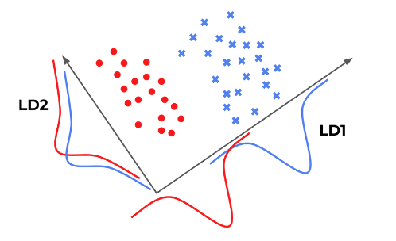
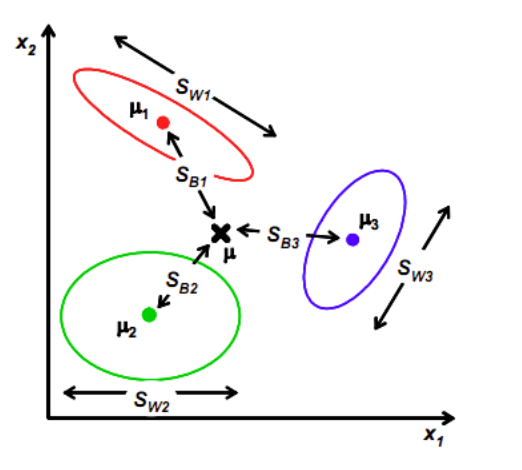

# Linear Discriminant Analysis (LDA)

LDA projects the source data space (assumed normal distributions) to a new space of lower dimensionality that tries clustering samples of the same labels.

The figure below shows a simple LDA classification that LD2 $2$d-$1$d projection renders a bad separation result while LD1's is much better. The $2$d-$1$d projection refers to the $2$-d data points projected onto the arrow-defined $1$-d lines.
 
This gives advantage over PCA that bases on SVD. The source data distribution is nearly a rectangle whose eigenvalues $\mathbf{\sigma}_j$ might not be distinctive. 

Consider a set of observations $\mathbf{x} \in \mathbb{R}^{N\times d}$ ($N$ is the total number of samples and $d$ is the number of input space dimensions) and labels $\mathbf{y}$. LDA assumes that the conditional probability density functions $p(\mathbf{x}|\mathbf{y}=y_j)$ are multivariate normal distributions $N(\mathbf{\mu}_j, \mathbf{\Sigma}_j)$ on a lower dimension projection space.

There are $k$ classes such that $\mathbf{y}\_i \in \mathbf{C}=[C_1, C_2, ..., C_k]$. Denote $N_j$ as the number of samples for the $j$-th class $C_j$, and $X_j$ as the sample set for the class $C_j$. Accordingly, $\mathbf{\mu}_j$ refers to the mean of $X_j$ and $\mathbf{\Sigma}_j$ for the sigma of $X_j$.

The mean $\mathbf{\mu}_j$ and variance $\mathbf{\Sigma}_j$ for each class $C_j$ can be computed as below.

$$
\begin{align*}
\mathbf{\mu}_j &= \frac{1}{N_j} \sum_{\mathbf{x}\_i \in X_j} \mathbf{x}\_i \\\\
\mathbf{\Sigma}_j &= \sum_{\mathbf{x}\_i \in X_j} (\mathbf{x}\_i - \mathbf{\mu}_j)(\mathbf{x}\_i - \mathbf{\mu}_j)^\text{T}
\end{align*}
$$

## $2$-d Binary Classification Example

$2$-d data binary classification can be described as having the input $\mathbf{x}=\big[ \begin{bmatrix} x_1 \\\\ x_2 \end{bmatrix}_1, \begin{bmatrix} x_1 \\\\ x_2 \end{bmatrix}_2, ..., \begin{bmatrix} x_1 \\\\ x_2 \end{bmatrix}\_i, ..., \begin{bmatrix} x_1 \\\\ x_2 \end{bmatrix}_n \big]^\text{T}$, 
and their corresponding labels $\mathbf{y}\_i \in \mathbf{C}=[C_1, C_2]$. 

Still consider this example. A good separation such as LD1 should have vastly different $\mu_1$ and $\mu_2$, and large $\Sigma_1, \Sigma_2$ (indicating two distinctive "lean" Gaussian distributions). LD2 in contrast, has $\mu_1 \approx \mu_2$ and small $\Sigma_1, \Sigma_2$ (indicating two overlapping "fat" Gaussian distributions).

In other words, the below expression should be maximized.

$$
\frac{(\mu_1-\mu_2)^2}{\Sigma_1^2+\Sigma_2^2}
$$

In LDA, $S_b=(\mu_1-\mu_2)^2$ is termed *Between class scatter* and $S_w=\Sigma_1^2+\Sigma_2^2$ is termed *Within class scatter*.

Here, the problem becomes optimizing the $2$d-$1$d projection so that $S_b$ is maximized and $S_w$ is minimized. 

Define a projection matrix $W$. Projection on each data point to a lower dimension space can be expressed as $\mathbf{w}^\text{T}\mathbf{x}\_i$.

The variance can be computed as below.

$$
\begin{align*}
    \sum_{j=1}^{C=2} \sum_{\mathbf{x} \in X_j}
    (\mathbf{w}^\text{T}\mathbf{x}-\mathbf{w}^\text{T}\mathbf{\mu}_j)^2 &=
    \sum_{j=1}^{C=2} \sum_{\mathbf{x} \in X_j}\big(
        \mathbf{w}^\text{T}\ (\mathbf{x}-\mathbf{\mu}_j)
    \big)^2
    \\\\ &=
    \sum_{j=1}^{C=2} \sum_{\mathbf{x} \in X_j}
    \mathbf{w}^\text{T} (\mathbf{x}-\mathbf{\mu}_j)(\mathbf{x}-\mathbf{\mu}_j)^\text{T} \mathbf{w}
    \\\\ &=
    \mathbf{w}^\text{T} \sum_{j=1}^{C=2}  \sum_{\mathbf{x} \in X_j}
    (\mathbf{x}-\mathbf{\mu}_j)(\mathbf{x}-\mathbf{\mu}_j)^\text{T} \mathbf{w}
    \\\\ &=
    \mathbf{w}^\text{T} \mathbf{\Sigma}
     \mathbf{w}
\end{align*}
$$

The optimization can be expressed as below
$$
arg \space \underset{W}{max} \space
\mathbf{J}(W)=
\frac{W^\text{T} S_b W}{W^\text{T} S_w W}=
\frac{\big|\big|
    \mathbf{w} \mathbf{\mu}_0 - \mathbf{w} \mathbf{\mu}_1
\big|\big|^2}{
    \mathbf{w}^\text{T} \Sigma_0 \mathbf{w} + 
    \mathbf{w}^\text{T} \Sigma_1 \mathbf{w} 
}
$$

The optimal $W^*$ where $\mathbf{J}$ reaches maximum can be computed by $\frac{\partial \mathbf{J}}{\partial W}=0$.

Before the derivative computation, should first perform normalization. Otherwise, there is an additional dimension to optimize: projection scaling (reference homography). However, projection scaling does not affect the result of $\mathbf{J}(W)$, since only projection direction is required.

Here for normalization, set $\big|\big|\mathbf{w}^\text{T} S_w \mathbf{w}\big|\big|=1$. Introduce Lagrange multiplier, there is
$$
\mathcal{L}(\mathbf{w})=
\mathbf{w}^\text{T} S_b \mathbf{w} - \lambda(\mathbf{w}^\text{T} S_w \mathbf{w}-1)
$$

Compute the Lagrange multiplier, there is

$$
\begin{align*}
    && 
    \frac{\partial \mathcal{L}}{\partial \mathbf{w}}
    &=
    2 S_b \mathbf{w} - 2 \lambda S_w \mathbf{w} = 0
    \\\\ \Rightarrow && 
    S_b \mathbf{w} &= \lambda S_w \mathbf{w}
    \\\\ \Rightarrow && 
    S_w^{-1} S_b \mathbf{w} &= \lambda \mathbf{w}
\end{align*}
$$

The above derivation reveals that $W$ is the eigenvectors of $S_w^{-1} S_b$.

Remember $S_b = (\mathbf{\mu_1}-\mathbf{\mu_2})(\mathbf{\mu_1}-\mathbf{\mu_2})^\text{T}$; substitute it into the above equation and set $\lambda_m = (\mathbf{\mu_1}-\mathbf{\mu_2})^\text{T} \mathbf{w}$. The interesting thing is that $\lambda_m$ is a scalar ($(\mathbf{\mu_1}-\mathbf{\mu_2})^\text{T} \in \mathbb{R}^{1 \times d}$ and $\mathbf{w} \in \mathbb{R}^{d \times 1}$), and $\lambda$ in Lagrange multiplier definition is a scalar as well. Since projection scaling does not affect projection direction, $\lambda_m$ and $\lambda$ can be cancelled out.

The optimal projection $W^*$ that only concerns about the projection direction can be computed as below.

$$
\begin{align*}
&&
S_w^{-1} S_b \mathbf{w} = 
S_w^{-1} (\mathbf{\mu_1}-\mathbf{\mu_2})(\mathbf{\mu_1}-\mathbf{\mu_2})^\text{T} \mathbf{w}&=
\lambda \mathbf{w}
\\\\ \Rightarrow &&
S_w^{-1} (\mathbf{\mu_1}-\mathbf{\mu_2}) \lambda_m&=
\lambda \mathbf{w}
\\\\ \Rightarrow &&
\mathbf{w} &= S_w^{-1} (\mathbf{\mu_1}-\mathbf{\mu_2}) 
\end{align*}
$$

Finally, the optimal projection is $\mathbf{w}^*=S_w^{-1} (\mathbf{\mu_1}-\mathbf{\mu_2})$,
and the prediction can be computed by $\hat{\mathbf{y}}\_i=\mathbf{w}^{*\text{T}}\mathbf{x}\_i$.

To determine the label being $C_1$ or $C_2$, a threshold $t$ can be set up. The most common thresholding is taking the mean of the two classes' centroids $t=\frac{\mathbf{w}^{*\text{T}}\mathbf{\mu}_1 + \mathbf{w}^{*\text{T}}\mathbf{\mu}_2}{2}$. Then labelling can be expressed as
$$
\hat{\mathbf{y}}\_i = 
\left\{
    \begin{array}{cc}
        C_1 & \mathbf{w}^{*\text{T}}\mathbf{x}\_i \ge t
        \\\\
        C_2 & \mathbf{w}^{*\text{T}}\mathbf{x}\_i < t
    \end{array}
\right.
$$

## Multivariate Scenarios

For multivariate distributions such as $\mathbf{x}=\bigg[ \begin{bmatrix} x_1 \\\\ x_2 \\\\ \vdots  \\\\ x_d\end{bmatrix}_1, \begin{bmatrix} x_1 \\\\ x_2 \\\\ \vdots  \\\\ x_d \end{bmatrix}_2, ..., \begin{bmatrix} x_1 \\\\ x_2 \\\\ \vdots  \\\\ x_d \end{bmatrix}\_i, ..., \begin{bmatrix} x_1 \\\\ x_2 \\\\ \vdots  \\\\ x_d \end{bmatrix}_N \bigg]^\text{T}$, 
and their corresponding labels $\mathbf{y}\_i \in \mathbf{C}=[C_1, C_2, ..., C_k]$, the $S_b$ and $S_w$ can be computed as below.

* $S_w$'s computation first finds $\mathbf{\mu}_j=\frac{1}{N_j}\sum^{N_j}\_{\mathbf{x}\_i \in X_j} \mathbf{x}\_i$, then computes $S_w$ by summing up all classes' variances.

$$
S_w = \sum_{j=1}^{C_k} \sum_{\mathbf{x}\_i \in X_j}
(\mathbf{w}^\text{T}\mathbf{x}\_i-\mathbf{w}^\text{T}\mathbf{\mu}_j)^2
$$

* $S_b$'s computation first calculates the global mean $\mathbf{\mu}=\frac{1}{N}\sum^N_{i=1} \mathbf{x}\_i$, then sums up the respective variances of each class mean $\mathbf{\mu}_j$. The variance is not normalized so that $N_j$ is included ($S_w$ sums up all $\mathbf{x}\_i \in X_j$ so that $S_b$ needs $N_j$ for each class $C_j$). 
  
$$
S_b = \sum_{j=1}^{C_k} N_j (\mathbf{\mu}_j - \mathbf{\mu})(\mathbf{\mu}_j - \mathbf{\mu})^\text{T}
$$

## Discussions

Consider this equation $S_w^{-1} S_b \mathbf{w} = \lambda \mathbf{w}$ that gives the optimal projection $\mathbf{w}^*$. The general method is to compute eigenvalues of $S_w^{-1} S_b$, then pick top few eigenvalue-corresponded eigenvectors $\mathbf{w}$ that together form the projection matrix $W$.

Since the global mean $\mathbf{\mu}$ is known, the last class's mean $\mathbf{\mu}_k$ can be linearly represented by the previous $k-1$ classes' means $a_0 \mathbf{\mu} + \sum_{j=1}^{k-1} a_j \mathbf{\mu}_j$, where $a_j$ is the coefficient for the class $C_j$. As a result, $S_b$ can at most have $rank(S_b)=k-1$, which indicates that $S_b$ at most have $k-1$ eigenvectors, and $W$ can at most project into a $k-1$ dimensional space.

### Drawbacks

* Projection only has $k-1$ dimensions
* Eigenvectors are not necessarily orthogonal