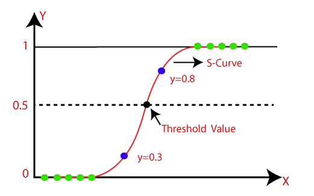

# Logistic Regression

## Motivation and Deduction

Consider independent binary tests $y_i \in \{0,1\}$, by Bernoulli distribution to model the tests: $y_i \sim \text{Bernoulli}(\pi_{i})$, where $\pi_i$ is the probability of $y_i=1$ (the opposite is $1-\pi_i$ for $y_i=0$).

A sequence of Bernoulli trials $y_1, y_2, ..., y_n$ with a constant probability $\pi_i$ is

$$
\prod^{n}\_{i=1} f(y_i; \pi_i)^{y_i} \big(1-f(y_i; \pi_i)\big)^{1-y_i} =
\prod^{n}\_{i=1} \pi_i^{y_i} (1-\pi_i)^{1-y_i}
$$

Usually, likelihood is maximized at $\hat{p}=\frac{1}{n} \sum^n\_{i=1} y_i$ (just count the $y_i$ events).
However, if it is known that the result $y_i$ is dependent on conditions/inputs, e.g., ${x}\_i \rightarrow y_i$, the likelihood $\pi_i$ can be better approached by taking consideration the conditions/inputs ${x}\_i$.

Now, the problem is to map real inputs to a probability such that ${x} \in \mathbb{R} \rightarrow y \in \{0, 1\} \rightarrow \pi \in [0,1]$.

To further explain the problem: the sequence of Bernoulli trials see $y_i \in \{0, 1\}$, and given $f(y=0; \pi)=1-\pi$ and $f(y=1; \pi)=\pi$, the problem seeks to find a continuous expression of the probability of $y=1$ event by the input ${x} \in \mathbb{R}$.

Illustrated as below, need to define $\pi$ so that $\frac{f(y=1; \pi)}{f(y=0; \pi)} > 0$ can be covered in all positive real numbers, and there is monotony that, when most of $y_i$ are $y_i=1$, there is $\lim\frac{f(y=1; \pi)}{f(y=0; \pi)}=+\infty$ and when most of $y_i$ are $y_i=0$, there is $\lim\frac{f(y=1; \pi)}{f(y=0; \pi)}=-\infty$.

$$
\begin{align*}
\frac{f(y=1; \pi)}{f(y=0; \pi)} &= \frac{\pi}{1-\pi} \\\\
&= \frac{\frac{e^x}{1+e^x}}{1-\frac{e^x}{1+e^x}} \\\\
&= \frac{e^x}{(e^x+1)\Big(\frac{1+e^x}{1+e^x}-\frac{e^x}{1+e^x}\Big)} \\\\
&= \frac{e^x}{(e^x+1)\Big(\frac{1+e^x-e^x}{1+e^x}\Big)} \\\\
&= \frac{e^x}{(e^x+1)\Big(\frac{1}{1+e^x}\Big)} \\\\
&= e^x \\\\
\Rightarrow \qquad \ln \frac{\pi}{1-\pi} &= x
\end{align*}
$$

$x=\ln\frac{\pi}{1-\pi}$ is proposed for $\pi \in [0,1]$, the mapping is to all numbers in real $x \in \mathbb{R}$.
And $\pi=\frac{e^x}{1+e^x}$ (the *sigmoid function*) is proposed so that $e^x$ can be easily computed/mapping ${x} \rightarrow y$.

This is useful such as in activation function in deep learning that it outputs most/little of the "energy" when the result is almost certain to be true/false, rather than a simple linear "energy" output.

### Derivative

Given $\pi(x)=\frac{e^x}{1+e^x}$, the derivative is $\pi'(x)=\pi(x)\big(1-\pi(x)\big)$.

Interestingly, $\pi'(x)$ is exactly a step of a sequence of Bernoulli trials $\prod^{n}\_{i=1} \pi_i^{y_i} (1-\pi_i)^{1-y_i}$.

## Function Form

Suppose there are a number of input/output pairs with the mapping ${x}\_i \in \mathbb{R} \rightarrow y_i \in \{0 ,1\} \rightarrow \pi(y_i) \in [0,1]$,
The expression $x=\ln\frac{\pi}{1-\pi} \Rightarrow \pi(x)=\frac{e^x}{1+e^x}$ says that the probability of the event $y=1$ can be best described by the sigmoid curve.

      

 

$$
y = 
\frac{\exp(x)}{\exp(x)+1}=
\frac{1}{1+e^{-\frac{x-\mu}{s}}}
$$
