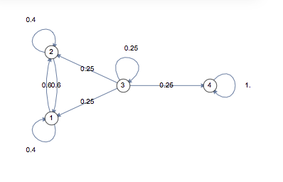
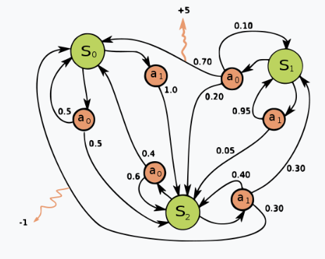

# Markov Chain

A Markov chain experiences transitions from one state to another according to certain probabilistic rules.

Each state's transition probability only depends on its previous state's.

## The Markove Property
$$
p(X_n=x_n | X_{n-1} = x_{n-1})
=
p(X_n=x_n | X_{0} = x_{0}, X_{1} = x_{1}, ..., X_{n-1} = x_{n-1})
$$
where $X_i$ is a static state in Markov chain, and $x_i$ is the $i$-th input.

## Transition Probability Maxtrix

Transition at the $i$-th time for the below graph can be expressed as

$$
p_i=
\begin{bmatrix}
      0.4 & 0.6 & 0 & 0 \\
      0.6 & 0.4 & 0 & 0 \\
      0.25 & 0.25 & 0.25 & 0.25 \\
      0 & 0 & 0 & 1
\end{bmatrix}
$$

## Markov Decision Process

*Markov decision process* added probability transition *action* $a_k$ between states $s_i$ and $s_j$.
The transition probability can be expressed as $P_a(s_i, s_j)=P(s_{t+1}=s | s_t=s, a_t=a)$.

      

 