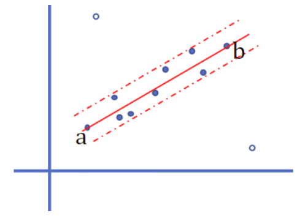

# Random Sample Consensus (RANSAC)

Random sample consensus (RANSAC) is an iterative method to estimate model parameters when outliers are to be accorded no influence on the values of the estimates. In other words, it is an outlier detection method.

      

 

1. Select a fitting model and some random data points

The chosen model is at the user's discretion, that can be a linear or quadratic function, or a more complex prediction model.

Data point selection is totally random.

2. Apply the fitting model on the sampled random data points

The applied fitting model finds the optimal parameters for configuration by the least squared error.

The inlier data points from the entire dataset falling in this fitting model are recorded.

3. Repeat the 1. and 2. step until the entire dataset is covered/sampled

4. Check the recorded data points collected from the 2. step.

If a data point is viewed by the fitting model as a inlier point multiple times during the repeated 1. and 2. steps, this data point is considered an inlier.

## RANSAC Sampling

Apparently, the threshold discriminating between inliers and outliers has significant impact on RANSAC accuracy.

Define a threshold $t^2$, there is
$$
\left\{
    \begin{matrix}
        \text{inlier} & d^2 < t^2 \\\\
        \text{outlier} & d^2 \ge t^2 \\\\
    \end{matrix}
\right.
$$
where $t^2=\Gamma_m^{-1}(\alpha) \cdot \sigma^2$. 
Here, $\alpha$ is the probability of inlier percentage, typically set $\alpha=0.95$ which indicates that there are $5\%$ of samples are outliers. 
$\sigma^2$ is the variance.

When $\alpha=0.95$, by Chi-squared distribution $\mathcal{X}_m^2$ such that $\Gamma_m(\alpha)=\int^{k^2}_m \mathcal{X}^2_m (\xi) d\xi$, there is
|Dimension|Typical Models|$t^2$|
|-|-|-|
|$1$|Linear models|$3.84\sigma^2$|
|$2$|Homography models|$5.99\sigma^2$|
|$3$|Trifocal tensor models|$7.81\sigma^2$|

Comment: in computer vision, the *trifocal tensor* (also *tritensor*) is a $3 \times 3 \times 3$ array of numbers (i.e., a tensor) that incorporates all projective geometric relationships among three views, 
and can be considered as the generalization of the fundamental matrix in three views.

### Sampling Number $N$

When the number of samples is small, the optimal model can be found by traversing all permutation and combination cases.
When the number of samples is large, such as in vSLAM, there are thousands of matches just in two images, and traversing all cases would be too time-consuming.
The computation complexity is $O(n^2)$.

Define the number of iterative samplings as $N$, and each sampling contains $n$ samples ($N$ tests where each test has $n$ samples).

* **Goal**: Want to increase $N$ so that the probability of at least one sampling where no outliers are found (i.e., all $n$ samples are inliers in one test) is acceptable.

Set the probability of at least one sampling containing all inliers as $p$, typically there is $p=0.99$, and $\omega$ as the probability of a sample being an inlier (so that $\epsilon=1-\omega$ is the outlier probability).
To reach the goal of $N$ tests where each test has $n$ samples, there is

$$
\begin{align*}
&&&
(1-\omega^n)^N=1-p
\\\\ \rightarrow &&&
N=
\frac{\log(1-p)}{\log\big( 1-(1-\epsilon)^n \big)}
\end{align*}
$$

In conclusion, should at least conduct $N=\frac{\log(1-p)}{\log\big( 1-(1-\epsilon)^n \big)}$ tests.

## RANSAC Iteration Termination Condition

When outlier percentage $\epsilon$ is known, 
simply define the termination condition $T=(1-\epsilon)n$ that for a few consecutive tests, every time the number of inliers is greater than the threshold $n\_{\text{inliers}}>T$,
it can be said RANSAC is converged.

### Adaptive Termination Condition

Often is the case that $\epsilon$ is unknown and not fixed. 
The **goal** is that: dynamically increase $N$, so that there is no lower outlier percentage $\epsilon$. In other words, as more tests are conducted, the number of outliers cannot be reduced.

In detail:

1. Set Total test number $N=+\infty$, set conducted test number $n\_{\text{tested}}=0$
2. When $N>n\_{\text{tested}}$, compute $\epsilon=1-\frac{n\_{\text{inliers}}}{n\_{\text{outliers}}}$; compute $N_{}=\frac{\log(1-p)}{\log\big( 1-(1-\epsilon)^n \big)}$
3. Set $n\_{\text{tested}}=n\_{\text{tested}}+1$, and repeat the 2. step.
4. When $N\le n\_{\text{tested}}$, terminate computation
