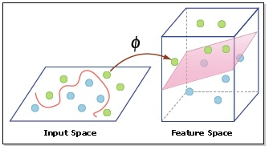
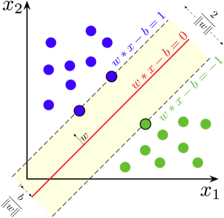

# Support Vector Machine

It attempts to add dimensionality (constructing a hyperplane by a kernel function $\phi$) for a dataset that cannot be linearly separated in the source data space, but be separable in higher dimensional space.

## Definition

Given a dataset $(\bold{x}, \bold{y})=[(x_1, y_1), (x_2, y_2), ..., (x_m, y_m)]$, where $x_i$ is a $n$-dimensional vector.

Construct a hyperplane that makes training data $\bold{x}$ satisfy
$$
\bold{w}^T \bold{x} - b = 0
$$
where $\bold{w}$  is the (not necessarily normalized) normal vector to the hyperplane.
$$
\bold{w}^T \bold{x} - b = 1,\quad \text{for } y_i=1
\\
\bold{w}^T \bold{x} - b = -1,\quad \text{for } y_i=-1
$$

This can be rewritten as
$$
y_i(\bold{w}^Tx_i-b) \ge 1, \quad \forall x_i \in \bold{x}, \space \forall y_i \in \bold{y}
$$

To achieve best separation, we want to maximize $\frac{2}{||\bold{w}||}$, which means
$$
arg \space \underset{\bold{w}}{min} ||\bold{w}||
$$
subject to
$$
y_i(\bold{w}^Tx_i-b) \ge 1
$$

### Example

$x_i = (x_{i,1}, x_{i,2})$ is a two-dimensional sample. We want to maximize $\frac{b}{||\bold{w}||}$

## Kernel Tricks

Kernel functions are used to map source data space to a higher dimensional space that makes separation easy. The additional dimensions $m$ are the result of a kernel function: $\phi(\overrightarrow{x_i}, \overrightarrow{x_j}): n \rightarrow m$, where $n$ is the nuumber of dimensions in source dataset. As a result, the new space has $n+m$ dimensions. $i, j$ are the indices referencing data samples.

Choice of kernels depends on dataset distributions.

Some typical kernels are

* Polynomial
$$\phi(\overrightarrow{x_i}, \overrightarrow{x_j}) = (\overrightarrow{x_i} \cdot \overrightarrow{x_j})^d
$$

**Example**: set $d=2$, and given two sample points $\overrightarrow{x_1}=(5,6,7)$ and $\overrightarrow{x_2}=(8,9,10)$

$$
\begin{align*}
\phi(\overrightarrow{x_1} \cdot \overrightarrow{x_1})
&=
(5,6,7) \cdot (5,6,7)
\\ &=
(x_1x_1, x_1x_2, x_1x_3, x_2x_1, x_2x_2, x_2x_3, x_3x_1, x_3x_2, x_3x_3)
\\ &=
(25, 30, 35, 30, 36, 42, 35, 42, 49)

\\
\\

\phi(\overrightarrow{x_2} \cdot \overrightarrow{x_2})
&=
(8,9,10) \cdot (8,9,10)
\\ &=
(x_1x_1, x_1x_2, x_1x_3, x_2x_1, x_2x_2, x_2x_3, x_3x_1, x_3x_2, x_3x_3)
\\ &=
(64, 72, 80, 72, 81, 90, 80, 90, 100)

\\
\\

\phi(\overrightarrow{x_1}, \overrightarrow{x_2})
 &=
\phi(\overrightarrow{x_1} \cdot \overrightarrow{x_1}) \cdot \phi(\overrightarrow{x_2} \cdot \overrightarrow{x_2})
\\ &=
(5,6,7)^2 \cdot (8,9,10)^2
\\ &=
(1600, 2160, 2800, 2160, 2916, 3780, 2800, 3780, 4900)
\\ &=
26896

\\ \text{alternatively}

\\ &=
(\overrightarrow{x_1} \cdot \overrightarrow{x_2})^2
\\ &=
(5 \cdot 8 + 6 \cdot 9 + 7 \cdot 10)^2
\\ &=
26896
\end{align*}
$$

* Gaussian radial basis function
$$
\phi(\overrightarrow{x_i}, \overrightarrow{x_j}) = e^{-\gamma||\overrightarrow{x_i} - \overrightarrow{x_j}||^2}, \quad \gamma>0
$$

* sigmoid

$$
\phi(\overrightarrow{x_i}, \overrightarrow{x_j}) = tanh (\gamma \overrightarrow{x_i} \cdot \overrightarrow{x_j} + c)
$$