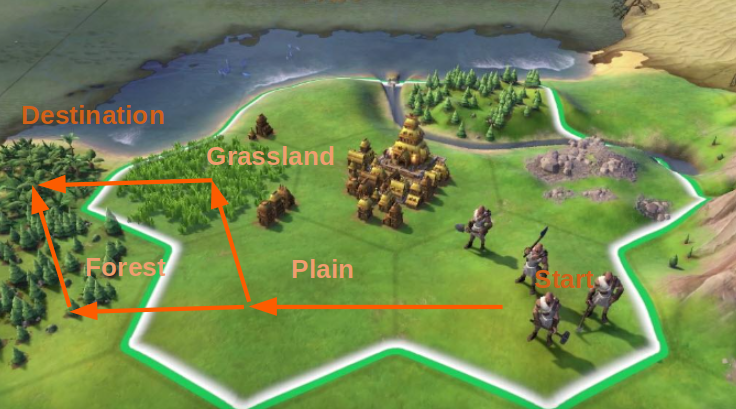

# Reinforcement Learning

Reinforcement learning describes how to guide actions $a \in A$ of an agent given a set of environments and agent states $s \in S$ to achieve high/maximize reward objective function $R(s_t,s_{t+1})$ from state $s_t$ to $s_{t+1}$.
In this process, $P_a(s_t,s_{t+1})=P(S_{t+1}=s' | S_t=s, A_t=a)$ is the probability distribution computed at the time $t$ from state $s_t$ to $s_{t+1}$.

* Policy

The agent's action selection is modeled as a map called *policy* $\pi$ to a probability $0 \le \pi(a,s) \le 1$.

$$
\begin{align*}
\pi(a,s) = P(A_t = a | S_t = s)
\end{align*}
$$

In other words, a policy is the action probability distribution conditioned on states.

For example, a group of people (aka agent) traveling on a land mass (described in this figure) to destination should have below actions and states.

      

 

|Actions|States|
|-|-|
|$a_1=\text{TravelByForest}$|$s_0=\text{OnStartTile}$|
|$a_2=\text{TravelByGrassland}$|$s_1=\text{OnGrassland}$|
|$a_3=\text{TravelByPlain}$|$s_2=\text{OnPlainTile}$|
||$s_3=\text{OnForestTile}$|
||$s_4=\text{OnDestinationTile}$|

The policy $\pi(a,s) = P(A_t = a | S_t = s)$ can be summarized to the below table, that each column's values should sum up to $1.0$, except for $\text{OnDestinationTile}$ where no further action is required as already reached to the destination.

Since grassland is easy to transpass compared to forest, this policy assigns higher probability to $\text{TravelByGrassland}$ than to $\text{TravelByForest}$.
In practice, policy $\pi(a,s)$ is learned via optimization.

$$
\begin{matrix}
                        & \text{OnStartTile} & \text{OnDestinationTile} & \text{OnPlainTile} & \text{OnForestTile} & \text{OnGrasslandTile} \\\\
\text{TravelByPlain}    & 1.0                & \text{Not Available}     & 0.0                & 0.0                 & 0.0                    \\\\
\text{TravelByGrassland}& 0.0                & \text{Not Available}     & 0.8                & 0.0                 & 1.0                    \\\\
\text{TravelByForest}   & 0.0                & \text{Not Available}     & 0.2                & 1.0                 & 0.0                    \\\\
\end{matrix}
$$

* Optimization Objective

Optimization objective $J$ is defined as *expected discounted return* to be maximized.

Set $G_t$ as the discounted return at a time $t$, and $R_{t+1}$ is the reward for transitioning from state $S_t$ to $S_{t+1}$.
Having included $0 \le \gamma < 1$ served as a discount rate that future rewards $R_{t+k}$, where $k > 0$, are discounted then summed to the total discounted return.

$$
G_t = \sum^{\infty}_{k=0} \gamma^k R_{t+k+1} =
R_{t+1} + \gamma R_{t+2} + \gamma^2 R_{t+3} + ...
$$

Reward $R_t$ refers to a custom function to encourage optimization converged to a desired policy distribution.
For instance, in the previous example of land exploration, there could be custom reward setup such as $R_t(a=\text{TravelByPlain}) = 10$, $R_t(a=\text{TravelByGrassland}) = 7$, and $R_t(a=\text{TravelByForest}) = 2$.
During $\max_{\pi} \sum_t G_t$ training, agent is encouraged to take action $a=\text{TravelByPlain}$ as it maximizes the total reward.

$\gamma^t R_{t+1}$ says that for distant future where $t \rightarrow +\infty$, the reward $\gamma^t R_{t+1}$ will be very small.
This renders rewards get weighted more on recent time rather than the faraway future.

The action-value ("Q-value", Quality) of a state-action pair is

$$
Q_{\pi}(s,a) = \mathbb{E}_{\pi}(G_t | \underbrace{S_{t} = s, A_{t} = a}_{\pi} )
$$

The state-value of a state $s$ is the expected return ("Value Function"), that is the "average result given different actions".

$$
\begin{align*}
V_{\pi}(s) &= \mathbb{E}_{\pi}(G_t | S_{t} = s) \\\\
      &= \sum_{a \in A} Q_{\pi}(s,a) \pi(a|s)
\end{align*}
$$

Set $\theta$ as the parameters that influence policy $\pi$, together denoted as $\pi_{\theta}(a|s)$.
The reward function to be maximized is defined as

$$
\mathcal{J}(\theta) = \sum_{s \in S} d_{\pi_{\theta}}(s) V_{\pi_{\theta}}(s)= \sum_{s \in S} d_{\pi_{\theta}}(s) \sum_{a \in A} Q_{\pi_{\theta}}(s,a) \pi_{\theta}(a|s)
$$

where $d_{\pi_{\theta}}(s) = \lim_{t \rightarrow \infty} \big(P(S_t=s | S_0, \pi_{\theta}) \big)^t$ is state stationary probability distribution.
$P$ is Markov chain transition probability matrix.

The difficulty of finding the optimal policy $\pi^{*}_{\theta} = \argmax_{\theta} \mathcal{J}(\theta)$ is the infinite combinations of state-action pairs $\pi(a,s) = P(A_t = a | S_t = s)$ often observed in the real world, hence the optimal policy search approach is often by iteratively selecting $\pi(a,s)$ rather than brute force (exhaustively find all $\pi(a,s)$ pairs).

To solve $\max_{\theta} \mathcal{J}(\theta)$, here introduces *Markov decision process* that formulates the problem into an iterative $\theta$ update issue as time progresses.

### On-Policy vs Off-Policy

*Sample efficiency* in reinforcement learning talks about how many policy iterations to take for the objective to converge to an optimal value.
On-policy vs off-policy achieve optimality via different sample choices: to use a specific policy $\pi(s,a)$ or greedy search of possible actions $a$.

* Off-Policy: $Q(s,a)$ is learned from taking different actions (greedy search of all possible actions)
* On-Policy: $Q(s,a)$ is learned from taking the current policy actions

For example, look at the $Q(s,a)$ gain from $t$ to $t+1$.
On-policy approach just takes action $a_{t+1}$, while off-policy approach goes by greedy search of all possible $a_{t+1}$ then choose the action that maximize $Q(s_{t+1},a_{t+1})$.

* On-Policy: $Q(s_{t+1},a_{t+1})-Q(s_t, a_t)$
* Off-Policy: $\max_{a} Q(s_{t+1},a_{t+1})-Q(s_t, a_t)$

## Markov Decision Process

Almost all the reinforcement learning problems can be framed as Markov Decision Processes: stationed on $S_t$ and take action $A_t$ generate a reward $R_t$ such that $\underbrace{S_1, A_1}_{\Rightarrow R_1} \rightarrow \underbrace{S_2, A_2}_{\Rightarrow R_2} \rightarrow ...$.

Below shows how Markov decision process as time progresses against how $V_{\pi}(s)$ and $Q_{\pi}(s,a)$ iteratively get updated from $t$ to $t+1$.

$$
\begin{align*}
V_{\pi}(s) &= \mathbb{E}_{\pi}(G_t | S_{t} = s) \\\\
      &= \mathbb{E}_{\pi}(R_{t+1} + \gamma R_{t+2} + \gamma^2 R_{t+3} + ... | S_{t} = s) \\\\
      &= \mathbb{E}_{\pi}(R_{t+1} + \gamma G_{t+1} | S_{t} = s) \\\\
      &= \mathbb{E}_{\pi}(R_{t+1} + \gamma V(S_{t+1}) | S_{t} = s) \\\\
\space \\\\
Q_{\pi}(s,a) &= \mathbb{E}_{\pi}(R_{t+1} + \gamma V(S_{t+1}) | {S_{t} = s, A_{t} = a} ) \\\\
      &= \mathbb{E}_{\pi}(R_{t+1} + \gamma \sum_{a \in A} Q_{\pi}(S_t,A_t) \pi(A_t| S_t) \space \big| \space {S_{t} = s, A_{t} = a} ) \\\\
      &= \mathbb{E}_{\pi}(R_{t+1} + \gamma \mathbb{E}_{a \sim \pi} Q_{\pi}(S_t,a)  \space \big| \space {S_{t} = s, A_{t} = a} ) \\\\
\end{align*}
$$

*Gradient ascent* talks about updating $\theta$ along the direction of $\nabla_{\theta}\mathcal{J}(\theta)$ to find the $\theta^*$ for the optimal $\pi_{\theta}^*$ as time progresses $t \rightarrow \infty$.

## Policy Gradient

$\nabla_{\theta}\mathcal{J}(\theta)$ computation is tricky for requiring determined $\pi_{\theta}$ but candidate actions can be infinite, and determined stationary distribution of states but impractical for action choice is not unknown.

*Policy gradient* is a method to approximate $\nabla_{\theta}\mathcal{J}(\theta)$ that makes the iteratively updating parameters $\theta$ practical.
The result is shown as bellow.

$$
\begin{align*}
\nabla_{\theta}\mathcal{J}(\theta) &=
\nabla_{\theta} \sum_{s \in S} d_{\pi_{\theta}}(s) V_{\pi_{\theta}}(s) \\&= \nabla_{\theta} \sum_{s \in S} d_{\pi_{\theta}}(s) \sum_{a \in A} Q_{\pi_{\theta}}(s,a) \pi(a|s) \\\\
&\propto \sum_{s \in S} d_{\pi_{\theta}}(s) \sum_{a \in A} Q_{\pi_{\theta}}(s,a) \nabla_{\theta} \pi(a|s) \\&= \mathbb{E}_{s \sim d_{\pi_{\theta}}, a \sim \pi_{\theta}} \Big( Q_{\pi_\theta}(s,a) \nabla_{\theta} \ln \big( \pi_{\theta}(a|s) \big) \Big)
\end{align*}
$$

Parameter update is $\theta \leftarrow \theta + \alpha \gamma^t G_t \nabla_{\theta} \ln \big( \pi_{\theta}(A_t | S_t) \big)$, where $\alpha$ is the learning rate.

The parameter update is by gradient ascent.
This is for $\max_{\theta} \mathcal{J}(\theta)$ as the reward is to be maximized.
If reward is a negative function, gradient descent is used to $\min_{\theta} \mathcal{J}(\theta)$.

### Proof of Policy Gradient Theorem

Reference: https://lilianweng.github.io/posts/2018-04-08-policy-gradient/

The proof shows that value function can be unrolled to such that $\nabla_{\theta} V_{\pi_{\theta}}(s) = \sum_{s_x \in S} \eta(s) \phi(s_x)$,
where $\eta(s)=\sum_{k=0}^{\infty} p_{\pi_\theta}(s \rightarrow s_x, k)$ and $\phi(s)=\sum_{a \in A} \nabla_{\theta} \Big(\pi_{\theta}(a|s) Q_{\pi_\theta}(s,a) \Big)$ are defined as the state transition probability and gradient expectation on action, respectively.
They are defined to simplify notations.

In $\eta(s)=\sum_{k=0}^{\infty} p_{\pi_\theta}(s \rightarrow s_x, k)$, the $s \rightarrow s_x$ indicates that state $s$ moving to $s_x$ takes $k+1$ steps.
For example, at the $k$-th step, there is $p_{\pi_\theta}(s \rightarrow s_x, k)=\sum_{s'} p_{\pi_\theta}(s \rightarrow s', k)p_{\pi_\theta}(s' \rightarrow s_x, 1)$, where $s'$ is a middle point state just one step before $s_x$.

The gradient $\nabla_{\theta} \mathcal{J}(\theta)$ can be approximated by the below.

$$
\begin{align*}
\nabla_{\theta} \mathcal{J}(\theta) &=
  \nabla_{\theta} V_{\pi_\theta} (s_0) \\&= \sum_{s_x \in S} \eta(s) \phi(s_x) \\&= \Big( \sum_{s \in S} \eta(s) \Big) \sum_{s \in S} \frac{\eta(s)}{\sum_{s \in S} \eta(s)} \phi(s_x) 
&& \sum_{s \in S} \eta(s) \text{ is a constant} \\\\
&\propto \sum_{s \in S} \frac{\eta(s)}{\sum_{s \in S} \eta(s)} \phi(s_x) \\&= \sum_{s \in S} d_{\pi_{\theta}}(s) \sum_{a \in A} \nabla_{\theta} \Big(\pi_{\theta}(a|s) Q_{\pi_\theta}(s,a) \Big)
&& d_{\pi_{\theta}}(s)=\frac{\eta(s)}{\sum_{s \in S} \eta(s)} \text{ is a stationary distribution} \\\\
&\propto \sum_{s \in S} d_{\pi_{\theta}}(s) \sum_{a \in A} Q_{\pi_\theta}(s,a) \nabla_{\theta} \Big(\pi_{\theta}(a|s) \Big) \\&= \sum_{s \in S} d_{\pi_{\theta}}(s) \sum_{a \in A} Q_{\pi_\theta}(s,a) \pi_{\theta}(a|s) \frac{\nabla_{\theta} \pi_{\theta}(a|s)}{ \pi_{\theta}(a|s)}
&& \text{ by } \frac{dx}{x}=\frac{d(\ln x)}{dx}dx= d(\ln x)  \\&= \underbrace{\sum_{s \in S} d_{\pi_{\theta}}(s)}_{s \sim d_{\pi_{\theta}}} \quad \underbrace{\sum_{a \in A} \pi_{\theta}(a|s)}_{a \sim \pi_{\theta}} Q_{\pi_\theta}(s,a) \nabla_{\theta} \ln \big( \pi_{\theta}(a|s) \big) \\&= \mathbb{E}_{s \sim d_{\pi_{\theta}}, a \sim \pi_{\theta}} \Big( Q_{\pi_\theta}(s,a) \nabla_{\theta} \ln \big( \pi_{\theta}(a|s) \big) \Big)
\end{align*}
$$

Recall that $Q_{\pi_\theta}(s,a)$ is the expectation of the discounted return $G_t$ conditioned on the policy $\pi_\theta$, so that

$$
\begin{align*}
\nabla_{\theta} \mathcal{J}(\theta)&= \mathbb{E}_{s \sim d_{\pi_{\theta}}, a \sim \pi_{\theta}} \Big( Q_{\pi_\theta}(s,a) \nabla_{\theta} \ln \big( \pi_{\theta}(a|s) \big) \Big) \\&= \mathbb{E}_{s \sim d_{\pi_{\theta}}, a \sim \pi_{\theta}} \Big( G_t \nabla_{\theta} \ln \big( \pi_{\theta}(A_t|S_t) \big) \Big) 
\end{align*}
$$

The above method is called *Monte-Carlo policy gradient* that uses selective $A_t$ and $S_t$ pair per timestamp $t$, and compute the expectation on all timestamp $t=1,2,...$.
This method relies on full trajectory of $\underbrace{S_1, A_1}_{\Rightarrow R_1} \rightarrow \underbrace{S_2, A_2}_{\Rightarrow R_2} \rightarrow ...$.

For each timestamp $t$, update parameter $\theta$  such that $\theta \leftarrow \theta + \alpha \gamma^t G_t \nabla_{\theta} \ln \big( \pi_{\theta}(A_t | S_t) \big)$.
This is plausible for $A_t=a$ and $S_t=s$ that see $s \sim d_{\pi_{\theta}}, a \sim \pi_{\theta}$. As time progresses $t \rightarrow \infty$, this term $\gamma^t G_t \nabla_{\theta} \ln \big( \pi_{\theta}(A_t | S_t) \big)$ will render an average result $\frac{1}{T} \sum_{t=1}^T \gamma^t G_t \nabla_{\theta} \ln \big( \pi_{\theta}(A_t | S_t) \big)$ that converges to the expectation $\mathbb{E}_{s \sim d_{\pi_{\theta}}, a \sim \pi_{\theta}}(...)$.

## Proximal Policy Optimization (PPO)

PPO is a variant of Policy Gradient method with improved control of parameter update steps.
PPO proposed two important ideas

* Advantage function $A(s,a)$ that focuses on action reward by taking away state info
* Ratio of policy $\gamma_t(\theta)$ to assign higher weights to good policy (old vs current)

Define an advantage function such that $A(s,a)=Q(s,a)-V(s)$. It can be considered as another version of Q-value with lower variance by taking the state-value off as the baseline.

Define $\gamma_t(\theta)=\frac{\pi_{\theta}(a_t|s_t)}{\pi_{\theta_{\text{old}}}(a_t|s_t)}$ is the ratio controlling the probability under the new and old policies, respectively.

* $\gamma_t(\theta)>1$: action $a_t$ at $s_t$ is more likely to stay in the current policy than the old one
* $1 \ge \gamma_t(\theta) > 0$: action $a_t$ at $s_t$ prefers the old policy than the current one

Finally, the PPO objective is defined as

$$
\mathcal{J}_{\text{clip}}(\theta) =
\mathbb{E}\Big( \min\big( \gamma_t(\theta)  A_t,
\underbrace{\text{clip}(\gamma_t(\theta), 1-\epsilon, 1+\epsilon)}_{\in [1-\epsilon, 1+\epsilon]}
A_t \big) \Big)
$$

By (typically) $\epsilon=0.1$ or $\epsilon=0.2$, the ratio is contained to $\gamma_t(\theta) \in [1-\epsilon, 1+\epsilon]$, so that both old and current policies have influences on the objective $\mathcal{J}_{\text{clip}}(\theta)$.

Minimization with Clipping: The use of the $\min$ function ensures that if the probability ratio goes outside the allowed range, the clipped value is used instead. This prevents the update from being too large, maintaining a "proximal" update.