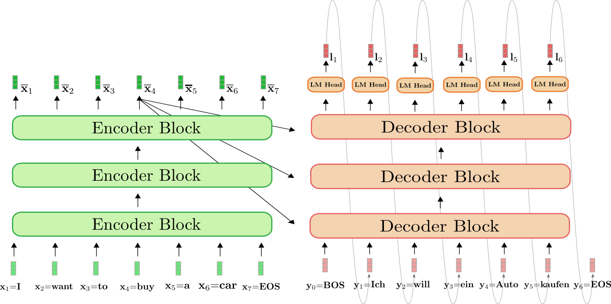

# Attention Mechanism Further Explained

## Understand Attention

Given the attention formula, for $n$ tokens each of $d$ dimensions, there are $Q \in \mathbb{R}^{n \times d}$ and $K^{\top} \in \mathbb{R}^{d \times n}$, and finally $V \in \mathbb{R}^{n \times d}$, (below see $d$ and $d_k$ interchangeably).

$$
\text{Attention}(Q,K,V) = \text{softmax} \big(\frac{Q K^{\top}}{\sqrt{d_k}} \big) V
$$

$Q K^{\top} \in \mathbb{R}^{n \times n}$ gives an "attention score matrix" what tokens be correlated to what next/previous tokens by what scores.
The resulted size $n \times n$ captures the context tokens.

The division by $\sqrt{d_k}$ is to scale down/flat the results of $Q K^{\top}$, so that by $\text{softmax}$ non-linearity, large values of $Q K^{\top}$ will be reduced, and the diffs between small values of $Q K^{\top}$ are amplified.
The flattened values help back-propagation leading to more stable training compared to non-$\sqrt{d_k}$ division.

Define softmax: for $i=1,2,...,n$ and $\bold{z}=(z_1, z_2, ..., z_n)\in \mathbb{R}^n$,

$$
\sigma(\bold{z})_i=
\frac{e^{z_i}}{\sum^n_{j=1}e^{z_j}}
$$

For $e^{z_i}$ grows exponentially, large inputs $z_i$ has significant influence over the activation energy.
This justifies the normalization by division of $\sqrt{d_k}$.

Given $Q K^{\top} \in \mathbb{R}^{n \times n}$, the multiplication by $V \in \mathbb{R}^{n \times d}$ yields the attention of $\mathbb{R}^{n \times d}$ that converts the $n \times n$ token context space back to $n \times d$ feature dimension space for the $n$ tokens.

```py
import numpy as np

Q = X @ W_Q  # Query
K = X @ W_K  # Key
V = X @ W_V  # Value

# Calculate attention scores
scores = Q @ K.T / np.sqrt(d_k)  # Scale the dot product
attention_weights = softmax(scores)  # Apply softmax to get attention weights
output = attention_weights @ V  # Weighted sum of values
```

### Attention Score by $Q K^{\top}$

For example, given $Q \in \mathbb{R}^{5 \times 6}$ and $K^{\top} \in \mathbb{R}^{6 \times 5}$,

```py
import numpy as np

Q = np.array(
[[0,0.9,0.1,0,0,0],
 [0,0,1,0,0,0],
 [0,0,1,0,0,0],
 [0,0,1,0,0,0],
 [0,0,1,0,0,0]])

K = np.array(
[[0,1,0,0,0,0],
 [0,1,0,0,0,0],
 [0,0.1,0.9,0,0,0],
 [0,1,0,0,0,0],
 [0,1,0,0,0,0]])

S = Q @ K.T

print(S)
```

that prints

```txt
[[0.9  0.9  0.18 0.9  0.9 ]
 [0.   0.   0.9  0.   0.  ]
 [0.   0.   0.9  0.   0.  ]
 [0.   0.   0.9  0.   0.  ]
 [0.   0.   0.9  0.   0.  ]]
```

where the 1st row and 3rd col see large vals.
The result derives from $0.9$ in the (1st row, 2nd col) entry in $Q$ correlating to 2nd col in $K$, another $0.9$ at the 3rd col in $Q$ correlating to the (3rd row, 3rd col) in $K$.

This shows that the first token in query $Q$ is correlated to all tokens in key $K$ (except for the 3rd token);
and the 3rd token in key $K$ is correlated to all tokens in query $Q$ (also except for the 3rd token).

### Why Divided by $\sqrt{d_k}$

One sentence explained: for normal distribution random vectors, the dot product tends to have a mean of $d$ and a variance that also scales with $d$.

Let $\bold{q}$ and $\bold{k}$ be a row of $Q$ and $K$.
Assume features present as standard normal distribution, so that each entry of $\bold{q}$ and $\bold{k}$ is of $q_i, k_i \sim N(0,1)$.

Each entry/score of $Q K^{\top}$ is $s=\bold{q} \bold{k} = \sum_{i=1}^d q_i k_i$.

Remember, here to prove $s \in Q K^{\top}$ that there is $s \sim N(0, d)$, not individual for $q_i k_i$.
$s=\bold{q} \bold{k}$ is an entry result of matrix multiplication, not to get confused with normalization by $\frac{1}{d}$, as $s \sim N(0, d)$ is not concerned of $q_i k_i$.

#### Expected Value (Mean)

For $q_i, k_i \sim N(0,1)$, and $q_i$ and $k_i$ are independent to each other, there is

$$
E[q_i k_i] = E[q_i] E[k_i] = 0
$$

So that,

$$
E[s] = E\Bigg[ \sum_{i=1}^d q_i k_i \Bigg] =
 \sum_{i=1}^d E[q_i k_i] = 0
$$

#### The Variance

By definition, there is

$$
\begin{align*}
\text{Var}(s) = \sum_{i=1}^d \big( q_i k_i - \underbrace{E[q_i k_i]}_{=0} \big)^2
= E[s^2]
\end{align*}
$$

Hence, only $E[s^2]$ needs to be computed.

$$
\begin{align*}
&&& \quad s^2 = \Bigg( \sum_{i=1}^d q_i k_i \Bigg)^2
    = \sum_{i=1}^d (q_i k_i)^2 + \sum_{i \ne j} q_i k_i q_j k_j \\
\Rightarrow &&& E(s^2) 
    = \sum_{i=1}^d E\Big[ (q_i k_i)^2 \Big] + \sum_{i \ne j} E\Big[q_i k_i q_j k_j \Big]
\end{align*}
$$

where, for $q_i, k_i \sim N(0,1)$, and $q_i$ and $k_i$ are assumed independent to each other, there are

$$
\begin{align*}
E\Big[ (q_i k_i)^2 \Big] &= E[q_i^2] E[k_i^2] = 1 \cdot 1 = 1 \\
E\Big[q_i k_i q_j k_j \Big] &= E[q_i] E[k_i] E[q_j] E[k_j] = 0
\end{align*}
$$

So that

$$
\text{Var}(s) = E[s^2] =
\sum_{i=1}^d 1 = d
$$

The standard deviation $\sqrt{d}$ describes the mean variance that $\frac{1}{\sqrt{d}}$ makes every score back to standard normal distribution $s \sim N(0, 1)$.

#### Code Example

```py
import numpy as np

rand_size = 10000

mu = 0
sigma = 1
rands_1 = np.random.normal(mu, sigma, rand_size)
rands_2 = np.random.normal(mu, sigma, rand_size)
s = rands_1 * rands_2

s_sum =  np.sum(s)
print(f"sum: {s_sum}")
s_mean =  np.mean(s)
print(f"mean: {s_mean}")
var_s2 = np.sum([x**2 for x in s]) - np.mean(s)**2
print(f"var: {var_s2}")
```

that shows

```txt
sum: 29.899064924872384
mean: 0.0029899064924872386
var: 10317.40248994817
```

### Multi-Head Attention

Define an attention head $\text{head}_i=\text{Attention}(Q_i,K_i,V_i)$, for multi-head, there is

$$
\text{MultiHead}(Q, K, V) = \text{Concat}(\text{head}_1, \text{head}_2, ..., \text{head}_n) W^O
$$

where $W^O$ is a learned weight matrix.

#### Why Multi-Head

Basically, the multi-head transform is a linear transform by $W^O$.

* Project heads into multiple lower-dimensional spaces
* "Summarize" different head attentions, respectively

#### Design of $W^O$

The linear projection by $W^O$ should yield a result matrix same size of input, i.e., `[batch_size, seq_length, d_model]`.

For example for BERT-base with $d_{\text{model}}=768$ and $n_{\text{head}}=12$ heads, there is $d_k=d_v=768/12=64$.
Each attention head gives `[batch_size, seq_length, 64]`.

To retain the shape to `[batch_size, seq_length, d_model]`, there is $W^O \in \mathbb{R}^{768 \times 768}$ derived from `[n_head * d_v, d_model]`

### Self-Attention vs Cross-Attention

Mathematically speaking, cross-attention has two inputs: $X$ for query and $Y$ for key and value (query results), while self-attention uses the same sequence input $X$.

#### Self-attention

$$
Q = X W_Q,
\qquad
K = X W_K,
\qquad
V = X W_V,
\qquad
$$

* Self-attention (as encoder) focuses on contextualized representations of words by considering **all** parts of the source input.
* In decoder, produce a target sequence by ensuring that each word in the target sequence can attend to all previously generated words.

#### Cross-attention

$$
Q = X W_Q,
\qquad
K = Y W_K,
\qquad
V = Y W_V,
\qquad
$$

* Cross-attention ensures that the decoder focuses on the **most relevant** parts of the source input when generating each word in the target sequence.
* For example, in English-to-Japanese translation, the verb usually comes at the end of the sentence in Japanese, while in English it often comes earlier. Cross-attention helps the model retain the correct verb and align it appropriately across the language pairs.

## Encoder and Decoder

Generally speaking,

* Encoder is self-attention transformer takes a whole input sequence altogether, and produce **all** embeddings **at once**.
* Decoder produces tokens **one by one**. A decoder can be self- or cross-attention transformer.

<div style="display: flex; justify-content: center;">
      
</div>
</br>

Below shows a pair of encoder-decoder on one layer.

<div style="display: flex; justify-content: center;">
      
</div>
</br>

### Inside A Transformer

#### Feed-Forward Network (FFN)

Feed-Forward Network (FFN)

$$
Y = \text{FFN}(X_{\text{atten}})
= \sigma(X_\text{atten}W_1 + \bold{b}_1)W_2+\bold{b}_2
$$

where $W_1$ is four times the input of $X_\text{atten}$, and $W_2$ transforms back to the original size.
$\sigma$ is a non-linearity activation function (ReLU, GELU, etc.).

##### Why need FFN

* Attention is highly linear that the only non-linear softmax is mostly about transforming to percentages of attention scores.
FFN adds much stronger non-linearity transforms on the data.
* Attention creates inter-token dependencies by making each token pay attention to others in the sequence, while FFN operates independently on each token, applying decoupled transforms on individual tokens.

#### Add and Norm

The "Add and Norm" helps transformer stable in training.
They are applied after the FFN and attention.

Generally speaking, ADD is a ResNet design adding previous layer input; normalization is by layer to smooth each layer outputs.

"Add and Norm" comes in ADD then NORM for that ADD introduces/amplifies previous layer inputs/errors that disrupt the output distribution, NORM helps transform the output into a standard normal distribution.

"Add and Norm" prevents activation explosion/vanishing.

##### Add: ResNet

A resnet design is that, for the currently layer $l$, its activation $\bold{a}^{l}$ takes the sum of previous layer activations and inputs.

* Effects and Benefits:

Residual connections can amplify variability

Prevent activation explosion/vanishing

* Definition: typically in neural network, there is

$$
\bold{a}^{(l)} = \sigma(W^{(l-1)}\bold{x}+\bold{b}^{(l-1)}) + \bold{x}
$$

where $\sigma(\space . \space)$ is an activation function.

In transformer, there is

$$
\bold{a}^{(l)} = \text{MultiHeadAttention}(\bold{x}) + \bold{x}
$$

where $\bold{x}=\{Q, Y, V\}$.

##### Norm: normalization by layer

Layer normalization normalizes each sample by its dimension.

* Effects and Benefits:

-> Reduces internal covariate shift (keep $X \sim N(0,1)$)

Given this transform, as training progresses, $\bold{x}^{(l)}$ does not necessarily be $\bold{x}^{(l)} \sim N(0,1)$.

$$
\bold{x}^{(l)} = W^{(l-1)}\bold{x}^{(l-1)} + \bold{b}^{(l-1)}
$$

-> Prevent activation explosion/vanishing

By keeping $X \sim N(0,1)$, large values are scaled down, and as a result, small values are amplified.

* Batch Normalization (BN) vs Layer Normalization (LN)

LN is preferred over BN for input in NLP is texts that does not be the same length.

Besides, small batch size (as often observed in NLP tasks) makes BN not applicable.

BN is more suitable for image data.

* Definition: let $X \in \mathbb{R}^{n \times d}$ for $n$ tokens each of which has $d$ dimensions, and $x_{ij} \in X$ is a scalar value for the $i$-th token's $j$-th dimension.

-> Mean

$$
\mu_i = \frac{1}{d} \sum_{j=1}^d x_{ij}
$$

-> Standard Deviation

$$
\sigma_i=\sqrt{\frac{1}{d} \sum_{j=1}^d (x_{ij}-\mu_i)^2}
$$

-> Normalization Transform

$$
\hat{x}_{ij} = \frac{x_{ij-\mu_i}}{\sigma_i+\epsilon}
$$

where $\epsilon=10^{-6}$ is a trivial value to prevent division by zero error.

-> Re-scaling and shifting (trainable parameters)

$\gamma$: To allow the model to reintroduce scales
$\beta$: To shift the normalized activations.

$$
\text{LayerNorm}(x_{ij}) = \gamma_j \hat{x}_{ij} + \beta_j
$$

### Masking in Decoder

Unlike encoder, the inputs to decoder need to get masked so that the decoder does not "see" future tokens for next token prediction.

The masked attention is used to produce Value $V$ for attention whose Query $Q$ and key $K$ are from encoder.

## Flash Attention

The aim of flash attention is to compute attention result with fewer IO and memory storage, and faster computation.

Reference:
https://arxiv.org/pdf/2205.14135

The main idea is to split the inputs $Q, K, V$ into blocks, load them from slow HBM to fast SRAM, then compute the attention output with respect to those blocks.

For GPU, there are

* High Bandwidth Memory (HBM): GPU main memory, e.g., 32 GB for GeForce 5090
* Static Random-Access Memory (SRAM): memory per GPU core, e.g., GeForce 5090, L1 Cache: 128 KB (per SM), L2 Cache: 88 MB

Given $Q,K,V \in \mathbb{R}^{n \times d}$, Memory Requirements:

||Standard Attention|Flash Attention|
|-|-|-|
|Compute $QK^{\top}$|$n^2 d$|$nd$|
|Store $QK^{\top}$|$n^2$|None|
|Apply Softmax|$n^2$|$n$|
|Multiply by $V$|$n^2d$|$nd$|
|Attention Output|$n^2$|$n$|

### Flash Attention In Detail

Given $Q,K,V \in \mathbb{R}^{n \times d}$, a standard attention can be written as

$$
\begin{align*}
    S &= Q K^{\top} \in \mathbb{R}^{n \times n} \\
    P &= \text{Softmax}(S) \\
    A &= PV \in \mathbb{R}^{n \times d}
\end{align*}
$$

Often, there is $n \gg d$ (e.g., for GPT2, $n=1024$ and $d=64$).
Attention score $S=Q K^{\top}$ has a large size if the row $n$ is large.

Matrix multiplication can be sliced and fit into CUDA cores, however, softmax $P=\text{Softmax}(S)$ needs the entire row of scores to compute and this step is not linear hence not able to get sliced.

To solve this, Flash Attention keeps running statistics for:

* $m_i$ The maximum value in each row (to prevent overflow in softmax).
* $z_i$ The sum of exponentials in each row (to normalize the softmax).

$$
\text{softmax}(x_i)=\frac{\exp(x_i)}{\sum_j \exp(x_j)}
$$

In other words, the softmax computation is approximated with the help of $m_i$ and $z_i$ without mandating an entire row be joined at once.
The softmax approximation in flash attention iteratively updates 

#### Tiling and Algo Process

Flash Attention avoids storing the entire $S$ matrix by computing it tile by tile (or block by block). This is known as *tiling*.

Flash attention splits $n$ rows into multiple blocks $Q_i \in \mathbb{R}^{b_r \times d}$ and $K_j, V_j \in \mathbb{R}^{b_c \times d}$.
$T_r=n/b_r$ and $T_c=n/b_c$ are the numbers of blocks with respects to row and col.

A forward of the flash attention shows as follows (here the index $i$ and $j$ represents block index rather than each row/col)

$$
\begin{align*}
&\bold{for}\space 1 \le j \le T_c \space\bold{do} \\
&\qquad \text{Load } K_j, V_j \text{ from HBM to on-chip SRAM} \\
&\qquad \bold{for}\space 1 \le i \le T_r \space\bold{do} \\
&\qquad\qquad \text{Load } Q_i, A_i, \bold{m}_i, \bold{z}_i \text{ from HBM to on-chip SRAM} \\
&\qquad\qquad \text{On chip, compute } S_{ij}=Q_iK^{\top}_j \in \mathbb{R}^{b_r \times b_c} \\
&\qquad\qquad \text{On chip, compute } \tilde{\bold{m}}_{ij}=\text{rowmax}(S_{ij})\in\mathbb{R}^{b_r}, \tilde{P}_{ij}=\exp(S_{ij}-\tilde{\bold{m}}_{ij}) \in \mathbb{R}^{b_r \times b_c}, \tilde{\bold{z}}_{ij}=\text{rowsum}(\tilde{P}_{ij}) \in\mathbb{R}^{b_r} \\
&\qquad\qquad \text{On chip, update } \bold{m}_i^{(\text{new})}=\max(\bold{m}_i, \tilde{\bold{m}}_{ij})\in\mathbb{R}^{b_r}, \bold{z}_i^{(\text{new})}=e^{\bold{m}_i-\bold{m}_i^{(\text{new})}}\bold{z}_i+e^{\tilde{\bold{m}}_i-\bold{m}_i^{(\text{new})}}\tilde{\bold{z}}_i\in\mathbb{R}^{b_r} \\
&\qquad\qquad \text{Write back to HBM: } A_i \leftarrow \text{diag}(\bold{z}_i^{(\text{new})})^{-1}\big(\text{diag}(\bold{z}_i)e^{\bold{m}_i-\bold{m}_i^{(\text{new})}}A_i+e^{\tilde{\bold{m}}_i-\bold{m}_i^{(\text{new})}}\tilde{P}_{ij}V_{j}\big) \\
&\qquad\qquad \text{Write back to HBM: } \bold{z}_i \leftarrow \bold{z}_i^{(\text{new})}, \bold{m}_i \leftarrow \bold{m}_i^{(\text{new})} \\
&\qquad \bold{end} \space \bold{for} \\
& \bold{end} \space \bold{for} \\
\end{align*}
$$

#### Softmax Approximation Explanation

$S_{ij}=Q_iK^{\top}_j \in \mathbb{R}^{b_r \times b_c}$ only accounts for $b_r$ dims, however, to approximate the full $\text{Softmax}(S_i)$, need full row all elements $n=b_c \times T_c$ included.

To aggregate the $S_{ij}$ for $1 \le i \le T_r$ without storing all elements, max element $\tilde{\bold{m}}_{ij}$ is computed and iteratively updated $\bold{m}_i^{(\text{new})}=\max(\bold{m}_i, \tilde{\bold{m}}_{ij})$.
The max element $\bold{m}_i$ of $S_{ij}$ is a normalization method to prevent overflow such as $\exp(S_{ij}-\tilde{\bold{m}}_{ij})\le\bold{1}$, and the ensued $\exp(\bold{m}_i-\bold{m}_i^{(\text{new})})\le\bold{1}$.

$\text{diag}(\bold{z}_i^{(\text{new})})^{-1}$ is the normalization approximated as denominator of $\text{softmax}$.
$A_i$ is added with the iterative increment $\tilde{P}_{ij}V_{j}$.

At this iterative step $i=t$ to write back to HBM to derive $A_i$, the normalization term $\text{diag}(\bold{z}_i^{(\text{new})})^{-1}$ accounts for the accumulated $t$ steps of attention output $A_{1:t}=\sum_{i=1}^{t}e^{\tilde{\bold{m}}_i-\bold{m}_i^{(\text{new})}}\tilde{P}_{ij}V_{j}$;
$\text{diag}(\bold{z}_i)e^{\bold{m}_i-\bold{m}_i^{(\text{new})}}$ accounts for previous $t-1$ steps $A_{1:t-1}$, and $e^{\tilde{\bold{m}}_i-\bold{m}_i^{(\text{new})}}$ is the scale for this $t$-th step $A_t$.

### Memory Efficiency Discussions

#### Standard Attention Mem Usage

For the computation is sequential, to derive $A$, storage of $S$ and $P$ is necessary.

$$
S = Q K^{\top} \in \mathbb{R}^{n \times n} \qquad
P = \text{Softmax}(S) \qquad
A = PV \in \mathbb{R}^{n \times d}
$$

1. Load $Q,K$ from HBM, compute $S = Q K^{\top}$, write $S$ to HBM: consumed memory $2 \times n \times d + n^2$
2. Load $S$ from HBM, compute $P = \text{Softmax}(S)$ and write $P$ to HBM: takes up $n^2$ memory, replacing $S$ with $P$
3. load $P$ and $V$ from GBM to compute $A = PV$, write back $A$ to HBM: used memory $n\times d$ for $V$, and $n^2$ for $P$ replaced with the output $A$

In conclusion, it is $O(nd+n^2)$ on HBM access.

#### Flash Attention Mem Usage

Let $n$ be the sequence length, $d$ be the head dimension, and $M$ be size of SRAM with $d\le M \le n\times d$.
Standard attention requires $O(n\times d + n^2)$ HBM accesses, while Flash Attention requires $O(n^2d^2M^{-1})$.

To best utilize SRAM, split $K$ and $V$ to the size relative to $M$, for each block (indexed by $j$) of $K$ and $V$ iterate all blocks (indexed by $i$) of $Q$.
The intermediate value computation passes $\frac{n \times d}{M}$ times over $Q$.

For softmax normalization takes into consideration the row only, each row's softmax is independent from each other, hence $1 \le j \le T_c$ are processed in parallel.

Each pass on $Q$ loads $n \times d$ elements of $K$ and $V$.

Together it is $O(n^2d^2M^{-1})$ on HBM access.

### Example

Set `use_flash_attention=True`.
by 2024, only Nvidia CUDA is supported for flash attention.

```py
import torch
from transformers import AutoModelForCausalLM, AutoTokenizer

# Load a model that supports Flash Attention (e.g., GPT-2 or GPT-NeoX)
model_name = "gpt2"  # Replace with a model that supports Flash Attention
tokenizer = AutoTokenizer.from_pretrained(model_name)
model = AutoModelForCausalLM.from_pretrained(model_name, torch_dtype=torch.float16, device_map="auto")

# Enable Flash Attention (if supported by the model and library)
model.config.use_flash_attention = True

# Input text
text = "Flash Attention is an efficient algorithm for transformers."

# Tokenize input
inputs = tokenizer(text, return_tensors="pt").to("cuda")

# Generate output with Flash Attention
with torch.no_grad():
    outputs = model.generate(**inputs, max_length=50)

# Decode and print the output
print(tokenizer.decode(outputs[0], skip_special_tokens=True))
```

## Paged Attention
