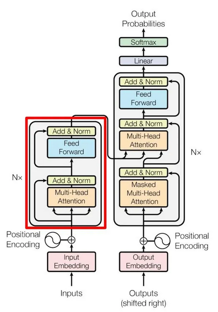
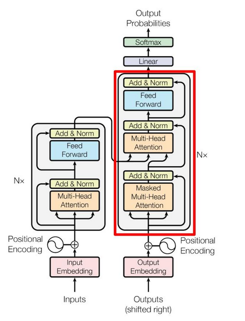

# Attention Is All You Need

## A Quick Attention Overview

* Attention

Given $Q$ for query, $K$ for key, $V$ for value, a simple self-attention can be computed as

$$
\text{Attention}(Q,K,V) = \text{softmax} \Big( \frac{Q K^{\top}}{\sqrt{d_k}} \Big) V
$$

where $\text{softmax} (\bold{x}) = \frac{e^{\bold{x}}}{\sum^K_{k=1}e^{\bold{x}}}$ in which $\bold{x}=\frac{Q K^{\top}}{\sqrt{d_k}}$.

$d_k$ is the dimension of query $Q$ and key $K$.
Define the dimension of value $V$ as $d_v$ (value is often regarded as outputs).
In other words, there are $Q, K \in \mathbb{R}^{1 \times d_k}$ and $V \in \mathbb{R}^{1 \times d_v}$.
To make computation convenient, set $d_v=d_k$.

* Multi-Head Attention

For multi-head attention, there is

$$
\text{MultiHeadAttention}(Q,K,V) = \text{concat}_{i=1}^h (\text{head}_1, \text{head}_2, ..., \text{head}_h) W
$$

where $\text{head}_i = \text{Attention} \big(Q_i (W_i^Q)^{\top},K_i (W_i^K)^{\top},V_i (W_i^V)^{\top} \big)$.

The weights are $W \in \mathbb{R}^{h \cdot d_v \times d_{model}}, W_i^Q \in \mathbb{R}^{d_{model} \times d_k}, W_i^K \in \mathbb{R}^{d_{model} \times d_k}, W_i^V \in \mathbb{R}^{d_{model} \times d_v}$, where $d_{model}=h \cdot d_v$ is the dimension of one single-attention head.
To make computation convenient, set $d_v=d_k$.

For example, in BERT base, there are $h=12$ attention heads ( $h = d_{model} / d_k = 768 / 64 = 12$); in BERT Large, there are $h=16$ attention heads ( $h = d_{model} / d_k = 1024 / 64 = 16$ ).
The choice of $d_{model} = 768$ is the result of employing wordpiece embedding per vocab.

* Feed-Forward Network (FFN)

Define a Feed-Forward Network (FFN), which is a $4$-times dimension increased fully connected network, such as in BERT base, there is `feed_forward_dim=3072` by $3072 = 4 \times 768$.
The activation function is a simple ReLU $\sigma(x) = max(0, x)$.

$$
FFN(\bold{x}) = \max(0, \bold{x}W_1 + \bold{b}_1)W_2 + \bold{b}_2
$$

where one token $\bold{x} \in \mathbb{R}^{1 \times d_{model}}$ is passed to $FFN(\bold{x})$, in which $W_1 \in \mathbb{R}^{4 d_{model} \times d_{model}}$ and $W_2 \in \mathbb{R}^{ d_{model} \times 4d_{model}}$.

* Cross-Layer Token Passing: Residual Stream

In the context of Transformers (like Llama-3 or Mistral), the *Residual Stream* is the primary vector space where tokens exist as they move through the layers of the model.

Let $\bold{t}_n^{(l-1)}\in\bold{t}^{(l-1)}$ be the last token vector from from the $(l-1)$-th layer, its corresponding next layer input is

$$
\mathbf{t}_n^{(l)} = \mathbf{t}_n^{(l-1)} + \text{Attention}(\mathbf{t}_n^{(l-1)}) + \text{MLP}(\mathbf{t}_n^{(l-1)})
$$

## Inspiration

Attention solves **long-distance dependency** issue haunting LSTM and RNN.

The predecessor LSTM (Long Short Term Memory) and GRU (Gated Recurrent Unit) are capable of learning latent info about sequence but have some disadvantages.

* have many step functions/gates that are not differentiable; this causes swings between on/off states that drop info; attention replaces with differentiable softmax
* long sequence info drops for vanishing gradients over the sequence; attention implements residual addition to amplify errors.
* LSTM has much more parameters to train, hence hard to train and difficult to explain/interpret the model

## Transformer

Transformer is the most popular component in LLM (Large Language Model) for NLP tasks.

The transformer building blocks are scaled dot-product attention units.

<div style="display: flex; justify-content: center;">
      
</div>
</br>


### Self-Attention and Multi-Head Attention

Given $Q$ for query, $K$ for key, $V$ for value, a simple self-attention can be computed as

$$
\text{attention}(Q,K,V) = \text{softmax} \Big( \frac{Q K^{\top}}{\sqrt{d_k}} \Big) V
$$
where $\text{softmax} (\bold{x}) = \frac{e^{\bold{x}}}{\sum^K_{k=1}e^{\bold{x}}}$ in which $\bold{x}=\frac{Q K^{\top}}{\sqrt{d_k}}$.

* 1st MatMul: $Q K^{\top} \in \mathbb{R}^{d_{model} \times d_{model}}$
* Scale: $\sqrt{d_k}$ is a scaling factor for each element of $Q K^{\top}$ 
* Mask: set partial input embeddings to zeros; this is useful in decoder where the predict words by decoder should not be affected by preceding input words.
* SoftMax: $\text{softmax} (\bold{x})$
* 2nd MatMul: $\text{softmax}(\bold{x}) \space V \in \mathbb{R}^{d_{model} \times d_k}$

<div style="display: flex; justify-content: center;">
      
</div>
</br>

For multi-head attention, 

$$
\text{MultiHeadAttention}(Q,K,V) = \text{concat}(\text{attention}_1, \text{attention}_2, ..., \text{attention}_n) W
$$

Explained as below, denote $Z_i = \text{attention}_i$.
The linear weight matrix $W$ is used for linear transformation.

<div style="display: flex; justify-content: center;">
      
</div>
</br>

From https://github.com/huggingface/transformers/blob/v4.35.2/src/transformers/models/bert/modeling_bert.py#L183, a self-attention is designed as below (for BERT).

* An attention is consisted of a self-attention + dense + normalization + dropout
* `past_key_value` in self-attention is used to extend key $K$ and value $V$; that the extended input can be used in encoder-decoder sequence or prefix tuning.
* `attention_score=torch.matmul(query_layer, key_layer.transpose(-1, -2))` is by $QK^{\top}$ that describes `attention_probs` by $\text{arg max}$.
* `context_layer = torch.matmul(attention_probs, value_layer)` is the self-attention's output

```python
class BertSelfAttention(nn.Module):

  def __init__(self, config, position_embedding_type=None):
      super().__init__()
      if config.hidden_size % config.num_attention_heads != 0 and not hasattr(config, "embedding_size"):
          raise ValueError(
              f"The hidden size ({config.hidden_size}) is not a multiple of the number of attention "
              f"heads ({config.num_attention_heads})"
          )

      self.num_attention_heads = config.num_attention_heads
      self.attention_head_size = int(config.hidden_size / config.num_attention_heads)
      self.all_head_size = self.num_attention_heads * self.attention_head_size

      self.query = nn.Linear(config.hidden_size, self.all_head_size)
      self.key = nn.Linear(config.hidden_size, self.all_head_size)
      self.value = nn.Linear(config.hidden_size, self.all_head_size)

      self.dropout = nn.Dropout(config.attention_probs_dropout_prob)
      self.position_embedding_type = position_embedding_type or getattr(
          config, "position_embedding_type", "absolute"
      )
      if self.position_embedding_type == "relative_key" or self.position_embedding_type == "relative_key_query":
          self.max_position_embeddings = config.max_position_embeddings
          self.distance_embedding = nn.Embedding(2 * config.max_position_embeddings - 1, self.attention_head_size)

      self.is_decoder = config.is_decoder

  def transpose_for_scores(self, x: torch.Tensor) -> torch.Tensor:
      # x: [batch_size,  attention_head_size * num_attention_heads, attention_head_size * num_attention_heads]
      # new_x_shape: [batch_size,  attention_head_size * num_attention_heads, num_attention_heads, attention_head_size]
      # new_x_shape.permute: [batch_size, num_attention_heads,  attention_head_size * num_attention_heads, attention_head_size]
      new_x_shape = x.size()[:-1] + (self.num_attention_heads, self.attention_head_size)
      x = x.view(new_x_shape)
      return x.permute(0, 2, 1, 3)

  def forward(...):
      mixed_query_layer = self.query(hidden_states)

      # If this is instantiated as a cross-attention module, the keys
      # and values come from an encoder; the attention mask needs to be
      # such that the encoder's padding tokens are not attended to.
      is_cross_attention = encoder_hidden_states is not None

      if is_cross_attention and past_key_value is not None: # encoder to decoder cross attention
          # reuse k,v, cross_attentions
          key_layer = past_key_value[0]
          value_layer = past_key_value[1]
          attention_mask = encoder_attention_mask
      elif is_cross_attention:
          key_layer = self.transpose_for_scores(self.key(encoder_hidden_states))
          value_layer = self.transpose_for_scores(self.value(encoder_hidden_states))
          attention_mask = encoder_attention_mask
      elif past_key_value is not None: # simply extending the input to K and V such as in prefix tuning
          key_layer = self.transpose_for_scores(self.key(hidden_states))
          value_layer = self.transpose_for_scores(self.value(hidden_states))
          key_layer = torch.cat([past_key_value[0], key_layer], dim=2)
          value_layer = torch.cat([past_key_value[1], value_layer], dim=2)
      else:
          key_layer = self.transpose_for_scores(self.key(hidden_states))
          value_layer = self.transpose_for_scores(self.value(hidden_states))

      query_layer = self.transpose_for_scores(mixed_query_layer)

      use_cache = past_key_value is not None
      if self.is_decoder:
          # if cross_attention save Tuple(torch.Tensor, torch.Tensor) of all cross attention key/value_states.
          # Further calls to cross_attention layer can then reuse all cross-attention
          # key/value_states (first "if" case)
          # if uni-directional self-attention (decoder) save Tuple(torch.Tensor, torch.Tensor) of
          # all previous decoder key/value_states. Further calls to uni-directional self-attention
          # can concat previous decoder key/value_states to current projected key/value_states (third "elif" case)
          # if encoder bi-directional self-attention `past_key_value` is always `None`
          past_key_value = (key_layer, value_layer)

      # Take the dot product between "query" and "key" to get the raw attention scores.
      attention_scores = torch.matmul(query_layer, key_layer.transpose(-1, -2))

      # if self.position_embedding_type == "relative_key" or self.position_embedding_type == "relative_key_query":
      #     ... 

      attention_scores = attention_scores / math.sqrt(self.attention_head_size)
      if attention_mask is not None:
          # Apply the attention mask is (precomputed for all layers in BertModel forward() function)
          attention_scores = attention_scores + attention_mask

      # Normalize the attention scores to probabilities.
      attention_probs = nn.functional.softmax(attention_scores, dim=-1)

      # This is actually dropping out entire tokens to attend to, which might
      # seem a bit unusual, but is taken from the original Transformer paper.
      attention_probs = self.dropout(attention_probs)

      # Mask heads if we want to
      if head_mask is not None:
          attention_probs = attention_probs * head_mask

      context_layer = torch.matmul(attention_probs, value_layer)

      context_layer = context_layer.permute(0, 2, 1, 3).contiguous()
      new_context_layer_shape = context_layer.size()[:-2] + (self.all_head_size,)
      context_layer = context_layer.view(new_context_layer_shape)

      outputs = (context_layer, attention_probs) if output_attentions else (context_layer,)

      if self.is_decoder:
          outputs = outputs + (past_key_value,)
      return outputs

class BertSelfOutput(nn.Module):
    def __init__(self, config):
        super().__init__()
        self.dense = nn.Linear(config.hidden_size, config.hidden_size)
        self.LayerNorm = nn.LayerNorm(config.hidden_size, eps=config.layer_norm_eps)
        self.dropout = nn.Dropout(config.hidden_dropout_prob)

    def forward(self, hidden_states: torch.Tensor, input_tensor: torch.Tensor) -> torch.Tensor:
        hidden_states = self.dense(hidden_states)
        hidden_states = self.dropout(hidden_states)
        hidden_states = self.LayerNorm(hidden_states + input_tensor)
        return hidden_states

class BertAttention(nn.Module):
    def __init__(self, config, position_embedding_type=None):
        super().__init__()
        self.self = BertSelfAttention(config, position_embedding_type=position_embedding_type)
        self.output = BertSelfOutput(config)
        self.pruned_heads = set()
```

Following the attention's output are intermediate layer and output layer.
They are basically dense + normalization layers.

```python
class BertIntermediate(nn.Module):
    def __init__(self, config):
        super().__init__()
        self.dense = nn.Linear(config.hidden_size, config.intermediate_size)
        if isinstance(config.hidden_act, str):
            self.intermediate_act_fn = ACT2FN[config.hidden_act]
        else:
            self.intermediate_act_fn = config.hidden_act

    def forward(self, hidden_states: torch.Tensor) -> torch.Tensor:
        hidden_states = self.dense(hidden_states)
        hidden_states = self.intermediate_act_fn(hidden_states)
        return hidden_states


class BertOutput(nn.Module):
    def __init__(self, config):
        super().__init__()
        self.dense = nn.Linear(config.intermediate_size, config.hidden_size)
        self.LayerNorm = nn.LayerNorm(config.hidden_size, eps=config.layer_norm_eps)
        self.dropout = nn.Dropout(config.hidden_dropout_prob)

    def forward(self, hidden_states: torch.Tensor, input_tensor: torch.Tensor) -> torch.Tensor:
        hidden_states = self.dense(hidden_states)
        hidden_states = self.dropout(hidden_states)
        hidden_states = self.LayerNorm(hidden_states + input_tensor)
        return hidden_states

class BertLayer(nn.Module):
  def __init__(self, config):
    super().__init__()
    self.chunk_size_feed_forward = config.chunk_size_feed_forward
    self.seq_len_dim = 1
    self.attention = BertAttention(config)
    self.is_decoder = config.is_decoder
    self.add_cross_attention = config.add_cross_attention
    if self.add_cross_attention:
        if not self.is_decoder:
            raise ValueError(f"{self} should be used as a decoder model if cross attention is added")
        self.crossattention = BertAttention(config, position_embedding_type="absolute")
    self.intermediate = BertIntermediate(config)
    self.output = BertOutput(config)
```

### Encoder

<div style="display: flex; justify-content: center;">
      
</div>
</br>

The *Add & Norm* refers to residual addition then normalization.

Residual addition earned its name in ResNet to prevent vanishing in gradient descent.
It is implemented in transformer as well.

$$
\begin{align*}
& \text{LayerNorm} \big( X + \text{MultiHeadAttention}(X) \big) \\
& \text{LayerNorm} \big( X + \text{FeedForward}(X) \big)  
\end{align*}
$$

<div style="display: flex; justify-content: center;">
      
</div>
</br>

The *Feed Forward* layer is a typical neural network layer such as below

$$
\text{FeedForward}(X) = \sigma(W_1^{\top} X + b_1)^{\top} W_2 + b_2
$$
where $\sigma(X)$ is an activation function.
In transformer, ReLU is used.

An encoder is constructed iterating all model's layers as in `for i, layer_module in enumerate(self.layer): ...`,
where `hidden_states` are recursively used as input to next for loop's `layer_module(hidden_states, ...)``

```python
class BertLayer(nn.Module):
    def forward(...):
        self_attention_outputs = self.attention(...)
        attention_output = self_attention_outputs[0]
        outputs = self_attention_outputs[1:]
        intermediate_output = self.intermediate(attention_output)
        layer_output = self.output(intermediate_output, attention_output)
        outputs = (layer_output,) + outputs
        return outputs

class BertEncoder(nn.Module):
    def forward(...):
        for i, layer_module in enumerate(self.layer):
            layer_outputs = layer_module(
                hidden_states,
                attention_mask,
                layer_head_mask,
                encoder_hidden_states,
                encoder_attention_mask,
                past_key_value,
                output_attentions,
            )
            hidden_states = layer_outputs[0] # recursively used as input to next for loop's layer_module(hidden_states, ...)

        return return BaseModelOutputWithPastAndCrossAttentions(...)
```

A BERT model is consisted of an embedding layer, encoder model and a optional pooler layer (depending on if pooler output is required such asin classification tasks).

```python
class BertModel(BertPreTrainedModel):

    def __init__(self, config, add_pooling_layer=True):
        super().__init__(config)
        self.config = config
        self.embeddings = BertEmbeddings(config)
        self.encoder = BertEncoder(config)
        self.pooler = BertPooler(config) if add_pooling_layer else None

    def forward(...):
        embedding_output = self.embeddings(
            input_ids=input_ids,
            position_ids=position_ids,
            token_type_ids=token_type_ids,
            inputs_embeds=inputs_embeds,
            past_key_values_length=past_key_values_length,
        )
        encoder_outputs = self.encoder(
            embedding_output,
            attention_mask=extended_attention_mask,
            head_mask=head_mask,
            encoder_hidden_states=encoder_hidden_states,
            encoder_attention_mask=encoder_extended_attention_mask,
            past_key_values=past_key_values,
            use_cache=use_cache,
            output_attentions=output_attentions,
            output_hidden_states=output_hidden_states,
            return_dict=return_dict,
        )
        sequence_output = encoder_outputs[0]
        pooled_output = self.pooler(sequence_output) if self.pooler is not None else None

        return BaseModelOutputWithPoolingAndCrossAttentions(...)
```

### Decoder

<div style="display: flex; justify-content: center;">
      
</div>
</br>

* The 1st attention heads: masked $Q K^{\top}$ is used to avoid interference of preceding input embeddings.
* The 2nd attention heads: used encoder's key $K$ and value $V$, used previous layer (attention heads)'s query $Q$ as input (cross attention)

The implementation in Hugging Face is via `is_decoder` set to true that triggers the use of `past_key_value` serving as input to $K$ and $V$ as in `key_layer = past_key_value[0]; value_layer = past_key_value[1]` in cross attention.
`attention_mask = encoder_attention_mask` is set as well.

```python
class BertSelfAttention(nn.Module):
    def forward(...):

        mixed_query_layer = self.query(hidden_states)

        # If this is instantiated as a cross-attention module, the keys
        # and values come from an encoder; the attention mask needs to be
        # such that the encoder's padding tokens are not attended to.
        is_cross_attention = encoder_hidden_states is not None

        if is_cross_attention and past_key_value is not None:
            # reuse k,v, cross_attentions
            key_layer = past_key_value[0]
            value_layer = past_key_value[1]
            attention_mask = encoder_attention_mask
        elif is_cross_attention:
            key_layer = self.transpose_for_scores(self.key(encoder_hidden_states))
            value_layer = self.transpose_for_scores(self.value(encoder_hidden_states))
            attention_mask = encoder_attention_mask
        elif past_key_value is not None:
            key_layer = self.transpose_for_scores(self.key(hidden_states))
            value_layer = self.transpose_for_scores(self.value(hidden_states))
            key_layer = torch.cat([past_key_value[0], key_layer], dim=2)
            value_layer = torch.cat([past_key_value[1], value_layer], dim=2)
        else:
            key_layer = self.transpose_for_scores(self.key(hidden_states))
            value_layer = self.transpose_for_scores(self.value(hidden_states))

        query_layer = self.transpose_for_scores(mixed_query_layer)

        if self.is_decoder:
            past_key_value = (key_layer, value_layer)

        ...

        if self.is_decoder:
            outputs = outputs + (past_key_value,)
        return outputs

class BertLayer(nn.Module):
    def forward(...):

        self_attention_outputs = self.attention(...)

        # if decoder, the last output is tuple of self-attn cache
        if self.is_decoder:
            outputs = self_attention_outputs[1:-1]
            present_key_value = self_attention_outputs[-1]
        else:
            outputs = self_attention_outputs[1:]  # add self attentions if we output attention weights

        ...

        if self.is_decoder:
            cross_attention_outputs = self.crossattention(...)
            attention_output = cross_attention_outputs[0]
            outputs = outputs + cross_attention_outputs[1:-1]  # add cross attentions if we output attention weights

            # add cross-attn cache to positions 3,4 of present_key_value tuple
            cross_attn_present_key_value = cross_attention_outputs[-1]
            present_key_value = present_key_value + cross_attn_present_key_value

        intermediate_output = self.intermediate(attention_output)
        layer_output = self.output(intermediate_output, attention_output)
        outputs = (layer_output,) + outputs

        # if decoder, return the attn key/values as the last output
        if self.is_decoder:
            outputs = outputs + (present_key_value,)

        return outputs


class BertModel(BertPreTrainedModel):
    """To behave as an decoder the model needs to be initialized with the `is_decoder` argument of the configuration"""
    def forward(...):
        embedding_output = self.embeddings(
            input_ids=input_ids,
            position_ids=position_ids,
            token_type_ids=token_type_ids,
            inputs_embeds=inputs_embeds,
            past_key_values_length=past_key_values_length,
        )
        encoder_outputs = self.encoder(
            embedding_output,
            attention_mask=extended_attention_mask,
            head_mask=head_mask,
            encoder_hidden_states=encoder_hidden_states,
            encoder_attention_mask=encoder_extended_attention_mask,
            past_key_values=past_key_values,
            use_cache=use_cache,
            output_attentions=output_attentions,
            output_hidden_states=output_hidden_states,
            return_dict=return_dict,
        )
        sequence_output = encoder_outputs[0]
        pooled_output = self.pooler(sequence_output) if self.pooler is not None else None

        return BaseModelOutputWithPoolingAndCrossAttentions(...)
```

### Cross-Attention

In self-attention, transformer works with the same input sequence.
In cross-attention, transformer mixes two different input sequences.

<div style="display: flex; justify-content: center;">
      
</div>
</br>

In hugging face, comparing between encoder vs decoder for BERT, the decoder needs `add_cross_attention=True` as config.

```python
model_enc = BertGenerationEncoder.from_pretrained(model_base_name, 
                                            output_hidden_states=True,
                                            output_attentions=True,
                                            bos_token_id=tokenizer.get_vocab()["[CLS]"], 
                                            eos_token_id=tokenizer.get_vocab()["[SEP]"])
model_dec = BertGenerationDecoder.from_pretrained(model_base_name, 
                                            add_cross_attention=True, 
                                            is_decoder=True, 
                                            output_hidden_states=True,
                                            output_attentions=True,
                                            bos_token_id=tokenizer.get_vocab()["[CLS]"], 
                                            eos_token_id=tokenizer.get_vocab()["[SEP]"])
```

To construct a encoder-decoder architecture, first put data `input_ids=dataInput.input_ids` to encoder, whose outputs serve as query $Q$ and key $K$ to decoder via `encoder_hidden_states=model_enc_outputs.last_hidden_state`.
The value $V$ is `input_ids=dataOutput.input_ids` to decoder.

Finally, `model_dec_outputs.logits` is the result probability distribution of all vocabs.
The corresponding token can be found by softmax `token_id = torch.argmax(torch.softmax(outputs.logits[0][0], dim=0))`.

```python
model_enc_outputs = model_enc(                
                input_ids=dataInput.input_ids,
                attention_mask=dataInput.attention_mask,
                )

model_dec_outputs = model_dec(    
            input_ids=dataOutput.input_ids,
            attention_mask=dataOutput.attention_mask,
            encoder_hidden_states=model_enc_outputs.last_hidden_state,
            encoder_attention_mask=dataInput.attention_mask,
            labels=None,
            )
```


## Outputs

### Logits

*Logits* basically means raw predictions which come out of the last layer of a classification neural network.

If the model is solving a multi-class classification problem (e.g., predict a token from $30522$ candidates), logits typically becomes an input to the softmax function.

```python
print(outputs.logits.size()) # print "torch.Size([1, 7, 30522])" for [batch_size, seq_len, vocab_size]

# convert logits to token representation
token_id = torch.argmax(torch.softmax(outputs.logits[0][0], dim=0))
tokenizer.convert_ids_to_tokens(token_id)
```
