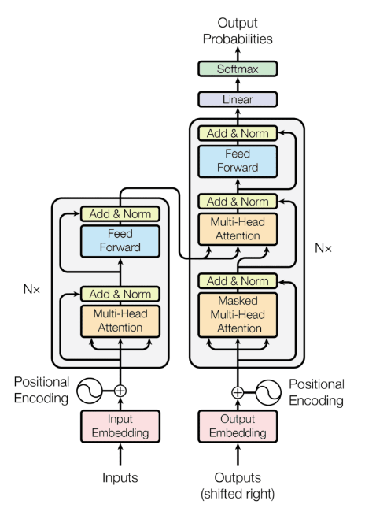

# Attention Is All You Need

## A Quick Attention Overview

* Attention

Given $Q$ for query, $K$ for key, $V$ for value, a simple self-attention can be computed as

$$
\text{Attention}(Q,K,V) = \text{softmax} \Big( \frac{Q K^{\top}}{\sqrt{d_k}} \Big) V
$$
where $\text{softmax} (\bold{x}) = \frac{e^{\bold{x}}}{\sum^K_{k=1}e^{\bold{x}}}$ in which $\bold{x}=\frac{Q K^{\top}}{\sqrt{d_k}}$.

$d_k$ is the dimension of query $Q$ and key $K$.
Define the dimension of value $V$ as $d_v$ (value is often regarded as outputs).

* Multi-Head Attention

For multi-head attention, there is

$$
\text{MultiHeadAttention}(Q,K,V) = \text{concat}(\text{head}_1, \text{head}_2, ..., \text{head}_h) W
$$
where $\text{head}_i = \text{Attention}(QW_i^Q,KW_i^K,VW_i^V)$.

The weights are $W \in \mathbb{R}^{h \cdot d_v \times d_{model}}, W_i^Q \in \mathbb{R}^{d_{model} \times d_k}, W_i^K \in \mathbb{R}^{d_{model} \times d_k}, W_i^V \in \mathbb{R}^{d_{model} \times d_v}$, where $d_{model}$ is the dimension of one single-attention head.

For example, in BERT base, there are $h=12$ attention heads ( $h = d_{model} / d_k = 768 / 64 = 12$); in BERT Large, there are $h=16$ attention heads ( $h = d_{model} / d_k = 1024 / 64 = 16$ ).
The choice of $d_{model} = 768$ is the result of employing wordpiece embedding per vocab.

* Feed-Forward Network (FFN)

Define a Feed-Forward Network (FFN), which is a $4$-times dimension increased fully connected network, such as in BERT base, there is `feed_forward_dim=3072` by $3072 = 4 \times 768$.
The activation function is a simple ReLU $\sigma(x) = max(0, x)$.

$$
FFN(\bold{x}) = \max(0, \bold{x}W_1 + \bold{b}_1)W_2 + \bold{b}_2
$$

where one token $\bold{x} \in \mathbb{R}^{1 \times d_{model}}$ is passed to $FFN(\bold{x})$, in which $W_1 \in \mathbb{R}^{4 d_{model} \times d_{model}}$ and $W_2 \in \mathbb{R}^{ d_{model} \times 4d_{model}}$. 

## Inspiration

Attention solves **long-distance dependency** issue haunting LSTM and RNN.

The predecessor LSTM (Long Short Term Memory) and GRU (Gated Recurrent Unit) are capable of learning latent info about sequence but have some disadvantages.
* have many step functions/gates that are not differentiable; this causes swings between on/off states that drop info; attention replaces with differentiable softmax
* long sequence info drops for vanishing gradients over the sequence; attention implements residual addition to amplify errors.
* LSTM has much more parameters to train, hence hard to train and difficult to explain/interpret the model


## Transformer

Transformer is the most popular component in LLM (Large Language Model) for NLP tasks.

The transformer building blocks are scaled dot-product attention units.

<div style="display: flex; justify-content: center;">
      
</div>
</br>


### Self-Attention and Multi-Head Attention

Given $Q$ for query, $K$ for key, $V$ for value, a simple self-attention can be computed as

$$
\text{attention}(Q,K,V) = \text{softmax} \Big( \frac{Q K^{\top}}{\sqrt{d_k}} \Big) V
$$
where $\text{softmax} (\bold{x}) = \frac{e^{\bold{x}}}{\sum^K_{k=1}e^{\bold{x}}}$ in which $\bold{x}=\frac{Q K^{\top}}{\sqrt{d_k}}$.

* 1st MatMul: $Q K^{\top}$
* Scale: $\sqrt{d_k}$ is a scaling factor for each element of $Q K^{\top}$ 
* Mask: set partial input embeddings to zeros; this is useful in decoder where the predict words by decoder should not be affected by preceding input words.
* SoftMax: $\text{softmax} (\bold{x})$
* 2nd MatMul: $\text{softmax}(\bold{x}) \space V$

<div style="display: flex; justify-content: center;">
      
</div>
</br>

For multi-head attention, 

$$
\text{MultiHeadAttention}(Q,K,V) = \text{concat}(\text{attention}_1, \text{attention}_2, ..., \text{attention}_n) W
$$

Explained as below, denote $Z_i = \text{attention}_i$.
The linear weight matrix $W$ is used for linear transformation.

<div style="display: flex; justify-content: center;">
      
</div>
</br>

### Encoder

<div style="display: flex; justify-content: center;">
      
</div>
</br>

The *Add & Norm* refers to residual addition then normalization.

Residual addition earned its name in ResNet to prevent vanishing in gradient descent.
It is implemented in transformer as well.

$$
\begin{align*}
& \text{LayerNorm} \big( X + \text{MultiHeadAttention}(X) \big) \\
& \text{LayerNorm} \big( X + \text{FeedForward}(X) \big)  
\end{align*}
$$

<div style="display: flex; justify-content: center;">
      
</div>
</br>

The *Feed Forward* layer is a typical neural network layer such as below

$$
\text{FeedForward}(X) = \sigma(W_1^{\top} X + b_1)^{\top} W_2 + b_2
$$
where $\sigma(X)$ is an activation function.
In transformer, ReLU is used.

### Decoder

<div style="display: flex; justify-content: center;">
      
</div>
</br>

* The 1st attention heads: masked $Q K^{\top}$ is used to avoid interference of preceding input embeddings.
* The 2nd attention heads: used encoder's key $K$ and value $V$, used previous layer (attention heads)'s query $Q$ as input

### Cross-Attention

In self-attention, transformer works with the same input sequence.
In cross-attention, transformer mixes two different input sequences.

<div style="display: flex; justify-content: center;">
      
</div>
</br>

In hugging face, comparing between encoder vs decoder for BERT, the decoder needs `add_cross_attention=True` as config.

```python
model_enc = BertGenerationEncoder.from_pretrained(model_base_name, 
                                            output_hidden_states=True,
                                            output_attentions=True,
                                            bos_token_id=tokenizer.get_vocab()["[CLS]"], 
                                            eos_token_id=tokenizer.get_vocab()["[SEP]"])
model_dec = BertGenerationDecoder.from_pretrained(model_base_name, 
                                            add_cross_attention=True, 
                                            is_decoder=True, 
                                            output_hidden_states=True,
                                            output_attentions=True,
                                            bos_token_id=tokenizer.get_vocab()["[CLS]"], 
                                            eos_token_id=tokenizer.get_vocab()["[SEP]"])
```

To construct a encoder-decoder architecture, first put data `input_ids=dataInput.input_ids` to encoder, whose outputs serve as query $Q$ and key $K$ to decoder via `encoder_hidden_states=model_enc_outputs.last_hidden_state`.
The value $V$ is `input_ids=dataOutput.input_ids` to decoder.

Finally, `model_dec_outputs.logits` is the result probability distribution of all vocabs.
The corresponding token can be found by softmax `token_id = torch.argmax(torch.softmax(outputs.logits[0][0], dim=0))`.

```python
model_enc_outputs = model_enc(                
                input_ids=dataInput.input_ids,
                attention_mask=dataInput.attention_mask,
                )

model_dec_outputs = model_dec(    
            input_ids=dataOutput.input_ids,
            attention_mask=dataOutput.attention_mask,
            encoder_hidden_states=model_enc_outputs.last_hidden_state,
            encoder_attention_mask=dataInput.attention_mask,
            labels=None,
            )
```


## Outputs

### Logits

*Logits* basically means raw predictions which come out of the last layer of a classification neural network.

If the model is solving a multi-class classification problem (e.g., predict a token from $30522$ candidates), logits typically becomes an input to the softmax function.

```python
print(outputs.logits.size()) # print "torch.Size([1, 7, 30522])" for [batch_size, seq_len, vocab_size]

# convert logits to token representation
token_id = torch.argmax(torch.softmax(outputs.logits[0][0], dim=0))
tokenizer.convert_ids_to_tokens(token_id)
```
