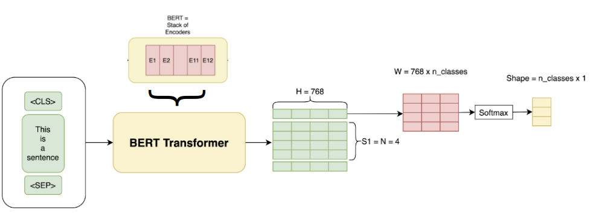
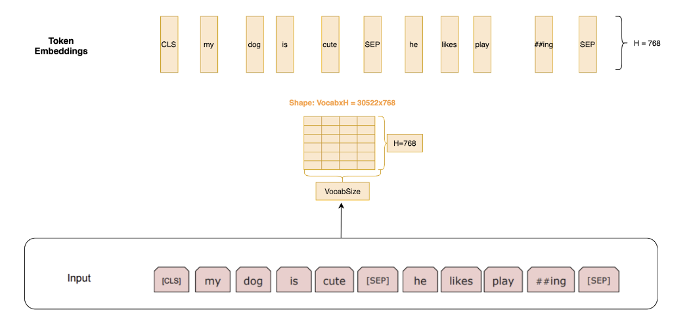

# LLM (Large Language Model)

A large language model (LLM) is a language model characterized by its large size.

## Bidirectional Encoder Representations from Transformers (BERT)

BERT is bidirectional 

||Transformer Layers|Hidden Size|Attention Heads|Parameters|Memory|
|-|-|-|-|-|-|
|BERT Base|12|768|12|110M|450 MB|
|BERT Large|24|1024|16|340M|1.2 GB|

<div style="display: flex; justify-content: center;">
      
</div>
</br>

### Source Input

Token Embeddings: a Matrix of size $30000 \times 768$. Here, $30000$ is the vocabulary length after wordpiece tokenization, and $768$ is dimension of each vocab.

Positional embeddings: positions of words in a sequence (often it is a sentence, large model may consider article).

Segment/document embeddings: positions of words' sentences in a context. For example, sentence index of a discussion (discussion serves as a context).

Total input: Token Embeddings (768 per vocabulary) + Segment Embeddings + Position Embeddings

### Data Preparation/Augmentation

* Full text prediction
* $10\%$ partial word masking (replaced with empty value)
* $10\%$ partial word random substitution (replaced with random work)
* Mixed: $5\%$ partial word masking and $5\%$ random word substitution

The above augmentation can build model resilience learning the right grammar and semantics. 

### Training

Given a context of text $S = \{ S_1, S_2, ..., S_n \}$, such as a discussion or an article, for each sentence $S_i$, prepare a false sentence $S_{i-{false}}$.
This gives half text data labelled false, while the others labelled true.

Training hyperparameters:

```json
{
  "per_gpu_batch_size": [16, 32],
  "learning_rate": [2e-5, 3e-5, 5e-5],
  "num_epochs": [2, 3, 4]
}
```


<div style="display: flex; justify-content: center;">
      
</div>
</br>

## LLaMa


## ChatGPT