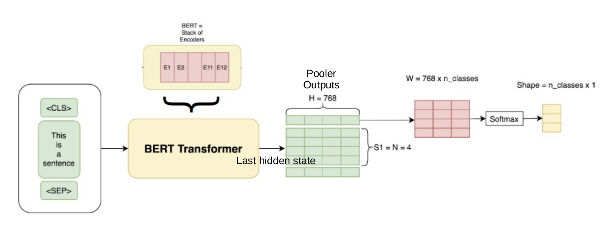

# LLM (Large Language Model)

A large language model (LLM) is a language model characterized by its large size.

State-of-art LLMs use transformers/attention designs.

* BERT by Google is the first of its kind using transformer.

* LLaMa by Facebook/Meta is the most popular open-source LLM by the year 2023.

* ChatGPT by OpenAI is the most commercially successful LLM.

## Attention Is All You Need

* Attention

Given $Q$ for query, $K$ for key, $V$ for value, a simple self-attention can be computed as

$$
\text{Attention}(Q,K,V) = \text{softmax} \Big( \frac{Q K^{\top}}{\sqrt{d_k}} \Big) V
$$
where $\text{softmax} (\bold{x}) = \frac{e^{\bold{x}}}{\sum^K_{k=1}e^{\bold{x}}}$ in which $\bold{x}=\frac{Q K^{\top}}{\sqrt{d_k}}$.

$d_k$ is the dimension of query $Q$ and key $K$.
Define the dimension of value $V$ as $d_v$ (value is often regarded as outputs).

* Multi-Head Attention

For multi-head attention, there is

$$
\text{MultiHeadAttention}(Q,K,V) = \text{concat}(\text{head}_1, \text{head}_2, ..., \text{head}_h) W
$$
where $\text{head}_i = \text{Attention}(QW_i^Q,KW_i^K,VW_i^V)$.

The weights are $W \in \mathbb{R}^{h \cdot d_v \times d_{model}}, W_i^Q \in \mathbb{R}^{d_{model} \times d_k}, W_i^K \in \mathbb{R}^{d_{model} \times d_k}, W_i^V \in \mathbb{R}^{d_{model} \times d_v}$, where $d_{model}$ is the dimension of one single-attention head.

For example, in BERT base, there are $h=12$ attention heads ( $h = d_{model} / d_k = 768 / 64 = 12$); in BERT Large, there are $h=16$ attention heads ( $h = d_{model} / d_k = 1024 / 64 = 16$ ).
The choice of $d_{model} = 768$ is the result of employing wordpiece embedding per vocab.

* Feed-Forward Network (FFN)

Define a Feed-Forward Network (FFN), which is a $4$-times dimension increased fully connected network, such as in BERT base, there is `feed_forward_dim=3072` by $3072 = 4 \times 768$.
The activation function is a simple ReLU $\sigma(x) = max(0, x)$.

$$
FFN(\bold{x}) = \max(0, \bold{x}W_1 + \bold{b}_1)W_2 + \bold{b}_2
$$

where one token $\bold{x} \in \mathbb{R}^{1 \times d_{model}}$ is passed to $FFN(\bold{x})$, in which $W_1 \in \mathbb{R}^{4 d_{model} \times d_{model}}$ and $W_2 \in \mathbb{R}^{ d_{model} \times 4d_{model}}$. 

## Bidirectional Encoder Representations from Transformers (BERT)

BERT is bidirectional, meaning that it can predict words by looking back (word sequence BEFORE a placeholder word) as well as looking ahead  (word sequence AFTER a placeholder word).

For example, to predict `<placeholder>` in this sentence: `Jason is playing football on a <placeholder> with his football coach Jack.`.
BERT can do/train prediction bidirectionally `Jason is playing football on a <placeholder>` and `<placeholder> with his football coach Jack` (answer is `<placeholder> = "playground"`).

This requires dataset containing sequential info but not necessarily orderly (such as in LSTM prediction for chronologically ordered data).

BERT is mainly constructed by stacking transformers.

||Transformer Layers|Hidden Size|Attention Heads|Parameters|Memory|
|-|-|-|-|-|-|
|BERT Base|12|768|12|110M|450 MB|
|BERT Large|24|1024|16|340M|1.2 GB|

### BERT-Base Model Breakdown

```py
bert_base_model = get_model(
    token_num=30522,
    head_num=12,
    transformer_num=12,
    embed_dim=768,
    feed_forward_dim=3072,
    seq_len=512,
    pos_num=512,
    dropout_rate=0.05,
)
```

The total of 110m (to be precise: 109,482,240) parameter breakdown is shown as below (for a typical Q&A task BERT encoder).

||Components|Shape|Count|Comments|
|-|-|-|-|-|
|Input Embeddings|embeddings.word_embeddings.weight|$30522 \times 768$|$23,440,896$|vocab size $\times$ wordpiece embedding|
||embeddings.position_embeddings.weight|$512 \times 768$|$393,216$|context sequence length $\times$ wordpiece embedding|
||embeddings.token_type_embeddings.weight|$2 \times 768$|$1536$| In tasks like Q&A that feeds two sentences: first as passage and second for question (0’s for first segment and 1’s for second segment)|
||embedding layer normalization (weight and bias)|$768 + 768$|$1536$|embedding layer normalization weight $+$ bias|
|Transformer $\times$ 12|encoder.layer.i.attention.self.query (weight and bias)|$(768 \times 768 + 768) \times 12$|$7,087,104$|query $Q$'s weight and bias|
||encoder.layer.i.attention.self.key (weight and bias)|$(768 \times 768 + 768) \times 12$|$7,087,104$|key $K$'s weight and bias|
||encoder.layer.i.attention.self.value (weight and bias)|$(768 \times 768 + 768) \times 12$|$7,087,104$|value $V$'s weight and bias|
||encoder.layer.i.attention.self.dense (weight and bias)|$(768 \times 768 + 768) \times 12$|$7,087,104$|dense output (weight and bias)|
||encoder.layer.i.attention normalization (weight and bias)|$(768 + 768) \times 12$|$18,432$|dense normalization (weight and bias)|
||encoder.layer.i.intermediate (feed-forward) input (weight and bias)|$(3072 \times 768 + 3072) \times 12$|$28,348,416$|feed-forward input (weight and bias)|
||encoder.layer.i.intermediate (feed-forward) output (weight and bias)|$(768 \times 3072 + 768) \times 12$|$28,320,768$|feed-forward output (weight and bias)|
||encoder layer normalization (weight and bias)|$(768 + 768) \times 12$|$18,432$|encoder layer normalization weight $+$ bias|
|Pooler|pooler.dense (weight and bias)|$768 \times 768 + 768$|$7,087,104$|pooler layer's weight and bias|

Shown as below, the $12 \times$ encoder produces `last_hidden_state` that is a context-aware token embedding of the size `(batch_size, seq_len, embedding_size_of_one_token)`.

The pooler output is of size $1 \times 768$ that serves as input to classification problem.

<div style="display: flex; justify-content: center;">
      
</div>
</br>

Other BERT models for different tasks may have different structures, such as no `token_type_embeddings` for Seq2Seq model.

#### Output: `last_hidden_state` vs `pooler_output`

`last_hidden_state` contains the hidden representations for each token in each sequence of the batch. So the size is `(batch_size, seq_len, hidden_size)`.

`pooler_output` contains a "representation" of each sequence in the batch, and is of size `(batch_size, hidden_size)`

The pooler_layer is a $\text{tanh}$-applied activation on the output from the last hidden layer (the last layer of encoder): $\bold{y}_{p}=\text{tanh}(W_p\bold{x}_h+\bold{b}_p)$.
The pooler layer's output $\bold{y}_{p} \in \mathbb{R}^{1 \times 768}$ can be considered as a "compressed" representation of the sequence of the last encoder's tokens $\bold{x}_{h} \in \mathbb{R}^{n_{seq} \times 768}$, where $n_{seq}$ is `sql_len`.

$\bold{y}_{p}$ can be further used in tasks such as classification, while $\bold{x}_{h}$ can be used for token representation.

#### Decoder

A typical BERT decoder is simply the encoder version with inserted cross-attention.

```txt
BertGenerationDecoder(
  (bert): BertGenerationEncoder(
    (embeddings): BertGenerationEmbeddings(
      (word_embeddings): Embedding(30522, 768, padding_idx=0)
      (position_embeddings): Embedding(512, 768)
      (LayerNorm): LayerNorm((768,), eps=1e-12, elementwise_affine=True)
      (dropout): Dropout(p=0.1, inplace=False)
    )
    (encoder): BertEncoder(
      (layer): ModuleList(
        (0-11): 12 x BertGenerationLayer(
          (attention): BertGenerationAttention(
            (self): BertGenerationSelfAttention(
              (query): Linear(in_features=768, out_features=768, bias=True)
              (key): Linear(in_features=768, out_features=768, bias=True)
              (value): Linear(in_features=768, out_features=768, bias=True)
              (dropout): Dropout(p=0.1, inplace=False)
            )
            (output): BertGenerationSelfOutput(
              (dense): Linear(in_features=768, out_features=768, bias=True)
              (LayerNorm): LayerNorm((768,), eps=1e-12, elementwise_affine=True)
              (dropout): Dropout(p=0.1, inplace=False)
            )
          )
          (crossattention): BertGenerationAttention(
            (self): BertGenerationSelfAttention(
              (query): Linear(in_features=768, out_features=768, bias=True)
              (key): Linear(in_features=768, out_features=768, bias=True)
              (value): Linear(in_features=768, out_features=768, bias=True)
              (dropout): Dropout(p=0.1, inplace=False)
            )
            (output): BertGenerationSelfOutput(
              (dense): Linear(in_features=768, out_features=768, bias=True)
              (LayerNorm): LayerNorm((768,), eps=1e-12, elementwise_affine=True)
              (dropout): Dropout(p=0.1, inplace=False)
            )
          )
          (intermediate): BertGenerationIntermediate(
            (dense): Linear(in_features=768, out_features=3072, bias=True)
            (intermediate_act_fn): GELUActivation()
          )
          (output): BertGenerationOutput(
            (dense): Linear(in_features=3072, out_features=768, bias=True)
            (LayerNorm): LayerNorm((768,), eps=1e-12, elementwise_affine=True)
            (dropout): Dropout(p=0.1, inplace=False)
          )
        )
      )
    )
  )
  (lm_head): BertGenerationOnlyLMHead(
    (decoder): Linear(in_features=768, out_features=30522, bias=True)
  )
)
```

### Source Input

Token Embeddings: a Matrix of size $30522 \times 768$. Here, $30000$ is the vocabulary length after wordpiece tokenization, and $768$ is dimension of each token.

Positional embeddings: positions of words in a sequence (often it is a sentence, large model may consider article).

Segment/document embeddings: positions of words' sentences in a context. For example, sentence index of a discussion (discussion serves as a context).

Total input: Token Embeddings (768 per vocabulary) + Segment Embeddings + Position Embeddings

#### Data for Training

* BooksCorpus (800M words)
* English Wikipedia (2,500M words)

#### Data for Fine-Tuning by Tasks

* Q & A: Stanford Question Answering Dataset (SQuAD)
* Next Sentence Prediction (NSP): Situations With Adversarial Generations (SWAG)
* Ablation (Masked language modeling (MLM)): no particular dataset, just randomly remove some words (replaced with an empty placeholder) and make prediction on these placeholder.

#### Data Preparation/Augmentation

* Full text prediction
* $10\%$ partial word masking (replaced with empty value)
* $10\%$ partial word random substitution (replaced with random work)
* Mixed: $5\%$ partial word masking and $5\%$ random word substitution

The above augmentation can build model resilience learning the right grammar and semantics.

### Training

BERT training first undergoes a normal training (pre-training) by BooksCorpus (800M words) and English Wikipedia (2,500M words), then fine-tunes on different tasks such as Q & A on Stanford Question Answering Dataset (SQuAD) and Next Sentence Prediction (NSP) on Situations With Adversarial Generations (SWAG).

<div style="display: flex; justify-content: center;">
      
</div>
</br>

#### Hyper-parameters

Training hyper-parameters:

```json
{
  "per_gpu_batch_size": [16, 32],
  "learning_rate": [2e-5, 3e-5, 5e-5],
  "num_epochs": [2, 3, 4]
}
```

* Motivations:

*Catastrophic Forgetting* or *Catastrophic Interference*:
when feeding new information, neural network "forgets" the previous tasks it was trained for.

In other words, it totally forgets previous knowledge.

The problem only happens with sequential learning, when new information disrupts what the network has previously learned.

* Remediation of catastrophic forgetting

Train a new neural network with all the old data to relearn the forgotten knowledge.

Use small learning rates

## LLaMa

LLaMA (Large Language Model Meta AI) 

|Model|Parameter Size|
|-|-|
|Llama 1|7 B|
|Llama 1|13 B|
|Llama 1|33 B|
|Llama 1|65 B|
|Llama 2|7 B|
|Llama 2|13 B|
|Llama 2|70 B|

### Alpaca

Alpaca is a fine-tuned model of LLaMA's 7B version.

## OpenAI GPT/ChatGPT

